# Noob: 1

Difficulty:: #Easy
> Classified according to [Vulhub difficulty page](https://www.vulnhub.com/difficulty/)

## Target data
- Link: [Noob: 1](https://www.vulnhub.com/entry/noob-1,746/)
- CVSS3 : [AV:N/AC:L/PR:N/UI:N/S:C/C:H/I:H/A:H/E:F/RL:O/RC:C/CR:H/IR:H/AR:H](https://www.first.org/cvss/calculator/3.0#CVSS:3.0/AV:N/AC:L/PR:N/UI:N/S:C/C:H/I:H/A:H/E:F/RL:O/RC:C/CR:H/IR:H/AR:H)
  > **Warning**: I select the CVSS3 score to start to practice, so is very possible that I made a mistake in the selection, so do not trust of that CVSS3.

## Machine Description
*N/A*

## Summary
Noob: 1 starts with an `ftp` that allows an `Anonymous` user connection, there I find in `base64` the credentials `champ:password`, and with that, I could log in to the website, the `about us` section of the site download a `download.rar` file, that contains `funny.bmp`, that after analyzing it with `stegseek` I find the hidden file `user.txt` that contains a text with a `ROT13` substitution cipher, and with `Cyberchef` I could decipher and get the credentials of the `wtf` user. After `ssh` with the credentials `wtf:this one is a simple one`, I find the `flag-1.txt` file and the `backup.sh` file that contains the credentials of the `n00b` user, after using the `su` command I could get the `n00b` shell. The `n00b` user has sudo privileges to run `nano` as the root user, I follow the [gtfobins about nano](https://gtfobins.github.io/gtfobins/nano/) instructions and I spawn the `root` shell and get the `root` flag. But, after that, I notice that the `wtf` user has all `sudo` privileges, then that is another way to escalate to the `root` user.

1. CWE-220: Storage of File With Sensitive Data Under FTP Root
2. CWE-219: Storage of File with Sensitive Data Under Web Root
3. CWE-922: Insecure Storage of Sensitive Information
4. CWE-257: Storing Passwords in a Recoverable Format
5. CWE-256: Plaintext Storage of a Password
6. CWE-269: Improper Privilege Management

#VMWare #Nmap #CyberChef #FTP #gtfobins #stegseek #steganography #SubstitutionCipher #ROT13 #nano

## Enumeration

When I run the target machine in VMware Workstation 17 Player (see the [setup vulnhub machines](../setup-vulnhub.md), and on my target machine, I run the `netdiscover` command:
```shell
$ sudo netdiscover -i enp0s3 -r 192.168.56.0/24
```
Then I compare the MAC with that of the target VMware configuration, and I find out that the IP is `192.168.56.106`

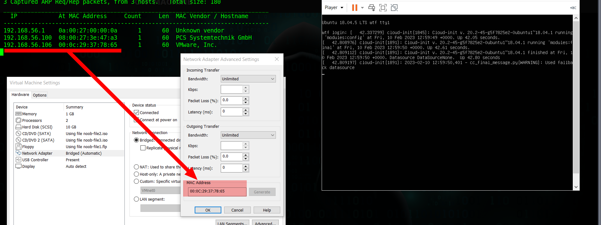

When I start scanning the target with `nmap`:
```shell
$ nmap -p- -sV -oA scans/nmap-full-tcp-scan 192.168.56.106
...SNIPPED...
21/tcp    open  ftp     vsftpd 3.0.3
80/tcp    open  http    Apache httpd 2.4.29 ((Ubuntu))
55077/tcp open  ssh     OpenSSH 7.6p1 Ubuntu 4ubuntu0.5
...SNIPPED...
```
Then I identify 3 open ports, and the `vsftpd 3.0.3` service runs on `21` TCP, and the `Apache httpd 2.4.29` service runs on `80` TCP, and the `OpenSSH 7.6p1` service runs on `55077` TCP, and it runs on `Ubuntu 4ubuntu0.5`, when I use the `nmap` general scripts:
```shell
$ nmap -p 21,80,55077 -sCV -oA scans/nmap-tcp-script-scan 192.168.56.106
```
Then I can see:

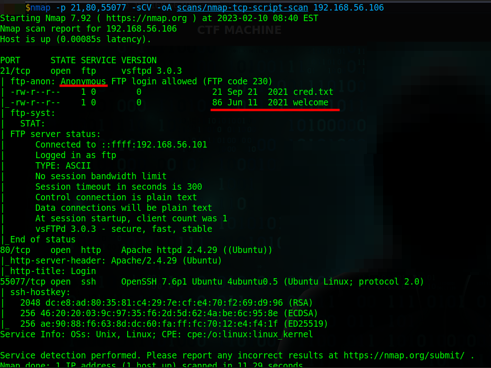

And I identify that the user `Anonymous` is allowed in the `ftp` service, and `nmap` also finds two files in the `ftp` service.

## Normal use case

Given I can access `http://192.168.56.106/` then I can see a login page:

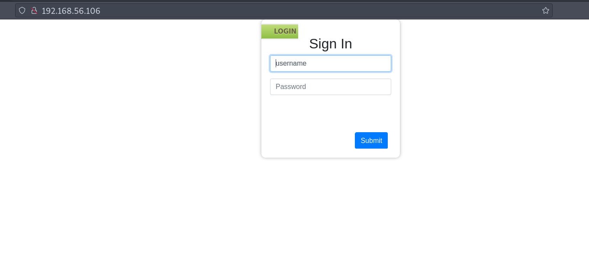

But I still do not have any credentials

## Dynamic detection
Credentials in FTP service and webroot.

Given I can access `ftp://192.168.56.106/`, and I know the `Anonymous` user is allowed, and it contains some files, then I will check it. When I use the `ftp` command:
```shell
$ ftp 192.168.56.106
```
And I use the `Anonymous` user with an empty password, then I can connect to the `ftp` service, and I can download two files:

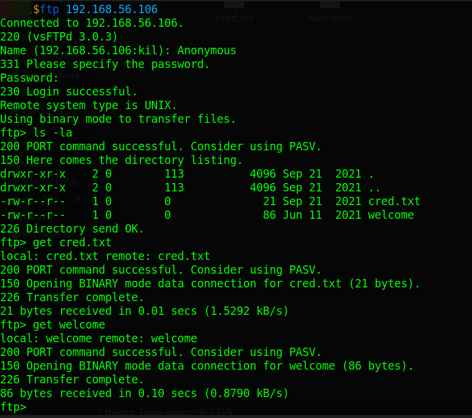

When I read the `cred.txt` file:
```shell
$ cat cred.txt
Y2hhbXA6cGFzc3dvcmQ=
```
When I decode it with the `base64` command:
```shell
$ echo -n "Y2hhbXA6cGFzc3dvcmQ=" | base64 -d
champ:password
```
Then it seems that I find credentials, when I read the `welcome` file, then I can see a welcome banner:

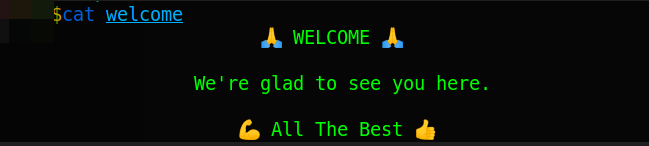

When I test the `champ:password` credentials on the login page,  then it works, and I can see:

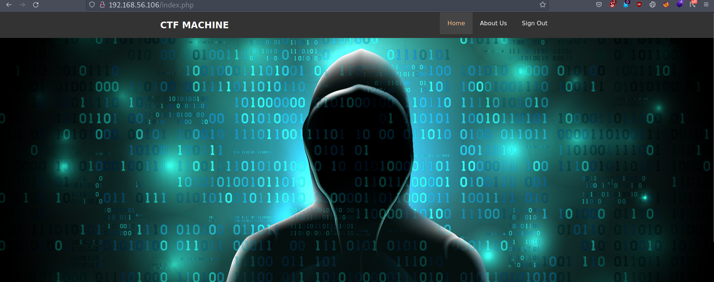

When I explore the page, then I find that the `About us` downloads a `download.rar` file, when I extract it, then I can see the files:
```shell
downloads
├── funny.bmp
├── funny.jpg
└── sudo
```
And the `sudo` file says:
```shell
Did you notice the file name? Isn't it interesting?
```
When I use the `file` command:
```shell
$ file funny.bmp
funny.bmp: JPEG image data, JFIF standard 1.01, resolution (DPI), density
300x300, segment length 16, baseline, precision 8, 500x290, components 3
```
Then I use the file command in `funny.jpg`, a I can see the same output, but if I calculate the `md5sum` is different for each file, and maybe there is something hidden in the `funny.bmp` file. When I use the `stegseek` command:

>**Note**: I discover the `stegseek` tool in the [Hacksudo 101 machine](../12-hacksudo-101/README.md).

```shell
$ stegseek --seed funny.bmp
[i] Found (possible) seed: "b2fb532a"
        Plain size: 55.0 Byte(s) (compressed)
        Encryption Algorithm: rijndael-128
        Encryption Mode:      cbc
```
Then it finds compressed data, when I use the command again, and with the Rockyou list:
```shell
$ stegseek funny.bmp /mnt/d/miguel/estudiar/HTB/rockyou.txt
[i] Progress: 99.74% (133.1 MB)
[!] error: Could not find a valid passphrase.
```
Then it does not work, and I wonder if there were any clues in what I have seen so far, and I remember the text of the `sudo` file. When I store the `sudo` word in a file:
```shell
$ echo "sudo" > wordlist.txt
```
And I use the `stegseek` command with that file:
```shell
$ stegseek funny.bmp wordlist.txt
...SNIPPED...
[i] Found passphrase: "sudo"
[i] Original filename: "user.txt".
[i] Extracting to "funny.bmp.out".
```
And it works, when I read the output file:
```
jgs:guvf bar vf n fvzcyr bar
```
And it looks like text with some substitution cipher when I use CyberChef, and I try with some substitution ciphers, then I can see that the `ROT13` works:

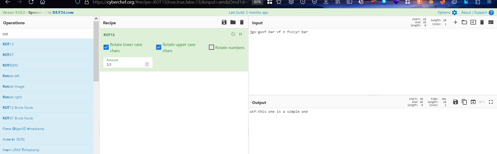

And now I have:
```
wtf:this one is a simple one
```
And maybe that text has the format `<user>:<password>`, when I try it with the `ssh` command:
```shell
$ sshpass -p "this one is a simple one" ssh wtf@192.168.56.106 -p 55077
```
And it works:

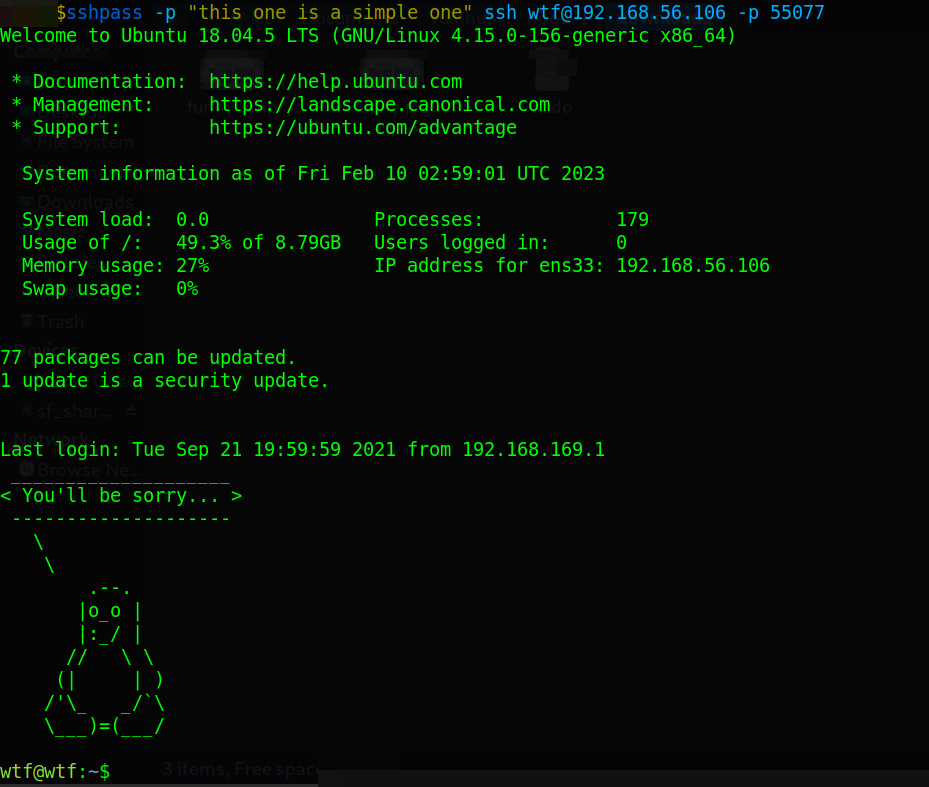

## Exploitation
Sudo privileges in both user `wtf` and `n00b`.

Given I have the credentials `wtf:this one is a simple one`, and I can access the `wtf` shell with the `ssh` command, then I start exploring the target server, when I explore the `wtf`'s home with the `ls` command:
```shell
wtf@wtf:~$ ls -lR
...SNIPPED...
./Documents:
-rw-rw-r-- 1 wtf wtf 680 Sep 21  2021 backup.sh
./Downloads:
-rw-rw-r-- 1 wtf wtf 51 Jun 12  2021 flag-1.txt
./Pictures:
-rwxrwxr-x 1 wtf wtf 76 Jul  3  2021 echo.sh
...SNIPPED...
```
Then I can see 3 interesting files, and I can read the file `flag-1.txt`:

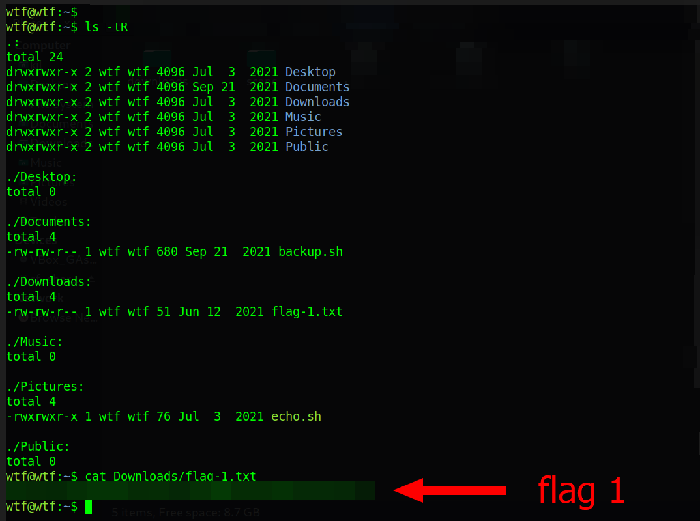

When I read the `backup.sh` file, then I can see:

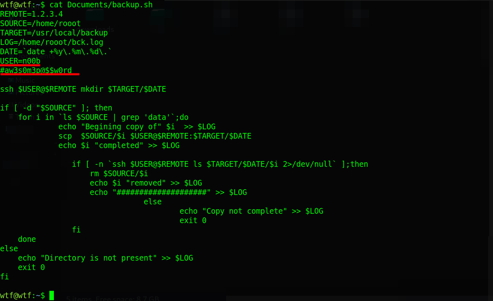

And it looks like there are the credentials `n00b:aw3s0m3p@$$w0rd`, but in `/home` directory there is no user `n00b`, when I read the `echo.sh` file, then I can see:
```bash
#!/bin/bash
#find something related
#It may help you
echo "All the best :)"
```
And that seems to be a cluem when I explore the `rooot` home, then I can find a file called `flag.txt`, when I read it, then I can see:
```
A Rabbit Hole?
Not sure!
Well, look for the thing you want.
It's just 2 steps ahead :)
```
And it looks like that is another clue, when I check the `/etc/passwd` file:
```shell
wtf@wtf:~$ cat /etc/passwd | grep /bin/bash
root:x:0:0:root:/root:/bin/bash
wtf:x:1000:1000:wtf:/home/wtf:/bin/bash
n00b:x:1001:1001::/var/www/rooot:/bin/bash
```
Then I can notice that the user `n00b` exitsm but the home directory is in `/var/www/rooot`, when I use the previously found credentials `n00b:aw3s0m3p@$$w0rd`, and I use the `su` command:
```shell
wtf@wtf:~$ su n00b
```
Then I get the `n00b` shell:

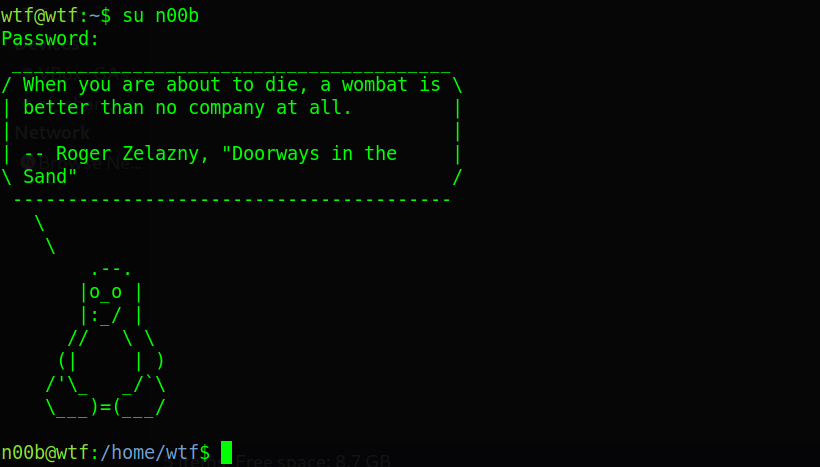

## Privilege escalation

When I use the sudo command:
```shell
n00b@wtf:~$ sudo -l
User n00b may run the following commands on wtf:
    (root) NOPASSWD: /bin/nano
```
When I check in [gtfobins about nano](https://gtfobins.github.io/gtfobins/nano/), then I see:

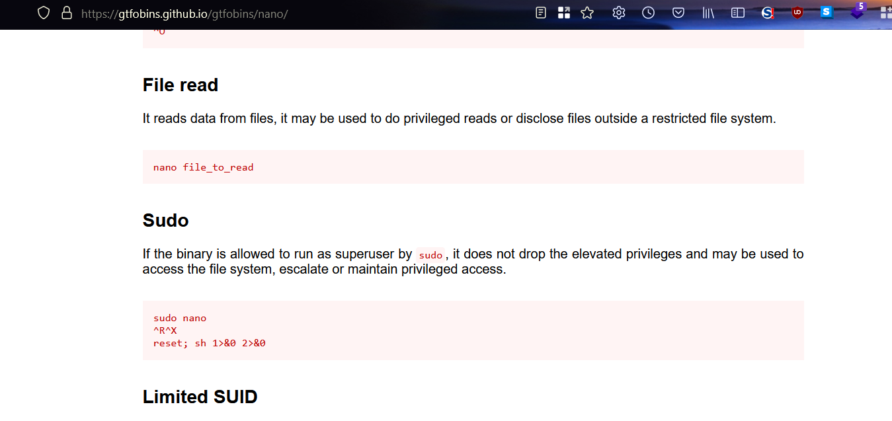

When I follow the instructions found in `gtfobins`, then I can get the `root` shell, and I can get the `root` flag:


But while I am still exploring the server, when I check the `sudo` command with the `wtf` user:
```shell
wtf@wtf:~$ sudo -l
User wtf may run the following commands on wtf:
    (ALL : ALL) ALL
```
and the user `wtf` can run anything as the `root` user, and there is another way to escalate privileges. When I run:
```shell
wtf@wtf:~$ sudo /bin/bash
```
Then I get the `root` shell, and I can get the `root` flag again:

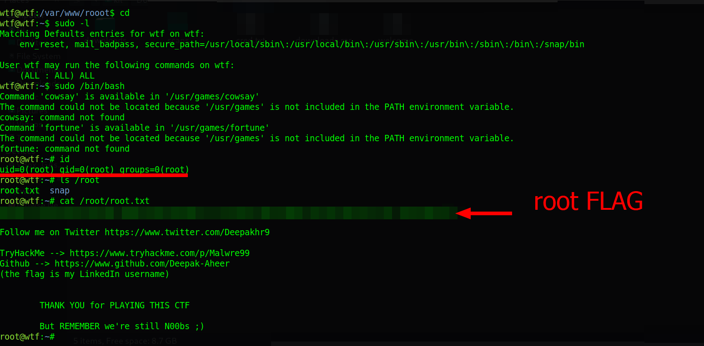

## Remediation
Given I find credentials in `FTP` services, and I can download them with the `Anonymous` user, then avoid exposing sensitive information to public users, and do not expose sensitive files in the web root, and use proper ways to store passwords, and not use recoverable formats like hiding data in an image, and do not store passwords in plain text, and limit the user's sudo privileges.