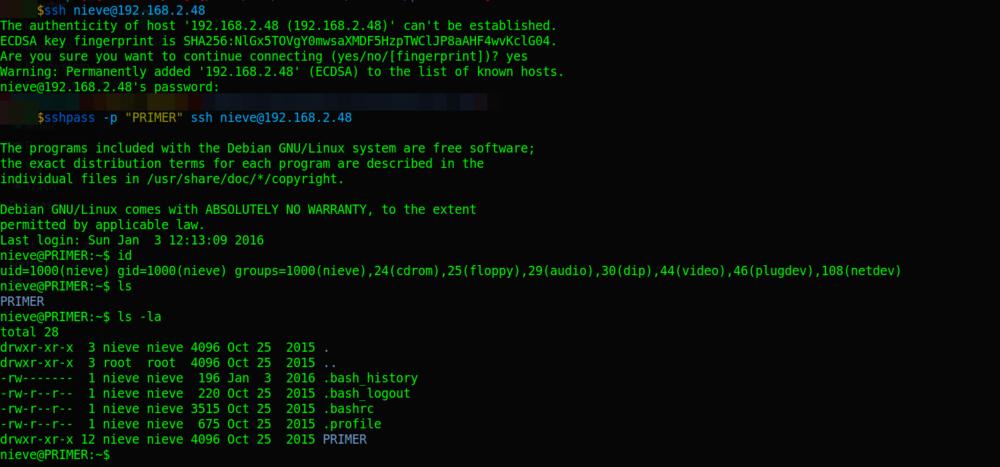

# PRIMER: 1.0.1

Difficulty:: #VeryEasy
> Classified according to [Vulhub difficulty page](https://www.vulnhub.com/difficulty/)

## Target data
- Link: [PRIMER: 1.0.1](https://www.vulnhub.com/entry/primer-101,136/)
- CVSS3 : [AV:N/AC:L/PR:N/UI:N/S:U/C:H/I:N/A:N/E:U/RL:O/RC:U/CR:M/IR:M/AR:M](https://www.first.org/cvss/calculator/3.0#CVSS:3.0/AV:N/AC:L/PR:N/UI:N/S:U/C:H/I:N/A:N/E:U/RL:O/RC:U/CR:M/IR:M/AR:M)
  > **Warning**: I select the CVSS3 score to start to practice, so is very possible that I made a mistake in the selection, so do not trust of that CVSS3.

## Machine Description
*This is a story based challenge written in a style heavily inspired by Neil Stephensons Snow Crash and William Gibsons Sprawl Trilogy. Each chapter is unlocked by solving the puzzle. From hardcoded clear text javascript password checks, SQL-injections and cracking hashes to a simulated terminal. You only need to start the VM, a webserver will come up and you can connect with your browser. In fact you never have to leave the browser.
Goal. Teach some basic well known techniques and attacks. Spark some curiosity, make the user look at the source code and try to figure out what's going on behind the scenes. The main goal is to give a nice welcoming intro to the scene and hopefully also teach something about ethics and responsibility.*


## Summary
PRIMER: 1.0.1 works with a series of steps represented by endpoints in a web service, it starts (endpoint 0 , index) with a login that is vulnerable to SQL injection, that redirects me to endpoint 1, where after I send the `user-agent` with the hash of the `MD5` of the first 7 digits of `pi` I get the endpoint 2, where I modify a cookie `activeSession:false` to `true` and I get the endpoint 3, and I find the endpoint 4 in the `/robots.txt` , and the endpoint 4 has a link to the endpoint 5, and the endpoint 5 has the text of the endpoint 6 written at th bottom of the view, but the endpoint 6 requires basic auth, but I can see that it validate the password with a javascript code in the client side, then I identify the password  `%%Ikdf076` where the first two bytes can be anything, and after that I see the endpoint 7 that also requires basic auth, but this time it has the code obfuscated, I use [beautifier](https://beautifier.io/) to read it, and I see that an array stored an MD5 hash of the password, with `hashcat` and the Rockyou list I could crack it, and the text of the endpoint 7 give me the instruction to look for the patter in the endpoints hashes to identify what is the endpoint 8, after analize it I can identify that each has the structure `8_MD5(value)` and the value of each endpoint is: `3,5,7,11,13,17`, then I could guess that the following is `19`, and I get the endpoint 8, that endpoint has a link to the endpoint 9, and this endpoint simulates a terminal, but in the javascript code I could see the endpoint 10, and that is the lastone, and there the machine ends.

1. CWE-89: Improper Neutralization of Special Elements used in an SQL Command
2. CWE-807: Reliance on Untrusted Inputs in a Security Decision
3. CWE-315: Cleartext Storage of Sensitive Information in a Cookie
4. CWE-200: Exposure of Sensitive Information to an Unauthorized Actor
5. CWE-798: Use of Hard-coded Credentials
6. CWE-521: Weak Password Requirements
7. CWE-916: Use of Password Hash With Insufficient Computational Effort

#VirtualBox #Nmap #HashCat #rpcbind #MD5 #Beautifier

## Enumeration
When I run the target machine in VirtualBox (see the [setup vulnhub machines](../setup-vulnhub.md), and on my target machine, I run the `netdiscover` command:
```shell
$ sudo netdiscover -i enp0s8 -r 192.168.2.0/24
```
Then I compare the MAC with that of the target VirtualBox configuration, and I find out that the IP is `192.168.2.48`.


And I start scanning the target with `nmap`:
```shell
$ nmap -p- -sV -oA scans/nmap-full-tcp-scan 192.168.2.48
...SNIPPED...
PORT     STATE SERVICE VERSION
22/tcp    open  ssh     OpenSSH 6.7p1 Debian 5 (protocol 2.0)
80/tcp    open  http    Apache httpd 2.4.10 ((Debian))
111/tcp   open  rpcbind 2-4 (RPC #100000)
53436/tcp open  status  1 (RPC #100024)
...SNIPPED...
```
Then I identify 4 open ports, and the `OpenSSH 6.7p1` service runs on `22` TCP, and the `Apache httpd 2.4.10` service runs on `80` TCP, and the `rpcbind 2-4` service runs on `111` TCP, and the `rpcbind 1` service runs on `53436` TCP, and it runs on `Debian 5`. When I rescan it with the `http-enum` script:
```shell
$ nmap -p 80 -sV --script=http-enum -oA scans/nmap_http_scan 192.168.2.48
...SNIPPED...
| http-enum:
|   /robots.txt: Robots file
|   /phpmyadmin/: phpMyAdmin
|_  /manual/: Potentially interesting folder
...SNIPPED...
```
Then I can identify a `robots.txt` file.

## Normal use case
Given I access `http://192.168.2.48/index.html`, then I can see:


And it contains text with a login form, and there is no other hyperlink.

## Dynamic detection
SQL injection in the login form.

Given I can access `http://192.168.2.48/index.html`, and I also have the credentials `nieve:PRIMER`, then I can explore the `SSH` and `HTTP` service. When I try the `SSH` connection, and the credentials are given by the machine description:
```shell
$ sshpass -p "PRIMER" ssh nieve@192.168.2.48
```
Then I can see:



But the description of the machine suggests working only from the website, and I decided to leave the `ssh` connection, and work on the `HTTP` service. When I check the `/robots.txt` endpoint found by `nmap`:
```shell
$ curl 'http://192.168.2.48/robots.txt'
User-agent: *
Disallow: /4_8f14e45fceea167a5a36dedd4bea2543
```
When I access `/4_8f14e45fceea167a5a36dedd4bea2543`, then I can see:


And it has a hyperlink to `5_6512bd43d9caa6e02c990b0a82652dca`, then I access that new endpoint, then I can see:


And it gives me another endpoint `6_c51ce410c124a10e0db5e4b97fc2af39`, and at this point, I notice that there is a pattern in the endpoints, and I guess I skipped some steps because I started with `/4_<hash>`, and I return to `/index.html` before continuing with `/6_<hash>`. When I check the login form, and after testing with some default credentials, then I notice there is a hidden text below the login form, and it is a clue:


When I read the sentence:
```html
...SNIPPED...
Manufacturing a bo0le4n response would probably be enough to let her pass
...SNIPPED...
```
Then I guess it is trying to tell me to use a SQL injection, when I try the following user payload:
```sql
admin' or 1=1 -- -
```
And a `JUNK` password, then it works:


And it redirects me to `1_c81e728d9d4c2f636f067f89cc14862c/`, and I can confirm that there is a SQL injection vulnerability.

## Exploitation
Plain text in client source code, weak password hashes, and credential reuse.

Given I can access `/index.html`, and I find an SQL injection vulnerability, and with that, I was able to bypass a login form, then I start to check the following endpoints. When I check the source code of the `HTML`, then I can see a comment on lines 82 to 83:
```html
82 This bot was looking for a Sosū User Agent Identifier she had cracked
   weeks ago, easy sauce, just a simple md5 hash of the first 7 digits of
83 pi. It was common knowledge to the entities moving in these areas but
   obscurity does create a, albeit virtual, layer of security.
```
And it tells me that I need to use a custom `user-agent` header, and it is the `MD5` hash of the first 7 digits of `pi`, when I use the `md5sum` command with the first `7 digits of pi`:
```shell
$ echo -n "3141592" | md5sum
```
And I use the hash in the `user-agent` header with the `curl` command:
```shell
$ curl 'http://192.168.2.48/1_c81e728d9d4c2f636f067f89cc14862c/' /
> -A '29885f98ed1c9b52420df8ae83721dbc' -v
```
Then it does not work, and I think maybe I need to add the decimal poin. When I try again with the `MD5` hash of `3.141592`, then it works:


And it redirects me to `/2_eccbc87e4b5ce2fe28308fd9f2a7baf3`, when I check the new endpoint, then I can see:


And I also identify the cookie with the `Cookie Editor` extension, and the cookie is `activeSession:false`, when I change it to `true`, and I reload the page,then it redirects me to `3_e4da3b7fbbce2345d7772b0674a318d5/`, and I can see:


But at this point, I already know where the next endpoint is, and it is the first one I find with the file `/robots.txt`, then I jump to the endpoint `/6_c51ce410c124a10e0db5e4b97fc2af39`, and that was the endpoint that I left at the beginning. When I check the endpoint `/6_<hash>`, then I can see it asks for a value:


When I check the source code of that page, then I find the lines from `50` to `55`:
```html
50 var X;
51 var L="Ikdf076";
52 X=prompt('/()=','');
53 if (X === null){window.location = "./_.php";}
54 if (X.substr(2,7) == L){}
55 else {window.location = "./_.php";}
```
And the code is `Ikdf076`, but line `54` compares my input from the third character, and I just need to prefix the code with two random letters, when I enter `AAIkdf076`, then it works:


And I can see the endpoint `/7_70efdf2ec9b086079795c442636b55fb`, when I access that endpoint, then it asks for another code:


When I check the source code of the page, then I can see a variable definition, and a very long function:


But first I want to know what the variable contains, when I write it in the browser console, then I can see an array:


When I copy the function, and paste it in [beautifier](https://beautifier.io/), and I look for the variable `_0x5cf4`, then I can see:


And it compares the `MD5` hash of my input with the index `9` of `_0x5cf4`, when I store that hash in a file called `9_0x5cf4.hash`:
```shell
$ echo -n "0d28cba0bd4f26e16d766000d27e49fa" > 9_0x5cf4.hash
```
And I use the `hashcat` command with the Rockyou list:
```shell
$ hashcat -a 0 -m 0 9.hash rockyou.txt --force
...SNIPPED...
0d28cba0bd4f26e16d766000d27e49fa:GOD
...SNIPPED...
```
When I write the word `GOD`, then it works:


And the following paragraph caught my attention:
```
It had been there since the second node and grew stronger with every move
There was a pattern in the path she had taken through the network.
An artificial pattern, laid out by someone or something.
```
When I list all the endpoints I find so far:
```
2_eccbc87e4b5ce2fe28308fd9f2a7baf3
3_e4da3b7fbbce2345d7772b0674a318d5
4_8f14e45fceea167a5a36dedd4bea2543
5_6512bd43d9caa6e02c990b0a82652dca
6_c51ce410c124a10e0db5e4b97fc2af39
7_70efdf2ec9b086079795c442636b55fb
```
And I use the `hashcat` command as I did above, then I can crack all the hashes:
```
eccbc87e4b5ce2fe28308fd9f2a7baf3:3
e4da3b7fbbce2345d7772b0674a318d5:5
8f14e45fceea167a5a36dedd4bea2543:7
6512bd43d9caa6e02c990b0a82652dca:11
c51ce410c124a10e0db5e4b97fc2af39:13
70efdf2ec9b086079795c442636b55fb:17
```
And I can see that it is the `MD5` hash of values `3,5,7,11,13,17`, and the difference between each consecutive value is `2,2,4,2,4`, and if I ignore the first `2`, then I see that the pattern is `2,4`, and that means the next number could be `19`, and the endpoint structure could be `8_MD5(19)`, when I use the `md5sum` command:
```shell
$ echo -n "19" | md5sum
```
And I access `/8_1f0e3dad99908345f7439f8ffabdffc4`, then it works:


And I can see the endpoint `/9_37693cfc748049e45d87b8c7d8b9aacd/`, when I access that endpoint, then I can see that it simulates a terminal, and the available commands:


When I check the javascript code with the browser inspector, then I can see a new endpoint:


When I access `/10_23693cff748o49r45d77b6c7d1b9afcd`, then I can see:


But the page is very slow, and it seems that it is all, when I check the server with `SSH`, then I see that in fact, the last endpoint is the `credits` page, but I want to try to escalate privileges to the root user, when I check the credentials `root:PRIMER`, then it works, and I get the root shell, but there are no flags:


> **Note**: This certainly can't be called "privilege escalation", and it's because the machine's creator probably put those credentials on purpose so we have full control of the machine, the main focus of the machine. machine is in web vulnerabilities, and proof of this is that there is no flag for `root`.


## Remediation
Given I find an SQL injection in the login formm and I find a protected endpoint with a specific value in the `user-agent`, and I find a plaintext cookie value, and I find a hidden endpoint in the `robots.txt` file, and I could crack `MD5` hashes, and I find credentials in the client code, and I identify a pattern in the endpoints, then use parameterized queries, and use proper methods to authenticate users, and do not store sensitive cleartext data in cookies, and avoid exposing sensitive information, and do not use leaked passwords and store passwords properly, and do not reuse the password of the root user.